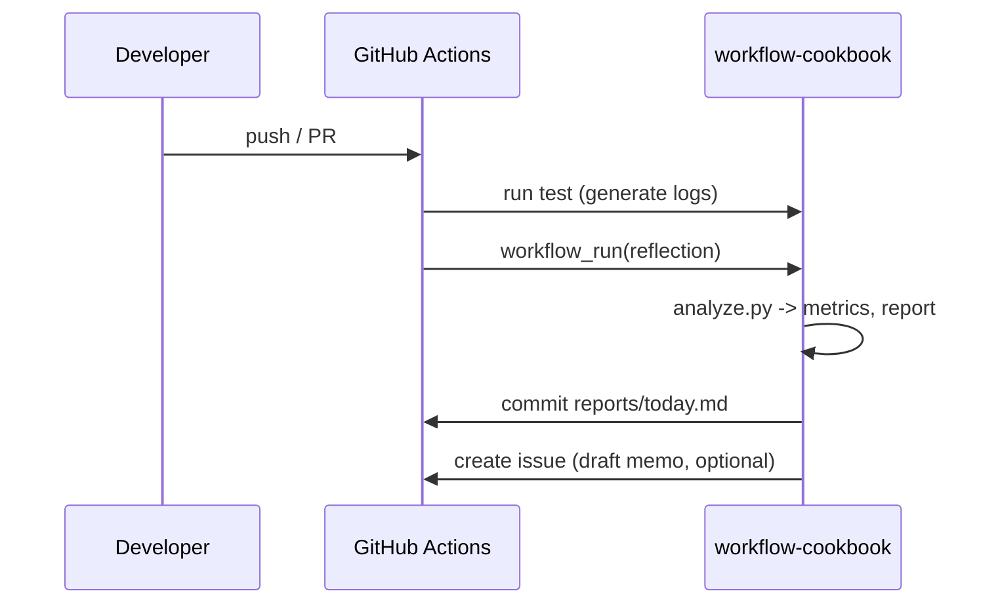
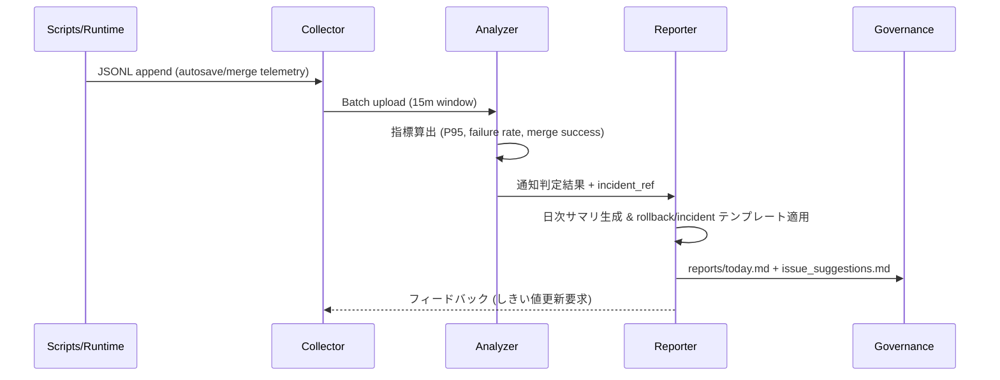

# 設計（Architecture）

## コンポーネント
- **Collector**: CI テストやツールから JSONL ログを収集（[ADR 0001](../../adr/0001-collector-analyzer-reporter-pipeline.md), [ADR 0002](../../adr/0002-jsonl-event-contract.md)）
- **Analyzer**: `workflow-cookbook/scripts/analyze.py` がメトリクス算出と Why-Why 草案生成（[ADR 0001](../../adr/0001-collector-analyzer-reporter-pipeline.md)）
- **Reporter**: `reports/today.md` と `reports/issue_suggestions.md` を生成（[ADR 0001](../../adr/0001-collector-analyzer-reporter-pipeline.md), [ADR 0003](../../adr/0003-propose-only-governance.md)）
- **Proposer**: Issue/ドラフトPR を“提案のみ”で作成（自動改変なし）（[ADR 0003](../../adr/0003-propose-only-governance.md)）
- **Governance**: `governance/policy.yaml` に行動制約・SLO（[ADR 0003](../../adr/0003-propose-only-governance.md)）

## データモデル（概略）
- TestRecord: `{ name, status, duration_ms, ts? }`
- Metrics: `{ pass_rate, duration_p95, flaky_rate? }`
- Report: Markdown（メトリクスと Why-Why）

## シーケンス（Mermaid）

## Collector/Analyzer/Reporter データ連携シーケンス

### Telemetry イベント整合 (Day8 Collector v1)

| イベント | 必須フィールド | Analyzer 指標 | Rollback 判定 | 備考 |
| --- | --- | --- | --- | --- |
| `flag_resolution` | `payload.flag`, `payload.variant`, `payload.source`, `payload.phase`, `payload.evaluation_ms` | `restore_success_rate`、`default_fallback_rate` | 同一フェーズで `status="failure"` が 2 バッチ継続 → Phase 差し戻し | `evaluation_ms` を 15 分窓平均し、配信レイテンシ ±5% を監視する |
| `status.autosave` | `payload.state`, `payload.debounce_ms`, `payload.latency_ms`, `payload.attempt`, `payload.phase_step`, `payload.guard.current`, `payload.guard.rollbackTo` | `autosave_p95`, `ui_saved_rate` | `ui_saved_rate < 0.95` または `autosave_p95` が基準を 5% 超過 → Rollback コマンド起動 | `phase_step` が `awaiting-lock` の滞留率を監視し、Collector が guard.rollbackTo を提示 |
| `merge.trace` | `payload.phase`, `payload.collisions`, `payload.processing_ms`, `payload.guardrail.metric`, `payload.guardrail.observed`, `payload.guardrail.tolerance_pct`, `payload.guardrail.rollbackTo` | `merge_auto_success_rate`, `merge_latency_p95` | `observed` が `tolerance_pct` を 2 連続超過 → B 系列フェーズ差し戻し | `processing_ms` と `tolerance_pct` で Analyzer が ±5% SLO を評価し、Reporter が incident ノートへ転記 |

Collector は上記フィールド欠損を RED として弾き、Analyzer はメトリクス算出時に `tolerance_pct`（既定 ±5%）を利用する。Reporter は guard.rollbackTo をテンプレート `templates/alerts/rollback.md` に挿入し、ロールバックチェックリストと連動させる。

## ASCII フォールバック
- Mermaid が利用できないレビュー環境では [docs/Architecture_ASCII.md](../../Architecture_ASCII.md) を参照し、Collector→Analyzer→Reporter→Proposer→Governance の責務と戻りフローを確認する。
- UI 骨子や CLI/レポートの画面構成をオフラインで確認する際は [Appendix B: UI モック](../../addenda/B_UI_Mock.md) を併用し、Analyzer/Reporter の入出力イメージを擦り合わせる。
- ドキュメント索引の手順は `docs/README.md` → `docs/ROADMAP_AND_SPECS.md` → 本ページ → `docs/adr/README.md` の順に辿り、Birdseye (`docs/birdseye/index.json`) のノード差分があれば同じコミットで更新する。

## サブディレクトリ対応方針
- `defaults.run.working-directory: workflow-cookbook`
- アーティファクトのパスは `workflow-cookbook/logs` に統一
