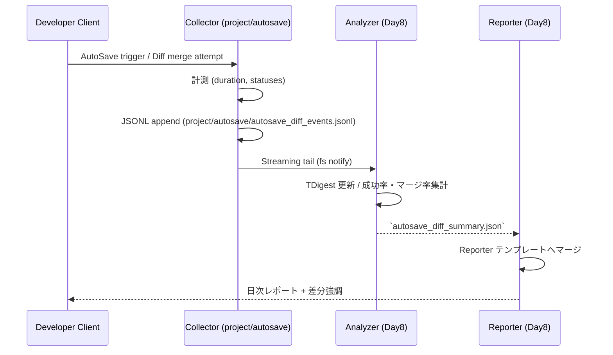

# AutoSave/Diff Merge Telemetry 設計

## 概要
- feature タグ: `autosave-diff-merge`
- Day8 Collector→Analyzer→Reporter の既存責務を維持しつつ、AutoSave/差分自動マージ系イベントを同一ストリームで扱う。
- ログファイルは `project/autosave/` 配下（例: `project/autosave/autosave_diff_events.jsonl`）に Collector が書き出す。

## JSONL スキーマ拡張
Collector は 1 行 1 イベントの JSONL を吐き出す。既存フィールドに影響せず、`metrics.autosave_diff` オブジェクトを追加する。

```json
{
  "timestamp": "2024-02-21T09:00:00.000Z",
  "pipeline": "day8",
  "feature": "autosave-diff-merge",
  "session_id": "d7c79f15-3e3b-4e6b-8f5e-8a4e4dc14c9f",
  "user_id": "developer-42",
  "trace_id": "5c0649393ad3b4f7",
  "metrics": {
    "autosave_diff": {
      "save_duration_ms": 1843,
      "recovery_status": "success",
      "auto_merge_status": "merged",
      "artifact_digest": "sha256:0bd...",
      "attempt": 2,
      "conflict_count": 0,
      "snapshot_size_bytes": 51234
    }
  },
  "context": {
    "project": "codex-workbench",
    "branch": "feature/autosave",
    "editor": "web-ide@1.8.0"
  }
}
```

- `save_duration_ms`: Collector 取得の実測保存時間。
- `recovery_status`: `success | retried | failed`。Analyzer は成功率算出に使用。
- `auto_merge_status`: `merged | skipped | conflicted`。Analyzer は自動マージ率算出に使用。
- `attempt`: 同一セッションでの試行番号。
- `conflict_count`: 差分マージ時のコンフリクト数（整数）。
- `snapshot_size_bytes`: 保存スナップショットのバイト数。SLO 算出には利用しないが、将来の回帰検知で参照。

## Analyzer 集計ロジック
Analyzer（`scripts/analyze.py` で拡張予定）は以下のステップでメトリクスを集計する。

1. `project/autosave/*.jsonl` を ingestion ソースとし、`feature === "autosave-diff-merge"` の行のみを Day8 aggregator に流す。
2. 集計ウィンドウ: 15 分ローリング + 日次バッチ。15 分窓は運用監視、日次は SLO 判定用。
3. 保存時間 P95: 各窓で `save_duration_ms` の 95 パーセンタイルを TDigest で推定。
4. 復旧成功率: `recovery_status === "success"` 件数 / `recovery_status !== "skipped"` 件数。
5. 自動マージ率: `auto_merge_status === "merged"` 件数 / 全イベント件数。
6. 集計結果は `analyzer/autosave_diff_summary.json`（日次）と `analyzer/autosave_diff_realtime.json`（ローリング）へ書き出し、既存 Day8 export と同じ命名規則を流用。
7. 失敗イベントは既存の再試行可能エラー扱い（Collector でリトライ、Analyzer でスキップログ）。

## Collector→Analyzer→Reporter シーケンス


## Reporter サマリ差分
- 出力ファイル: `reports/autosave_diff_report.md` テンプレートを利用し、日次バッチでレンダリング。
- インライン diff 表現: 前日比で P95 保存時間と成功率/マージ率の上下を `▲/▼` で表示。
- 既存 Day8 Reporter のテーブル拡張ポイントを使用（`feature_sections` 配列に新規セクションを追加）。
- 既存 CLI/API のレスポンス構造には変更を加えず、追加セクションのみを付与。

### メトリクス出力形式
Analyzer から Reporter へは以下 JSON を渡す。

```json
{
  "feature": "autosave-diff-merge",
  "window": "2024-02-21",
  "p95_save_duration_ms": 1950,
  "recovery_success_rate": 0.982,
  "auto_merge_rate": 0.761,
  "deltas": {
    "p95_save_duration_ms": -120,
    "recovery_success_rate": 0.012,
    "auto_merge_rate": -0.034
  },
  "sample_size": 4382
}
```

Reporter は `deltas` を差分表示し、`sample_size` が 200 未満の場合はウォーニング行を追加（既存の低サンプル警告 UI を再利用）。

## テストデータ計画
1. **ベースライン**: 成功イベントのみ 200 件（`save_duration_ms` 1–2s 分布）。P95 が 1.95s 前後になることを確認。
2. **復旧失敗混在**: 成功 180 / 失敗 20 件（計 200）。復旧成功率が 0.9 となることを確認。
3. **マージコンフリクト強調**: `auto_merge_status` が `conflicted` 30 件、残り `merged`。自動マージ率 0.87 を検証。
4. **長時間保存テール**: 5 件のみ 10s 超のイベントを挿入し、P95 が上振れするか検証。
5. **低サンプル**: 50 件のみのデータセットで Reporter が低サンプル警告を出すことを確認。
6. 各データセットを `project/autosave/testdata/<scenario>.jsonl` に配置し、Analyzer のユニットテストで fixture として読み込む。

## SLO 算出
- 保存時間 P95 SLO: 2.5s 以下。ローリング 7 日移動平均で判定。
- 復旧成功率 SLO: 98% 以上。日次ごとに判定し、3 日連続未達で PagerDuty。
- 自動マージ率 SLO: 75% 以上。週次レポートで傾向確認。
- Reporter では SLO 未達項目に `:warning:` マークを付け、既存アラート集約と連携。

## 未決事項
- Analyzer の TDigest 実装は `scripts/analyze.py` へ組み込む予定だが、既存ユーティリティの再利用候補を調査中。
- Collector のタイムスタンプ同期は NTP 依存。将来的に monotonic timer fallback が必要か要検討。
