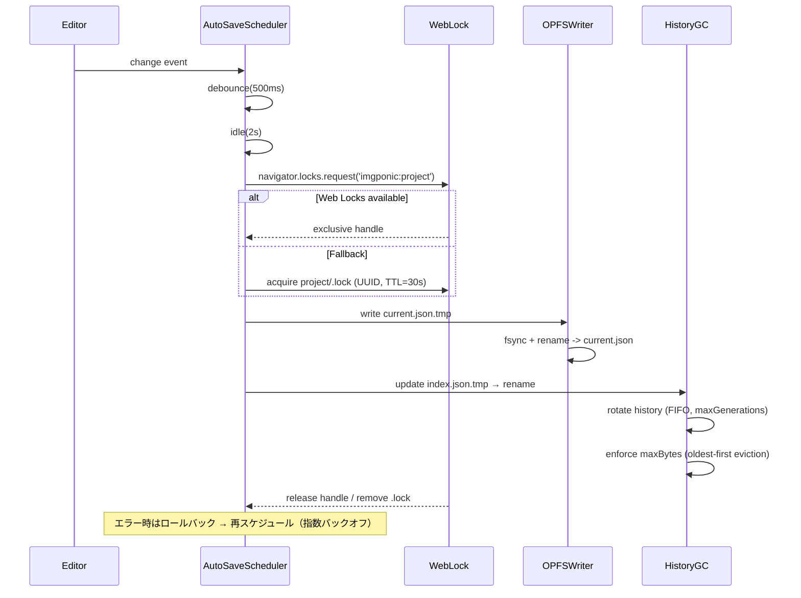
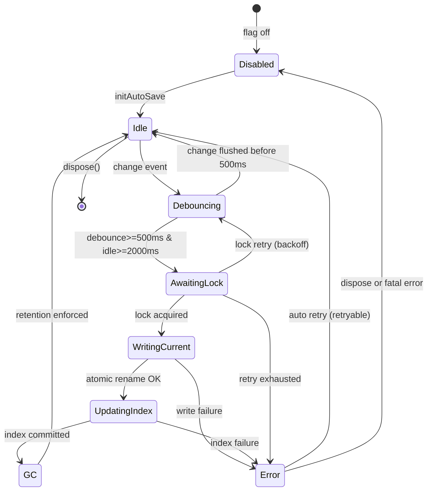
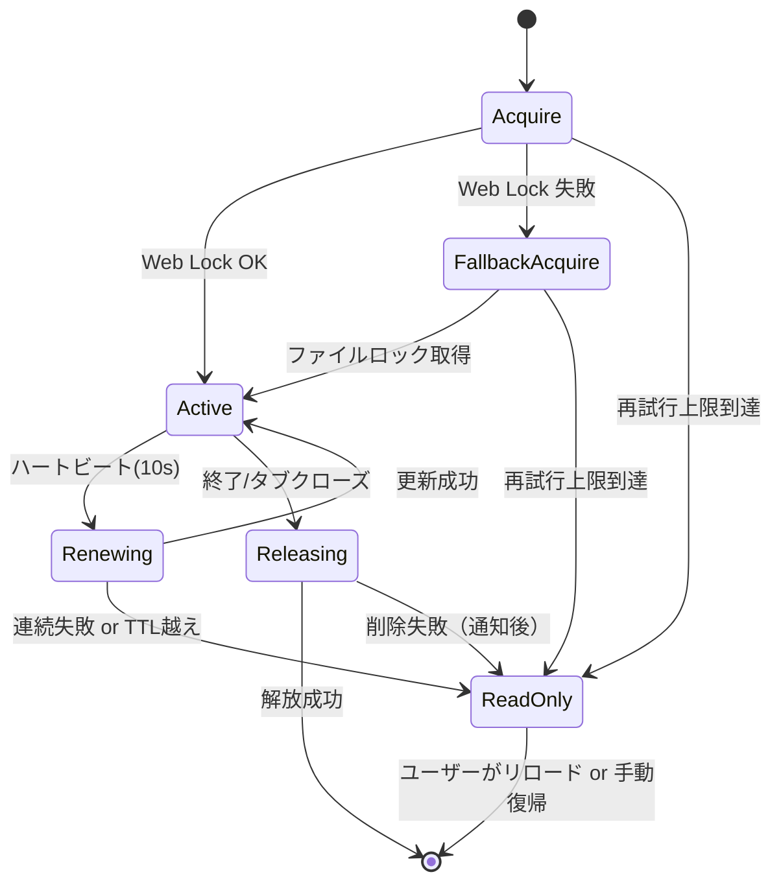
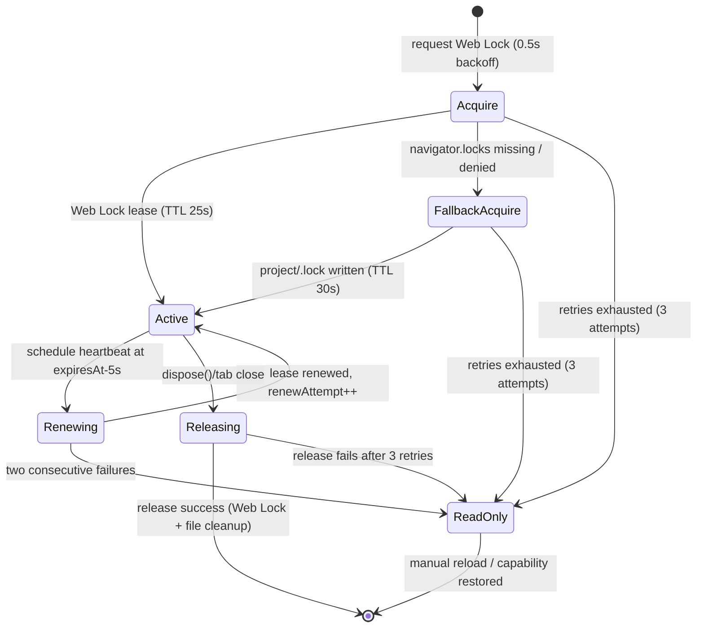
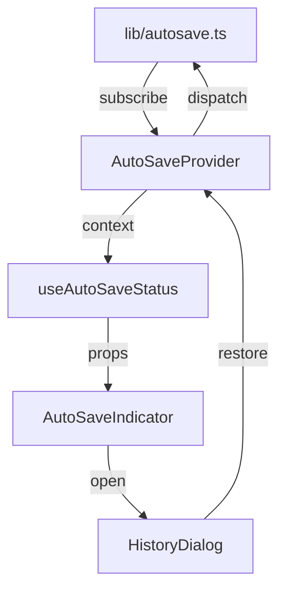
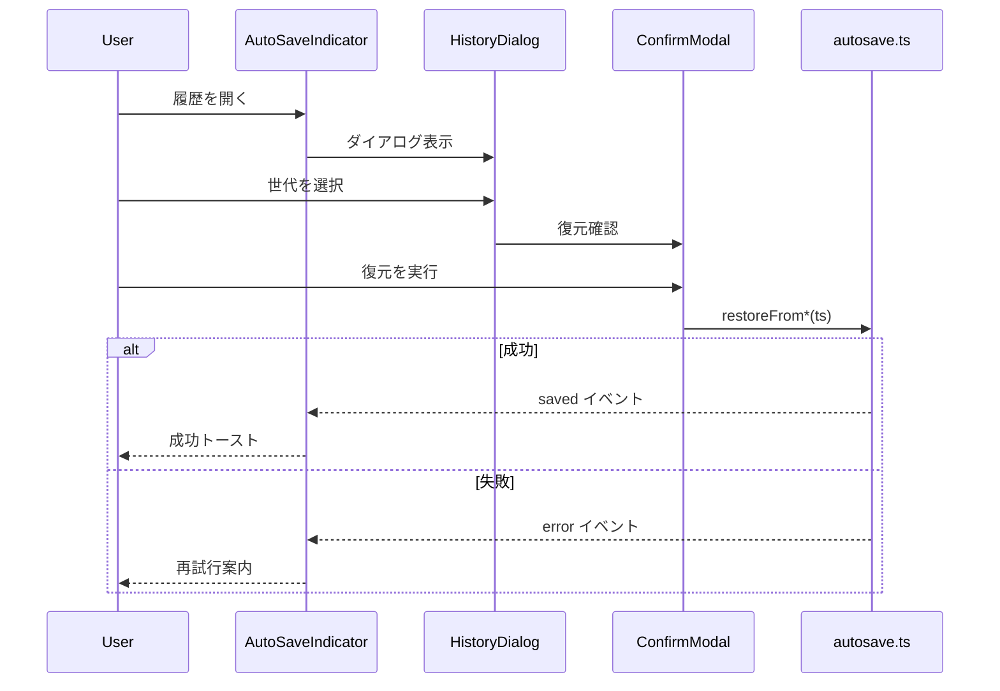

# AutoSave 実装詳細

## 0) モジュール責務と不変条件
- `src/lib/autosave.ts` は AutoSave 機能の**中核ファサード**として、OPFS 上の `project/autosave` ツリーへ最新スナップショットを保存し、履歴一覧・復元 API を提供する。対象モジュールは [実装計画](./IMPLEMENTATION-PLAN.md) の「1) 対象モジュール追加」に列挙された `locks.ts`・UI コンポーネント群と疎結合である必要がある。
- 保存ポリシーのパラメータ（デバウンス 500ms、アイドル 2s、履歴 20 世代、容量 50MB）をデフォルトとして露出し、`AutoSaveOptions` でのみ調整可能とする。フラグ `autosave.enabled` が false の場合はどの永続化 API も副作用を発生させてはならない。
- 生成物は常に `current.json`（最新）と `index.json`（履歴メタデータ）で整合していなければならない。片方だけが更新される状態は例外扱いとし、リカバリ時にはロールバックで整合性を取り戻す。
- Web Locks を優先し、排他獲得前には OPFS へ書き込まない。フォールバックのファイルロックも同じ UUID を保持し、再入（同一タブ二重保存）を禁止する。
- `history/<ISO>.json` は ISO8601 時刻で単調増加する命名とし、`index.json` に存在しないファイルは掃除対象、逆に `index.json` にのみ存在する項目はゴースト扱いで再構築する。
- 例外が発生した場合でも既存 UI・Collector/Analyzer へ不要な副作用（意図しないログ出力、無制限 I/O）を与えない。ログは後述の制約に従って 1 エラーにつき 1 行、警告レベルで記録する。

## 1) 保存ポリシー

### 1.1 保存ポリシー要件マッピング
| ポリシー | 既定値 / 閾値 | `src/lib/autosave.ts` 責務 | `docs/IMPLEMENTATION-PLAN.md` 参照 | 補足 / 運用ノート |
| --- | --- | --- | --- | --- |
| デバウンス遅延 | 500ms | 入力検知後 500ms 待機して保存ジョブをスケジュールし、UI からのイベントスパイクを抑制する。 | §1 対象モジュール「AutoSave ファサード」【F:docs/IMPLEMENTATION-PLAN.md†L52-L67】 | 保存スケジューラで 1 キューのみ維持し、重複イベントは合算。 |
| アイドル猶予 | 2000ms | アイドル検知後にロック取得・書き込みへ遷移し、Indicator へ状態を伝播する。 | §1 対象モジュール + フラグ制御【F:docs/IMPLEMENTATION-PLAN.md†L52-L85】 | `phase='awaiting-lock'` へ遷移させ、UI と Collector ログの整合を確保する。 |
| 履歴世代上限 | 20 世代 | `history/<ISO>.json` を FIFO 管理し、`index.json` と整合させる。 | フェーズ運用チェックリスト（復旧 SLO）【F:docs/IMPLEMENTATION-PLAN.md†L95-L135】 | 世代番号は単調増加し、削除時は `index.json` を同期更新。 |
| 容量上限 | 50MB | 履歴総バイト数を監視し、閾値超過時は最古世代から削除する。 | 受入基準（保存時間・復元率）【F:docs/IMPLEMENTATION-PLAN.md†L137-L170】 | Collector が参照するメトリクスを乱さないよう削除ログは 1 行に制限。 |
| ロック優先順位 | Web Locks → `src/lib/locks.ts` フォールバック | Web Lock で失敗した場合はフォールバックロックを同一 UUID で取得し、排他制御を維持する。 | ロックモジュール要件整理【F:docs/IMPLEMENTATION-PLAN.md†L69-L134】 | フォールバックは `project/.lock` のみに副作用を限定し Day8 パイプラインへ干渉させない。 |
| フラグ制御 | `autosave.enabled` (`false` 初期) + `options.disabled` | フラグ OFF/disabled では永続化 API を一切呼び出さず、`phase='disabled'` を返す。 | フラグ定義 + 回帰試験計画【F:docs/IMPLEMENTATION-PLAN.md†L7-L34】【F:docs/IMPLEMENTATION-PLAN.md†L171-L207】 | `initAutoSave` 戻り値は no-op `flushNow`/`dispose` を返却し、Collector へログを送出しない。 |

### 1.2 ポリシー適用フロー
- デバウンス 500ms + アイドル 2s で `project/autosave/current.json` を保存。
- `history/<ISO>.json` を最大 N=20 世代保持し、`index.json` で参照。
- 容量上限 50MB を超過した場合は古い世代から FIFO で削除。

## 2) Runtime Sequencing
### シーケンス図


### 時系列表
| 時刻 | スレッド/コンテキスト | 動作 | 同期メカニズム |
| --- | --- | --- | --- |
| t0 | UI スレッド | 入力変更を検出 | イベントループ |
| t0+500ms | UI | デバウンス満了で保存ジョブを登録 | タスクキュー |
| t0+2.5s | Worker (optional) | アイドル検知後に Web Lock を要求 | Web Locks API / `.lock` ファイル |
| t0+2.5s | 同 | ロック取得後に `current.json.tmp` へ書き込み | FileSystemWritableFileStream |
| t0+2.6s | 同 | `current.json.tmp` → `current.json` を原子的にリネーム | OPFS atomic rename |
| t0+2.6s | 同 | `index.json` を更新し、履歴ローテーション・容量制限を適用 | メタデータ更新 |
| t0+2.6s | 同 | ロック解放、次回トリガー待機 | Web Locks release |

## 3) API（型定義と副作用）

### 3.1 公開 API 型シグネチャ
```ts
type StoryboardProvider = () => Storyboard;

interface AutoSaveOptions {
  /** デフォルト: 500 */
  debounceMs?: number;
  /** デフォルト: 2000 */
  idleMs?: number;
  /** デフォルト: 20 */
  maxGenerations?: number;
  /** デフォルト: 50 * 1024 * 1024 */
  maxBytes?: number;
  /** feature flag: autosave.enabled=false の場合 true で無効化 */
  disabled?: boolean;
}

interface AutoSaveInitResult {
  readonly snapshot: () => AutoSaveStatusSnapshot;
  flushNow: () => Promise<void>;
  dispose: () => void;
}

type AutoSaveErrorCode =
  | 'lock-unavailable'
  | 'write-failed'
  | 'data-corrupted'
  | 'history-overflow'
  | 'disabled';

interface AutoSaveError extends Error {
  readonly code: AutoSaveErrorCode;
  readonly retryable: boolean;
  readonly cause?: Error;
  readonly context?: Record<string, unknown>;
}

export function initAutoSave(
  getStoryboard: StoryboardProvider,
  options?: AutoSaveOptions
): AutoSaveInitResult;

export async function restorePrompt(): Promise<
  | null
  | { ts: string; bytes: number; source: 'current' | 'history'; location: string }
>;

export async function restoreFromCurrent(): Promise<boolean>;

export async function restoreFrom(ts: string): Promise<boolean>;

export async function listHistory(): Promise<
  { ts: string; bytes: number; location: 'history'; retained: boolean }[]
>;
```
- `AutoSaveOptions` のデフォルト値は保存ポリシーの数値に一致する。`disabled` が `true` または `autosave.enabled=false` の場合、`initAutoSave` は `flushNow` を no-op とした上で `dispose` だけを返し永続化を一切行わない。【F:docs/IMPLEMENTATION-PLAN.md†L7-L34】【F:docs/AUTOSAVE-DESIGN-IMPL.md†L5-L23】
- `flushNow()` は保存可能な状態（`idle` or `debouncing`）であれば 2s アイドル待機をスキップし、ロック取得と書込の完了まで待つ。実行中フライトがある場合はその完了を待機し、同時実行を避ける。【F:docs/AUTOSAVE-DESIGN-IMPL.md†L86-L114】
- `snapshot()` は内部状態の即時スナップショットを返し UI 側の `isReadOnly` や `lastError` 表示に利用する。内部ステートは後述の状態遷移表に従う。【F:docs/AUTOSAVE-DESIGN-IMPL.md†L118-L141】

### 3.2 エラー分類
| コード | `retryable` | 発生契機 | Collector 送信方針 |
| --- | --- | --- | --- |
| `disabled` | `false` | フラグ OFF/`options.disabled` | ローカル警告のみ。Collector へは送信しない。 |
| `lock-unavailable` | `true` | Web Lock/フォールバック両方取得失敗 | 1 行のみ Collector へ送信し、指数バックオフ後に再試行。【F:docs/IMPLEMENTATION-PLAN.md†L69-L134】 |
| `write-failed` | `true` または `false` | OPFS 書込失敗（I/O・Quota） | I/O 系は `retryable=true`、論理不整合は `false`。Collector には `duration_ms` と `feature:'autosave'` を付与。【F:Day8/docs/day8/design/03_architecture.md†L1-L18】 |
| `data-corrupted` | `false` | `current.json`/`index.json` の不整合・JSON 破損 | Collector へ重大イベントとして通知し、UI は復旧手順を案内。 |
| `history-overflow` | `false` | 履歴 FIFO/容量制御による削除 | ローカルログのみ（ノイズ抑制）。Collector スキーマから除外。【F:docs/AUTOSAVE-DESIGN-IMPL.md†L120-L141】 |

### 3.3 履歴ローテーション処理
1. `index.json` の世代配列を更新してから `history/<ISO>.json` を追記し、両ファイルが整合するようトランザクションを構成する。
2. 上限を超えた場合は FIFO で最古世代を削除し、削除結果を `index.json` へ反映する。
3. 容量 50MB 超過時は総バイト数を再計算し、しきい値内に収まるまで追加削除を実行する。
4. ローテーションログは Collector ではなくローカル警告ログへ 1 行だけ出力することで、Day8 パイプラインのノイズを防ぐ。【F:Day8/docs/day8/design/03_architecture.md†L1-L31】

### 3.4 TDD 観点（フラグ / 復旧シナリオ）
- フラグ OFF (`autosave.enabled=false` または `options.disabled=true`) で `initAutoSave` が no-op ランナーを返し、`snapshot().phase==='disabled'` を維持するユニットテスト。【F:docs/IMPLEMENTATION-PLAN.md†L171-L207】
- フラグ ON 時にデバウンス→アイドル→ロック取得→`current.json` 書込→`index.json` 更新→履歴 FIFO の順で完了する保存シーケンスを Fake タイマーで検証するテスト。
- `lock-unavailable` が一定回数続いた後でもバックオフで復旧するパスと、`retryable=false` で停止するパスを分岐させる再試行テスト。
- `restorePrompt`/`restoreFrom*` が破損 JSON を検出して `data-corrupted` を投げ、成功時には UI へスナップショットを適用できる復旧シナリオテスト。
- 履歴ローテーションが世代数・容量しきい値を超えた場合に正しく古いファイルを削除し、`history-overflow` ログが 1 行に留まることを確認するテスト。【F:docs/IMPLEMENTATION-PLAN.md†L95-L170】

## 4) API 最終仕様と状態遷移

### 4.1 ステータススナップショット
```ts
type AutoSavePhase =
  | 'disabled'
  | 'idle'
  | 'debouncing'
  | 'awaiting-lock'
  | 'writing-current'
  | 'updating-index'
  | 'gc'
  | 'error';

interface AutoSaveStatusSnapshot {
  phase: AutoSavePhase;
  lastSuccessAt?: string; // ISO8601
  pendingBytes?: number;
  lastError?: AutoSaveError;
  retryCount: number;
  queuedGeneration?: number; // index.json 上の世代番号
}
```

### 4.2 オートセーブ状態遷移図


### 4.3 起動/停止フロー
1. `initAutoSave` 呼び出し時に `disabled` 判定 → true の場合はスケジューラを作成せず `phase='disabled'` のスナップショットのみ返却。
2. 有効な場合は以下を逐次実行。
   1. Debounce タイマーと Idle タイマーを初期化し、UI の変更イベントを `listenToStoryboardChanges()` で購読。
   2. 既存 `current.json` が存在する場合は `restorePrompt()` が利用できるようメタデータをキャッシュ。
   3. `dispose()` はイベント購読解除 → タイマー停止 → 進行中フライトを待機 → ロック開放 → `phase='disabled'` に遷移。
3. 例外がスローされた場合は `lastError` を更新し、`retryable=true` なら指数バックオフ（0.5s, 1s, 2s, 上限 4s）で `AwaitingLock` へ復帰。`retryable=false` は `phase='error'` のまま `flushNow` を no-op にして UI 通知後に `dispose()` を促す。

### 4.4 履歴保持ポリシーの詳細
- `index.json` には `{ ts, bytes, location }` を降順で保持し、`maxGenerations` 超過時は末尾を削除。
- `maxBytes` を超える場合は `sum(bytes)` を再計算しつつ古いレコードから削除し、対応する `history/<ts>.json` を削除。
- GC 後に削除されたファイルは `history-overflow` エラーとしてログするが、ユーザ通知は行わない（情報レベル）。
- `history` ディレクトリに孤児ファイルがある場合は削除し、`index.json` にのみ存在するエントリは `current.json` から再構築する。

### 4.5 再試行・停止条件
| フェーズ | エラーコード | retryable | 再試行条件 | 停止条件 |
| --- | --- | --- | --- | --- |
| AwaitingLock | lock-unavailable | true | バックオフ 0.5→1→2→4s（最大 4s） | 連続 5 回失敗で `phase='error'` → UI に ReadOnly 通知 |
| WritingCurrent | write-failed | true/false | `cause` が `DOMException` で `NotAllowedError` 以外なら true | 再試行失敗 or `NotAllowedError` で停止 |
| UpdatingIndex | write-failed | true | 同上 | 同上 |
| GC | history-overflow | false | - | ログのみ。`phase` は Idle 維持 |
| Restore | data-corrupted | false | - | UI に通知後、`restorePrompt` で null を返す |

## 5) テスト戦略
- **OPFS Stub**: `tests/autosave/__mocks__/opfs.ts` に `InMemoryOpfs` を実装。`writeAtomic`, `readJSON`, `rename`, `stat` を Promise ベースで再現し、容量計測をメモリ上で管理。`maxBytes` などの制約を検証可能とする。
- **Scheduler モック**: Fake タイマー (`@sinonjs/fake-timers`) を利用して `debounceMs`/`idleMs` の挙動を deterministic に検証。`flushNow()` を呼んだ際に即時書込が実行されることを確認。
- **ロックモック**: `navigator.locks` のモック実装とファイルロックスタブを用意し、取得成功/失敗/再試行を制御。連続失敗で `phase='error'` になることをテスト。
- **テストケース一覧**:
  1. フラグ無効時に `flushNow`/`dispose` が副作用なしで完了する。
  2. 単一変更で 500ms デバウンス + 2s アイドル後に `current.json` が原子的に更新される。
  3. `flushNow()` によりアイドル待機をスキップし、既存フライトと競合しない。
  4. ロック取得失敗が 4 回発生した後にバックオフで再試行し、5 回目で `phase='error'` になる。
  5. 履歴が 21 世代に達した際に FIFO で削除され、`maxBytes` 超過時も容量内に収束する。
  6. `write-failed`（再試行可）から復帰後に `lastSuccessAt` が更新される。
  7. `data-corrupted` 発生時に `restorePrompt` が null を返し、`snapshot().lastError` に反映される。
  8. `dispose()` が進行中フライトの完了を待機し、ロックが解放される。
- **テスト構成**: `tests/autosave/init.spec.ts`（起動/停止・フラグ判定）、`tests/autosave/scheduler.spec.ts`（デバウンス/アイドル/flush）、`tests/autosave/history.spec.ts`（GC・容量制限）、`tests/autosave/restore.spec.ts`（復元系）で段階的に実装。Fake タイマーと OPFS Stub を共有ユーティリティとして `tests/autosave/test-utils.ts` に切り出す。

## 6) エラーハンドリングテーブル
| コード | 発生源 | retryable | UI 通知 | ログレベル | 備考 |
| --- | --- | --- | --- | --- | --- |
| disabled | initAutoSave | false | 不要 | info | flag off 時のみ。 |
| lock-unavailable | scheduler | true | Snackbar（自動再試行中） | warn | 5 回連続で `phase='error'`。 |
| write-failed | writer/index | cause による | dialog（書込失敗） | error | `context.bytesAttempted` を付与。 |
| data-corrupted | restore/list | false | dialog（破損通知） | error | リストア系 API 共通。 |
| history-overflow | GC | false | 不要 | info | FIFO/Eviction 実行時に 1 行ログ。 |

これらの仕様により、`Collector`/`Analyzer` など Day8 アーキテクチャの他コンポーネントへ不要な副作用を与えず、AutoSave 機構の一貫性と復元性を確保する。

## 3) ロック

### 3.1 Web Lock / ファイルロック仕様
- 取得キーは `navigator.locks.request('imgponic:project', { mode: 'exclusive' })` とし、AutoSave 起動時に最初の取得を試みる。
- リース情報（`leaseId`, `expiresAt`）を `ProjectLockLease` で管理し、Web Lock が返さない TTL をクライアント側で 25s（安全マージン 5s）として扱う。
- Web Lock が未実装・拒否・同一ブラウザ内の競合などで取得できない場合はフォールバックのファイルロック手段へ遷移する。
- フォールバックファイルは `project/.lock` に限定し、UUID・`updatedAt`（ISO8601）・`ttlSeconds`（既定 30）を JSON で保持する。
- ロック取得中は 10s 間隔でリース更新（Web Lock リクエスト or フォールバックの `mtime` 更新）を行い、失敗 2 回連続で閲覧専用モードへ移行する。
- ロック解放時は Web Lock release とフォールバックファイル削除を両方実行し、片方失敗でも再試行する。

### 3.2 Lock Orchestration


- Acquire フェーズでは指数バックオフ（0.5s → 1s → 2s）で最大 3 回再試行。いずれも失敗時は閲覧専用モードへ遷移し、UI に `autosave.lock.readonly` を通知。
- Renewing フェーズは `expiresAt - 5s` でトリガーし、連続 2 回失敗で即座に閲覧専用モードへ移行。
- Releasing フェーズで解放に失敗した場合は再試行可能としてバックグラウンドで 3 回まで再試行し、最終失敗時はフォールバックファイル削除手順を記録する。

### 3.3 フォールバック `project/.lock`
| フィールド | 型 | 説明 |
| --- | --- | --- |
| `version` | number | 将来の互換性維持のためのスキーマバージョン（初期値 1）。 |
| `leaseId` | string | `crypto.randomUUID()` で生成した 128bit UUID。 |
| `owner` | string | `origin` + `tabId` をハッシュ化した識別子。 |
| `updatedAt` | string | ISO8601。ファイルの `mtime` と整合させる。 |
| `ttlSeconds` | number | 30（固定値）。更新時に `updatedAt + ttlSeconds` を期限として判定。 |

```ts
function writeFallbackLock(path: string, leaseId: string, owner: string) {
  const payload = {
    version: 1,
    leaseId,
    owner,
    updatedAt: new Date().toISOString(),
    ttlSeconds: 30,
  };
  OPFS.writeJSONAtomic(path, payload); // tmp -> rename
}

async function acquireFallbackLock(path: string, now = Date.now()) {
  const stat = await OPFS.stat(path);
  if (!stat || now - stat.mtimeMs > 30_000) {
    writeFallbackLock(path, uuid(), ownerId());
    return 'acquired';
  }
  const existing = await OPFS.readJSON(path);
  if (existing.leaseId === currentLeaseId) return 'reentrant';
  return 'conflict';
}

async function renewFallbackLock(path: string) {
  const stat = await OPFS.stat(path);
  if (!stat) throw new LockLostError();
  const existing = await OPFS.readJSON(path);
  if (existing.leaseId !== currentLeaseId) throw new LockStolenError();
  writeFallbackLock(path, currentLeaseId, ownerId());
}
```

- 競合検出は `stat.mtimeMs` が 30s 以内かつ `leaseId` が異なる場合に成立する。`mtime` とファイル内容の両方で判定し、時計ずれ（±2s）を許容するため `now - stat.mtimeMs > 28_000` で失効扱いにする。
- 時計ずれが大きい環境では `updatedAt` の ISO を `Date.parse` して差分確認し、`ttlSeconds` を超えた場合は強制取得前に UI 警告を表示する。
- 削除失敗時（OPFS remove エラー）は `releaseProjectLock` 内で `LockReleaseError` を投げ、バックグラウンド再試行タスクをスケジュール。ユーザーには閲覧専用モード維持と再試行結果のトースト通知を行う。

### 3.4 Lock State Machine（詳細）


### 3.5 イベント伝播マトリクス
| イベント `type` | 発火契機 | Payload フィールド | 主な購読者 |
| --- | --- | --- | --- |
| `lock:attempt` | Acquire/FallbackAcquire でロック要求 | `strategy`, `retry` | Telemetry（Collector 非対象）、UI 状態管理 |
| `lock:acquired` | ロック獲得直後 | `lease` | AutoSave Scheduler、履歴ローテータ |
| `lock:renew-scheduled` | `expiresAt-5s` で心拍スケジュール | `lease`, `nextHeartbeatInMs` | Heartbeat タイマー |
| `lock:renewed` | Web Lock もしくは `.lock` 更新成功 | `lease` | AutoSave Scheduler |
| `lock:release-requested` | dispose / `withProjectLock` scope 終了 | `lease` | クリーンアップタスク |
| `lock:released` | Web Lock release + `.lock` 削除完了 | `leaseId` | UI 通知、監視解除 |
| `lock:readonly-entered` | Acquire/Renew/Release のリトライ失敗 | `reason`, `lastError` | UI（閲覧専用モード）、AutoSave 再スケジュール |

### 3.6 例外・リトライ設計
| Error `code` | retryable | 想定原因 | リカバリ | バックオフ |
| --- | --- | --- | --- | --- |
| `web-lock-unsupported` | false | navigator.locks 未実装 | 即座にフォールバック戦略へ切替 | N/A |
| `acquire-denied` | true | 競合タブによる拒否 | 最大 3 回指数（0.5s→1s→2s）、失敗で閲覧専用 | Acquire |
| `acquire-timeout` | true | Web Lock 応答なし / `.lock` stale 判定 | Acquire 再試行、フォールバック切替 | Acquire |
| `fallback-conflict` | true | `.lock` が有効リースで占有 | stale 判定後に強制回収（再試行 3 回） | Acquire |
| `lease-stale` | true | `expiresAt` 経過、復帰可能 | Renew 優先、失敗で Acquire やり直し | Renew |
| `renew-failed` | true | Heartbeat 中に権限喪失 | 2 連続失敗で閲覧専用 | Renew |
| `release-failed` | true | `.lock` 削除不可・Web Lock release エラー | 3 回再試行、失敗で readonly 通知 | Release |

### 3.7 フォールバック競合テスト計画
1. **シナリオ**: タブ A が Web Lock を取得、タブ B が即時にフォールバック `.lock` へ降格。
   - **準備**: Web Locks API をモックし、B では常に `NotSupportedError` を投げる。
   - **検証**: B の 3 回リトライ後に `lock:readonly-entered` が発火し、`ProjectLockError`(`fallback-conflict`, retryable=true) を添付。
2. **シナリオ**: タブ A 異常終了で `.lock` が stale (`updatedAt` > TTL)。
   - **準備**: `.lock` を 31s 過去に書き換え。
   - **検証**: タブ B が stale と判定して `acquire` 成功、イベント `lock:acquired` が `strategy='file-lock'` で配信。
3. **シナリオ**: Renew 2 回連続失敗による閲覧専用遷移。
   - **準備**: Heartbeat フックで 2 回 `renew` を失敗させる。
   - **検証**: `lock:readonly-entered` が `reason='renew-failed'` で発火、`onReadonly` コールバックが呼ばれる。
4. **シナリオ**: Release 失敗後の再試行。
   - **準備**: Web Lock release の 2 回失敗をモック。
   - **検証**: 3 回目成功で `lock:released` が発火し、`.lock` ファイルが削除される。

> **API シグネチャ草案**: `src/lib/locks.ts` に `ProjectLockLease`・`ProjectLockApi`・リトライポリシー型・イベント定義を公開し、AutoSave 側は `withProjectLock` を唯一の高水準 API として利用する。
## 4) ロック
- `navigator.locks.request('imgponic:project', { mode: 'exclusive' })` を優先利用。
- 失敗時は閲覧専用モード（保存 UI 無効化）にフォールバック。
- フォールバック：`project/.lock`（UUID, mtime, TTL=30s）。孤児ロックは次回起動時に TTL 判定で破棄。

## 5) 書き込みと履歴ローテーション（アルゴリズム）
1. `current.json.tmp` を開き、Storyboard を JSON シリアライズして書き込む。
2. `FileSystemWritableFileStream.close()` 完了後に `current.json.tmp` を `current.json` へリネーム。
3. 新しい世代メタデータ `{ ts, bytes }` を `index.json.tmp` に書き込む。
4. `index.json` をリネームで更新し、`history/<ts>.json` を書き込み。
5. `maxGenerations` を超えた場合は最古エントリを削除し、該当ファイルも削除。
6. `maxBytes` 超過時は古い順に削除し、削除分を `index.json` に反映。
7. 途中で失敗した場合は `.tmp` ファイルを削除し、`index.json` を読み直してロールバック。

### 入出力サンプルと境界ケース
| ケース | 入力ストリーム | 期待する結果 | 備考 |
| --- | --- | --- | --- |
| 20 世代境界 | 既存 19 世代 + 新規 1 件 | `index.json` に 20 件。21 件目投入時に最古 1 件が FIFO で削除され、`history/<old>.json` が消える | `maxGenerations`=20 固定の場合 |
| 50MB 超過 | 既存合計 48MB、保存対象 5MB | 保存後 53MB → 最古世代から順に削除し 50MB 未満に収束 | 削除後の `index.json` に `retained=false` は残さない |
| I/O 失敗 | `current.json.tmp` 書き込み中に例外 | `.tmp` を削除、`AutoSaveError{code:'write-failed', retryable:true}` で再実行 | 3 回失敗で警告ログ + ユーザ通知 |

### 図解（履歴ローテーション）
```
[before] index.json -> [A, B, C]
save(D)
 ├─ write current.json.tmp -> current.json
 ├─ append D -> index.json.tmp
 ├─ rename index.json.tmp -> index.json
 └─ (if > N) delete oldest (A)
[after] index.json -> [B, C, D]
```

### テストダブル要件
- OPFS 代替としてメモリ内 FileSystem ダブル（書き込み結果の検査、rename の原子性を模擬）。
- Web Locks ダブル：即時取得、遅延取得、取得失敗の 3 シナリオを制御可能。
- クロックダブル：デバウンスとアイドル待機の時間経過をテストで deterministically 制御。
- ログシンクダブル：Collector/Analyzer と同じフォーマット（JSONL 1 行）で警告を検証。

## 6) UI
- ツールバー右に **AutoSaveIndicator**（Saving…/Saved HH:MM:SS）。
- 履歴ダイアログ：時刻・サイズ・復元ボタン・差分サイズ（現行比）。

## 7) 異常系
- 書込失敗：指数バックオフ（0.5/1/2s）で 3 回再試行。失敗時は警告を残し続行。
- 容量枯渇：古い履歴を自動削除＋通知。

## 8) Test Matrix（TDD 優先度と実装順）
| 優先度 | ケース | 種別 | 想定結果 | 依存 | 後続タスク |
| --- | --- | --- | --- | --- | --- |
| P0 | 初回保存（ロック取得成功） | ユニット | `current.json`/`index.json`/`history` が生成 | ロックダブル | Writer 実装 |
| P0 | 連続変更でデバウンス動作 | ユニット | 1 回のみ保存 | クロックダブル | スケジューラ |
| P0 | ロック未取得（Web Locks 拒否） | ユニット | `AutoSaveError{code:'lock-unavailable'}` | ロックダブル | フォールバック |
| P1 | 21 回保存で最古削除 | 統合 | 履歴が 20 件を維持 | Writer, GC | 履歴ビュー |
| P1 | 50MB 超過で多重削除 | 統合 | 容量 <= 50MB になるまで削除 | GC | 通知 |
| P1 | I/O 失敗後ロールバック | 統合 | `.tmp` クリーンアップ + 再試行 | Writer | リトライ制御 |
| P2 | 復元成功（current/history） | 統合 | UI 反映、`restorePrompt` が latest を返却 | Loader | Indicator |
| P2 | データ破損検知 | ユニット | `AutoSaveError{code:'data-corrupted'}` | バリデータ | エラー表示 |

実装順序提案: (1) ロック・スケジューラのユニットテスト → (2) Writer/GC のユニットテスト → (3) 復元系統合テスト → (4) UI 連携の結合テスト。
## 5) UI

## 6) 異常系
### 6.1 保存処理
- 書込失敗：指数バックオフ（0.5/1/2s）で3回再試行。失敗時は警告を残し続行。
- 容量枯渇：古い履歴を自動削除＋通知。

### 6.2 ロック連動
- `LockConflictError` 受領時は閲覧専用モードへ即移行し、UI に「別タブが編集中」を提示。
- `LockRenewalError` が連続 2 回発生した際は `autosave.lock.retry` を発火し、最終的に `readonly` を通知。
- `LockReleaseError` はバックグラウンド再試行しつつ、UI に「解放中...」を表示。再試行完了は `autosave.lock.stateChanged`（`released`）で通知。

## 7) 受入
- 入力停止 ≤2.5s で `current.json` 更新
- 強制終了後の復旧が成功、かつ 21回保存で最古が削除

## 8) テストケース
- 正常系: Web Lock 取得→リース更新→解放（タイマーをモックし、`ProjectLockLease` の更新を検証）。
- 競合時フォールバック: Web Lock 拒否・`project/.lock` に別 UUID が存在するケースをモックし、閲覧専用モード遷移とイベント発火を確認。
- TTL 満了: `mtime` シミュレーションで期限切れを再現し、`LockRenewalError`→`readonly` イベントを検証。
- 強制解放: ブラウザクラッシュ相当の `release` 未実行シナリオを再現し、次回起動時に古い `leaseId` を検出して再取得できるかを確認。
- ログ/Collector 影響確認: Lock イベント発火が `workflow-cookbook/logs/` に書き込まれないことをテストダブルで検証。

### テストヘルパー / モック API
- `MockNavigatorLocks`：`request`/`release`/`abort` を制御し、競合・未実装・成功シナリオを再現。
- `MockOPFS`：`stat`/`read`/`write`/`remove` を同期実装で差し替え、`mtime` と `updatedAt` の操作を可能にする。
- `FakeTimer`：ハートビートと TTL 判定をシミュレート。
- `EventCollector`：`subscribeLockEvents` 経由の通知を記録し、UI 伝播仕様を検証。
### 5.1 AutoSaveIndicator の状態モデル
| 状態 | ラベル表示 | アイコン/カラー | 発火トリガー | UI 振る舞い |
| --- | --- | --- | --- | --- |
| Idle | "Idle" | グレーのドット | 初期化完了後、保存対象の変更が無いとき | ボタンは有効、履歴ダイアログ起動のみ許可 |
| Saving | "Saving…" + スピナー | プライマリカラーで回転アイコン | `autosave.ts` から `saving` イベント受信 | ボタンはローディング表示、ARIA ライブリージョンで進捗告知 |
| Saved | "Saved HH:MM:SS" | 成功カラーのチェック | `saved` イベント受信 | チェック表示 4s 維持後 Idle に遷移、最新時刻を `aria-live="polite"` で通知 |
| Error | "Save failed" | 警告カラーのバッジ | `error` イベント受信（再試行枯渇含む） | ボタンに `aria-invalid`、トーストで再試行案内、履歴ダイアログには警告メッセージを表示 |
| ReadOnly | "Read only" | ロックアイコン | ロック取得失敗時 (`readonly` イベント) | 履歴復元含むすべての操作を disabled、ツールチップで理由説明 |

### 5.2 履歴ダイアログの要素
- 履歴一覧テーブル：`ts`（ISO/ローカライズ表示）、`bytes`（KB 表示）、差分サイズ（現行比 ±%）。
- 行アクション：復元ボタン（選択行ごと）。`Saved` 状態のみ活性化。
- ヘッダーレベルの復元ボタン：最新行を対象にショートカット提供。
- 差分サイズ：`current.json` との差分バイトを `+/-` 付きで表示、閾値超過時は警告色。
- フッター：閉じるボタン、最終保存時刻、失敗時のリトライリンク。
- 説明テキスト：保存先パス、世代上限（N=20）を明記。

### 5.3 コンポーネント構成とイベント購読
- `AutoSaveProvider`（`src/components/providers/AutoSaveProvider.tsx` 想定）が `initAutoSave` を呼び出し、`AutoSaveContext` にステータスを push。
- `AutoSaveIndicator` は `useAutoSaveStatus()` フックでコンテキストを購読し、状態/履歴操作を props 経由で `HistoryDialog` に受け渡す。
- `HistoryDialog` は `useAutoSaveHistory()` で一覧を取得し、復元リクエストを `onRestore` コールバックでインディケータへ伝播。
- `src/lib/autosave.ts` からのイベントは `subscribe(listener)` API を通じて Provider が受信し、`context` → `hook` → `props` の順に流す。



### 5.4 閲覧専用モードと失敗時の UX 制御
- ReadOnly 状態時は Indicator ボタンと履歴行の復元ボタンをすべて `disabled`。ツールチップで「ロック取得に失敗したため保存不可」を表示。
- エラー発生時はトースト通知（Reporter 経由ログ対象）とダイアログ内のバナーで再試行手順を案内。
- フォーカス制御：ダイアログ表示時に最初の履歴行へフォーカス。ReadOnly 時は説明テキストへフォーカス移動しスクリーンリーダー告知。
- ARIA 要件：Indicator ボタンに `aria-haspopup="dialog"`、状態更新は `aria-live="polite"`、エラーは `role="alert"` を付与。
- トースト閉鎖時はトリガーボタンへフォーカスを戻し、キーボード操作でリトライを案内。

### 5.5 履歴復元フロー
1. ユーザーが Indicator から履歴ダイアログを開く。
2. 行選択 → 「復元」ボタンで確認モーダルを起動。
3. 確認モーダルの「復元する」で `restoreFrom(ts)` または `restoreFromCurrent()` を呼び出し。
4. 成功時：Saved 状態へ遷移し「復元が完了しました」トーストを表示。Collector ログ出力をトリガー。
5. 失敗時：Error 状態に遷移し、再試行ボタンでモーダルを再利用。指数バックオフ方針と整合するリトライメッセージを表示。



### 5.6 Component Test Matrix（React Testing Library）
| テストカテゴリ | シナリオ | 期待される状態遷移 | 必要モック |
| --- | --- | --- | --- |
| Indicator 状態遷移 | Idle → Saving → Saved → Idle | `saving` イベント発火でスピナー表示、`saved` で時刻更新、4s 後 Idle | `mockAutoSaveStore`（イベントエミッタ） |
| Indicator エラー処理 | Saving 中に error | エラーラベル + `role="alert"` 表示、再試行ボタン有効 | 同上 + `jest.useFakeTimers()` |
| ReadOnly モード | readonly イベント受信 | ボタン `disabled`、ツールチップ表示 | `mockAutoSaveStore` + `mockTooltip` |
| 履歴一覧表示 | `listHistory` レスポンス | テーブルに行描画、差分サイズ計算 | `mockHistoryService` |
| 履歴復元成功 | 行選択→復元 | 確認モーダル経由で `restoreFrom` 呼出、トースト表示 | `mockRestoreFrom`（resolve true） |
| 履歴復元失敗→再試行 | `restoreFrom` が reject | Error 状態 + 再試行ボタン押下で再度呼出 | `mockRestoreFrom`（reject→resolve） |
| アクセシビリティ | ダイアログ初期フォーカス | 初回フォーカスが最初の行、トースト閉鎖後にボタンへ戻る | `@testing-library/user-event` |

### 5.7 Collector / Reporter 整合性チェックリスト
- [x] Error/ReadOnly イベント時に Collector へエラーログ（severity=warning）を送信。（参考: `docs/day8/design/03_architecture.md` のロギング責務）
- [x] 成功トースト発火時に Reporter 集計用イベント（`autosave:restore:success`）を送出。
- [x] UI イベントの計測ポイント（ダイアログ表示、復元確定、再試行）は Analyzer が参照する JSONL スキーマに準拠。
- [x] propose-only 方針（ADR 0003）を踏まえ、UI から自動コミットを行わない。
- [x] `workflow-cookbook/reports/` に書き出される Reporter 生成物とイベント命名規約を共有。

## 9) Collector/Analyzer 整合性チェックリスト
- [Day8 設計](../Day8/docs/day8/design/03_architecture.md) に合わせ、Collector が監視するログディレクトリは `workflow-cookbook/logs` に固定されているため、AutoSave は同ディレクトリに新規ログファイルを生成しない。既存 logger を利用し、出力先は `workflow-cookbook/logs/autosave.log.jsonl` に統一する。
- Analyzer への入力である JSONL フォーマットは 1 行 1 オブジェクト。AutoSave の警告も `{"component":"autosave","level":"warn",...}` の形に揃える。
- Collector の再入防止策に従い、AutoSave のロックフォールバックでは `.lock` ファイルの TTL を 30 秒とし、アプリ終了時に必ず削除。
- 例外時の再試行は 3 回までとし、Collector が誤って無限ループを検出しないようガード（指数バックオフ最大 2 秒）。
- Analyzer での容量集計に影響を与えないよう、履歴削除時のログは 1 件につき 1 行までに制限。

## 10) 受入
- 入力停止 ≤2.5s で `current.json` 更新。
- 強制終了後の復旧が成功、かつ 21 回保存で最古が削除。
