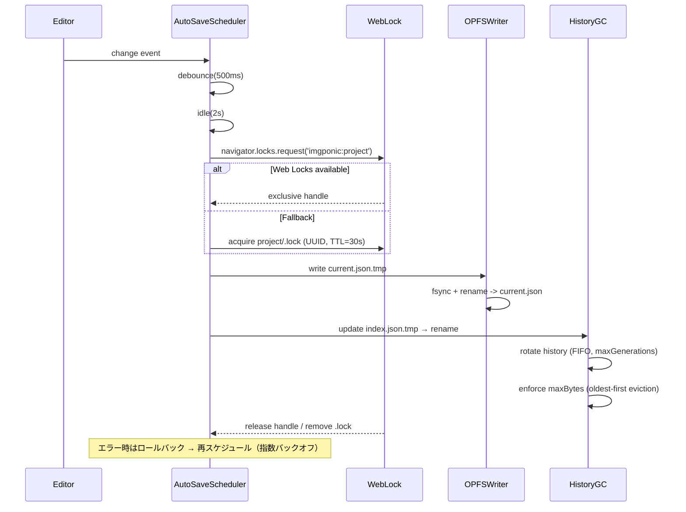
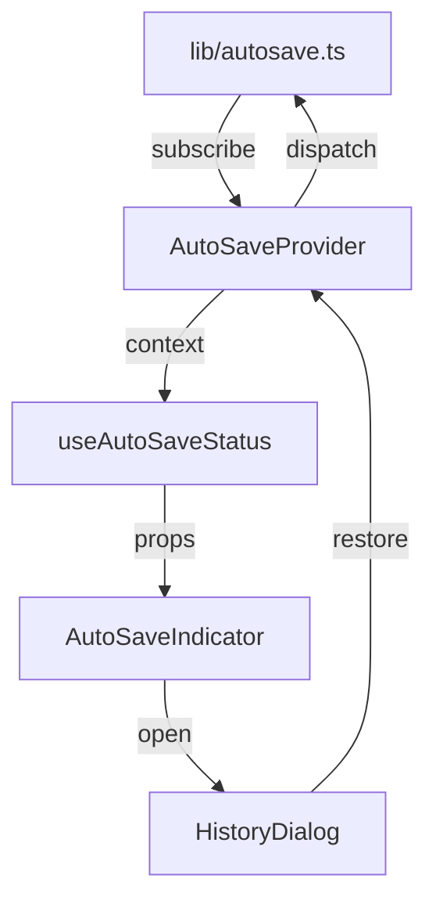
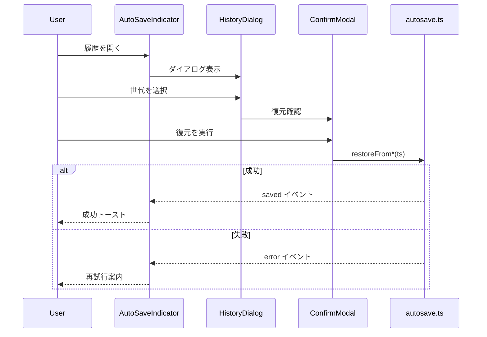

# AutoSave 実装詳細

## 0) モジュール責務と不変条件
- `src/lib/autosave.ts` は AutoSave 機能の**中核ファサード**として、OPFS 上の `project/autosave` ツリーへ最新スナップショットを保存し、履歴一覧・復元 API を提供する。対象モジュールは [実装計画](./IMPLEMENTATION-PLAN.md) の「1) 対象モジュール追加」に列挙された `locks.ts`・UI コンポーネント群と疎結合である必要がある。
- 保存ポリシーのパラメータ（デバウンス 500ms、アイドル 2s、履歴 20 世代、容量 50MB）をデフォルトとして露出し、`AutoSaveOptions` でのみ調整可能とする。フラグ `autosave.enabled` が false の場合はどの永続化 API も副作用を発生させてはならない。
- 生成物は常に `current.json`（最新）と `index.json`（履歴メタデータ）で整合していなければならない。片方だけが更新される状態は例外扱いとし、リカバリ時にはロールバックで整合性を取り戻す。
- Web Locks を優先し、排他獲得前には OPFS へ書き込まない。フォールバックのファイルロックも同じ UUID を保持し、再入（同一タブ二重保存）を禁止する。
- `history/<ISO>.json` は ISO8601 時刻で単調増加する命名とし、`index.json` に存在しないファイルは掃除対象、逆に `index.json` にのみ存在する項目はゴースト扱いで再構築する。
- 例外が発生した場合でも既存 UI・Collector/Analyzer へ不要な副作用（意図しないログ出力、無制限 I/O）を与えない。ログは後述の制約に従って 1 エラーにつき 1 行、警告レベルで記録する。

## 1) 保存ポリシー
- デバウンス 500ms + アイドル 2s で `project/autosave/current.json` を保存。
- `history/<ISO>.json` を最大 N=20 世代保持し、`index.json` で参照。
- 容量上限 50MB を超過した場合は古い世代から FIFO で削除。

## 2) Runtime Sequencing
### シーケンス図


### 時系列表
| 時刻 | スレッド/コンテキスト | 動作 | 同期メカニズム |
| --- | --- | --- | --- |
| t0 | UI スレッド | 入力変更を検出 | イベントループ |
| t0+500ms | UI | デバウンス満了で保存ジョブを登録 | タスクキュー |
| t0+2.5s | Worker (optional) | アイドル検知後に Web Lock を要求 | Web Locks API / `.lock` ファイル |
| t0+2.5s | 同 | ロック取得後に `current.json.tmp` へ書き込み | FileSystemWritableFileStream |
| t0+2.6s | 同 | `current.json.tmp` → `current.json` を原子的にリネーム | OPFS atomic rename |
| t0+2.6s | 同 | `index.json` を更新し、履歴ローテーション・容量制限を適用 | メタデータ更新 |
| t0+2.6s | 同 | ロック解放、次回トリガー待機 | Web Locks release |

## 3) API（型定義と副作用）
```ts
type StoryboardProvider = () => Storyboard;

interface AutoSaveOptions {
  /** デフォルト: 500 */
  debounceMs?: number;
  /** デフォルト: 2000 */
  idleMs?: number;
  /** デフォルト: 20 */
  maxGenerations?: number;
  /** デフォルト: 50 * 1024 * 1024 */
  maxBytes?: number;
  /** feature flag: autosave.enabled=false の場合 true で無効化 */
  disabled?: boolean;
}

interface AutoSaveInitResult {
  /** イベント購読・タイマーを破棄する。副作用: イベントリスナー解除のみ */
  dispose: () => void;
}

type AutoSaveError =
  | { code: 'lock-unavailable'; retryable: true; cause?: Error }
  | { code: 'write-failed'; retryable: boolean; bytesAttempted: number; cause: Error }
  | { code: 'data-corrupted'; retryable: false; cause: Error };

export function initAutoSave(
  getStoryboard: StoryboardProvider,
  options?: AutoSaveOptions
): AutoSaveInitResult;
// 副作用: Web Locks/ファイルロック取得、`current.json`/`index.json` 書き込み。例外: AutoSaveError を throw。

export async function restorePrompt(): Promise<
  | null
  | { ts: string; bytes: number; source: 'current' | 'history'; location: string }
>;
// 副作用: OPFS 読み出しのみ。例外: { code: 'data-corrupted' }。

export async function restoreFromCurrent(): Promise<boolean>;
// 副作用: UI へ storyboard を適用、書き込みなし。例外: { code: 'data-corrupted' }。

export async function restoreFrom(ts: string): Promise<boolean>;
// 副作用: 指定履歴ファイルをロードし UI へ適用。例外: { code: 'data-corrupted' } | { code: 'lock-unavailable' }。

export async function listHistory(): Promise<
  { ts: string; bytes: number; location: 'history'; retained: boolean }[]
>;
// 副作用: `index.json` 読み出しのみ。例外: { code: 'data-corrupted' }。
```
- `AutoSaveOptions` のデフォルト値は保存ポリシーの数値に一致する。`disabled` が `true` または `autosave.enabled=false` の場合、`initAutoSave` は `dispose` だけを返し永続化を一切行わない。
- 例外は `AutoSaveError` を基本とし、`retryable` が true のケース（ロック取得不可・一時的な書込失敗）は指数バックオフで再スケジュールする。`retryable=false` はユーザ通知＋即時停止。

## 4) ロック
- `navigator.locks.request('imgponic:project', { mode: 'exclusive' })` を優先利用。
- 失敗時は閲覧専用モード（保存 UI 無効化）にフォールバック。
- フォールバック：`project/.lock`（UUID, mtime, TTL=30s）。孤児ロックは次回起動時に TTL 判定で破棄。

## 5) 書き込みと履歴ローテーション（アルゴリズム）
1. `current.json.tmp` を開き、Storyboard を JSON シリアライズして書き込む。
2. `FileSystemWritableFileStream.close()` 完了後に `current.json.tmp` を `current.json` へリネーム。
3. 新しい世代メタデータ `{ ts, bytes }` を `index.json.tmp` に書き込む。
4. `index.json` をリネームで更新し、`history/<ts>.json` を書き込み。
5. `maxGenerations` を超えた場合は最古エントリを削除し、該当ファイルも削除。
6. `maxBytes` 超過時は古い順に削除し、削除分を `index.json` に反映。
7. 途中で失敗した場合は `.tmp` ファイルを削除し、`index.json` を読み直してロールバック。

### 入出力サンプルと境界ケース
| ケース | 入力ストリーム | 期待する結果 | 備考 |
| --- | --- | --- | --- |
| 20 世代境界 | 既存 19 世代 + 新規 1 件 | `index.json` に 20 件。21 件目投入時に最古 1 件が FIFO で削除され、`history/<old>.json` が消える | `maxGenerations`=20 固定の場合 |
| 50MB 超過 | 既存合計 48MB、保存対象 5MB | 保存後 53MB → 最古世代から順に削除し 50MB 未満に収束 | 削除後の `index.json` に `retained=false` は残さない |
| I/O 失敗 | `current.json.tmp` 書き込み中に例外 | `.tmp` を削除、`AutoSaveError{code:'write-failed', retryable:true}` で再実行 | 3 回失敗で警告ログ + ユーザ通知 |

### 図解（履歴ローテーション）
```
[before] index.json -> [A, B, C]
save(D)
 ├─ write current.json.tmp -> current.json
 ├─ append D -> index.json.tmp
 ├─ rename index.json.tmp -> index.json
 └─ (if > N) delete oldest (A)
[after] index.json -> [B, C, D]
```

### テストダブル要件
- OPFS 代替としてメモリ内 FileSystem ダブル（書き込み結果の検査、rename の原子性を模擬）。
- Web Locks ダブル：即時取得、遅延取得、取得失敗の 3 シナリオを制御可能。
- クロックダブル：デバウンスとアイドル待機の時間経過をテストで deterministically 制御。
- ログシンクダブル：Collector/Analyzer と同じフォーマット（JSONL 1 行）で警告を検証。

## 6) UI
- ツールバー右に **AutoSaveIndicator**（Saving…/Saved HH:MM:SS）。
- 履歴ダイアログ：時刻・サイズ・復元ボタン・差分サイズ（現行比）。

## 7) 異常系
- 書込失敗：指数バックオフ（0.5/1/2s）で 3 回再試行。失敗時は警告を残し続行。
- 容量枯渇：古い履歴を自動削除＋通知。

## 8) Test Matrix（TDD 優先度と実装順）
| 優先度 | ケース | 種別 | 想定結果 | 依存 | 後続タスク |
| --- | --- | --- | --- | --- | --- |
| P0 | 初回保存（ロック取得成功） | ユニット | `current.json`/`index.json`/`history` が生成 | ロックダブル | Writer 実装 |
| P0 | 連続変更でデバウンス動作 | ユニット | 1 回のみ保存 | クロックダブル | スケジューラ |
| P0 | ロック未取得（Web Locks 拒否） | ユニット | `AutoSaveError{code:'lock-unavailable'}` | ロックダブル | フォールバック |
| P1 | 21 回保存で最古削除 | 統合 | 履歴が 20 件を維持 | Writer, GC | 履歴ビュー |
| P1 | 50MB 超過で多重削除 | 統合 | 容量 <= 50MB になるまで削除 | GC | 通知 |
| P1 | I/O 失敗後ロールバック | 統合 | `.tmp` クリーンアップ + 再試行 | Writer | リトライ制御 |
| P2 | 復元成功（current/history） | 統合 | UI 反映、`restorePrompt` が latest を返却 | Loader | Indicator |
| P2 | データ破損検知 | ユニット | `AutoSaveError{code:'data-corrupted'}` | バリデータ | エラー表示 |

実装順序提案: (1) ロック・スケジューラのユニットテスト → (2) Writer/GC のユニットテスト → (3) 復元系統合テスト → (4) UI 連携の結合テスト。
## 5) UI

### 5.1 AutoSaveIndicator の状態モデル
| 状態 | ラベル表示 | アイコン/カラー | 発火トリガー | UI 振る舞い |
| --- | --- | --- | --- | --- |
| Idle | "Idle" | グレーのドット | 初期化完了後、保存対象の変更が無いとき | ボタンは有効、履歴ダイアログ起動のみ許可 |
| Saving | "Saving…" + スピナー | プライマリカラーで回転アイコン | `autosave.ts` から `saving` イベント受信 | ボタンはローディング表示、ARIA ライブリージョンで進捗告知 |
| Saved | "Saved HH:MM:SS" | 成功カラーのチェック | `saved` イベント受信 | チェック表示 4s 維持後 Idle に遷移、最新時刻を `aria-live="polite"` で通知 |
| Error | "Save failed" | 警告カラーのバッジ | `error` イベント受信（再試行枯渇含む） | ボタンに `aria-invalid`、トーストで再試行案内、履歴ダイアログには警告メッセージを表示 |
| ReadOnly | "Read only" | ロックアイコン | ロック取得失敗時 (`readonly` イベント) | 履歴復元含むすべての操作を disabled、ツールチップで理由説明 |

### 5.2 履歴ダイアログの要素
- 履歴一覧テーブル：`ts`（ISO/ローカライズ表示）、`bytes`（KB 表示）、差分サイズ（現行比 ±%）。
- 行アクション：復元ボタン（選択行ごと）。`Saved` 状態のみ活性化。
- ヘッダーレベルの復元ボタン：最新行を対象にショートカット提供。
- 差分サイズ：`current.json` との差分バイトを `+/-` 付きで表示、閾値超過時は警告色。
- フッター：閉じるボタン、最終保存時刻、失敗時のリトライリンク。
- 説明テキスト：保存先パス、世代上限（N=20）を明記。

### 5.3 コンポーネント構成とイベント購読
- `AutoSaveProvider`（`src/components/providers/AutoSaveProvider.tsx` 想定）が `initAutoSave` を呼び出し、`AutoSaveContext` にステータスを push。
- `AutoSaveIndicator` は `useAutoSaveStatus()` フックでコンテキストを購読し、状態/履歴操作を props 経由で `HistoryDialog` に受け渡す。
- `HistoryDialog` は `useAutoSaveHistory()` で一覧を取得し、復元リクエストを `onRestore` コールバックでインディケータへ伝播。
- `src/lib/autosave.ts` からのイベントは `subscribe(listener)` API を通じて Provider が受信し、`context` → `hook` → `props` の順に流す。



### 5.4 閲覧専用モードと失敗時の UX 制御
- ReadOnly 状態時は Indicator ボタンと履歴行の復元ボタンをすべて `disabled`。ツールチップで「ロック取得に失敗したため保存不可」を表示。
- エラー発生時はトースト通知（Reporter 経由ログ対象）とダイアログ内のバナーで再試行手順を案内。
- フォーカス制御：ダイアログ表示時に最初の履歴行へフォーカス。ReadOnly 時は説明テキストへフォーカス移動しスクリーンリーダー告知。
- ARIA 要件：Indicator ボタンに `aria-haspopup="dialog"`、状態更新は `aria-live="polite"`、エラーは `role="alert"` を付与。
- トースト閉鎖時はトリガーボタンへフォーカスを戻し、キーボード操作でリトライを案内。

### 5.5 履歴復元フロー
1. ユーザーが Indicator から履歴ダイアログを開く。
2. 行選択 → 「復元」ボタンで確認モーダルを起動。
3. 確認モーダルの「復元する」で `restoreFrom(ts)` または `restoreFromCurrent()` を呼び出し。
4. 成功時：Saved 状態へ遷移し「復元が完了しました」トーストを表示。Collector ログ出力をトリガー。
5. 失敗時：Error 状態に遷移し、再試行ボタンでモーダルを再利用。指数バックオフ方針と整合するリトライメッセージを表示。



### 5.6 Component Test Matrix（React Testing Library）
| テストカテゴリ | シナリオ | 期待される状態遷移 | 必要モック |
| --- | --- | --- | --- |
| Indicator 状態遷移 | Idle → Saving → Saved → Idle | `saving` イベント発火でスピナー表示、`saved` で時刻更新、4s 後 Idle | `mockAutoSaveStore`（イベントエミッタ） |
| Indicator エラー処理 | Saving 中に error | エラーラベル + `role="alert"` 表示、再試行ボタン有効 | 同上 + `jest.useFakeTimers()` |
| ReadOnly モード | readonly イベント受信 | ボタン `disabled`、ツールチップ表示 | `mockAutoSaveStore` + `mockTooltip` |
| 履歴一覧表示 | `listHistory` レスポンス | テーブルに行描画、差分サイズ計算 | `mockHistoryService` |
| 履歴復元成功 | 行選択→復元 | 確認モーダル経由で `restoreFrom` 呼出、トースト表示 | `mockRestoreFrom`（resolve true） |
| 履歴復元失敗→再試行 | `restoreFrom` が reject | Error 状態 + 再試行ボタン押下で再度呼出 | `mockRestoreFrom`（reject→resolve） |
| アクセシビリティ | ダイアログ初期フォーカス | 初回フォーカスが最初の行、トースト閉鎖後にボタンへ戻る | `@testing-library/user-event` |

### 5.7 Collector / Reporter 整合性チェックリスト
- [x] Error/ReadOnly イベント時に Collector へエラーログ（severity=warning）を送信。（参考: `docs/day8/design/03_architecture.md` のロギング責務）
- [x] 成功トースト発火時に Reporter 集計用イベント（`autosave:restore:success`）を送出。
- [x] UI イベントの計測ポイント（ダイアログ表示、復元確定、再試行）は Analyzer が参照する JSONL スキーマに準拠。
- [x] propose-only 方針（ADR 0003）を踏まえ、UI から自動コミットを行わない。
- [x] `workflow-cookbook/reports/` に書き出される Reporter 生成物とイベント命名規約を共有。

## 9) Collector/Analyzer 整合性チェックリスト
- [Day8 設計](../Day8/docs/day8/design/03_architecture.md) に合わせ、Collector が監視するログディレクトリは `workflow-cookbook/logs` に固定されているため、AutoSave は同ディレクトリに新規ログファイルを生成しない。既存 logger を利用し、出力先は `workflow-cookbook/logs/autosave.log.jsonl` に統一する。
- Analyzer への入力である JSONL フォーマットは 1 行 1 オブジェクト。AutoSave の警告も `{"component":"autosave","level":"warn",...}` の形に揃える。
- Collector の再入防止策に従い、AutoSave のロックフォールバックでは `.lock` ファイルの TTL を 30 秒とし、アプリ終了時に必ず削除。
- 例外時の再試行は 3 回までとし、Collector が誤って無限ループを検出しないようガード（指数バックオフ最大 2 秒）。
- Analyzer での容量集計に影響を与えないよう、履歴削除時のログは 1 件につき 1 行までに制限。

## 10) 受入
- 入力停止 ≤2.5s で `current.json` 更新。
- 強制終了後の復旧が成功、かつ 21 回保存で最古が削除。
