# AutoSave 実装詳細

## 0) モジュール責務と不変条件

| 観点 | 要件 | 依存/備考 |
| --- | --- | --- |
| 責務 | `src/lib/autosave.ts` が AutoSave の**中核ファサード**として、スナップショット保存・履歴取得・復元 API を提供する。 | [IMPLEMENTATION-PLAN](./IMPLEMENTATION-PLAN.md) §1 と連携し、`locks.ts`・UI 層とは疎結合。 |
| 永続化 | `project/autosave/current.json` と `index.json` をアトミック更新し整合を維持する。 | 片方のみ更新された場合はロールバックし、`AutoSaveError('write-failed', retryable=true)` を発行。 |
| ロック | Web Locks を優先し、獲得前に OPFS へ書き込まない。同一 UUID によるフォールバック `.lock` で再入を禁止。 | `src/lib/locks.ts` の契約に従い、取得失敗は指数バックオフで再試行。 |
| 履歴 | `history/<ISO>.json` を ISO8601 で単調増加させ、`index.json` と相互整合を保つ。 | 乖離検知時は GC が再構築し、欠落は `AutoSaveError('history-overflow', retryable=false)`。 |
| エラーポリシー | UI・Collector/Analyzer へ副作用を与えず、`warn` ログ 1 行で終了。`retryable` により再試行可否を明示。 | 例外階層は §3.1.1 を参照。 |

Phase A では保存パラメータ（デバウンス 500ms、アイドル 2s、履歴 20 世代、容量 50MB）を固定し、`AutoSaveOptions.disabled` と設定フラグ `autosave.enabled` の二重ガードで有効/無効のみを制御する。

## 1) 保存ポリシー

### 1.1 保存パラメータと適用ポリシー
| 保存パラメータ | 既定値 (`AUTOSAVE_DEFAULTS`) | Phase A の上書き可否 | 入力ソース | 主担当 API/モジュール | 補足 / 運用ノート |
| --- | --- | --- | --- | --- | --- |
| デバウンス遅延 | `500` | 不可（固定値） | - | `initAutoSave`（スケジューラ） | 入力検知後 500ms 待機して保存ジョブをキューイング。UI からのイベントスパイクを抑制する。 |
| アイドル猶予 | `2000` | 不可（固定値） | - | `initAutoSave` / `AutoSaveIndicator` | デバウンス完了後 2s アイドルを確認し、ロック要求へ遷移して状態を UI へ伝播する。 |
| 履歴世代上限 | `20` | 不可（固定値） | - | `initAutoSave`（履歴 GC） | `history/<ISO>.json` を FIFO 管理し、`index.json` と整合させる。 |
| 容量上限 | `50 * 1024 * 1024` | 不可（固定値） | - | `initAutoSave`（容量ガード） | 50MB 超過時は古い世代から削除し、Collector/Analyzer が参照するメトリクスを変動させない。 |
| フィーチャーフラグ | `false` (既定) | 可（設定値で制御） | `autosave.enabled` / `AutoSaveOptions.disabled` | `initAutoSave` / `App.tsx` | [実装計画](./IMPLEMENTATION-PLAN.md) §0 で規定。いずれかが無効化判定に一致した場合は永続化 API を呼ばず `phase='disabled'` を維持する。 |
| ロック優先順位 | Web Locks → フォールバック | - | - | `src/lib/locks.ts` | Web Locks が不可時は `project/.lock` を同一 UUID で保持し、Collector/Analyzer が扱うパスに干渉しない。 |

Phase B 以降で可変化する場合は `AutoSaveOptions` を拡張し、`normalizeOptions()` を通じて `AUTOSAVE_POLICY` と整合させる（現在は `disabled` のみ受理）。

### 1.2 ポリシー適用フロー
- デバウンス 500ms + アイドル 2s で `project/autosave/current.json` を保存。
- `history/<ISO>.json` を最大 N=20 世代保持し、`index.json` で参照。
- 容量上限 50MB を超過した場合は古い世代から FIFO で削除。

### 1.3 Phase A ガードの設計リスクとロールバック条件

| ガード | 想定リスク | ロールバック条件 | 備考 |
| --- | --- | --- | --- |
| `AutoSaveOptions.disabled` | UI からの誤設定で常時無効化され、復元データが欠落する。 | 連続 3 回の `snapshot().phase==='disabled'` かつ `autosave.enabled=true` を検出した場合、ガードを強制無効化してローカル通知を出す。 | 将来の可変ポリシー導入時は `normalizeOptions()` でワーニングを返す。 |
| Feature flag `autosave.enabled` | フラグ配信遅延により有効化が遅れる。 | フラグ false のまま 24h 経過した場合はオペレーション通知を行い、ロールバック（AutoSave 完全停止）で整合性を保つ。 | 配信障害時の暫定策。 |
| 固定ポリシー値 | 将来のしきい値緩和を阻害する。 | GC が `history-overflow` を 2 回連続で検出した場合、最後の成功世代へ復帰して以降の保存を一時停止。 | Phase B でダイナミック設定を導入予定。 |

## 2) Runtime Sequencing

### 2.1 `initAutoSave` I/O / 状態遷移 / 例外

| I/O | 説明 |
| --- | --- |
| Input | `getStoryboard: () => Storyboard`, `options?: AutoSaveOptions`, feature flag `autosave.enabled`. |
| Output | `AutoSaveInitResult`（`snapshot`, `flushNow`, `dispose`）。`snapshot` は状態を同期取得し、`flushNow` は保存完了で解決する。 |
| 副作用 | Web Locks / `.lock` 取得、OPFS への書込、`history/` のローテーション、`warn` ログ発行。 |

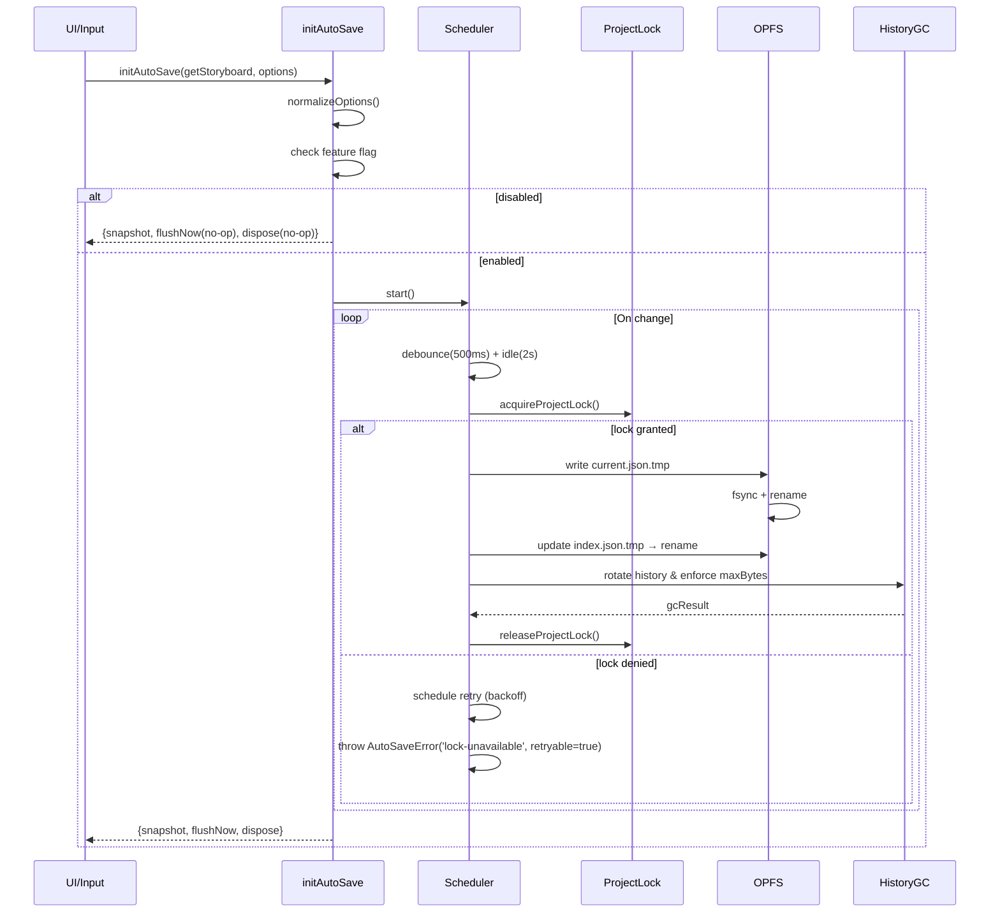

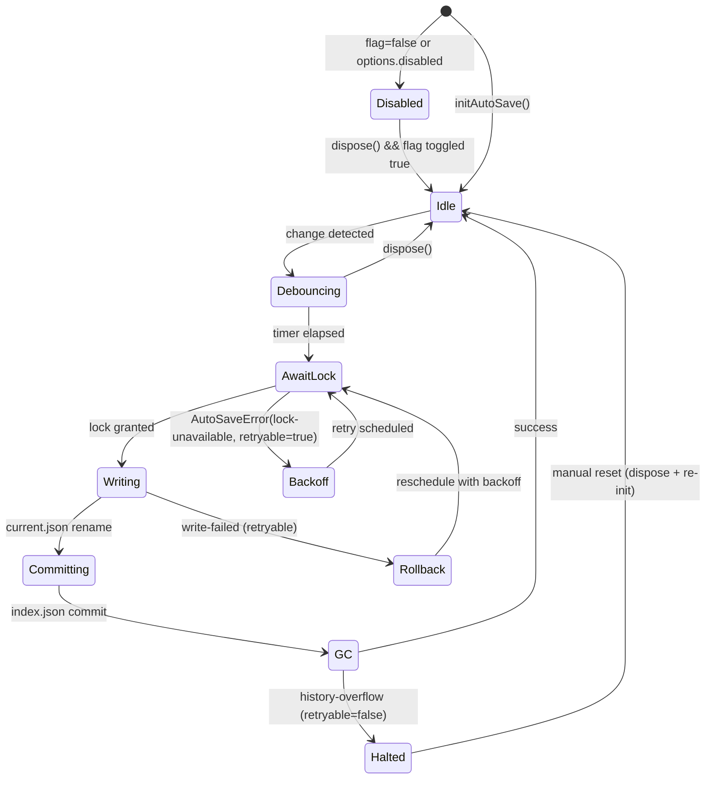

### 2.2 `restorePrompt` / `restoreFrom*` I/O / 例外

| 関数 | Input | Output | 主な例外 |
| --- | --- | --- | --- |
| `restorePrompt()` | なし | `null` or `{ts, bytes, source, location}` | `AutoSaveError('data-corrupted', retryable=false)` when `index.json` parse fails. |
| `restoreFromCurrent()` | なし | `Promise<boolean>` | `AutoSaveError('data-corrupted', retryable=false)` / `'write-failed'`（UI 反映不可）。 |
| `restoreFrom(ts)` | `ts: string` | `Promise<boolean>` | `AutoSaveError('data-corrupted', retryable=false)` / `'history-overflow'`（履歴欠落）。 |

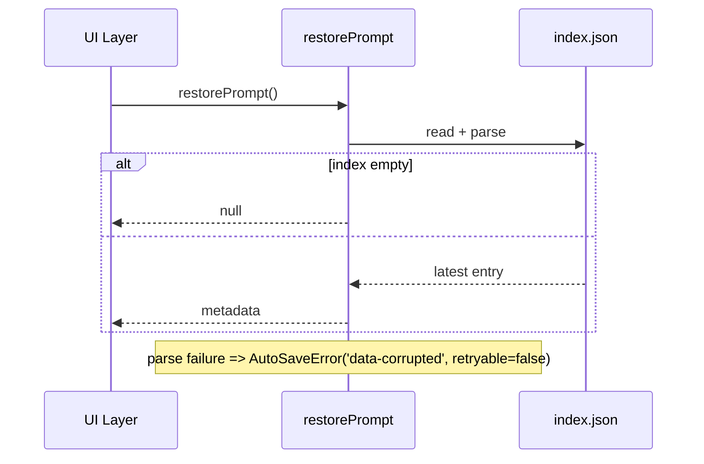

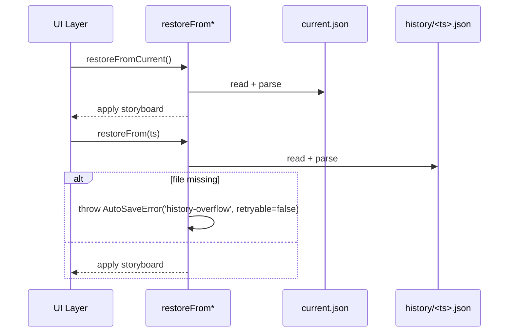

### 2.3 `listHistory` I/O / シーケンス

| Input | Output | 例外 |
| --- | --- | --- |
| なし | `{ ts, bytes, location: 'history', retained }[]` | `AutoSaveError('data-corrupted', retryable=false)` when index parse fails. |

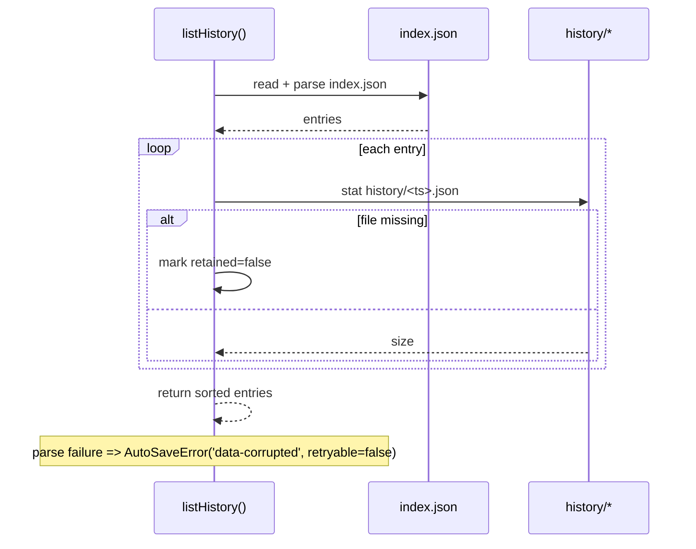

### 2.4 時系列表
| 時刻 | スレッド/コンテキスト | 動作 | 同期メカニズム |
| --- | --- | --- | --- |
| t0 | UI スレッド | 入力変更を検出 | イベントループ |
| t0+500ms | UI | デバウンス満了で保存ジョブを登録 | タスクキュー |
| t0+2.5s | Worker (optional) | アイドル検知後に Web Lock を要求 | Web Locks API / `.lock` ファイル |
| t0+2.5s | 同 | ロック取得後に `current.json.tmp` へ書き込み | FileSystemWritableFileStream |
| t0+2.6s | 同 | `current.json.tmp` → `current.json` を原子的にリネーム | OPFS atomic rename |
| t0+2.6s | 同 | `index.json` を更新し、履歴ローテーション・容量制限を適用 | メタデータ更新 |
| t0+2.6s | 同 | ロック解放、次回トリガー待機 | Web Locks release |

## 3) API（型定義と副作用）

### 3.1 公開 API 型シグネチャ
```ts
type StoryboardProvider = () => Storyboard;

interface AutoSaveOptions {
  /** フラグ連動の静的ガード。true の場合は全処理をスキップ。 */
  disabled?: boolean;
}

interface AutoSaveInitResult {
  readonly snapshot: () => AutoSaveStatusSnapshot;
  flushNow: () => Promise<void>;
  dispose: () => void;
}

type AutoSaveErrorCode =
  | 'lock-unavailable'
  | 'write-failed'
  | 'data-corrupted'
  | 'history-overflow'
  | 'disabled';

interface AutoSaveError extends Error {
  readonly code: AutoSaveErrorCode;
  readonly retryable: boolean;
  readonly cause?: Error;
  readonly context?: Record<string, unknown>;
}

export function initAutoSave(
  getStoryboard: StoryboardProvider,
  options?: AutoSaveOptions
): AutoSaveInitResult;

export async function restorePrompt(): Promise<
  | null
  | { ts: string; bytes: number; source: 'current' | 'history'; location: string }
>;

export async function restoreFromCurrent(): Promise<boolean>;

export async function restoreFrom(ts: string): Promise<boolean>;

export async function listHistory(): Promise<
  { ts: string; bytes: number; location: 'history'; retained: boolean }[]
>;
```
- `AutoSaveOptions` は Phase A では `disabled` のみを受理する。その他の保存パラメータは `AUTOSAVE_POLICY` 固定値として扱い、将来の拡張時は `normalizeOptions()` でバリデーションを行う。
- `disabled` が `true` または設定フラグ `autosave.enabled=false` の場合、`initAutoSave` は [実装計画](./IMPLEMENTATION-PLAN.md) §0 の no-op 要件を満たすため `flushNow` を no-op とした上で `dispose` だけを返し永続化を一切行わない。
- 例外は `AutoSaveError` を基本とし、`retryable` が true のケース（ロック取得不可・一時的な書込失敗）は指数バックオフで再スケジュールする。`retryable=false` はユーザ通知＋即時停止。`code='disabled'` は再試行禁止の静的ガードとして扱い、ログのみ残して停止する。
- `flushNow()` は保存可能な状態（`idle` or `debouncing`）であれば 2s アイドル待機をスキップし、ロック取得と書込の完了まで待つ。実行中のフライトがある場合はその完了を待機し、同時実行を避ける。
- `snapshot()` は内部状態の即時スナップショットを返し UI 側の `isReadOnly` や `lastError` 表示に利用する。内部ステートは後述の状態遷移表に従う。

### 3.1.1 例外階層

```mermaid
flowchart TD
    AutoSaveError[AutoSaveError]
    LockErr[code="lock-unavailable"\nretryable=true]
    WriteErr[code="write-failed"\nretryable=true]
    DataErr[code="data-corrupted"\nretryable=false]
    HistoryErr[code="history-overflow"\nretryable=false]
    DisabledErr[code="disabled"\nretryable=false]

    AutoSaveError --> LockErr
    AutoSaveError --> WriteErr
    AutoSaveError --> DataErr
    AutoSaveError --> HistoryErr
    AutoSaveError --> DisabledErr
```

### 3.2 プロジェクトロック API 設計

AutoSave の前提となる排他制御は `src/lib/locks.ts` に集約し、Web Locks を優先・フォールバックで `project/.lock`（Collector/Analyzer が参照しないプロジェクトルート配下）を使用する。`project/.lock` は OPFS の `project/autosave` 階層と並列に配置され、Collector/Analyzer 専用パス（`collector/`, `analyzer/`）と衝突しない。

#### 3.2.1 API 面の責務

| 関数 | 入力 | 出力 | 再試行・フォールバック戦略 | 説明 |
| --- | --- | --- | --- | --- |
| `acquireProjectLock(options?: AcquireProjectLockOptions)` | `signal?`, `ttlMs?`, `heartbeatIntervalMs?`, `preferredStrategy?`, `backoff?`, `retry?`, `onReadonly?` | `ProjectLockLease`（`leaseId`, `ownerId`, `strategy`, `viaFallback`, `resource`, `acquiredAt`, `expiresAt`, `ttlMillis`, `nextHeartbeatAt`, `renewAttempt`） | `retry` が `false` の場合は 1 回のみ、それ以外は `backoff.maxAttempts`（既定 3 回）で指数バックオフ。`navigator.locks` が無い場合は自動で `file-lock` に切替。 | Web Locks を優先し、拒否された場合や非対応環境では同一 UUID でフォールバック。獲得時にイベント `lock:acquired`/`lock:renew-scheduled` を発行。 |
| `renewProjectLock(lease, options?: RenewProjectLockOptions)` | `lease`, `signal?` | 更新済み `ProjectLockLease` | TTL 内はリトライ可、`lease.strategy==='file-lock'` の場合は `.lock` を更新。 | TTL 手前でのハートビート更新。遅延時は `lock:warning`(`heartbeat-delayed`) を通知。 |
| `releaseProjectLock(lease, options?: ReleaseProjectLockOptions)` | `lease`, `signal?`, `force?` | `void` | `force` が true でも `.lock` を削除。Web Lock ハンドル紛失時も冪等。 | 正常/強制解放を統一し、`lock:release-requested`→`lock:released` を通知。 |
| `withProjectLock(executor, options?: WithProjectLockOptions)` | `executor`, `renewIntervalMs?`, `releaseOnError?`, `AcquireProjectLockOptions` 同等 | `Promise<T>` | `renewIntervalMs` で定期 `renew` を実行し、例外時は `releaseOnError`（既定 true）で解放。 | AutoSave の高階ユーティリティ。読み取り専用へ降格時は `onReadonly` を呼ぶ。 |
| `projectLockEvents.subscribe(listener)` | `ProjectLockEventListener` | `() => void` | - | `projectLockApi.events` 経由で UI が購読する。 |

`AcquireProjectLockOptions.retry` は API レベルで再試行の有無を明示するフラグで、型定義により呼び出し側が挙動を選択できる。

#### 3.2.2 状態遷移

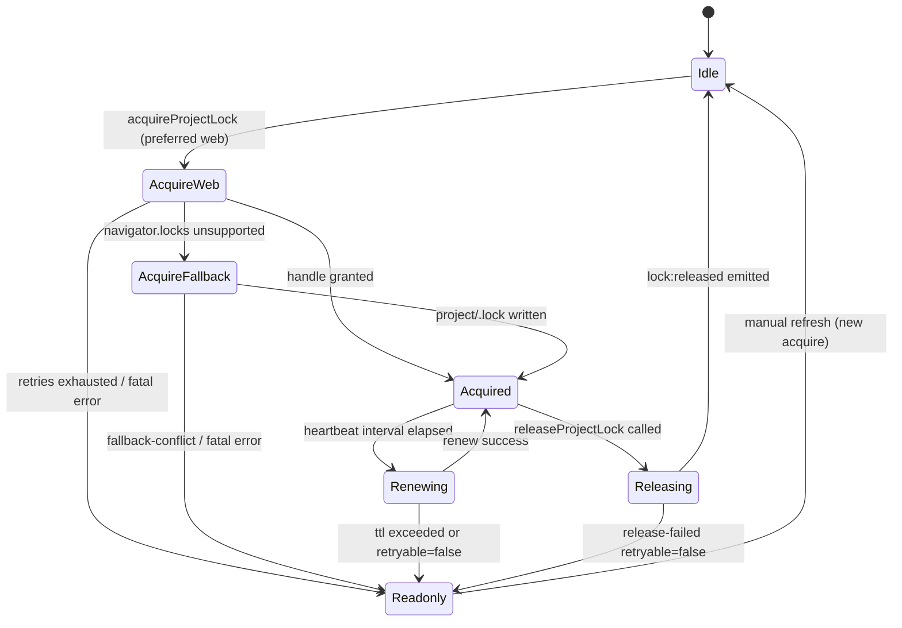

#### 3.2.3 例外ハンドリングテーブル

| エラーコード (`ProjectLockError.code`) | 発生オペレーション | retryable | UI 伝播 | 主要原因 |
| --- | --- | --- | --- | --- |
| `web-lock-unsupported` | acquire | true | `lock:warning`(`fallback-engaged`) → `lock:acquired`(viaFallback) | Web Locks API が存在しない/許可されない |
| `acquire-denied` | acquire | true | `lock:error` → リトライ（`retry` が true の場合） | ブラウザがロックを拒否 |
| `acquire-timeout` | acquire | false | `lock:readonly-entered`(`acquire-failed`) | リトライ上限到達 |
| `fallback-conflict` | acquire | true | `lock:warning`(`fallback-degraded`) | `.lock` が別タブに保持されている |
| `lease-stale` | renew / release | false | `lock:readonly-entered`(`renew-failed`/`release-failed`) | `.lock` の所有者不一致 |
| `renew-failed` | renew | true | `lock:error` → リトライ | Web Lock ハンドル喪失・一時的な I/O エラー |
| `release-failed` | release | true | `lock:error` → `lock:readonly-entered` | Web Lock ハンドル破棄済み・`.lock` 削除失敗 |

#### 3.2.4 イベントと Payload

| イベント | Payload | トリガー |
| --- | --- | --- |
| `lock:attempt` | `{ strategy, retry }` | `acquireProjectLock` の各トライ試行開始 |
| `lock:waiting` | `{ retry, delayMs }` | リトライ待機 | 
| `lock:acquired` | `{ lease }` | ロック獲得成功（`lease.viaFallback` で手段判別） |
| `lock:renew-scheduled` | `{ lease, nextHeartbeatInMs }` | 獲得・更新後のハートビート予約 |
| `lock:renewed` | `{ lease }` | `renewProjectLock` 完了 |
| `lock:warning` | `{ lease, warning, detail? }` | フォールバック利用やハートビート遅延 |
| `lock:fallback-engaged` | `{ lease }` | フォールバック初回使用 |
| `lock:release-requested` | `{ lease }` | `releaseProjectLock` 呼出開始 |
| `lock:released` | `{ leaseId }` | ロック解放完了 |
| `lock:error` | `{ operation, error, retryable }` | 例外捕捉時 |
| `lock:readonly-entered` | `{ reason, lastError, retryable:false }` | リトライ不可で ReadOnly へ降格 |

UI 層は `lock:readonly-entered` を契機にバナー表示・保存停止へ遷移し、`lock:warning` の `warning` 種別で通知粒度を決定する。

#### 3.2.5 フォールバック互換性

- Web Locks 非対応環境では `acquireProjectLock` が自動的に `project/.lock` を使用し、`lease.viaFallback=true` を返却する。`withProjectLock` はこのフラグを参照しつつも API 互換を維持するため、既存 UI への破壊的変更は発生しない。
- `.lock` ファイルは UUID・所有者 ID（タブ識別子）と TTL を持ち、`renewProjectLock` で `expiresAt` を延長する。Collector/Analyzer が監視するパス外にあるため副作用を与えない。
- `retry=false` の場合でも `lock:error` イベントを通じて UI は即座に状況把握可能で、必要に応じて手動更新（ページリロード等）を案内する。

### 3.4 TDD 計画（`tests/autosave/*.spec.ts`）

| フェーズ | モジュール | 優先度 | テスト観点 |
| --- | --- | --- | --- |
| Phase A | `initAutoSave.debounce.spec.ts` | P0 | 500ms デバウンス、2s アイドル判定、`flushNow()` の即時コミット。 |
| Phase A | `initAutoSave.gc.spec.ts` | P0 | 履歴 20 世代維持、50MB 超過時の FIFO 削除、孤児ファイル再構築。 |
| Phase A | `initAutoSave.error-recovery.spec.ts` | P1 | lock 失敗時の指数バックオフ、`write-failed` からのロールバック、`history-overflow` で停止。 |
| Phase A | `restore.flow.spec.ts` | P1 | `restorePrompt` の空/正常/破損ケース、`restoreFrom*` の history 欠落。 |
| Phase A | `list-history.spec.ts` | P2 | `retained=false` マーク付与とメタデータ整合、並び順保証。 |
| Phase B | `options-matrix.spec.ts` | P2 | 将来の動的オプション有効化、`disabled` ガード優先順位。 |

優先度は Phase A のクリティカル挙動（デバウンス・GC・エラー復帰）を P0/P1 とし、拡張ケースを P2 に後ろ倒しする。

## 4) API 最終仕様と状態遷移

### 4.1 ステータススナップショット
```ts
type AutoSavePhase =
  | 'disabled'
  | 'idle'
  | 'debouncing'
  | 'awaiting-lock'
  | 'writing-current'
  | 'updating-index'
  | 'gc'
  | 'error';

interface AutoSaveStatusSnapshot {
  phase: AutoSavePhase;
  lastSuccessAt?: string; // ISO8601
  pendingBytes?: number;
  lastError?: AutoSaveError;
  retryCount: number;
  queuedGeneration?: number; // index.json 上の世代番号
}
```

| フィールド | 型 | 取得タイミング | 備考 |
| --- | --- | --- | --- |
| `phase` | `AutoSavePhase` | `snapshot()` 呼び出しごと | 状態遷移表（§4.2）と同期。 |
| `lastSuccessAt` | `string` (ISO8601) | `gc` 完了時 | 最終正常保存時刻。存在しない場合は未保存。 |
| `pendingBytes` | `number` | `debouncing` エントリー時 | 最新の書込予定バイト数。`idle` へ戻るとリセット。 |
| `lastError` | `AutoSaveError` | エラー発生時 | UI/Collector へ表示する詳細。`retryable=true` の場合は再試行後にクリア。 |
| `retryCount` | `number` | バックオフ開始時 | `retry-exhausted` 発火までインクリメント。 |
| `queuedGeneration` | `number` | `updating-index` | `index.json` 上の世代番号。GC 後に最新値へ更新。 |


### 4.2 オートセーブ状態遷移図
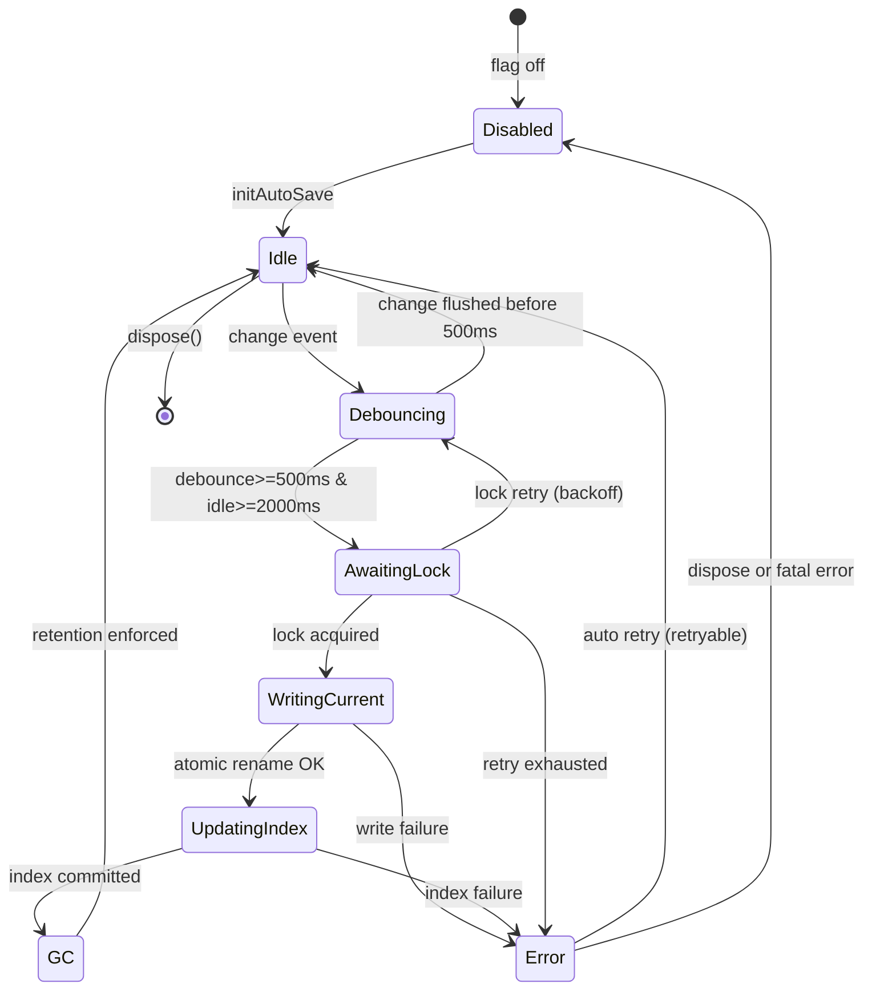

### 4.3 起動/停止フロー
1. `initAutoSave` 呼び出し時に `disabled` 判定 → true の場合はスケジューラを作成せず `phase='disabled'` のスナップショットのみ返却。
2. 有効な場合は以下を逐次実行。
   1. Debounce タイマーと Idle タイマーを初期化し、UI の変更イベントを `listenToStoryboardChanges()` で購読。
   2. 既存 `current.json` が存在する場合は `restorePrompt()` が利用できるようメタデータをキャッシュ。
   3. `dispose()` はイベント購読解除 → タイマー停止 → 進行中フライトを待機 → ロック開放 → `phase='disabled'` に遷移。
3. 例外がスローされた場合は `lastError` を更新し、`retryable=true` なら指数バックオフ（0.5s, 1s, 2s, 上限 4s）で `AwaitingLock` へ復帰。`retryable=false` は `phase='error'` のまま `flushNow` を no-op にして UI 通知後に `dispose()` を促す。

### 4.4 履歴保持ポリシーの詳細
- `index.json` には `{ ts, bytes, location }` を降順で保持し、`maxGenerations` 超過時は末尾を削除。
- `maxBytes` を超える場合は `sum(bytes)` を再計算しつつ古いレコードから削除し、対応する `history/<ts>.json` を削除。
- GC 後に削除されたファイルは `history-overflow` エラーとしてログするが、ユーザ通知は行わない（情報レベル）。
- `history` ディレクトリに孤児ファイルがある場合は削除し、`index.json` にのみ存在するエントリは `current.json` から再構築する。

### 4.5 再試行・停止条件
| フェーズ | エラーコード | retryable | 再試行条件 | 停止条件 |
| --- | --- | --- | --- | --- |
| AwaitingLock | lock-unavailable | true | バックオフ 0.5→1→2→4s（最大 4s） | 連続 5 回失敗で `phase='error'` → UI に ReadOnly 通知 |
| WritingCurrent | write-failed | true/false | `cause` が `DOMException` で `NotAllowedError` 以外なら true | 再試行失敗 or `NotAllowedError` で停止 |
| UpdatingIndex | write-failed | true | 同上 | 同上 |
| GC | history-overflow | false | - | ログのみ。`phase` は Idle 維持 |
| Restore | data-corrupted | false | - | UI に通知後、`restorePrompt` で null を返す |

## 5) テスト戦略
- **OPFS Stub**: `tests/autosave/__mocks__/opfs.ts` に `InMemoryOpfs` を実装。`writeAtomic`, `readJSON`, `rename`, `stat` を Promise ベースで再現し、容量計測をメモリ上で管理。`maxBytes` などの制約を検証可能とする。
- **Scheduler モック**: Fake タイマー (`@sinonjs/fake-timers`) を利用して `debounceMs`/`idleMs` の挙動を deterministic に検証。`flushNow()` を呼んだ際に即時書込が実行されることを確認。
- **ロックモック**: `navigator.locks` のモック実装とファイルロックスタブを用意し、取得成功/失敗/再試行を制御。連続失敗で `phase='error'` になることをテスト。
- **テストケース一覧**:
  1. フラグ無効時に `flushNow`/`dispose` が副作用なしで完了する。
  2. 単一変更で 500ms デバウンス + 2s アイドル後に `current.json` が原子的に更新される。
  3. `flushNow()` によりアイドル待機をスキップし、既存フライトと競合しない。
  4. ロック取得失敗が 4 回発生した後にバックオフで再試行し、5 回目で `phase='error'` になる。
  5. 履歴が 21 世代に達した際に FIFO で削除され、`maxBytes` 超過時も容量内に収束する。
  6. `write-failed`（再試行可）から復帰後に `lastSuccessAt` が更新される。
  7. `data-corrupted` 発生時に `restorePrompt` が null を返し、`snapshot().lastError` に反映される。
  8. `dispose()` が進行中フライトの完了を待機し、ロックが解放される。
- **テスト構成**: `tests/autosave/init.spec.ts`（起動/停止・フラグ判定）、`tests/autosave/scheduler.spec.ts`（デバウンス/アイドル/flush）、`tests/autosave/history.spec.ts`（GC・容量制限）、`tests/autosave/restore.spec.ts`（復元系）で段階的に実装。Fake タイマーと OPFS Stub を共有ユーティリティとして `tests/autosave/test-utils.ts` に切り出す。

### 5.2 AutoSaveIndicator UI/UX 設計

#### コンポーネント構成図
```mermaid
graph TD
  AutoSaveIndicator[AutoSaveIndicator (container)] --> Banner[autosave-indicator__banner
role="alert"]
  AutoSaveIndicator --> Primary[autosave-indicator__primary
role="status"]
  AutoSaveIndicator --> Meta[autosave-indicator__meta
<dl> metrics ]
  AutoSaveIndicator --> History[autosave-indicator__history
actions]
  History --> HistoryNote[autosave-indicator__history-note
read only hints]
```

| エリア | 役割 | 主なアクセシビリティ属性 | 主要データバインド | 備考 |
| --- | --- | --- | --- | --- |
| `AutoSaveIndicator` | コンテナ | `aria-busy`, `data-testid="autosave-indicator"` | `phase`, `retryCount`, `lastSuccessAt` | props で ViewModel を受け取り、Collector 通知は保持しない。 |
| `__banner` | エラー/ReadOnly 通知 | `role="alert"`, `aria-live="assertive"` | `isReadOnly`, `lastError` | `lock:readonly-entered` のみを表示し、Collector 連携は `initAutoSave` が担当。 |
| `__primary` | 状態ラベル | `role="status"`, `aria-live` 可変 | `statusLabel`, `description` | `retryCount>=3` で `Retrying (n)`。 |
| `__meta` | 直近メトリクス | `aria-label` | `lastSuccessAt`, `pendingBytes` | `<dl>` 構造で画面リーダーが読み上げ可能にする。 |
| `__history` | 操作群 | `aria-disabled`, `data-testid="autosave-history"` | `history.access`, `phase` | `phase='gc'`・ReadOnly では無効化し、GC 完了後に再度有効化。 |

#### UI 状態表
| 状態キー | 対応フェーズ | ReadOnly 判定 | Indicator 表示 | Banner 表示 | 履歴アクセス | 優先アクション | メモ |
| --- | --- | --- | --- | --- | --- | --- | --- |
| `idle` | `idle` | `false` | `Idle` ラベル、成功アイコン | 非表示 | `available` | 履歴を開く / 即時保存 | 最新成功スナップショットを表示し、Collector へ追加通知しない。 |
| `progress` | `debouncing` / `awaiting-lock` / `writing-current` / `updating-index` / `gc` | `false` | `Saving…` ラベル + アニメーション | 非表示 | `disabled` (`aria-busy=true`) | `flushNow` | I/O 中は操作を抑止し、進捗を `aria-live="polite"` で発話。 |
| `retrying` | `awaiting-lock` かつ `retryCount>=3` | `implicit` | `Retrying (n)` | 非表示 | `available` | 履歴を開く | 警告トーストは `App` 側で表示。Indicator は情報のみに留める。 |
| `readonly` | 任意フェーズ + `ProjectLockEvent`=`conflict` | `true` | `Read only` ラベル | `lock` 警告を表示 | `disabled` | - | ReadOnly 遷移時のみバナー強調。解除時は通常表示へ戻す。 |
| `fatal-error` | `error` かつ `retryable=false` | `false` | `Error` ラベル + アイコン | `role="alert"` で即時通知 | `available` | 履歴復元 / 手動保存 | 復元導線を強調し、Collector への `error-shown` 送信はランナー側が担う。 |

#### 状態図
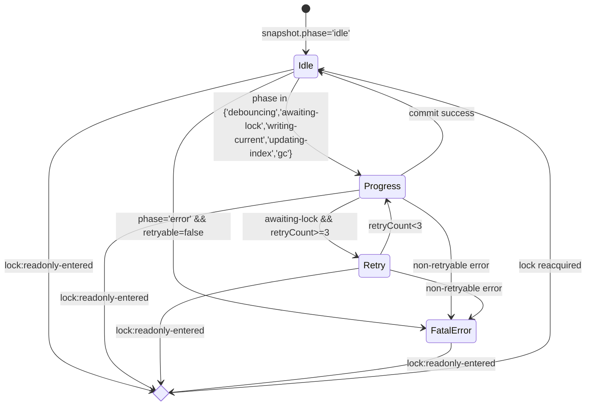

#### 履歴一覧と GC 通知 UX
- 履歴リストは `progress` であっても ReadOnly でない限りトリガー可能とし、`aria-disabled` の切り替えで明示する。
- `historySummary.overflowDetected` または容量/世代 90% 超過時は `__banner` ではなく `__history-note` に警告を集約し、Collector 通知はランナーに委譲する。
- GC 完了時は最新世代のボタンにフォーカスを返し、削除済み世代はメニューから除去する。

#### ユーザ操作シナリオ
| シナリオ | イベント列 | UI 反応 | テレメトリ | 備考 |
| --- | --- | --- | --- | --- |
| SCN-OK (通常保存) | `debouncing` → `awaiting-lock` → `idle` | `progress` → `idle` へ遷移し、`lastSuccessAt` 更新 | なし（Collector は `initAutoSave` が送信） | 履歴ボタンが再度活性化。 |
| SCN-RETRY (再試行) | `awaiting-lock` で `retryCount>=3` | Indicator は `retrying` に遷移、`__banner` は非表示 | `lock:retry` はランナー側 | 履歴から復元導線を許可。 |
| SCN-FATAL (致命エラー) | `error` + `retryable=false` | `fatal-error` でバナー表示 | `error-shown` をランナーが送信 | ユーザーへ履歴復元を案内。 |

### 5.1 UI 起動条件とイベント連携

#### 起動条件サマリ
| トリガー | 条件 | アクション | 備考 |
| --- | --- | --- | --- |
| フラグ解決 | `autosave.enabled === true`【F:docs/IMPLEMENTATION-PLAN.md†L10-L39】 | `initAutoSave()` を呼び出し | Phase A 既定は無効。 |
| 読み取り専用判定 | `AppState.isEditable === false` または `options.disabled===true` | `phase='disabled'` として起動回避 | ロック競合時に明示的にセット。 |
| アンマウント | React アンマウント / `beforeunload` | `dispose()` / `flushNow()` | `flushNow()` は最終保存保証。 |
| 状態伝播 | `snapshot()` 更新 | ストアに格納し 250ms ごとにサンプリング | 不要な再レンダリングを抑制。 |

#### 状態管理選択肢比較
| オプション | メリット | デメリット | 適用判断 |
| --- | --- | --- | --- |
| Zustand + `useStore` selector | 軽量・サブツリー更新を抑制。Immer なしでも読みやすい。 | ガバナンス上の devtools が薄い。SSR 時は手動初期化が必要。 | Phase A: UI 側の既存採用実績があるため第一候補。 |
| Redux Toolkit + RTK Query 無し | 監視・ロギングが整備され、開発チームに馴染みあり。 | ボイラープレート増加。Indicator 用には過剰。 | Phase B で Collector 連携を強化する場合に検討。 |
| React Context + `useReducer` | 依存がなく bundle が最小。 | コンポーネント毎のメモ化が難しく、再レンダリングが多い。 | 非推奨。Indicator の頻繁な更新には向かない。 |

#### イベント流路図
```mermaid
flowchart LR
  Editor -- change --> Scheduler[initAutoSave scheduler]
  Scheduler -- snapshot update --> Store[App Store (Zustand/Redux)]
  Store -- props --> Indicator[AutoSaveIndicator]
  Locks[locks.ts events] -- subscribeLockEvents --> Store
  App[App actions] -- flushNow/restore --> Scheduler
  Scheduler -- telemetry --> Collector[(Collector)]
  Indicator -- view-only --> User[User]
```

| イベント | 発火元 | 受信側 | Indicator の挙動 | Collector 連携 |
| --- | --- | --- | --- | --- |
| `snapshot()` 更新 | スケジューラ | ストア → Indicator | `phase`/`retryCount`/`lastSuccessAt` を再計算 | `initAutoSave` 内で送信。 |
| `ProjectLockEvent` (`acquired`) | `locks.ts` | ストア → Indicator | バナーを閉じ、`aria-live="polite"` で完了を案内 | なし。 |
| `ProjectLockEvent` (`conflict`) | `locks.ts` | ストア → Indicator | `readonly` バナー表示、操作無効化 | `lock:readonly-entered` はランナーが送信。 |
| `flushNow()` / `restore*` 完了 | App | ストア | `lastSuccessAt` / 履歴メッセージ更新 | ランナー側で成功ログ送信。 |
| `error-shown` | Indicator ではなくランナー | Collector | Indicator は通知しない | 責務分離を維持。 |
#### React Testing Library 事前テストケース
| カテゴリ | テスト ID | 観点 | 期待値 | 備考 |
| --- | --- | --- | --- | --- |
| ARIA 属性 | RTL-ARIA-STATUS | `role="status"` と `aria-live` が `phase` に応じて `polite/assertive` 切替される | `progress` 中は `aria-busy=true`、`fatal-error` で `aria-live="assertive"` | `getByRole('status')` を使用。 |
| ARIA 属性 | RTL-ARIA-ALERT | ReadOnly/Fatal バナーが `role="alert"` を持ち、`aria-live="assertive"` で即時通知 | `readonly` 遷移でバナーが追加され、解除で削除される | `queryByRole('alert')` で存在確認。 |
| 状態ラベル | RTL-LABEL-IDLE | `phase='idle'` 時に `Idle` が表示され、履歴ボタンが `aria-disabled=false` | 最新保存時刻が `<time>` に反映 | `screen.getByText('Idle')`。 |
| 状態ラベル | RTL-LABEL-RETRY | `retryCount>=3` で `Retrying (n)` が表示される | `n` が現在の `retryCount` と一致 | `rerender` でカウント増加を検証。 |
| ロックイベント | RTL-LOCK-READONLY | `ProjectLockEvent:conflict` 受信で `readonly` バナーと `aria-disabled=true` が設定される | 再取得イベントで解除 | イベントエミッタをモックし、`act()` で通知。 |
| ロックイベント | RTL-LOCK-RECOVER | `ProjectLockEvent:acquired` で `readonly` が解除され、`Idle` ラベルに戻る | `aria-live` が `polite` に戻る | `waitFor` で非同期更新を待機。 |
| 操作応答 | RTL-HISTORY-DISABLE | `progress` と `readonly` 状態で履歴ボタンが無効 (`aria-disabled=true`) | `fatal-error` 時は再度有効化 | `getByTestId('autosave-history')`. |
| 操作応答 | RTL-RESTORE-MESSAGE | `restore*` 完了で履歴メッセージが更新される | `historySummary` の世代数が表示される | `fireEvent.click` → モック関数呼び出し確認。 |

#### 承認前提条件とリスク
- **責務分離**: Indicator から Collector 通知・ログ送信を行わない。`initAutoSave` 側で `error-shown`/`lock:retry` を送信し、Indicator は ViewModel を映すのみとすることをチケット記載の前提条件とする。
- **UX リスク (読み取り専用モード)**: ReadOnly 状態が長時間継続する場合、編集不能と誤認される恐れがあるため、承認条件として (1) バナーに再取得操作案内、(2) 履歴復元導線の常時提示、(3) 再取得成功時にアニメーションで通常状態へ戻ることを定義する。
- **レビュー前チェック**: 上記前提条件をチケットに追記し、React Testing Library のテストケース (RTL-*) が PR で網羅されていることを承認基準に加える。

## 6) エラーハンドリングテーブル
| コード | 発生源 | retryable | UI 通知 | ログレベル | 備考 |
| --- | --- | --- | --- | --- | --- |
| disabled | initAutoSave | false | 不要 | info | flag off 時のみ（Collector 出力 1 行）。 |
| lock-unavailable | scheduler | true | Snackbar（自動再試行中） | warn | 5 回連続で `phase='error'`。1 エラーにつき Collector へ 1 行。 |
| write-failed | writer/index | cause による | dialog（書込失敗） | error | `context.bytesAttempted` を付与。Collector へは cause/hash を含め 1 行。 |
| data-corrupted | restore/list | false | dialog（破損通知） | error | リストア系 API 共通。Collector へ高優先度ログを 1 行送信。 |
| history-overflow | GC | false | 不要 | info | FIFO/Eviction 実行時に 1 行ログ。 |

ログポリシー: すべてのエラー/通知は「1 イベント 1 行」を厳守し、冪等なリトライ中も追加行は発生させない。Collector 送信時は `code`・`retryable`・`context`（可能な限り構造化 JSON）を添付する。

## 7) 公開 API I/O テーブル

| 関数 | Input | Output | Throw | 備考 |
| --- | --- | --- | --- | --- |
| `initAutoSave(getStoryboard, options?)` | `StoryboardProvider` / `AutoSaveOptions` | `AutoSaveInitResult` | `AutoSaveError` (`disabled`/`lock-unavailable`/`write-failed`) | `autosave.enabled=false` または `options.disabled=true` の場合は `flushNow`/`dispose` が no-op。 |
| `restorePrompt()` | なし | `null` または `{ ts, bytes, source, location }` | `AutoSaveError('data-corrupted')` | `index.json` が欠損/破損した場合は null を返し、Collector へ error を 1 行送信。 |
| `restoreFromCurrent()` | なし | `boolean` (`true`: 復元適用) | `AutoSaveError('data-corrupted')` | 復元成功時のみ `true`。破損検知で `phase` は更新せず UI 通知。 |
| `restoreFrom(ts)` | `string` (`ISO8601`) | `boolean` | `AutoSaveError('data-corrupted' | 'lock-unavailable')` | 履歴ファイル読み込み前にロック確認。再試行不可。 |
| `listHistory()` | なし | `{ ts, bytes, location: 'history', retained: boolean }[]` | `AutoSaveError('data-corrupted')` | GC 実行後に FIFO 並びを保証。 |

これらの仕様により、`Collector`/`Analyzer` など Day8 アーキテクチャの他コンポーネントへ不要な副作用を与えず、AutoSave 機構の一貫性と復元性を確保する。

## 3) ロック

### 3.1 Web Lock / ファイルロック仕様
- 取得キーは `navigator.locks.request('imgponic:project', { mode: 'exclusive' })` とし、AutoSave 起動時に最初の取得を試みる。
- リース情報（`leaseId`, `expiresAt`）を `ProjectLockLease` で管理し、Web Lock が返さない TTL をクライアント側で 25s（安全マージン 5s）として扱う。
- Web Lock が未実装・拒否・同一ブラウザ内の競合などで取得できない場合はフォールバックのファイルロック手段へ遷移する。
- フォールバックファイルは `project/.lock` に限定し、UUID・`updatedAt`（ISO8601）・`ttlSeconds`（既定 30）を JSON で保持する。
- ロック取得中は 10s 間隔でリース更新（Web Lock リクエスト or フォールバックの `mtime` 更新）を行い、失敗 2 回連続で閲覧専用モードへ移行する。
- ロック解放時は Web Lock release とフォールバックファイル削除を両方実行し、片方失敗でも再試行する。

### 3.2 Lock Orchestration
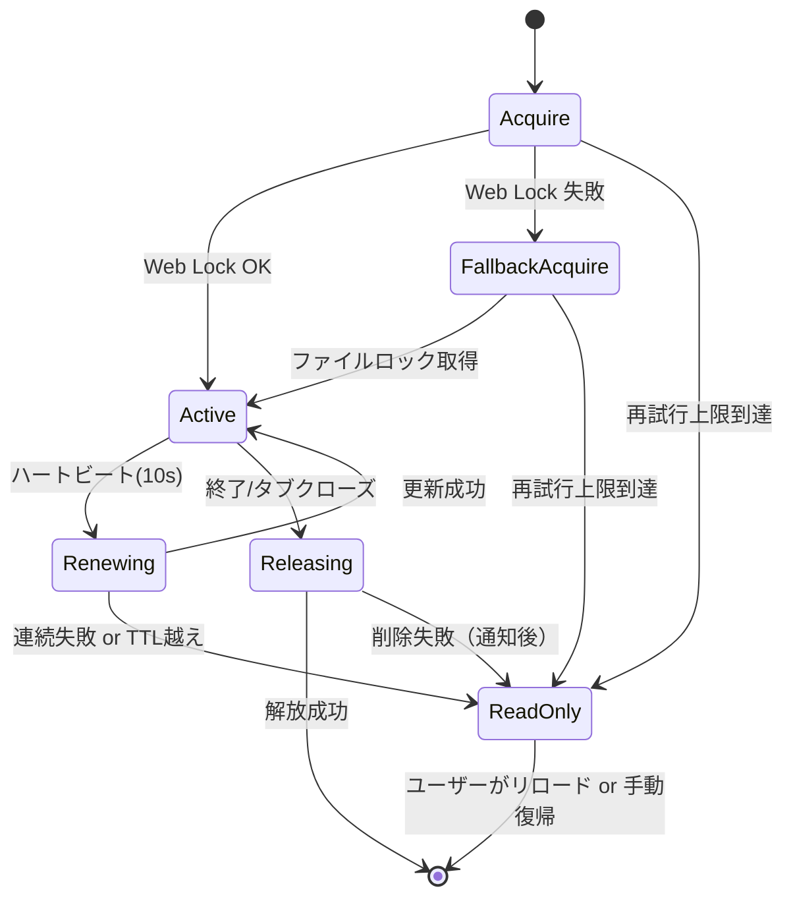

- Acquire フェーズでは指数バックオフ（0.5s → 1s → 2s）で最大 3 回再試行。いずれも失敗時は閲覧専用モードへ遷移し、UI に `autosave.lock.readonly` を通知。
- Renewing フェーズは `expiresAt - 5s` でトリガーし、連続 2 回失敗で即座に閲覧専用モードへ移行。
- Releasing フェーズで解放に失敗した場合は再試行可能としてバックグラウンドで 3 回まで再試行し、最終失敗時はフォールバックファイル削除手順を記録する。

### 3.3 フォールバック `project/.lock`
| フィールド | 型 | 説明 |
| --- | --- | --- |
| `version` | number | 将来の互換性維持のためのスキーマバージョン（初期値 1）。 |
| `leaseId` | string | `crypto.randomUUID()` で生成した 128bit UUID。 |
| `owner` | string | `origin` + `tabId` をハッシュ化した識別子。 |
| `updatedAt` | string | ISO8601。ファイルの `mtime` と整合させる。 |
| `ttlSeconds` | number | 30（固定値）。更新時に `updatedAt + ttlSeconds` を期限として判定。 |

```ts
function writeFallbackLock(path: string, leaseId: string, owner: string) {
  const payload = {
    version: 1,
    leaseId,
    owner,
    updatedAt: new Date().toISOString(),
    ttlSeconds: 30,
  };
  OPFS.writeJSONAtomic(path, payload); // tmp -> rename
}

async function acquireFallbackLock(path: string, now = Date.now()) {
  const stat = await OPFS.stat(path);
  if (!stat || now - stat.mtimeMs > 30_000) {
    writeFallbackLock(path, uuid(), ownerId());
    return 'acquired';
  }
  const existing = await OPFS.readJSON(path);
  if (existing.leaseId === currentLeaseId) return 'reentrant';
  return 'conflict';
}

async function renewFallbackLock(path: string) {
  const stat = await OPFS.stat(path);
  if (!stat) throw new LockLostError();
  const existing = await OPFS.readJSON(path);
  if (existing.leaseId !== currentLeaseId) throw new LockStolenError();
  writeFallbackLock(path, currentLeaseId, ownerId());
}
```

- 競合検出は `stat.mtimeMs` が 30s 以内かつ `leaseId` が異なる場合に成立する。`mtime` とファイル内容の両方で判定し、時計ずれ（±2s）を許容するため `now - stat.mtimeMs > 28_000` で失効扱いにする。
- 時計ずれが大きい環境では `updatedAt` の ISO を `Date.parse` して差分確認し、`ttlSeconds` を超えた場合は強制取得前に UI 警告を表示する。
- 削除失敗時（OPFS remove エラー）は `releaseProjectLock` 内で `LockReleaseError` を投げ、バックグラウンド再試行タスクをスケジュール。ユーザーには閲覧専用モード維持と再試行結果のトースト通知を行う。

### 3.4 Lock State Machine（詳細）
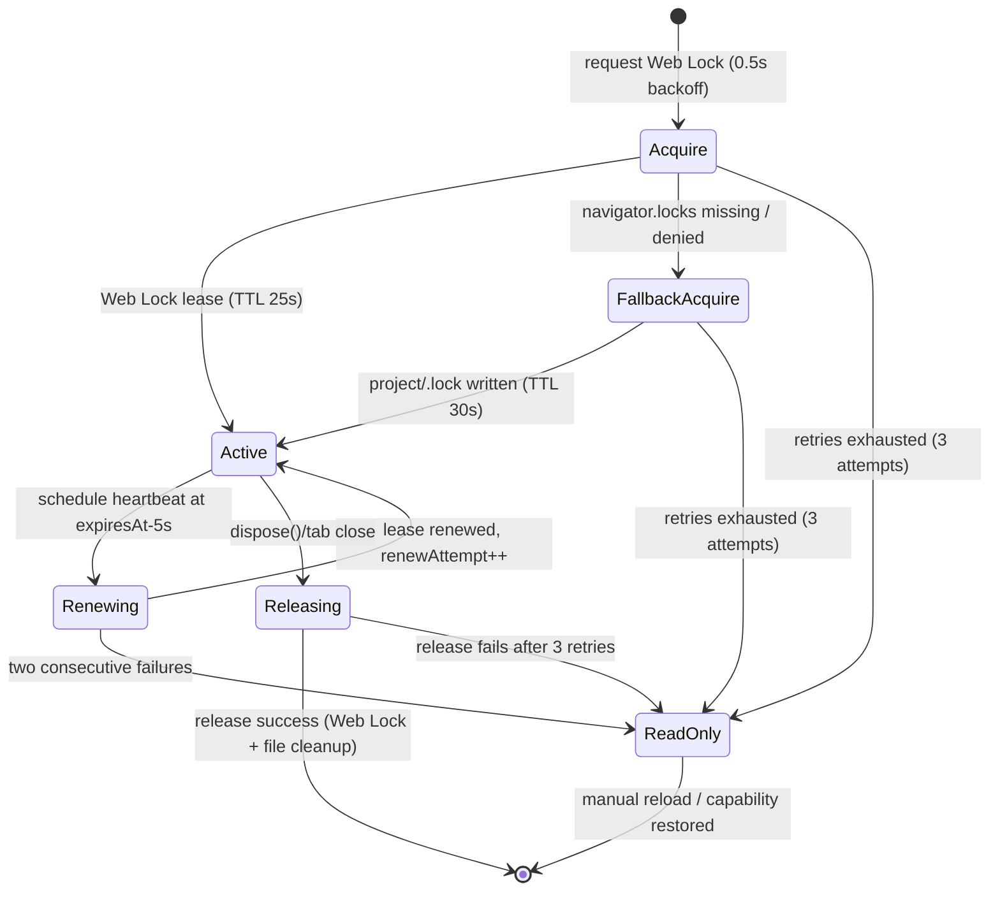

### 3.5 イベント伝播マトリクス
| イベント `type` | 発火契機 | Payload フィールド | 主な購読者 |
| --- | --- | --- | --- |
| `lock:attempt` | Acquire/FallbackAcquire でロック要求 | `strategy`, `retry` | Telemetry（Collector 非対象）、UI 状態管理 |
| `lock:acquired` | ロック獲得直後 | `lease` | AutoSave Scheduler、履歴ローテータ |
| `lock:renew-scheduled` | `expiresAt-5s` で心拍スケジュール | `lease`, `nextHeartbeatInMs` | Heartbeat タイマー |
| `lock:renewed` | Web Lock もしくは `.lock` 更新成功 | `lease` | AutoSave Scheduler |
| `lock:release-requested` | dispose / `withProjectLock` scope 終了 | `lease` | クリーンアップタスク |
| `lock:released` | Web Lock release + `.lock` 削除完了 | `leaseId` | UI 通知、監視解除 |
| `lock:readonly-entered` | Acquire/Renew/Release のリトライ失敗 | `reason`, `lastError` | UI（閲覧専用モード）、AutoSave 再スケジュール |

### 3.6 例外・リトライ設計
| Error `code` | retryable | 想定原因 | リカバリ | バックオフ |
| --- | --- | --- | --- | --- |
| `web-lock-unsupported` | false | navigator.locks 未実装 | 即座にフォールバック戦略へ切替 | N/A |
| `acquire-denied` | true | 競合タブによる拒否 | 最大 3 回指数（0.5s→1s→2s）、失敗で閲覧専用 | Acquire |
| `acquire-timeout` | true | Web Lock 応答なし / `.lock` stale 判定 | Acquire 再試行、フォールバック切替 | Acquire |
| `fallback-conflict` | true | `.lock` が有効リースで占有 | stale 判定後に強制回収（再試行 3 回） | Acquire |
| `lease-stale` | true | `expiresAt` 経過、復帰可能 | Renew 優先、失敗で Acquire やり直し | Renew |
| `renew-failed` | true | Heartbeat 中に権限喪失 | 2 連続失敗で閲覧専用 | Renew |
| `release-failed` | true | `.lock` 削除不可・Web Lock release エラー | 3 回再試行、失敗で readonly 通知 | Release |

### 3.7 フォールバック競合テスト計画
1. **シナリオ**: タブ A が Web Lock を取得、タブ B が即時にフォールバック `.lock` へ降格。
   - **準備**: Web Locks API をモックし、B では常に `NotSupportedError` を投げる。
   - **検証**: B の 3 回リトライ後に `lock:readonly-entered` が発火し、`ProjectLockError`(`fallback-conflict`, retryable=true) を添付。
2. **シナリオ**: タブ A 異常終了で `.lock` が stale (`updatedAt` > TTL)。
   - **準備**: `.lock` を 31s 過去に書き換え。
   - **検証**: タブ B が stale と判定して `acquire` 成功、イベント `lock:acquired` が `strategy='file-lock'` で配信。
3. **シナリオ**: Renew 2 回連続失敗による閲覧専用遷移。
   - **準備**: Heartbeat フックで 2 回 `renew` を失敗させる。
   - **検証**: `lock:readonly-entered` が `reason='renew-failed'` で発火、`onReadonly` コールバックが呼ばれる。
4. **シナリオ**: Release 失敗後の再試行。
   - **準備**: Web Lock release の 2 回失敗をモック。
   - **検証**: 3 回目成功で `lock:released` が発火し、`.lock` ファイルが削除される。

> **API シグネチャ草案**: `src/lib/locks.ts` に `ProjectLockLease`・`ProjectLockApi`・リトライポリシー型・イベント定義を公開し、AutoSave 側は `withProjectLock` を唯一の高水準 API として利用する。
## 4) ロック
- `navigator.locks.request('imgponic:project', { mode: 'exclusive' })` を優先利用。
- 失敗時は閲覧専用モード（保存 UI 無効化）にフォールバック。
- フォールバック：`project/.lock`（UUID, mtime, TTL=30s）。孤児ロックは次回起動時に TTL 判定で破棄。

## 5) 書き込みと履歴ローテーション（アルゴリズム）
1. `current.json.tmp` を開き、Storyboard を JSON シリアライズして書き込む。
2. `FileSystemWritableFileStream.close()` 完了後に `current.json.tmp` を `current.json` へリネーム。
3. 新しい世代メタデータ `{ ts, bytes }` を `index.json.tmp` に書き込む。
4. `index.json` をリネームで更新し、`history/<ts>.json` を書き込み。
5. `maxGenerations` を超えた場合は最古エントリを削除し、該当ファイルも削除。
6. `maxBytes` 超過時は古い順に削除し、削除分を `index.json` に反映。
7. 途中で失敗した場合は `.tmp` ファイルを削除し、`index.json` を読み直してロールバック。

### 入出力サンプルと境界ケース
| ケース | 入力ストリーム | 期待する結果 | 備考 |
| --- | --- | --- | --- |
| 20 世代境界 | 既存 19 世代 + 新規 1 件 | `index.json` に 20 件。21 件目投入時に最古 1 件が FIFO で削除され、`history/<old>.json` が消える | `maxGenerations`=20 固定の場合 |
| 50MB 超過 | 既存合計 48MB、保存対象 5MB | 保存後 53MB → 最古世代から順に削除し 50MB 未満に収束 | 削除後の `index.json` に `retained=false` は残さない |
| I/O 失敗 | `current.json.tmp` 書き込み中に例外 | `.tmp` を削除、`AutoSaveError{code:'write-failed', retryable:true}` で再実行 | 3 回失敗で警告ログ + ユーザ通知 |

### 図解（履歴ローテーション）
```
[before] index.json -> [A, B, C]
save(D)
 ├─ write current.json.tmp -> current.json
 ├─ append D -> index.json.tmp
 ├─ rename index.json.tmp -> index.json
 └─ (if > N) delete oldest (A)
[after] index.json -> [B, C, D]
```

### テストダブル要件
- OPFS 代替としてメモリ内 FileSystem ダブル（書き込み結果の検査、rename の原子性を模擬）。
- Web Locks ダブル：即時取得、遅延取得、取得失敗の 3 シナリオを制御可能。
- クロックダブル：デバウンスとアイドル待機の時間経過をテストで deterministically 制御。
- ログシンクダブル：Collector/Analyzer と同じフォーマット（JSONL 1 行）で警告を検証。

## 6) UI
- ツールバー右に **AutoSaveIndicator**（Saving…/Saved HH:MM:SS）。
- 履歴ダイアログ：時刻・サイズ・復元ボタン・差分サイズ（現行比）。

## 7) 異常系
- 書込失敗：指数バックオフ（0.5/1/2s）で 3 回再試行。失敗時は警告を残し続行。
- 容量枯渇：古い履歴を自動削除＋通知。

## 8) Test Matrix（TDD 優先度と実装順）
| 優先度 | ケース | 種別 | 想定結果 | 依存 | 後続タスク |
| --- | --- | --- | --- | --- | --- |
| P0 | 初回保存（ロック取得成功） | ユニット | `current.json`/`index.json`/`history` が生成 | ロックダブル | Writer 実装 |
| P0 | 連続変更でデバウンス動作 | ユニット | 1 回のみ保存 | クロックダブル | スケジューラ |
| P0 | ロック未取得（Web Locks 拒否） | ユニット | `AutoSaveError{code:'lock-unavailable'}` | ロックダブル | フォールバック |
| P1 | 21 回保存で最古削除 | 統合 | 履歴が 20 件を維持 | Writer, GC | 履歴ビュー |
| P1 | 50MB 超過で多重削除 | 統合 | 容量 <= 50MB になるまで削除 | GC | 通知 |
| P1 | I/O 失敗後ロールバック | 統合 | `.tmp` クリーンアップ + 再試行 | Writer | リトライ制御 |
| P2 | 復元成功（current/history） | 統合 | UI 反映、`restorePrompt` が latest を返却 | Loader | Indicator |
| P2 | データ破損検知 | ユニット | `AutoSaveError{code:'data-corrupted'}` | バリデータ | エラー表示 |

実装順序提案: (1) ロック・スケジューラのユニットテスト → (2) Writer/GC のユニットテスト → (3) 復元系統合テスト → (4) UI 連携の結合テスト。
## 5) UI

## 6) 異常系
### 6.1 保存処理
- 書込失敗：指数バックオフ（0.5/1/2s）で3回再試行。失敗時は警告を残し続行。
- 容量枯渇：古い履歴を自動削除＋通知。

### 6.2 ロック連動
- `LockConflictError` 受領時は閲覧専用モードへ即移行し、UI に「別タブが編集中」を提示。
- `LockRenewalError` が連続 2 回発生した際は `autosave.lock.retry` を発火し、最終的に `readonly` を通知。
- `LockReleaseError` はバックグラウンド再試行しつつ、UI に「解放中...」を表示。再試行完了は `autosave.lock.stateChanged`（`released`）で通知。

## 7) 受入
- 入力停止 ≤2.5s で `current.json` 更新
- 強制終了後の復旧が成功、かつ 21回保存で最古が削除

## 8) テストケース
- 正常系: Web Lock 取得→リース更新→解放（タイマーをモックし、`ProjectLockLease` の更新を検証）。
- 競合時フォールバック: Web Lock 拒否・`project/.lock` に別 UUID が存在するケースをモックし、閲覧専用モード遷移とイベント発火を確認。
- TTL 満了: `mtime` シミュレーションで期限切れを再現し、`LockRenewalError`→`readonly` イベントを検証。
- 強制解放: ブラウザクラッシュ相当の `release` 未実行シナリオを再現し、次回起動時に古い `leaseId` を検出して再取得できるかを確認。
- ログ/Collector 影響確認: Lock イベント発火が `workflow-cookbook/logs/` に書き込まれないことをテストダブルで検証。

### テストヘルパー / モック API
- `MockNavigatorLocks`：`request`/`release`/`abort` を制御し、競合・未実装・成功シナリオを再現。
- `MockOPFS`：`stat`/`read`/`write`/`remove` を同期実装で差し替え、`mtime` と `updatedAt` の操作を可能にする。
- `FakeTimer`：ハートビートと TTL 判定をシミュレート。
- `EventCollector`：`subscribeLockEvents` 経由の通知を記録し、UI 伝播仕様を検証。
### 5.1 AutoSaveIndicator の状態モデル
| 状態 | ラベル表示 | アイコン/カラー | 発火トリガー | UI 振る舞い |
| --- | --- | --- | --- | --- |
| Idle | "Idle" | グレーのドット | 初期化完了後、保存対象の変更が無いとき | ボタンは有効、履歴ダイアログ起動のみ許可 |
| Saving | "Saving…" + スピナー | プライマリカラーで回転アイコン | `autosave.ts` から `saving` イベント受信 | ボタンはローディング表示、ARIA ライブリージョンで進捗告知 |
| Saved | "Saved HH:MM:SS" | 成功カラーのチェック | `saved` イベント受信 | チェック表示 4s 維持後 Idle に遷移、最新時刻を `aria-live="polite"` で通知 |
| Error | "Save failed" | 警告カラーのバッジ | `error` イベント受信（再試行枯渇含む） | ボタンに `aria-invalid`、トーストで再試行案内、履歴ダイアログには警告メッセージを表示 |
| ReadOnly | "Read only" | ロックアイコン | ロック取得失敗時 (`readonly` イベント) | 履歴復元含むすべての操作を disabled、ツールチップで理由説明 |

### 5.2 履歴ダイアログの要素
- 履歴一覧テーブル：`ts`（ISO/ローカライズ表示）、`bytes`（KB 表示）、差分サイズ（現行比 ±%）。
- 行アクション：復元ボタン（選択行ごと）。`Saved` 状態のみ活性化。
- ヘッダーレベルの復元ボタン：最新行を対象にショートカット提供。
- 差分サイズ：`current.json` との差分バイトを `+/-` 付きで表示、閾値超過時は警告色。
- フッター：閉じるボタン、最終保存時刻、失敗時のリトライリンク。
- 説明テキスト：保存先パス、世代上限（N=20）を明記。

### 5.3 コンポーネント構成とイベント購読
- `AutoSaveProvider`（`src/components/providers/AutoSaveProvider.tsx` 想定）が `initAutoSave` を呼び出し、`AutoSaveContext` にステータスを push。
- `AutoSaveIndicator` は `useAutoSaveStatus()` フックでコンテキストを購読し、状態/履歴操作を props 経由で `HistoryDialog` に受け渡す。
- `HistoryDialog` は `useAutoSaveHistory()` で一覧を取得し、復元リクエストを `onRestore` コールバックでインディケータへ伝播。
- `src/lib/autosave.ts` からのイベントは `subscribe(listener)` API を通じて Provider が受信し、`context` → `hook` → `props` の順に流す。

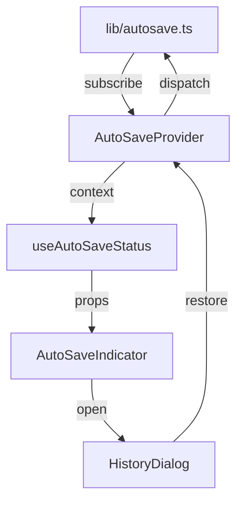

### 5.4 閲覧専用モードと失敗時の UX 制御
- ReadOnly 状態時は Indicator ボタンと履歴行の復元ボタンをすべて `disabled`。ツールチップで「ロック取得に失敗したため保存不可」を表示。
- エラー発生時はトースト通知（Reporter 経由ログ対象）とダイアログ内のバナーで再試行手順を案内。
- フォーカス制御：ダイアログ表示時に最初の履歴行へフォーカス。ReadOnly 時は説明テキストへフォーカス移動しスクリーンリーダー告知。
- ARIA 要件：Indicator ボタンに `aria-haspopup="dialog"`、状態更新は `aria-live="polite"`、エラーは `role="alert"` を付与。
- トースト閉鎖時はトリガーボタンへフォーカスを戻し、キーボード操作でリトライを案内。

### 5.5 履歴復元フロー
1. ユーザーが Indicator から履歴ダイアログを開く。
2. 行選択 → 「復元」ボタンで確認モーダルを起動。
3. 確認モーダルの「復元する」で `restoreFrom(ts)` または `restoreFromCurrent()` を呼び出し。
4. 成功時：Saved 状態へ遷移し「復元が完了しました」トーストを表示。Collector ログ出力をトリガー。
5. 失敗時：Error 状態に遷移し、再試行ボタンでモーダルを再利用。指数バックオフ方針と整合するリトライメッセージを表示。

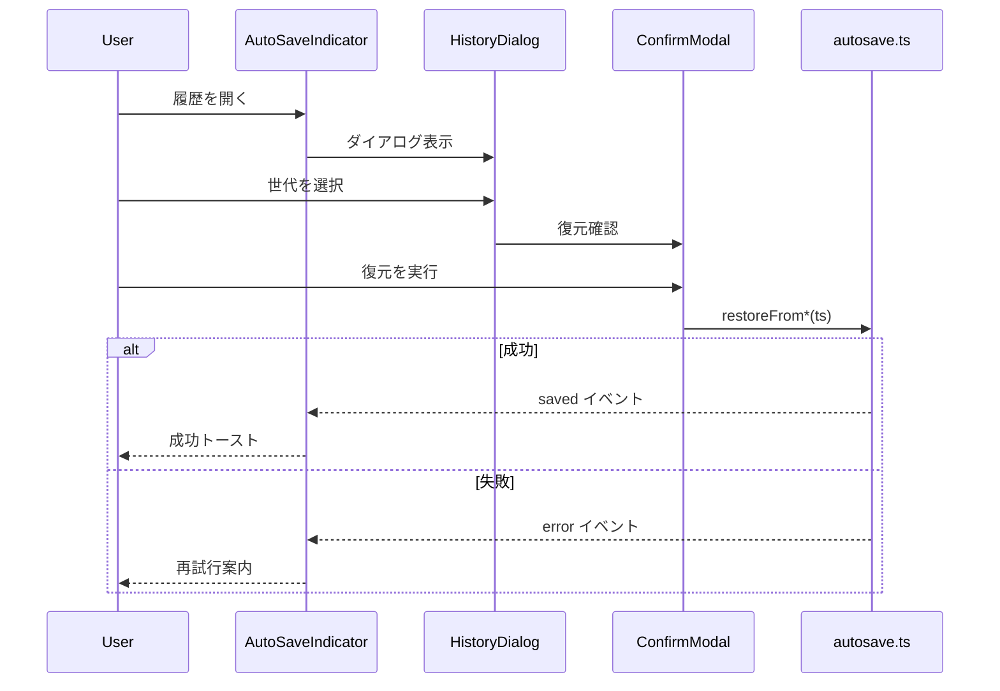

### 5.6 Component Test Matrix（React Testing Library）
| テストカテゴリ | シナリオ | 期待される状態遷移 | 必要モック |
| --- | --- | --- | --- |
| Indicator 状態遷移 | Idle → Saving → Saved → Idle | `saving` イベント発火でスピナー表示、`saved` で時刻更新、4s 後 Idle | `mockAutoSaveStore`（イベントエミッタ） |
| Indicator エラー処理 | Saving 中に error | エラーラベル + `role="alert"` 表示、再試行ボタン有効 | 同上 + `jest.useFakeTimers()` |
| ReadOnly モード | readonly イベント受信 | ボタン `disabled`、ツールチップ表示 | `mockAutoSaveStore` + `mockTooltip` |
| 履歴一覧表示 | `listHistory` レスポンス | テーブルに行描画、差分サイズ計算 | `mockHistoryService` |
| 履歴復元成功 | 行選択→復元 | 確認モーダル経由で `restoreFrom` 呼出、トースト表示 | `mockRestoreFrom`（resolve true） |
| 履歴復元失敗→再試行 | `restoreFrom` が reject | Error 状態 + 再試行ボタン押下で再度呼出 | `mockRestoreFrom`（reject→resolve） |
| アクセシビリティ | ダイアログ初期フォーカス | 初回フォーカスが最初の行、トースト閉鎖後にボタンへ戻る | `@testing-library/user-event` |

### 5.7 Collector / Reporter 整合性チェックリスト
- [x] Error/ReadOnly イベント時に Collector へエラーログ（severity=warning）を送信。（参考: `docs/day8/design/03_architecture.md` のロギング責務）
- [x] 成功トースト発火時に Reporter 集計用イベント（`autosave:restore:success`）を送出。
- [x] UI イベントの計測ポイント（ダイアログ表示、復元確定、再試行）は Analyzer が参照する JSONL スキーマに準拠。
- [x] propose-only 方針（ADR 0003）を踏まえ、UI から自動コミットを行わない。
- [x] `workflow-cookbook/reports/` に書き出される Reporter 生成物とイベント命名規約を共有。

## 9) Collector/Analyzer 整合性チェックリスト
- [Day8 設計](../Day8/docs/day8/design/03_architecture.md) に合わせ、Collector が監視するログディレクトリは `workflow-cookbook/logs` に固定されているため、AutoSave は同ディレクトリに新規ログファイルを生成しない。既存 logger を利用し、出力先は `workflow-cookbook/logs/autosave.log.jsonl` に統一する。
- Analyzer への入力である JSONL フォーマットは 1 行 1 オブジェクト。AutoSave の警告も `{"component":"autosave","level":"warn",...}` の形に揃える。
- Collector の再入防止策に従い、AutoSave のロックフォールバックでは `.lock` ファイルの TTL を 30 秒とし、アプリ終了時に必ず削除。
- 例外時の再試行は 3 回までとし、Collector が誤って無限ループを検出しないようガード（指数バックオフ最大 2 秒）。
- Analyzer での容量集計に影響を与えないよう、履歴削除時のログは 1 件につき 1 行までに制限。

## 10) 受入
- 入力停止 ≤2.5s で `current.json` 更新。
- 強制終了後の復旧が成功、かつ 21 回保存で最古が削除。
