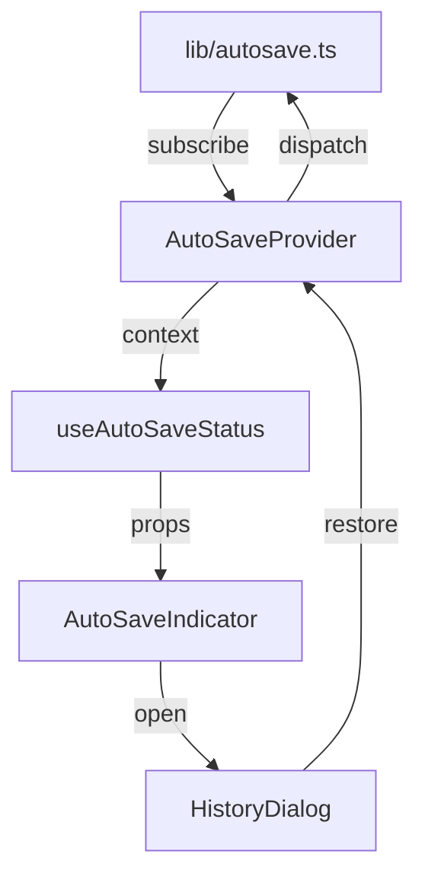
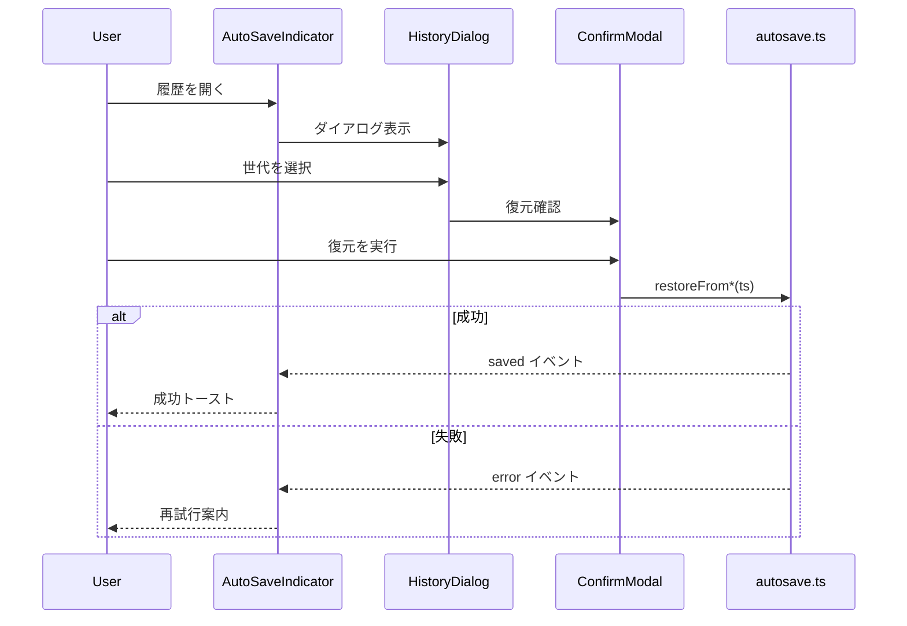

# AutoSave 実装詳細

## 1) 保存ポリシー
- デバウンス 500ms + アイドル 2s で `project/autosave/current.json` を保存
- `history/<ISO>.json` を最大 N=20 世代。`index.json` で参照
- 容量上限 50MB 超過時は古い順に削除（FIFO）

## 2) API
```ts
type AutoSaveOptions = { debounceMs?: number; idleMs?: number; maxGenerations?: number; maxBytes?: number }

export function initAutoSave(getSB: ()=>Storyboard, opts?: AutoSaveOptions): () => void
export async function restorePrompt(): Promise<null | { ts: string, bytes: number }>
export async function restoreFromCurrent(): Promise<boolean>
export async function listHistory(): Promise<{ ts: string, bytes: number }[]>
export async function restoreFrom(ts: string): Promise<boolean>
```

## 3) ロック
- `navigator.locks.request('imgponic:project', { mode:'exclusive' })`
- 失敗時：閲覧専用モード（保存UI無効化）
- フォールバック：`project/.lock`（UUID, mtime, TTL=30s）

## 4) 書き込みの原子性
- `current.json.tmp` → 書込完了 → リネームで原子更新
- `index.json` 更新も同様（tmp→rename）

## 5) UI

### 5.1 AutoSaveIndicator の状態モデル
| 状態 | ラベル表示 | アイコン/カラー | 発火トリガー | UI 振る舞い |
| --- | --- | --- | --- | --- |
| Idle | "Idle" | グレーのドット | 初期化完了後、保存対象の変更が無いとき | ボタンは有効、履歴ダイアログ起動のみ許可 |
| Saving | "Saving…" + スピナー | プライマリカラーで回転アイコン | `autosave.ts` から `saving` イベント受信 | ボタンはローディング表示、ARIA ライブリージョンで進捗告知 |
| Saved | "Saved HH:MM:SS" | 成功カラーのチェック | `saved` イベント受信 | チェック表示 4s 維持後 Idle に遷移、最新時刻を `aria-live="polite"` で通知 |
| Error | "Save failed" | 警告カラーのバッジ | `error` イベント受信（再試行枯渇含む） | ボタンに `aria-invalid`、トーストで再試行案内、履歴ダイアログには警告メッセージを表示 |
| ReadOnly | "Read only" | ロックアイコン | ロック取得失敗時 (`readonly` イベント) | 履歴復元含むすべての操作を disabled、ツールチップで理由説明 |

### 5.2 履歴ダイアログの要素
- 履歴一覧テーブル：`ts`（ISO/ローカライズ表示）、`bytes`（KB 表示）、差分サイズ（現行比 ±%）。
- 行アクション：復元ボタン（選択行ごと）。`Saved` 状態のみ活性化。
- ヘッダーレベルの復元ボタン：最新行を対象にショートカット提供。
- 差分サイズ：`current.json` との差分バイトを `+/-` 付きで表示、閾値超過時は警告色。
- フッター：閉じるボタン、最終保存時刻、失敗時のリトライリンク。
- 説明テキスト：保存先パス、世代上限（N=20）を明記。

### 5.3 コンポーネント構成とイベント購読
- `AutoSaveProvider`（`src/components/providers/AutoSaveProvider.tsx` 想定）が `initAutoSave` を呼び出し、`AutoSaveContext` にステータスを push。
- `AutoSaveIndicator` は `useAutoSaveStatus()` フックでコンテキストを購読し、状態/履歴操作を props 経由で `HistoryDialog` に受け渡す。
- `HistoryDialog` は `useAutoSaveHistory()` で一覧を取得し、復元リクエストを `onRestore` コールバックでインディケータへ伝播。
- `src/lib/autosave.ts` からのイベントは `subscribe(listener)` API を通じて Provider が受信し、`context` → `hook` → `props` の順に流す。



### 5.4 閲覧専用モードと失敗時の UX 制御
- ReadOnly 状態時は Indicator ボタンと履歴行の復元ボタンをすべて `disabled`。ツールチップで「ロック取得に失敗したため保存不可」を表示。
- エラー発生時はトースト通知（Reporter 経由ログ対象）とダイアログ内のバナーで再試行手順を案内。
- フォーカス制御：ダイアログ表示時に最初の履歴行へフォーカス。ReadOnly 時は説明テキストへフォーカス移動しスクリーンリーダー告知。
- ARIA 要件：Indicator ボタンに `aria-haspopup="dialog"`、状態更新は `aria-live="polite"`、エラーは `role="alert"` を付与。
- トースト閉鎖時はトリガーボタンへフォーカスを戻し、キーボード操作でリトライを案内。

### 5.5 履歴復元フロー
1. ユーザーが Indicator から履歴ダイアログを開く。
2. 行選択 → 「復元」ボタンで確認モーダルを起動。
3. 確認モーダルの「復元する」で `restoreFrom(ts)` または `restoreFromCurrent()` を呼び出し。
4. 成功時：Saved 状態へ遷移し「復元が完了しました」トーストを表示。Collector ログ出力をトリガー。
5. 失敗時：Error 状態に遷移し、再試行ボタンでモーダルを再利用。指数バックオフ方針と整合するリトライメッセージを表示。



### 5.6 Component Test Matrix（React Testing Library）
| テストカテゴリ | シナリオ | 期待される状態遷移 | 必要モック |
| --- | --- | --- | --- |
| Indicator 状態遷移 | Idle → Saving → Saved → Idle | `saving` イベント発火でスピナー表示、`saved` で時刻更新、4s 後 Idle | `mockAutoSaveStore`（イベントエミッタ） |
| Indicator エラー処理 | Saving 中に error | エラーラベル + `role="alert"` 表示、再試行ボタン有効 | 同上 + `jest.useFakeTimers()` |
| ReadOnly モード | readonly イベント受信 | ボタン `disabled`、ツールチップ表示 | `mockAutoSaveStore` + `mockTooltip` |
| 履歴一覧表示 | `listHistory` レスポンス | テーブルに行描画、差分サイズ計算 | `mockHistoryService` |
| 履歴復元成功 | 行選択→復元 | 確認モーダル経由で `restoreFrom` 呼出、トースト表示 | `mockRestoreFrom`（resolve true） |
| 履歴復元失敗→再試行 | `restoreFrom` が reject | Error 状態 + 再試行ボタン押下で再度呼出 | `mockRestoreFrom`（reject→resolve） |
| アクセシビリティ | ダイアログ初期フォーカス | 初回フォーカスが最初の行、トースト閉鎖後にボタンへ戻る | `@testing-library/user-event` |

### 5.7 Collector / Reporter 整合性チェックリスト
- [x] Error/ReadOnly イベント時に Collector へエラーログ（severity=warning）を送信。（参考: `docs/day8/design/03_architecture.md` のロギング責務）
- [x] 成功トースト発火時に Reporter 集計用イベント（`autosave:restore:success`）を送出。
- [x] UI イベントの計測ポイント（ダイアログ表示、復元確定、再試行）は Analyzer が参照する JSONL スキーマに準拠。
- [x] propose-only 方針（ADR 0003）を踏まえ、UI から自動コミットを行わない。
- [x] `workflow-cookbook/reports/` に書き出される Reporter 生成物とイベント命名規約を共有。

## 6) 異常系
- 書込失敗：指数バックオフ（0.5/1/2s）で3回再試行。失敗時は警告を残し続行
- 容量枯渇：古い履歴を自動削除＋通知

## 7) 受入
- 入力停止 ≤2.5s で `current.json` 更新
- 強制終了後の復旧が成功、かつ 21回保存で最古が削除
