# AutoSave 実装詳細

## 1) 保存ポリシー
- デバウンス 500ms + アイドル 2s で `project/autosave/current.json` を保存
- `history/<ISO>.json` を最大 N=20 世代。`index.json` で参照
- 容量上限 50MB 超過時は古い順に削除（FIFO）

## 2) API
```ts
type AutoSaveOptions = { debounceMs?: number; idleMs?: number; maxGenerations?: number; maxBytes?: number }

export function initAutoSave(getSB: ()=>Storyboard, opts?: AutoSaveOptions): () => void
export async function restorePrompt(): Promise<null | { ts: string, bytes: number }>
export async function restoreFromCurrent(): Promise<boolean>
export async function listHistory(): Promise<{ ts: string, bytes: number }[]>
export async function restoreFrom(ts: string): Promise<boolean>
```

## 3) ロック

### 3.1 Web Lock / ファイルロック仕様
- 取得キーは `navigator.locks.request('imgponic:project', { mode: 'exclusive' })` とし、AutoSave 起動時に最初の取得を試みる。
- リース情報（`leaseId`, `expiresAt`）を `ProjectLockLease` で管理し、Web Lock が返さない TTL をクライアント側で 25s（安全マージン 5s）として扱う。
- Web Lock が未実装・拒否・同一ブラウザ内の競合などで取得できない場合はフォールバックのファイルロック手段へ遷移する。
- フォールバックファイルは `project/.lock` に限定し、UUID・`updatedAt`（ISO8601）・`ttlSeconds`（既定 30）を JSON で保持する。
- ロック取得中は 10s 間隔でリース更新（Web Lock リクエスト or フォールバックの `mtime` 更新）を行い、失敗 2 回連続で閲覧専用モードへ移行する。
- ロック解放時は Web Lock release とフォールバックファイル削除を両方実行し、片方失敗でも再試行する。

### 3.2 Lock Orchestration

```mermaid
stateDiagram-v2
    [*] --> Acquire
    Acquire --> Active: Web Lock OK
    Acquire --> FallbackAcquire: Web Lock 失敗
    FallbackAcquire --> Active: ファイルロック取得
    Acquire --> ReadOnly: 再試行上限到達
    FallbackAcquire --> ReadOnly: 再試行上限到達
    Active --> Renewing: ハートビート(10s)
    Renewing --> Active: 更新成功
    Renewing --> ReadOnly: 連続失敗 or TTL越え
    Active --> Releasing: 終了/タブクローズ
    Releasing --> [*]: 解放成功
    Releasing --> ReadOnly: 削除失敗（通知後）
    ReadOnly --> [*]: ユーザーがリロード or 手動復帰
```


- Acquire フェーズでは指数バックオフ（0.5s → 1s → 2s）で最大 3 回再試行。いずれも失敗時は閲覧専用モードへ遷移し、UI に `autosave.lock.readonly` を通知。
- Renewing フェーズは `expiresAt - 5s` でトリガーし、連続 2 回失敗で即座に閲覧専用モードへ移行。
- Releasing フェーズで解放に失敗した場合は再試行可能としてバックグラウンドで 3 回まで再試行し、最終失敗時はフォールバックファイル削除手順を記録する。

### 3.3 フォールバック `project/.lock`
| フィールド | 型 | 説明 |
| --- | --- | --- |
| `version` | number | 将来の互換性維持のためのスキーマバージョン（初期値 1）。 |
| `leaseId` | string | `crypto.randomUUID()` で生成した 128bit UUID。 |
| `owner` | string | `origin` + `tabId` をハッシュ化した識別子。 |
| `updatedAt` | string | ISO8601。ファイルの `mtime` と整合させる。 |
| `ttlSeconds` | number | 30（固定値）。更新時に `updatedAt + ttlSeconds` を期限として判定。 |

```ts
function writeFallbackLock(path: string, leaseId: string, owner: string) {
  const payload = {
    version: 1,
    leaseId,
    owner,
    updatedAt: new Date().toISOString(),
    ttlSeconds: 30,
  };
  OPFS.writeJSONAtomic(path, payload); // tmp -> rename
}

async function acquireFallbackLock(path: string, now = Date.now()) {
  const stat = await OPFS.stat(path);
  if (!stat || now - stat.mtimeMs > 30_000) {
    writeFallbackLock(path, uuid(), ownerId());
    return 'acquired';
  }
  const existing = await OPFS.readJSON(path);
  if (existing.leaseId === currentLeaseId) return 'reentrant';
  return 'conflict';
}

async function renewFallbackLock(path: string) {
  const stat = await OPFS.stat(path);
  if (!stat) throw new LockLostError();
  const existing = await OPFS.readJSON(path);
  if (existing.leaseId !== currentLeaseId) throw new LockStolenError();
  writeFallbackLock(path, currentLeaseId, ownerId());
}
```

- 競合検出は `stat.mtimeMs` が 30s 以内かつ `leaseId` が異なる場合に成立する。`mtime` とファイル内容の両方で判定し、時計ずれ（±2s）を許容するため `now - stat.mtimeMs > 28_000` で失効扱いにする。
- 時計ずれが大きい環境では `updatedAt` の ISO を `Date.parse` して差分確認し、`ttlSeconds` を超えた場合は強制取得前に UI 警告を表示する。
- 削除失敗時（OPFS remove エラー）は `releaseProjectLock` 内で `LockReleaseError` を投げ、バックグラウンド再試行タスクをスケジュール。ユーザーには閲覧専用モード維持と再試行結果のトースト通知を行う。

### 3.4 例外・リトライ戦略とイベント伝播
- 例外階層（再試行可否を `retryable` プロパティで区別）:
  - `LockAcquisitionError`（`retryable=true`）: Web Lock/フォールバック取得の一時失敗。
  - `LockConflictError`（`retryable=false`）: UUID 不一致の競合。
  - `LockRenewalError`（`retryable=true`）: リース更新失敗。連続 2 回で閲覧専用モードへ。
  - `LockReleaseError`（`retryable=true`）: 解放または削除失敗。バックグラウンドで追加再試行。
  - `LockIrrecoverableError`（`retryable=false`）: OPFS 破損など復旧不能な例外。
- リトライ戦略: Acquire/renew/release すべて指数バックオフ（0.5s→1s→2s、最大 3 回）。`retryable=false` の例外は即座に閲覧専用モードへ遷移し、UI へエラーイベントを送る。
- AutoSave UI へのイベント/コールバック:
  - `autosave.lock.stateChanged` (payload: `{ state: 'acquired' | 'renewed' | 'released' }`)
  - `autosave.lock.retry` (payload: `{ attempt: number, maxAttempts: number, retryable: boolean }`)
  - `autosave.lock.error` (payload: `{ error: string, retryable: boolean, leaseId?: string }`)
  - `autosave.lock.readonly` (payload: `{ reason: 'conflict' | 'timeout' | 'irrecoverable' }`)
- イベントは `subscribeLockEvents` 経由で購読し、AutoSaveIndicator は再試行状況をトースト表示・Collector/Analyzer 向けログに残さない。

## 4) 書き込みの原子性
- `current.json.tmp` → 書込完了 → リネームで原子更新
- `index.json` 更新も同様（tmp→rename）

## 5) UI
- ツールバー右に **AutoSaveIndicator**（Saving…/Saved HH:MM:SS）
- 履歴ダイアログ：時刻・サイズ・復元ボタン・差分サイズ（現行比）

## 6) 異常系
### 6.1 保存処理
- 書込失敗：指数バックオフ（0.5/1/2s）で3回再試行。失敗時は警告を残し続行。
- 容量枯渇：古い履歴を自動削除＋通知。

### 6.2 ロック連動
- `LockConflictError` 受領時は閲覧専用モードへ即移行し、UI に「別タブが編集中」を提示。
- `LockRenewalError` が連続 2 回発生した際は `autosave.lock.retry` を発火し、最終的に `readonly` を通知。
- `LockReleaseError` はバックグラウンド再試行しつつ、UI に「解放中...」を表示。再試行完了は `autosave.lock.stateChanged`（`released`）で通知。

## 7) 受入
- 入力停止 ≤2.5s で `current.json` 更新
- 強制終了後の復旧が成功、かつ 21回保存で最古が削除

## 8) テストケース
- 正常系: Web Lock 取得→リース更新→解放（タイマーをモックし、`ProjectLockLease` の更新を検証）。
- 競合時フォールバック: Web Lock 拒否・`project/.lock` に別 UUID が存在するケースをモックし、閲覧専用モード遷移とイベント発火を確認。
- TTL 満了: `mtime` シミュレーションで期限切れを再現し、`LockRenewalError`→`readonly` イベントを検証。
- 強制解放: ブラウザクラッシュ相当の `release` 未実行シナリオを再現し、次回起動時に古い `leaseId` を検出して再取得できるかを確認。
- ログ/Collector 影響確認: Lock イベント発火が `workflow-cookbook/logs/` に書き込まれないことをテストダブルで検証。

### テストヘルパー / モック API
- `MockNavigatorLocks`：`request`/`release`/`abort` を制御し、競合・未実装・成功シナリオを再現。
- `MockOPFS`：`stat`/`read`/`write`/`remove` を同期実装で差し替え、`mtime` と `updatedAt` の操作を可能にする。
- `FakeTimer`：ハートビートと TTL 判定をシミュレート。
- `EventCollector`：`subscribeLockEvents` 経由の通知を記録し、UI 伝播仕様を検証。
