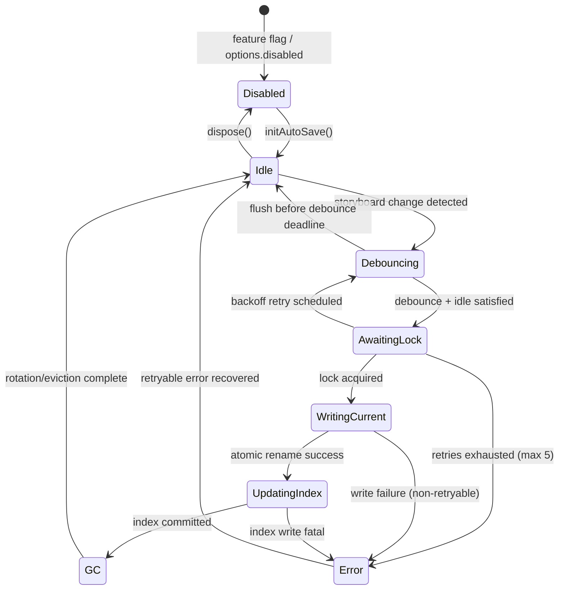
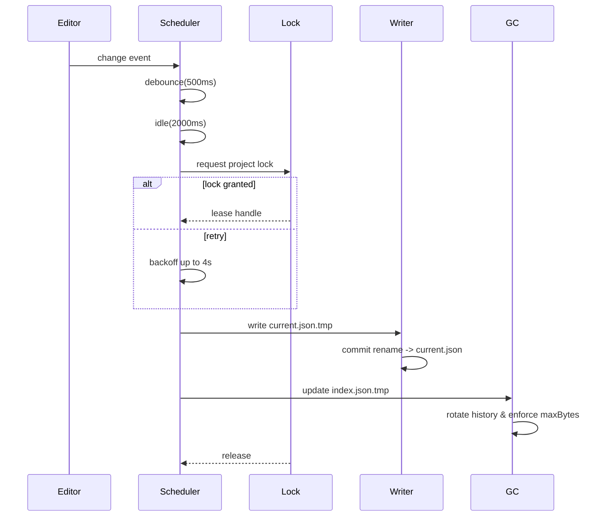

# AutoSave コアファサード設計

参照: [docs/AUTOSAVE-DESIGN-IMPL.md](./AUTOSAVE-DESIGN-IMPL.md), [Day8/docs/day8/design/03_architecture.md](../Day8/docs/day8/design/03_architecture.md)

## 1. 目的と範囲
- `src/lib/autosave.ts` の `initAutoSave` および復元 API 群の内部状態・副作用・エラーハンドリングを定義する。
- 対象: ステータスフェーズ管理、履歴ローテーション、OPFS I/O、feature flag 無効時の no-op。
- 非対象: 実際の OPFS 実装、UI 連携、ロック API (`src/lib/locks.ts`) の細部。

## 2. コンテキスト
- AutoSave は Collector→Analyzer→Reporter パイプラインと疎結合である必要があり、ログ出力は 1 エラー 1 行を維持する（Day8 アーキテクチャ整合）。
- 保存ポリシー（デバウンス 500ms、アイドル 2s、履歴 20 世代、容量 50MB）は `AUTOSAVE_DEFAULTS` で公開する。
- `autosave.enabled=false` または `AutoSaveOptions.disabled=true` の場合は永続化副作用を一切発生させない。

## 3. API 設計
### 3.1 initAutoSave
```ts
export function initAutoSave(
  getStoryboard: StoryboardProvider,
  options?: AutoSaveOptions
): AutoSaveInitResult
```
#### シーケンス
1. `resolveOptions`: `AUTOSAVE_DEFAULTS` と `options` をマージし、`featureFlag`（設定値）を確認。
2. Flag 判定: `autosave.enabled=false` または `opts.disabled=true` → `phase='disabled'` の `snapshot()` と no-op な `flushNow`/`dispose` を返す。
3. `phase='idle'` を初期化し、`snapshot()` クロージャに共有ステートを閉じ込める。
4. `scheduleDebounce(changeEvent)`: 500ms デバウンス後に `idleTimer` を起動。
5. `idleTimer` 完了 (2s) → `requestLock()` を実行。
6. `requestLock()`:
   - Web Lock 優先。失敗時はフォールバックロックを同一 UUID で試行。
   - 連続失敗時は `retryCount` を更新し `phase='awaiting-lock'` → バックオフ 0.5→1→2→4s（最大 4s）。5 回失敗で `phase='error'`、`flushNow` は no-op。
7. ロック取得成功 → `phase='writing-current'`。`current.json.tmp` へ書き込み → rename → `phase='updating-index'`。
8. `index.json` を更新し、`history/<ISO>.json` を追記。`phase='gc'` で履歴ローテーション (`maxGenerations`) と容量ガード (`maxBytes`) を適用。
9. GC 完了後 `lastSuccessAt` と `retryCount` をリセットし `phase='idle'`。
10. エラー発生時は `AutoSaveError` を生成し `lastError` に保持。`retryable=true` ならバックオフ再試行、`false` なら `phase='error'` を維持し `flushNow` を no-op。

#### flushNow
- `phase` が `debouncing`/`idle` の場合、デバウンスとアイドルタイマーを即時完了させロック取得に進む。
- 進行中フライト (`awaiting-lock` 以降) がある場合はその完了を待機し、重複実行を防ぐ。

#### dispose
1. 変更購読解除、タイマー停止。
2. 進行中フライトを待機し、保持ロックを解放。
3. `phase='disabled'`、`snapshot()` は最後の `lastError`/`lastSuccessAt` を保持。

### 3.2 復元 API 群
- `restorePrompt`: `current.json`/`index.json` を読み込み、最新世代と容量情報を返す。データ破損時は `AutoSaveError{code:'data-corrupted', retryable:false}`。
- `restoreFromCurrent`: `current.json` をデシリアライズ。検証失敗は `data-corrupted`。成功時は UI 呼び出し元が反映。
- `restoreFrom(ts)`: `history/<ts>.json` を読み込み、`withProjectLock` で衝突を防ぐ。ロック不可は `lock-unavailable` (retryable=true) で呼び出し元再試行。データ破損は `data-corrupted`。
- `listHistory`: `index.json` を降順で返却。整合性不一致（孤児/ゴースト）は整備しつつ `history-overflow` を情報ログで記録。

### 3.3 状態管理
共通ステート:
- `phase: AutoSavePhase`
- `retryCount: number`
- `pendingBytes?: number`（直近書き込み予定サイズ）
- `queuedGeneration?: number`（`index.json` 上の次世代番号）
- `lastSuccessAt?: string`
- `lastError?: AutoSaveError`

`phase` 遷移は §4 を参照。

## 4. 状態遷移図


## 5. エラーハンドリング
| フェーズ | 例外コード | retryable | バックオフ | ハンドラ |
| --- | --- | --- | --- | --- |
| AwaitingLock | lock-unavailable | true | 0.5 → 1 → 2 → 4s (上限 4s) | `phase='awaiting-lock'` 維持、5 回失敗で `phase='error'` |
| WritingCurrent | write-failed | cause 判定 | 成功時 0.5 → 1 → 2 → 4s | `.tmp` 削除後にリトライ、非再試行エラーで停止 |
| UpdatingIndex | write-failed | cause 判定 | 同上 | `index.json` ロールバック後リトライ |
| GC | history-overflow | false | なし | FIFO/容量削除完了後 `phase` は `idle` |
| Restore 系 | data-corrupted | false | なし | 呼び出し側に例外伝搬、ログ 1 行 |
| Disabled 判定 | disabled | false | なし | `snapshot().phase='disabled'`、副作用なし |

## 6. データフローと I/O


## 7. テストシナリオ
| ID | シナリオ | 期待結果 | 種別 | 依存 |
| --- | --- | --- | --- | --- |
| T1 | フラグ無効で `initAutoSave` | `phase='disabled'`、`flushNow`/`dispose` が副作用なし | ユニット | Flag モック |
| T2 | デバウンス 500ms + アイドル 2s 後に保存 | `current.json`/`index.json` が更新され `phase='idle'` | ユニット | Fake Timer, OPFS スタブ |
| T3 | `flushNow` 呼び出し | アイドル待機をスキップし書込完了まで待機 | ユニット | Fake Timer |
| T4 | ロック取得失敗リトライ | バックオフ 0.5→1→2→4s、5 回目で `phase='error'` | ユニット | Lock モック |
| T5 | 履歴 21 世代 | 最古を削除し 20 件に保つ | 統合 | OPFS スタブ |
| T6 | 容量 50MB 超過 | 古い順に削除し総容量 < 50MB | 統合 | OPFS スタブ |
| T7 | `write-failed` 後復帰 | 成功後 `lastSuccessAt` 更新、`retryCount` リセット | 統合 | Writer スタブ |
| T8 | `data-corrupted` 復元 | 例外送出、`restorePrompt` は null | ユニット | OPFS スタブ |
| T9 | `dispose()` 中の進行中フライト | フライト完了待機後ロック解放 | ユニット | Lock モック |

### 受入テスト観点
- `flushNow` パス
- 履歴上限 20 世代維持
- 容量 50MB 超過時の削除

## 8. ログ・メトリクス
- 1 エラー 1 行の JSONL ログ（Collector 互換）。`context` へ `phase`/`retryCount` を添付。
- GC による削除は情報ログのみ。Analyzer の閾値に影響させない。

## 9. 今後の実装指針
1. テストダブル整備 (`tests/autosave/test-utils.ts` に FakeTimer/OPFS/Lock)。
2. T1/T2/T3 を満たす単体テストを先に実装（TDD）。
3. スケジューラ実装後に GC/復元の統合テスト (T5/T6/T8)。
4. UI 連携は別タスクで Provider 層を実装。
