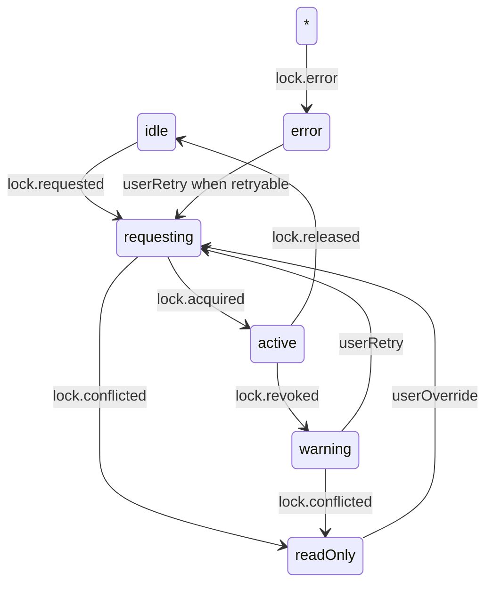

# AutoSave Indicator UI 仕様補遺

本書は `AutoSaveIndicator.tsx` の状態管理と `locks` 契約、Collector/Telemetry 連携の UI 観点要件を定義する。

## 1. イベント I/O 契約
| イベント名 | 発火トリガー | Payload プロパティ | UI ステート反映 |
| --- | --- | --- | --- |
| `autosave.lock.requested` | 編集画面がロック取得を試行 | `requestId: string`, `requestedAt: ISO8601` | Indicator を `requesting` へ。ボタンにスピナーを表示。
| `autosave.lock.acquired` | Web Locks API 取得成功 | `ownerId: string`, `acquiredAt: ISO8601`, `ttlMs: number` | Indicator を `active` へ更新。最終保存時刻を `acquiredAt` にリセット。
| `autosave.lock.renewed` | ロック更新成功 | `ownerId: string`, `renewedAt: ISO8601`, `ttlMs: number` | Indicator を `active` のまま維持し、ツールチップに次回更新予定を表示。
| `autosave.lock.released` | 明示的なロック解放 | `ownerId: string`, `releasedAt: ISO8601`, `reason?: "navigate" | "manual"` | Indicator を `idle` へ遷移し、履歴メニューを再有効化。
| `autosave.lock.conflicted` | 競合でロック取得失敗 | `ownerId: string`, `holderSummary: { userLabel: string; acquiredAt: ISO8601 }` | Indicator を `readOnly` に切替え、トーストで閲覧専用モードを通知。
| `autosave.lock.revoked` | ブラウザイベントでロック喪失 | `ownerId: string`, `revokedAt: ISO8601`, `reason: "visibility" | "expired"` | Indicator を `warning` に遷移。トーストと履歴ダイアログショートカットを提示。
| `autosave.lock.error` | 取得/更新時エラー | `ownerId?: string`, `stage: "request" | "renew" | "release"`, `message: string`, `retryable: boolean` | Indicator を `error` にし、再試行可否に応じて CTA を出し分け。

## 2. UI ステートマシン

- `idle`: 編集不可視覚効果なし。履歴ダイアログボタン有効。
- `requesting`: Indicator アイコンはスピナー。履歴ダイアログボタンを無効化。
- `active`: 「Saved HH:MM:SS」表示。更新トーストは出さない。
- `warning`: 黄色バッジと「ロック喪失」トースト。履歴ダイアログを強調表示。
- `readOnly`: グレーアウト＋鍵アイコン。「閲覧専用モード」バナーを表示。
- `error`: 赤バッジとエラーメッセージ。`retryable=false` の場合は「履歴を開く」CTA のみ。

## 3. 通知・コピー
- トースト: `readOnly` 遷移時「他のウィンドウで編集されています。閲覧専用モードで表示中」。
- トースト: `warning` 遷移時「ロックが解除されました。編集を再開するには再取得してください」。
- 警告バナー: `readOnly` のツールバー下に表示。`lock.conflicted` の `holderSummary.userLabel` を埋め込む。
- CTA: `warning` と `error(retryable)` に「ロックを再取得」ボタン。

## 4. 履歴表示フロー
1. Indicator から履歴ボタンをクリック。
2. `readOnly` 以外のステートでは即座にダイアログ表示。
3. `readOnly` では「編集権限が必要です」モーダルを先に表示し、ユーザーが `userOverride` を選択すると `locks.requested` を再送。
4. ダイアログ内で `warning`/`error` の場合は先頭に注意文を表示。

## 5. Telemetry 命名（Collector 送信のみ）
| UI アクション | Telemetry 名 | 備考 |
| --- | --- | --- |
| ステート遷移（全般） | `ui.autosaveIndicator.stateChanged` | `from`, `to`, `reason` を payload に含め、Collector では既存 `ui.*` と衝突しない prefix を維持。
| トースト表示 | `ui.autosaveIndicator.toastShown` | `variant`=`warning`/`info`/`error`。
| 履歴ダイアログ表示 | `ui.autosaveIndicator.historyOpened` | 既存 `history.opened` と区別するため命名を変更。
| 再取得リトライ | `ui.autosaveIndicator.retry` | `source`=`warning`/`error`。

## 6. Mock イベント駆動テスト計画（`tests/components/AutoSaveIndicator.test.tsx`）
1. `lock.requested` → `lock.acquired` の連続発火で `requesting`→`active` を検証。
2. `lock.requested` → `lock.conflicted` で `readOnly` バナーとトースト文言をスナップショット。
3. `lock.revoked` 後にユーザーがリトライすると `locks.requested` を再送するモックを検証。
4. `lock.error` (`retryable=false`) で CTA が履歴のみになることを確認。
5. `readOnly` 状態から履歴ボタンを押すとモーダル経由で `locks.requested` が再送されることを確認。

## 7. Collector 連携上の注意
- 上記 Telemetry は既存 JSONL schema の `ui.*` カテゴリに集約し、新規イベント名のみ追加。Payload 形状は既存キーを再利用し、Collector 側でのフィールド追加は不要。
- `autosave.lock.*` のブリッジ実装では未使用プロパティを破棄し、余計なイベントは送信しない。
