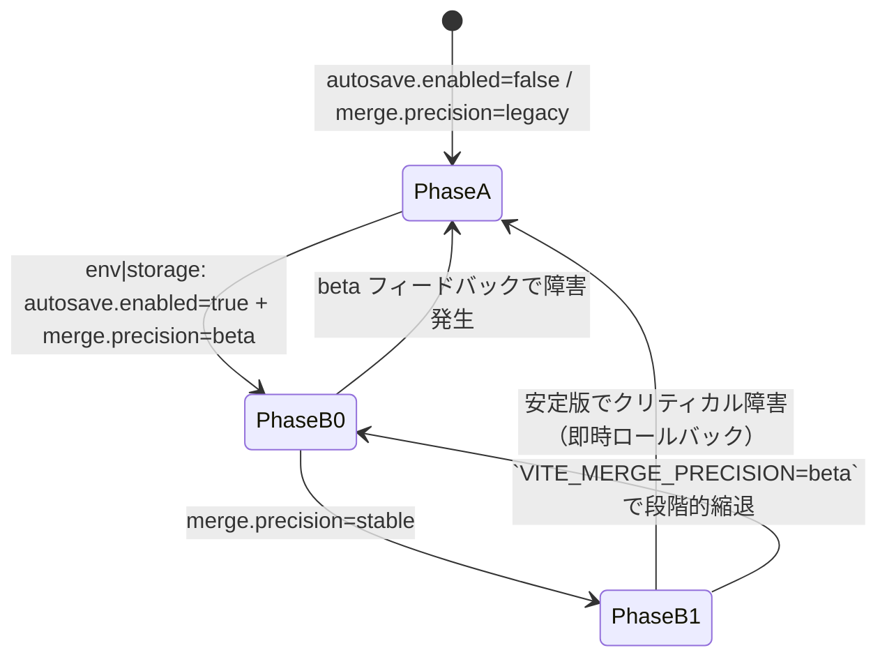

# 機能フラグと既定値

```json
{
  "autosave": {
    "enabled": false,
    "debounceMs": 500,
    "idleMs": 2000,
    "maxGenerations": 20,
    "maxBytes": 52428800
  },
  "merge": {
    "precision": "beta",
    "profile": {
      "tokenizer": "char",
      "granularity": "section",
      "threshold": 0.75,
      "prefer": "none"
    }
  }
}
```
- フラグは `localStorage` または設定UI（将来）で切替

## アクティベーションマトリクス（AutoSave / Diff Merge）

| `autosave.enabled` \ `merge.precision` | `legacy` | `beta` | `stable` |
| --- | --- | --- | --- |
| `false` | AutoSave 初期化: **無効**<br/>Diff Merge タブ: **非表示**（従来 UI のみ） | AutoSave 初期化: **無効**<br/>Diff Merge タブ: QA/開発のみ手動起動（内部検証用） | AutoSave 初期化: **無効**<br/>Diff Merge タブ: **非表示**（安定版へは同時リリースしない） |
| `true` | AutoSave 初期化: **有効**（アイドル 2s→OPFS 保存）<br/>Diff Merge タブ: **非表示** | AutoSave 初期化: **有効**<br/>Diff Merge タブ: **表示**（β UI、既存セレクタと共存） | AutoSave 初期化: **有効**<br/>Diff Merge タブ: **表示**（stable UI、Diff マージ結果を既定） |

- `beta` 列は Phase B-0 に限定し、`import.meta.env.VITE_MERGE_PRECISION=beta` または `localStorage.merge.precision="beta"` で QA のみ解放。
- `stable` へ昇格する際は Phase B-1 で `autosave.enabled=true` が前提。未達成時は `legacy` へ即時ロールバック。

## フラグ解決順序と入力ソース

### 優先順位

1. **ビルド時環境変数**: `import.meta.env` から `VITE_AUTOSAVE_ENABLED`（`"true" | "false"`）、`VITE_MERGE_PRECISION`（`"legacy" | "beta" | "stable"`）を読み取る。CI/CLI 出力向けに `process.env` もフォールバックで許容し、既存 `scripts/config-dump.ts` からの読み取り互換を維持する。
2. **ブラウザ `localStorage`**: キーは後方互換のため `autosave.enabled`・`merge.precision` のまま保持し、値は JSON 文字列ではなくプレーン文字列を想定（例: `'true'`, `'beta'`）。無効値は読み捨てる。
3. **既定値**: 本ドキュメント先頭の JSON を `DEFAULT_FLAGS` として `src/config/flags.ts` に内包する。どの入力ソースでも値が確定しない場合はこの既定値を採用する。

### キャッシュとライフサイクル

- フラグロードは `src/config/flags.ts` の `resolveFlags()` で一度だけ実行し、アプリ初期化時に `App.tsx` から呼び出す。結果はイミュータブルスナップショットとして React コンテキスト経由で配下へ配布する。
- `localStorage` のホットリロードは Phase B まで延期し、当面はタブ再読み込みでのみ値を反映する（パフォーマンス ±5% 以内を保証）。
- CLI/JSON 出力向けには同一ロジックを `resolveFlags({ mode: 'cli' })` で再利用し、`localStorage` レイヤーをスキップして `env → default` 順に評価する。

## `src/config/flags.ts` 設計

```ts
export type MergePrecision = 'legacy' | 'beta' | 'stable';
export type AutoSavePhase = 'disabled' | 'phase-a' | 'phase-b';

export interface FlagSnapshot {
  autosave: {
    enabled: boolean;
    phase: AutoSavePhase;
  };
  merge: {
    precision: MergePrecision;
  };
  source: {
    autosaveEnabled: 'env' | 'storage' | 'default';
    mergePrecision: 'env' | 'storage' | 'default';
  };
}

export interface FlagInputs {
  env?: Partial<Record<'VITE_AUTOSAVE_ENABLED' | 'VITE_MERGE_PRECISION', string | undefined>>;
  storage?: Pick<Storage, 'getItem'>;
  defaults?: typeof DEFAULT_FLAGS;
  mode?: 'browser' | 'cli';
}

export function resolveFlags(inputs?: FlagInputs): FlagSnapshot;
```

- `AutoSavePhase` は `enabled` と `merge.precision` の組み合わせで導出する（下記フェーズ遷移図を参照）。
- `mode='cli'` の場合は `storage` を無視し、`env`→`defaults` の優先順位に固定。
- `storage` 読取時に例外が発生した場合は既存ロガーへ `warn` を送りつつサプレッションし、後方互換で `default` を返す。
- `FlagSnapshot.source` で最終値の由来を保持し、デバッグ UI とテレメトリでの確認を容易にする。

## フェーズ遷移とロールバック



- **Phase A**: 既定状態。AutoSave は初期化されず、MergeDock は従来タブのみを表示。
- **Phase B-0**: QA 用段階。`autosave.enabled=true` を満たしたうえで `merge.precision=beta` を設定。`localStorage.merge.precision` で個別タブ単位の有効化が可能。障害時は `localStorage` 初期化で Phase A へ即時復帰。
- **Phase B-1**: 全ユーザー公開。`merge.precision=stable` を満たす場合のみ `AutoSavePhase` を `phase-b` とし、タブは常時表示。ロールバックは `env` を `legacy` へ戻し `localStorage` をクリアする。

## 想定テストケース

| ID | 観点 | 入力 | 期待値 |
| --- | --- | --- | --- |
| F01 | env 優先 | `VITE_AUTOSAVE_ENABLED="true"`, `localStorage.autosave.enabled="false"` | `enabled=true`, source=`env` |
| F02 | storage 上書き | env 未設定, `localStorage.merge.precision="beta"` | `precision='beta'`, source=`storage` |
| F03 | 無効値除外 | env 未設定, `localStorage.merge.precision="invalid"` | `precision='legacy'`, source=`default` |
| F04 | CLI 互換 | `resolveFlags({ mode: 'cli' })` で `localStorage` 供給なし | `precision` は env→default のみで決定 |
| F05 | Phase 判定 | `autosave.enabled=true`, `merge.precision='stable'` | `phase='phase-b'` |
| F06 | ロールバック | PhaseB0 で障害検知 → env を `legacy` へ変更 | 次回ロードで PhaseA に戻る |

## 段階導入チェックリスト

1. `DEFAULT_FLAGS` を `docs/CONFIG_FLAGS.md` と同期し、`git diff` で乖離がないことを確認。
2. Staging ビルドで `VITE_AUTOSAVE_ENABLED=true` を指定し、`resolveFlags()` の `source.autosaveEnabled` が `env` になることをログで確認。
3. QA アカウントで `localStorage.merge.precision='beta'` を設定し、MergeDock に Diff Merge タブが表示されることを目視確認。
4. 本番ロールアウト前に `resolveFlags({ mode: 'cli' })` を用いた設定ダンプが後方互換 JSON（キー名・値型）を維持していることを CI で検証。
5. ロールバック訓練として `localStorage.clear()` 後に `beta`→`legacy` へ戻るまでの UI/ログを記録し、運用 Runbook に追記。
