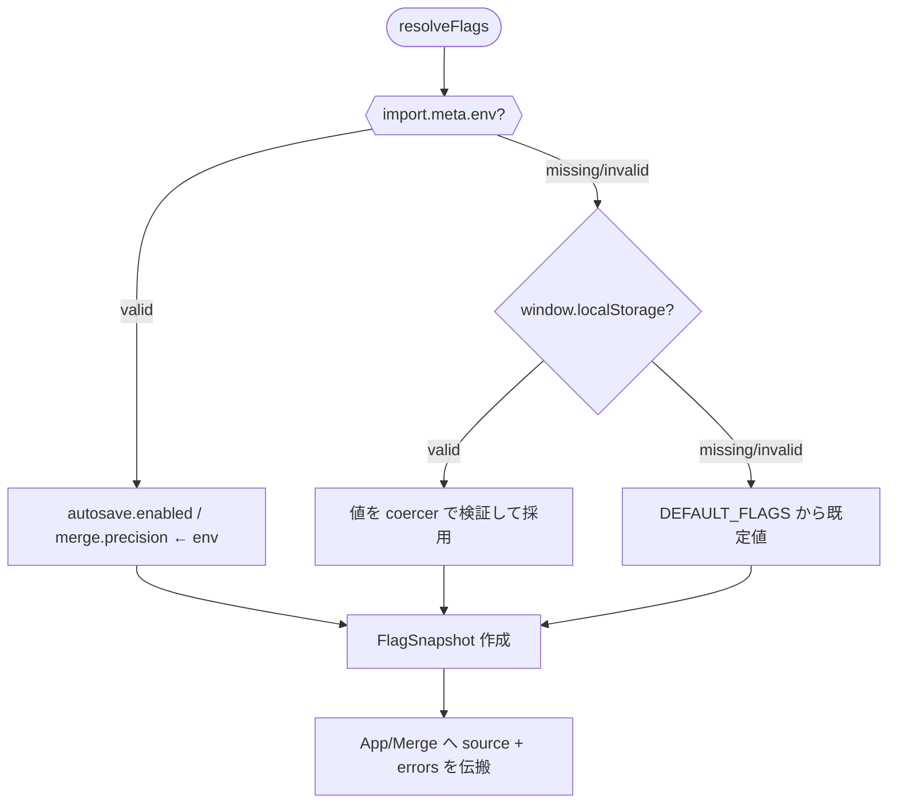
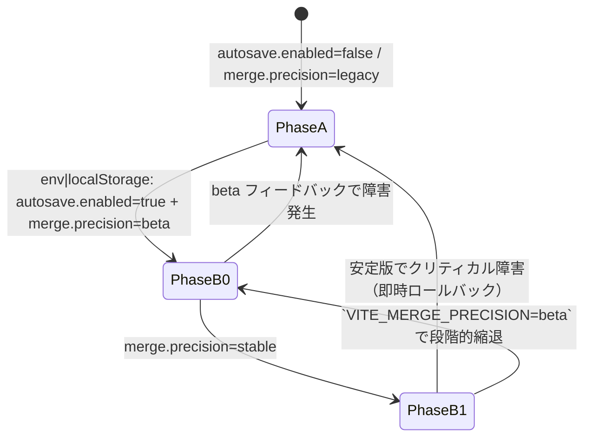

# 機能フラグと既定値

```json
{
  "autosave": {
    "enabled": false,
    "debounceMs": 500,
    "idleMs": 2000,
    "maxGenerations": 20,
    "maxBytes": 52428800
  },
  "merge": {
    "precision": "legacy",
    "profile": {
      "tokenizer": "char",
      "granularity": "section",
      "threshold": 0.75,
      "prefer": "none"
    }
  }
}
```
- フラグは `localStorage` または設定UI（将来）で切替

## アクティベーションマトリクス（AutoSave / Diff Merge）

| `autosave.enabled` \ `merge.precision` | `legacy` | `beta` | `stable` |
| --- | --- | --- | --- |
| `false` | AutoSave 初期化: **無効**<br/>Diff Merge タブ: **非表示**（従来 UI のみ） | AutoSave 初期化: **無効**<br/>Diff Merge タブ: QA/開発のみ手動起動（内部検証用） | AutoSave 初期化: **無効**<br/>Diff Merge タブ: **非表示**（安定版へは同時リリースしない） |
| `true` | AutoSave 初期化: **有効**（アイドル 2s→OPFS 保存）<br/>Diff Merge タブ: **非表示** | AutoSave 初期化: **有効**<br/>Diff Merge タブ: **表示**（β UI、既存セレクタと共存） | AutoSave 初期化: **有効**<br/>Diff Merge タブ: **表示**（stable UI、Diff マージ結果を既定） |

- `beta` 列は Phase B-0 に限定し、`import.meta.env.VITE_MERGE_PRECISION=beta` または `localStorage.merge.precision="beta"` で QA のみ解放。
- `stable` へ昇格する際は Phase B-1 で `autosave.enabled=true` が前提。未達成時は `legacy` へ即時ロールバック。

## MergeDock Diff タブ段階露出設計

| `merge.precision` | タブ構成 | 初期表示 | Diff 露出モード | フォールバックと後方互換 |
| --- | --- | --- | --- | --- |
| `legacy` | `compiled → shot → assets → import → golden` | `compiled` | 非表示 | `localStorage.merge.lastTab` が `diff` の場合でも `compiled` へ復帰。`pref` は常に `manual-first` 起点。 |
| `beta` | 既存タブ末尾に `diff (Beta)` を追加 | 直前の選択/既定 (`compiled`) | 段階露出（opt-in） | 既存ショートカット/タブ順序を維持。`diff` を選択済みのままベータに昇格/ロールバックしても保持される。`pref='diff-merge'` はロールバック時に `manual-first` へ戻す。 |
| `stable` | `golden` の直前に `diff` を挿入 | `diff` | 既定露出（default） | `beta` → `stable` への昇格時に `initialTab=diff` を優先。`localStorage.merge.lastTab` に互換値があればそれを尊重。Diff バックアップ CTA は 5 分経過で表示。`pref` 初期値は `diff-merge`。 |

- `FlagSnapshot.merge.precision` を最優先し、未提供時は `import.meta.env` → `localStorage.merge.precision` → 既定値を順に参照する。
- `MergeDock` は `flags` プロパティを受け入れるが、従来どおりプロパティ未指定でもローカルストレージ経由で後方互換動作する。
- `pref` セレクタは `stable` 以外の精度にダウングレードした際、自動で `manual-first` へ復帰し既存シーン選択ロジックを維持する。
- Diff タブは `beta` でのみ `Beta` バッジを付与。タブ順序・ショートカット (`Alt+[数字]`) は既存定義を再利用し、Diff を途中挿入する `stable` でもキーアサインが変わらないよう ID 順を保持する。

### Diff タブ QA チェックリスト

- [ ] **legacy**: `merge.precision=legacy` で Diff タブが描画されず、`localStorage.merge.lastTab='diff'` でも初期タブが `compiled` へ戻る。`pref` は `manual-first` のまま。
- [ ] **beta**: `merge.precision=beta` でタブ末尾に `Diff (Beta)` が追加され、既存タブ順序とショートカットが崩れない。`pref='diff-merge'` 選択状態から `legacy` へ戻した際、自動で `manual-first` へ復帰する。
- [ ] **stable**: `merge.precision=stable` で Diff タブが `golden` の直前に挿入され、初期タブが `diff`。AutoSave スナップショットの最終成功から 5 分超過時にバックアップ CTA が表示される。

## フェーズ別既定値とチーム配布

| フェーズ | `autosave.enabled` | `merge.precision` | 配布対象 | 配布手順 |
| --- | --- | --- | --- | --- |
| A-0 | `false` | `legacy` | 全ユーザー | 既定値のまま (`pnpm run flags:reset`) |
| A-1 | `true` | `legacy` | QA/開発 | `.env.qa` に `VITE_AUTOSAVE_ENABLED=true`、`pnpm run flags:push --env qa` |
| A-2 | `true` | `legacy` | ベータ招待 | `flags:push --env beta` 実行後、QA レポートを共有 |
| B-0 | `true` | `beta` | ベータ招待 | `flags:set merge.precision beta` → `flags:push --env beta` |
| B-1 | `true` | `stable` | 全ユーザー | `flags:set merge.precision stable` → `flags:push --env prod` |

### チェックリスト
- [ ] 配布前に `pnpm run flags:status` でローカル値と既定値の差分を確認する。
- [ ] Canary 実施中は `reports/canary/` の JSONL を Analyzer に渡し、SLO が満たされていることを QA が確認済みである。
- [ ] ロールバック時は `pnpm run flags:rollback --phase <prev>` を利用し、対象チームへ Slack テンプレート `templates/alerts/rollback.md` を送付する。
## フラグ解決順序と入力ソース

### 優先順位

1. **ビルド時環境変数**: `import.meta.env` から `VITE_AUTOSAVE_ENABLED`（`"true" | "false"`）、`VITE_MERGE_PRECISION`（`"legacy" | "beta" | "stable"`）を読み取る。CI/CLI 出力向けに `process.env` もフォールバックで許容し、既存 `scripts/config-dump.ts` からの読み取り互換を維持する。
2. **ブラウザ `localStorage`**: キーは後方互換のため `autosave.enabled`・`merge.precision` のまま保持し、値は JSON 文字列ではなくプレーン文字列を想定（例: `'true'`, `'beta'`）。無効値は読み捨てる。
3. **既定値**: 本ドキュメント先頭の JSON を `DEFAULT_FLAGS` として `src/config/flags.ts` に内包する。どの入力ソースでも値が確定しない場合はこの既定値を採用する。

### FlagSnapshot

- `resolveFlags()` は `FlagSnapshot` を返却し、`autosave`・`merge` の各フラグに対して `value`・`source`・`errors` を収集する。
- `source` は `'env' | 'localStorage' | 'default'` のいずれかであり、UI/Collector が Phase 判定やテレメトリ整合性を検証する際のキーとなる。
- `updatedAt` は `ResolveOptions.clock()`（既定: `() => new Date()`）から得た ISO8601 文字列で記録し、`docs/AUTOSAVE-DESIGN-IMPL.md` における AutoSave フェーズ遷移ログと相関させる。

### 解決シーケンス（設計メモ）



- `docs/AUTOSAVE-DESIGN-IMPL.md` と `Day8/docs/day8/design/03_architecture.md` で定義されている保存ポリシー / データフローと矛盾しないよう、スナップショットはイミュータブルに扱う。
- Phase A では `localStorage` を直接参照する既存 UI が残存するため、`resolveFlags()` で取得できない場合でも **直読フェールセーフを温存する**。削除は Phase B-0 完了後に ADR 化して判断する。

### キャッシュとライフサイクル

- フラグロードは `src/config/flags.ts` の `resolveFlags()` で一度だけ実行し、アプリ初期化時に `App.tsx` から呼び出す。結果はイミュータブルスナップショットとして React コンテキスト経由で配下へ配布する。
- `localStorage` のホットリロードは Phase B まで延期し、当面はタブ再読み込みでのみ値を反映する（パフォーマンス ±5% 以内を保証）。
- CLI/JSON 出力向けには同一ロジックを `resolveFlags({ storage: null })` で再利用し、`localStorage` レイヤーをスキップして `env → default` 順に評価する。

## `src/config/flags.ts` 設計

-```ts
export type FlagSource = 'env' | 'localStorage' | 'default'

export type MergePrecision = 'legacy' | 'beta' | 'stable'

export interface FlagValidationIssue {
  readonly code: 'invalid-boolean' | 'invalid-precision'
  readonly flag: string
  readonly raw: string
  readonly message: string
  readonly retryable: false
}

export interface FlagValidationError extends FlagValidationIssue {
  readonly source: FlagSource
}

export interface FlagValueSnapshot<T> {
  readonly value: T
  readonly source: FlagSource
  readonly errors: readonly FlagValidationError[]
}

export interface FlagSnapshot {
  readonly autosave: {
    readonly enabled: boolean
    readonly source: FlagSource
    readonly errors: readonly FlagValidationError[]
  }
  readonly merge: {
    readonly precision: MergePrecision
    readonly source: FlagSource
    readonly errors: readonly FlagValidationError[]
  }
  readonly updatedAt: string
}

export interface ResolveOptions {
  readonly env?: Record<string, unknown>
  readonly storage?: Pick<Storage, 'getItem'> | null
  readonly clock?: () => Date
}

export interface FlagDefinition<T> {
  readonly name: string
  readonly envKey: string
  readonly storageKey: string
  readonly legacyStorageKeys?: readonly string[]
  readonly defaultValue: T
  readonly coerce?: FlagCoercer<T>
}

export type FeatureFlagName = 'autosave.enabled' | 'merge.precision'

export type FeatureFlagValue<Name extends FeatureFlagName> =
  (typeof FEATURE_FLAG_DEFINITIONS)[Name]['defaultValue']

export const DEFAULT_FLAGS = {
  autosave: {
    enabled: false,
    debounceMs: 500,
    idleMs: 2000,
    maxGenerations: 20,
    maxBytes: 50 * 1024 * 1024
  },
  merge: {
    precision: 'legacy' as const,
    profile: {
      tokenizer: 'char' as const,
      granularity: 'section' as const,
      threshold: 0.75,
      prefer: 'none' as const
    }
  }
} as const

export function resolveFlags(options?: ResolveOptions): FlagSnapshot
export function resolveFeatureFlag<Name extends FeatureFlagName>(
  name: Name,
  options?: ResolveOptions
): FlagValueSnapshot<FeatureFlagValue<Name>>
```

- `DEFAULT_FLAGS` は冒頭 JSON と同じ構造を `as const` で保持し、`defaultValue` 更新時の後方互換を担保する。
- `FlagValueSnapshot.source` に `'env' | 'localStorage' | 'default'` を格納し、App/Merge UI からのテレメトリ一致を保証する。
- `updatedAt` は `clock()`（既定: `() => new Date()`）で決定し、テストではフェイククロックで固定する。
- 2025-01-18 設計更新: 本節と `src/config/flags.ts` の定義差分はゼロ（`import.meta.env` / `process.env` マージ、`FlagSnapshot.updatedAt` の仕様を確認済み）。

## フェーズ遷移とロールバック



- **Phase A**: 既定状態。AutoSave は初期化されず、MergeDock は従来タブのみを表示。
- **Phase B-0**: QA 用段階。`autosave.enabled=true` を満たしたうえで `merge.precision=beta` を設定。`localStorage.merge.precision` で個別タブ単位の有効化が可能。障害時は `localStorage` 初期化で Phase A へ即時復帰。
- **Phase B-1**: 全ユーザー公開。`merge.precision=stable` を満たす場合のみ `AutoSavePhase` を `phase-b` とし、タブは常時表示。ロールバックは `env` を `legacy` へ戻し `localStorage` をクリアする。

### フェーズ状態遷移表（検証用）

| Phase | 入力条件 (`autosave.enabled` / `merge.precision`) | 期待される `FlagSnapshot.autosave.source` / `merge.source` | AutoSave 状態 (`docs/AUTOSAVE-DESIGN-IMPL.md` §4) | MergeDock 表示 | チェック観点 |
| --- | --- | --- | --- | --- | --- |
| PhaseA (`phase-a0`) | `false` / `legacy`（既定値） | `default` / `default` | `disabled` 固定 | 従来タブのみ | `pnpm run flags:reset` 後に `updatedAt` が初期化されること |
| PhaseB0 (`phase-b0`) | `true` / `beta`（env または storage） | `env` 優先、`storage` フォールバック | `idle → awaiting-lock` への遷移が許可 | β UI を明示表示 | Collector テレメトリが `source` を JSONL に含めること |
| PhaseB1 (`phase-b1`) | `true` / `stable`（env 推奨） | `env` / `env` | `idle → awaiting-lock`、安定版ロールアウト | Stable UI 常時表示 | env 切替で `updatedAt` が再更新し、`storage` が未使用であること |

- Reviewer は上記表を参照し、Phase 切替時に `resolveFlags()` から得られる `source` と AutoSave/Merge の UI 状態が一致しているかを検証する。

### TDD 用テストケース草案

| ID | 観点 | 入力 | 期待値 |
| --- | --- | --- | --- |
| T01 | env 優先 | `VITE_AUTOSAVE_ENABLED="true"`, `localStorage.autosave.enabled="false"` | `autosave.value=true`, `autosave.enabled=true`, `autosave.source='env'` |
| T02 | localStorage フォールバック | env 未設定, `localStorage.merge.precision="beta"` | `merge.value='beta'`, `merge.precision='beta'`, `merge.source='localStorage'` |
| T03 | 既定値採用 | env 未設定, `localStorage.merge.precision="invalid"` | `merge.value='legacy'`, `merge.precision='legacy'`, `merge.source='default'`, 検証エラー1件 |

上記 TDD 草案を満たしたうえで、下表の全体テスト計画に合流する。

### 差分適用前のリスク評価

1. **env 未設定**: `import.meta.env` / `process.env` の両方にキーが無い場合は `localStorage` → 既定値へフォールバック。初期リリースは `DEFAULT_FLAGS` が Phase A を表すため UX 変化はない。
2. **localStorage 不正値**: 既存 UI が文字列以外を書き込んだ場合でも `coerce` が失敗し、エラーを `FlagSnapshot.errors` に残したうえで既定値採用。Day8/docs/day8/design/03_architecture.md のテレメトリ要件と整合。
3. **既定値読み込み**: `docs/AUTOSAVE-DESIGN-IMPL.md` の保存ポリシーは `autosave.enabled=false` を前提に設計されているため、既定値へのフォールバック時も保存動作は従来通り。パフォーマンス影響 ±5% 以内。

## 想定テストケース

### TDD フォーカステスト（先行実装）

| ID | 観点 | 入力 | 期待値 |
| --- | --- | --- | --- |
| T01 | env 優先 | `VITE_AUTOSAVE_ENABLED="true"`, `localStorage.autosave.enabled="false"` | `enabled=true`, source=`env` |
| T02 | localStorage フォールバック | env 未設定, `localStorage.merge.precision="beta"` | `precision='beta'`, source=`localStorage` |
| T03 | 既定値リカバリ | env 未設定, `localStorage.merge.precision="invalid"` | `precision='legacy'`, source=`default` |

### E2E/統合テスト

| ID | 観点 | 入力 | 期待値 |
| --- | --- | --- | --- |
| F04 | CLI 互換 | `resolveFlags` に `storage: null` を指定 | `precision` は env→default のみで決定 |
| F05 | App.tsx 初期化 | `autosave.enabled=true` | AutoSave ブートストラップが `FlagSnapshot.autosave.value` を参照し、ソースをテレメトリへ出力 |
| F06 | MergeDock 表示制御 | `merge.precision='beta'` | Diff Merge タブが表示され、`FlagSnapshot.merge.source` が UI ログへ残る |

- App.tsx / MergeDock からの利用シナリオを含む詳細テスト計画は `tests/config/FLAGS_TEST_PLAN.md` を参照。

## リスク評価（差分適用前）

- **想定外の直読依存**: 既存 UI が `localStorage` を直接参照し続けているため、`resolveFlags()` 導入時には「スナップショット取得失敗時は直読を許可する」ガイドラインを共有する。Feature Flag Cleanup の前段で利用箇所の棚卸しを実施。
- **無効値持続**: `localStorage` に不正値が残っている場合、既定値へ戻す動線（`pnpm run flags:reset`）を QA Runbook へ明示し、サポートが迅速に対応できるようにする。
- **テレメトリ不整合**: `source` が `default` へフォールバックしたケースを Analyzer が区別できるよう、JSONL スキーマに `flagSource` 属性を追加検討。追加実装は別タスクで扱う。

## 段階導入チェックリスト

1. `DEFAULT_FLAGS` を `docs/CONFIG_FLAGS.md` と同期し、`git diff` で乖離がないことを確認。
2. Staging ビルドで `VITE_AUTOSAVE_ENABLED=true` を指定し、`resolveFlags().autosave.source` が `env` になることをログで確認。
3. QA アカウントで `localStorage.merge.precision='beta'` を設定し、MergeDock に Diff Merge タブが表示されることを目視確認。
4. 本番ロールアウト前に `resolveFlags({ storage: null })` を用いた設定ダンプが後方互換 JSON（キー名・値型）を維持していることを CI で検証。
5. ロールバック訓練として `localStorage.clear()` 後に `beta`→`legacy` へ戻るまでの UI/ログを記録し、運用 Runbook に追記。

## 監視・ロールバック連携

- Collector/Analyzer/Reporter の責務分離は `Day8/docs/day8/design/03_architecture.md` を踏襲し、AutoSave/精緻マージの段階導入監視は `reports/rollout-monitoring-design.md` に従う。
- Telemetry JSONL は 15 分 ETL で集約し、Canary では `phase=canary`、GA では `phase=ga` を付与する。欠損バッチは `collector-missed-batch` として監査ログに残す。
- SLO/ロールバック指標
  - `autosave_write_success_rate`（Canary: ≥99.5%、GA: ≥99.3%）
  - `merge_precision_latency_p95`（Canary: ≤4500ms、GA: ≤5000ms）
  - `rollback_request_rate = 0`（逸脱で PagerDuty L2）
- ロールバック失敗時は `flags-rollback-failed` として再試行不可扱い。Reporter が即時エスカレーションし、`pnpm run flags:push --env <prev>` の手動実行ログを `reports/rollback/` に保管する。
- Canary → GA 移行判定は 48h 連続 SLO 達成と `reports/rollout-monitoring-checklist.md` 完了を要件とする。

## 差分適用前のリスク評価

- **localStorage の旧直接参照**: resolveFlags() 導入後も UI は段階的移行中。既存直読が残るため、キー名/値型が変わると即時障害となる。→ 現状は不変とし、フェーズ完了まで維持。
- **env 未設定時の既定値依存**: `.env` 漏れで AutoSave が無効化される可能性。→ `DEFAULT_FLAGS` と同値であることを release checklist に追加し、CI で `.env.sample` Diff を監視。
- **validation エラーの見落とし**: storage の無効値が静かに既定値へ戻る。→ `FlagSnapshot.*.errors` をテレメトリに送出し、Analyzer 側で `invalid-*` を監視する。
