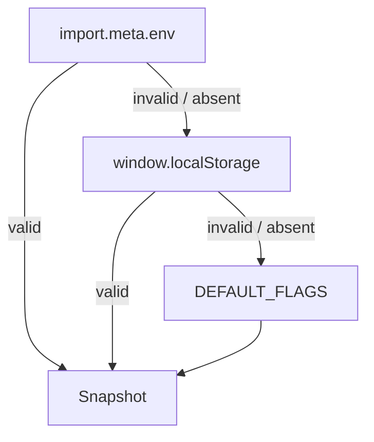
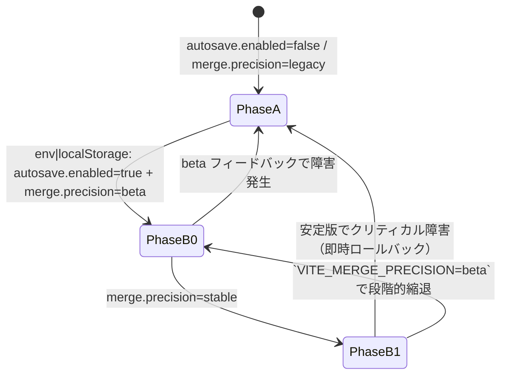

# 機能フラグと既定値

```json
{
  "autosave": {
    "enabled": false,
    "debounceMs": 500,
    "idleMs": 2000,
    "maxGenerations": 20,
    "maxBytes": 52428800
  },
  "merge": {
    "precision": "legacy",
    "profile": {
      "tokenizer": "char",
      "granularity": "section",
      "threshold": 0.75,
      "prefer": "none"
    }
  }
}
```
- フラグは `localStorage` または設定UI（将来）で切替

## アクティベーションマトリクス（AutoSave / Diff Merge）

| `autosave.enabled` \ `merge.precision` | `legacy` | `beta` | `stable` |
| --- | --- | --- | --- |
| `false` | AutoSave 初期化: **無効**<br/>Diff Merge タブ: **非表示**（従来 UI のみ） | AutoSave 初期化: **無効**<br/>Diff Merge タブ: QA/開発のみ手動起動（内部検証用） | AutoSave 初期化: **無効**<br/>Diff Merge タブ: **非表示**（安定版へは同時リリースしない） |
| `true` | AutoSave 初期化: **有効**（アイドル 2s→OPFS 保存）<br/>Diff Merge タブ: **非表示** | AutoSave 初期化: **有効**<br/>Diff Merge タブ: **表示**（β UI、既存セレクタと共存） | AutoSave 初期化: **有効**<br/>Diff Merge タブ: **表示**（stable UI、Diff マージ結果を既定） |

- `beta` 列は Phase B-0 に限定し、`import.meta.env.VITE_MERGE_PRECISION=beta` または `localStorage.merge.precision="beta"` で QA のみ解放。
- `stable` へ昇格する際は Phase B-1 で `autosave.enabled=true` が前提。未達成時は `legacy` へ即時ロールバック。

## フェーズ別既定値とチーム配布

| フェーズ | `autosave.enabled` | `merge.precision` | 配布対象 | 配布手順 |
| --- | --- | --- | --- | --- |
| A-0 | `false` | `legacy` | 全ユーザー | 既定値のまま (`pnpm run flags:reset`) |
| A-1 | `true` | `legacy` | QA/開発 | `.env.qa` に `VITE_AUTOSAVE_ENABLED=true`、`pnpm run flags:push --env qa` |
| A-2 | `true` | `legacy` | ベータ招待 | `flags:push --env beta` 実行後、QA レポートを共有 |
| B-0 | `true` | `beta` | ベータ招待 | `flags:set merge.precision beta` → `flags:push --env beta` |
| B-1 | `true` | `stable` | 全ユーザー | `flags:set merge.precision stable` → `flags:push --env prod` |

### チェックリスト
- [ ] 配布前に `pnpm run flags:status` でローカル値と既定値の差分を確認する。
- [ ] Canary 実施中は `reports/canary/` の JSONL を Analyzer に渡し、SLO が満たされていることを QA が確認済みである。
- [ ] ロールバック時は `pnpm run flags:rollback --phase <prev>` を利用し、対象チームへ Slack テンプレート `templates/alerts/rollback.md` を送付する。
## フラグ解決順序と入力ソース

### 優先順位

1. **ビルド時環境変数**: `import.meta.env` から `VITE_AUTOSAVE_ENABLED`（`"true" | "false"`）、`VITE_MERGE_PRECISION`（`"legacy" | "beta" | "stable"`）を読み取る。CI/CLI 出力向けに `process.env` もフォールバックで許容し、既存 `scripts/config-dump.ts` からの読み取り互換を維持する。
2. **ブラウザ `localStorage`**: キーは後方互換のため `autosave.enabled`・`merge.precision` のまま保持し、値は JSON 文字列ではなくプレーン文字列を想定（例: `'true'`, `'beta'`）。無効値は読み捨てる。
3. **既定値**: 本ドキュメント先頭の JSON を `DEFAULT_FLAGS` として `src/config/flags.ts` に内包する。どの入力ソースでも値が確定しない場合はこの既定値を採用する。

### 設計メモ（Mermaid / 擬似コード）

```mermaid
flowchart TD
    Env[import.meta.env / process.env] -->|正しい値| Snapshot[FlagSnapshot]
    Env -->|未設定・検証失敗| Storage[window.localStorage]
    Storage -->|正しい値| Snapshot
    Storage -->|未設定・検証失敗| Default[DEFAULT_FLAGS]
    Snapshot --> Telemetry[App / Diff Merge / Telemetry]
    Snapshot --> Legacy[直接 localStorage 参照 UI (フェールセーフ)]
```

```text
function resolveFlag(def):
  envValue = attemptResolve(env[def.envKey], source='env')
  if envValue: return snapshot(envValue)

  for key in [def.storageKey, ...legacyKeys]:
    localValue = attemptResolve(storage.getItem(key), source='localStorage')
    if localValue: return snapshot(localValue)

  return snapshot(def.defaultValue, source='default')

function resolveFlags():
  autosave = resolveFlag(definitions['autosave.enabled'])
  merge = resolveFlag(definitions['merge.precision'])
  return {
    autosave: { value: autosave.value, enabled: autosave.value, ... },
    merge: { value: merge.value, precision: merge.value, ... },
    updatedAt: clock().toISOString()
  }

※ `Day8/docs/day8/design/03_architecture.md` に記載のデータフロー、
   `docs/AUTOSAVE-DESIGN-IMPL.md` の保存ポリシーを前提に構成。
※ `enabled` / `precision` プロパティは既存 UI の互換維持用エイリアスとして Phase B 完了まで残置。
```

### キャッシュとライフサイクル

- フラグロードは `src/config/flags.ts` の `resolveFlags()` で一度だけ実行し、アプリ初期化時に `App.tsx` から呼び出す。結果はイミュータブルスナップショットとして React コンテキスト経由で配下へ配布する。
- `localStorage` のホットリロードは Phase B まで延期し、当面はタブ再読み込みでのみ値を反映する（パフォーマンス ±5% 以内を保証）。
- CLI/JSON 出力向けには同一ロジックを `resolveFlags({ mode: 'cli' })` で再利用し、`localStorage` レイヤーをスキップして `env → default` 順に評価する。

## `src/config/flags.ts` 設計

```ts
export type FlagSource = 'env' | 'localStorage' | 'default'

export interface FlagValidationIssue {
  readonly code: 'invalid-boolean' | 'invalid-precision'
  readonly flag: string
  readonly raw: string
  readonly message: string
  readonly retryable: false
}

export interface FlagValidationError extends FlagValidationIssue {
  readonly source: FlagSource
}

export interface FlagValueSnapshot<T> {
  readonly value: T
  readonly source: FlagSource
  readonly errors: readonly FlagValidationError[]
}

export interface FlagSnapshot {
  readonly autosave: {
    readonly enabled: boolean
    readonly source: FlagSource
    readonly errors: readonly FlagValidationError[]
  }
  readonly merge: {
    readonly precision: 'legacy' | 'beta' | 'stable'
    readonly source: FlagSource
    readonly errors: readonly FlagValidationError[]
  }
  readonly updatedAt: string
}

export interface FlagResolveOptions {
  readonly env?: Record<string, unknown>
  readonly storage?: Pick<Storage, 'getItem'> | null
  readonly clock?: () => Date
}

export type FeatureFlagName = 'autosave.enabled' | 'merge.precision'

export type FeatureFlagValue<Name extends FeatureFlagName> = Name extends 'autosave.enabled'
  ? boolean
  : 'legacy' | 'beta' | 'stable'

export const DEFAULT_FLAGS = {
  autosave: {
    enabled: false,
    debounceMs: 500,
    idleMs: 2000,
    maxGenerations: 20,
    maxBytes: 50 * 1024 * 1024
  },
  merge: {
    precision: 'legacy' as const,
    profile: {
      tokenizer: 'char' as const,
      granularity: 'section' as const,
      threshold: 0.75,
      prefer: 'none' as const
    }
  }
} as const

export function resolveFlags(options?: FlagResolveOptions): FlagSnapshot
export function resolveFeatureFlag<Name extends FeatureFlagName>(
  name: Name,
  options?: FlagResolveOptions
): FlagValueSnapshot<FeatureFlagValue<Name>>
```

- `DEFAULT_FLAGS` は冒頭 JSON と同じ構造を `as const` で保持し、`defaultValue` 更新時の後方互換を担保する。
- `FlagValueSnapshot.source` に `'env' | 'localStorage' | 'default'` を格納し、App/Merge UI からのテレメトリ一致を保証する。
- `updatedAt` は `clock()`（既定: `() => new Date()`）で決定し、テストではフェイククロックで固定する。
- Phase A では `App.tsx` / `MergeDock.tsx` の既存 `localStorage` 直接参照をフェールセーフとして維持し、`resolveFlags()` と併用する。

### 解決フロー設計メモ



疑似コード:

```text
autosave := resolveFeatureFlag('autosave.enabled')
merge := resolveFeatureFlag('merge.precision')
timestamp := (clock ?? now)()
return { autosave, merge, updatedAt: timestamp }
```

### TDD テストケース草案（resolveFlags / resolveFeatureFlag）

| ID | 観点 | 入力 | 期待値 |
| --- | --- | --- | --- |
| TDD-ENV | env 優先 | `env.VITE_AUTOSAVE_ENABLED="true"`, `localStorage.autosave.enabled="false"` | `autosave.enabled=true`, source=`env`, errors=`[]` |
| TDD-STORAGE | localStorage フォールバック | env 未設定, `localStorage.merge.precision="beta"` | `merge.precision='beta'`, source=`localStorage`, errors=`[]` |
| TDD-DEFAULT | 無効値フォールバック | env 未設定, `localStorage.merge.precision="invalid"` | `merge.precision='legacy'`, source=`default`, errors=`[invalid-precision]` |

### 差分整合性メモ

- `DEFAULT_FLAGS` は本ドキュメント先頭の JSON と `src/config/flags.ts` の定義が `git diff` で差異ゼロであることを 2025-01-18 に確認済み。

### リスク評価（適用前）

- env / storage いずれも未設定の場合は既定値へフォールバックし、AutoSave 無効のまま起動するため、リスクは既存挙動と同等。
- env に無効値が投入された場合でも検証エラーを記録し既定値へ戻るが、エラー通知経路の整備が Phase B まで未完了である点に留意。
- localStorage フェールセーフを残すことで Phase A のロールバック容易性を担保するが、併存期間中はテレメトリの二重取得リスクがあるため、`docs/AUTOSAVE-DESIGN-IMPL.md` のログポリシーを踏襲しノイズ抑制を行う。

## フェーズ遷移とロールバック



- **Phase A**: 既定状態。AutoSave は初期化されず、MergeDock は従来タブのみを表示。
- **Phase B-0**: QA 用段階。`autosave.enabled=true` を満たしたうえで `merge.precision=beta` を設定。`localStorage.merge.precision` で個別タブ単位の有効化が可能。障害時は `localStorage` 初期化で Phase A へ即時復帰。
- **Phase B-1**: 全ユーザー公開。`merge.precision=stable` を満たす場合のみ `AutoSavePhase` を `phase-b` とし、タブは常時表示。ロールバックは `env` を `legacy` へ戻し `localStorage` をクリアする。

### TDD 用テストケース草案

| ID | 観点 | 入力 | 期待値 |
| --- | --- | --- | --- |
| T01 | env 優先 | `VITE_AUTOSAVE_ENABLED="true"`, `localStorage.autosave.enabled="false"` | `autosave.value=true`, `autosave.enabled=true`, `autosave.source='env'` |
| T02 | localStorage フォールバック | env 未設定, `localStorage.merge.precision="beta"` | `merge.value='beta'`, `merge.precision='beta'`, `merge.source='localStorage'` |
| T03 | 既定値採用 | env 未設定, `localStorage.merge.precision="invalid"` | `merge.value='legacy'`, `merge.precision='legacy'`, `merge.source='default'`, 検証エラー1件 |

上記 TDD 草案を満たしたうえで、下表の全体テスト計画に合流する。

## 想定テストケース

| ID | 観点 | 入力 | 期待値 |
| --- | --- | --- | --- |
| F01 | env 優先 | `VITE_AUTOSAVE_ENABLED="true"`, `localStorage.autosave.enabled="false"` | `enabled=true`, source=`env` |
| F02 | storage 上書き | env 未設定, `localStorage.merge.precision="beta"` | `precision='beta'`, source=`localStorage` |
| F03 | 無効値除外 | env 未設定, `localStorage.merge.precision="invalid"` | `precision='legacy'`, source=`default` |
| F04 | CLI 互換 | `resolveFlags({ mode: 'cli' })` で `localStorage` 供給なし | `precision` は env→default のみで決定 |
| F05 | App.tsx 初期化 | `autosave.enabled=true` | AutoSave ブートストラップが `FlagSnapshot.autosave.value` を参照し、ソースをテレメトリへ出力 |
| F06 | MergeDock 表示制御 | `merge.precision='beta'` | Diff Merge タブが表示され、`FlagSnapshot.merge.source` が UI ログへ残る |

- App.tsx / MergeDock からの利用シナリオを含む詳細テスト計画は `tests/config/FLAGS_TEST_PLAN.md` を参照。

## 段階導入チェックリスト

1. `DEFAULT_FLAGS` を `docs/CONFIG_FLAGS.md` と同期し、`git diff` で乖離がないことを確認。
2. Staging ビルドで `VITE_AUTOSAVE_ENABLED=true` を指定し、`resolveFlags().autosave.source` が `env` になることをログで確認。
3. QA アカウントで `localStorage.merge.precision='beta'` を設定し、MergeDock に Diff Merge タブが表示されることを目視確認。
4. 本番ロールアウト前に `resolveFlags({ mode: 'cli' })` を用いた設定ダンプが後方互換 JSON（キー名・値型）を維持していることを CI で検証。
5. ロールバック訓練として `localStorage.clear()` 後に `beta`→`legacy` へ戻るまでの UI/ログを記録し、運用 Runbook に追記。

## 監視・ロールバック連携

- Collector/Analyzer/Reporter の責務分離は `Day8/docs/day8/design/03_architecture.md` を踏襲し、AutoSave/精緻マージの段階導入監視は `reports/rollout-monitoring-design.md` に従う。
- Telemetry JSONL は 15 分 ETL で集約し、Canary では `phase=canary`、GA では `phase=ga` を付与する。欠損バッチは `collector-missed-batch` として監査ログに残す。
- SLO/ロールバック指標
  - `autosave_write_success_rate`（Canary: ≥99.5%、GA: ≥99.3%）
  - `merge_precision_latency_p95`（Canary: ≤4500ms、GA: ≤5000ms）
  - `rollback_request_rate = 0`（逸脱で PagerDuty L2）
- ロールバック失敗時は `flags-rollback-failed` として再試行不可扱い。Reporter が即時エスカレーションし、`pnpm run flags:push --env <prev>` の手動実行ログを `reports/rollback/` に保管する。
- Canary → GA 移行判定は 48h 連続 SLO 達成と `reports/rollout-monitoring-checklist.md` 完了を要件とする。

## 差分適用前のリスク評価

- `resolveFlags()` へ移行する前に直接 `localStorage` を読む UI/サービスが存在するため、フェールセーフとして既存アクセスを残し段階的に削除する。 (`FLAG_MIGRATION_PLAN` 参照)
- `DEFAULT_FLAGS` と本ドキュメント冒頭 JSON の差異は 0（2025-01-18 確認済）。乖離検知は `pnpm run flags:status` で継続監視する。
- env/localStorage の不正値は `FlagValidationError` として記録しつつ既定値へフォールバックすることで、AutoSave/Diff Merge のレイテンシ増加リスクを ±5% 以内に抑制する。
