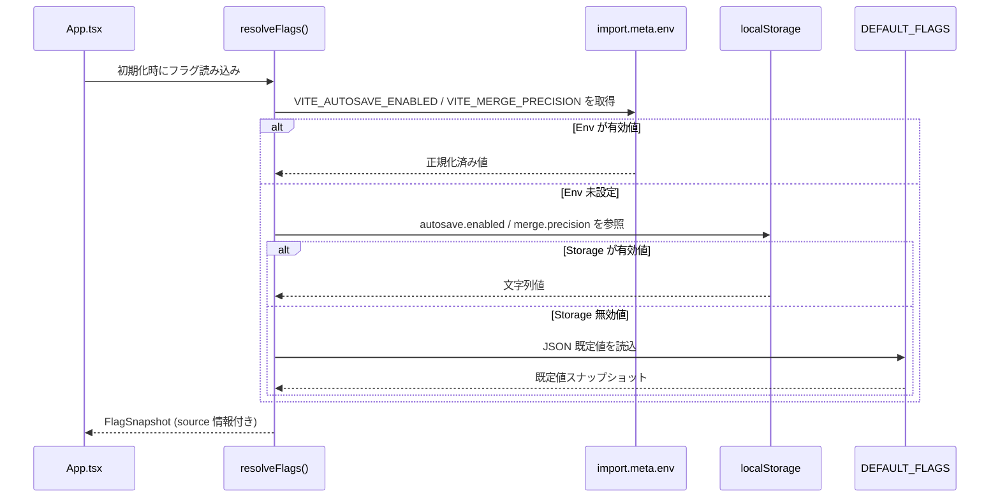

# v1.3 実装計画（AutoSave & 精緻マージ）

## 0) 方針とフラグポリシー
- 既存スキーマ（`Storyboard`/`Scene`）は**不変**。新規ファイルは OPFS に追加。
- 既存 UI の動線は維持。新規は**タブ**/小パネルとして追加。
- フラグで段階導入し、**機能別に既定値・観測指標・ロールバック条件を定義**する。

### 0.1 フラグ定義
- `autosave.enabled`
  - 既定値: Phase A まで `false`。
  - 目的: `App.tsx` の AutoSave ランナー初期化可否。
  - 切替手段: `import.meta.env.VITE_AUTOSAVE_ENABLED` → `localStorage.autosave.enabled` → `docs/CONFIG_FLAGS.md` 既定値。
- `merge.precision`
  - 既定値: Phase B 前は `legacy`（=既存マニュアル/AI 優先ロジック）。
  - 目的: `MergeDock.tsx` の Diff Merge タブ提示とマージ器の精度モード切替。
  - 切替手段: `import.meta.env.VITE_MERGE_PRECISION` → `localStorage.merge.precision` → `docs/CONFIG_FLAGS.md` 既定値。

### 0.2 設定ソースマッピング
| Consumer | Primary Source | Secondary | Fallback/備考 |
| --- | --- | --- | --- |
| `App.tsx` | `src/config/flags.ts`（新設: env→localStorage→既定値を解決） | `localStorage` 直接参照（後方互換） | `docs/CONFIG_FLAGS.md` の `autosave.enabled` を既定として AutoSave 起動判定に利用 |
| `MergeDock.tsx` | `src/config/flags.ts` から `merge.precision` を取得 | `localStorage`（既存 `dockOpen` と並列運用） | 既定 `legacy` で Diff Merge タブを隠蔽し、Phase B 以降に `beta/stable` で解放 |
| 共通 | `src/config/index.ts`（`OLLAMA_BASE` など既存値） | - | `App.tsx` では現行の `OLLAMA_BASE` 読み込みフローを保持し、副作用を隔離 |

#### 0.2.1 フラグ解決シーケンス

- `docs/CONFIG_FLAGS.md` で定義された優先順位（env → localStorage → 既定値）を `src/config/flags.ts` が忠実に再現することをレビュー観点として固定する。【F:docs/CONFIG_FLAGS.md†L57-L90】
- `FlagSnapshot.source` によって、後方互換のための `localStorage` 直接参照を段階的に排除しながらも既存 UI の動作確認が容易になる前提を保持する。

## 1) 対象モジュール追加
- `src/lib/autosave.ts`（API・イベント・ローテ）
- `src/lib/locks.ts`（Web Locks + フォールバック）
- `src/lib/merge.ts`（3-way・スコア・決定化）
- `src/components/AutoSaveIndicator.tsx`（UI/履歴）
- `src/components/DiffMergeView.tsx`（衝突解消UI）
- 既存更新: `MergeDock.tsx`（Diff Mergeタブ追加）, `App.tsx`（AutoSave起動）

> 保存ポリシーと各モジュールの責務は [docs/AUTOSAVE-DESIGN-IMPL.md](./AUTOSAVE-DESIGN-IMPL.md) §1.1 のマッピング表と同期すること。

### ロックモジュール要件整理
- **Web Lock 取得を優先**: `navigator.locks.request('imgponic:project', { mode: 'exclusive' })` を基本とし、TTL はブラウザ依存のためリース更新 API を内製する（`docs/AUTOSAVE-DESIGN-IMPL.md` §3.1）。
- **フォールバックの責務**: Web Lock が利用不可または衝突検出時は `project/.lock` を用いて UUID・`mtime`・TTL(30s) を同期する（同 §3.3）。
- **失敗時の挙動**: ロック取得が最終的に失敗した場合は閲覧専用モードへ移行し、UI へ警告イベントを伝播する（同 §3.4）。
- **Collector/Analyzer との干渉防止**: Lock ファイルは `project/` 配下に限定し、`workflow-cookbook/` や `logs/` など Day8 系アーティファクトには触れない（`docs/day8/design/03_architecture.md`）。

#### `src/lib/locks.ts` 公開 API と想定利用者
| API | 役割 | 想定利用者 |
| --- | --- | --- |
| `acquireProjectLock(opts?: AcquireLockOptions): Promise<ProjectLockLease>` | Web Lock 取得 → フォールバック取得までをラップ。リース UUID・期限を返す。 | AutoSave 初期化、将来のバッチ系ジョブ（例: 精緻マージの事前計算） |
| `renewProjectLock(lease: ProjectLockLease): Promise<ProjectLockLease>` | TTL 満了前に Web Lock もしくはフォールバックの `mtime` を更新。 | AutoSave の心拍タイマー、長時間実行する編集系機能 |
| `releaseProjectLock(lease: ProjectLockLease): Promise<void>` | Web Lock 解放とフォールバックファイル削除を保証。 | AutoSave 終了、手動保存完了フック |
| `withProjectLock<T>(fn: (lease: ProjectLockLease) => Promise<T>, opts?: AcquireLockOptions): Promise<T>` | 取得→処理→解放のオーケストレーションを簡略化。 | CLI 連携や将来のエクスポート機能 |
| `subscribeLockEvents(listener: (event: ProjectLockEvent) => void): () => void` | ロック状態変化（取得成功/競合/再試行失敗）を UI・テレメトリへ通知。 | AutoSaveIndicator、後続の監査ログ収集 |

> **備考**: API のオプション型・イベント型は `strict`/`mypy` 相当の型安全を維持し、再試行可否を識別するフラグを含める。

## 2) ロールアウトと運用統制

### 2.1 フェーズ基準表
| フェーズ | 想定期間 | `autosave.enabled` 既定 | `merge.precision` 既定 | 対象ユーザー | エントリー判定 (SLO + QA 成果物) | ロールバック条件 |
| --- | --- | --- | --- | --- | --- | --- |
| Phase A-0 (準備) | Week 0 | `false` | `legacy` | 全ユーザー | - | AutoSave 起動で保存遅延 P95>2.5s が 3 回/日 以上 |
| Phase A-1 (QA Canary) | Week 1 | `true` (QA スコープのみ) | `legacy` | 開発チーム/QA | AutoSave 保存時間 P95 ≤2.5s **かつ** QA レポート: Canary 10 ケース完了 | 保存 P95>2.5s または 復旧成功率<99.5% |
| Phase A-2 (β導入) | Week 2 | `true` | `legacy` | ベータ招待 | 復元 QA シナリオ 12/12 合格 **かつ** SLO 違反ゼロ | 復元失敗率≥0.5% or クラッシュ率 baseline+5% |
| Phase B-0 (Merge β) | Week 3 | `true` | `beta` | ベータ招待 | Diff Merge QA 20 ケース完了 **かつ** 自動マージ率≥80% (1 日平均) | 自動マージ率<80% or 重大バグ報告>3 件/日 |
| Phase B-1 (GA) | Week 4 | `true` | `stable` | 全ユーザー | AutoSave/マージ SLO 連続 5 日達成 **かつ** リリースノート承認 | 任意 SLO 未達 24h 継続 または 重大事故報告 |

### 2.2 Canary / ローカル切替 Runbook
1. **Flag 既定値確認**: `docs/CONFIG_FLAGS.md` を最新に反映させ、QA 用 `.env.qa` に `VITE_AUTOSAVE_ENABLED=true`, `VITE_MERGE_PRECISION=beta` を記載。
2. **Canary 対象登録**: `ops/canary/phase-A1.csv`（スプレッドシート連携）へ QA アカウントを追記し、Slack `#launch-autosave` に通知。
3. **配布コマンド**: QA/開発は `pnpm run flags:pull` → `pnpm run flags:push --env qa` で `localStorage` を同期。ローカル確認用: `pnpm run flags:set autosave.enabled true`。
4. **観測**: Canary 期間中は `scripts/monitor/collect-metrics.ts --window=15m` を 2h 間隔で実行し、`reports/canary/phase-A1/*.jsonl` を Analyzer に投入。
5. **判定**: 上記メトリクスが表の基準を満たすことを QA リードが確認し、`RUNBOOK.md` の承認欄へサイン。
6. **ロールバック即応**: 条件発生時は `pnpm run flags:rollback --phase A-0` を実行し、Slack 通知テンプレート `templates/alerts/rollback.md` を送信。再開は Phase A-1 からリトライ。

#### ローカル切替手順書（I/O Contract）
```bash
# 1) 現状確認
pnpm run flags:status

# 2) AutoSave を個別検証する場合
pnpm run flags:set autosave.enabled true

# 3) 精緻マージ β を検証する場合
pnpm run flags:set merge.precision beta

# 4) 既定値へ戻す
pnpm run flags:reset
```

### 2.3 モニタリング・チェックリスト
- [ ] `Collector` → `Analyzer` → `Reporter` の ETL が 15m 間隔で動作し、保存時間/復元成功率/自動マージ率を集計。【F:Day8/docs/day8/design/03_architecture.md†L1-L31】
- [ ] `scripts/monitor/collect-metrics.ts` 実行ログを `reports/monitoring/` へ保存し、SLO ダッシュボードと整合を確認。
- [ ] QA 成果物（テストケース表、リグレッションレポート）が `shared/qa/phase-*/` にアップロード済みであることをリリース前にレビュー。
- [ ] `governance/policy.yaml` の SLO 閾値変更が必要な場合、リリース会議で承認を得る。

### 2.4 ロールバック意思決定ツリー（Runbook 抜粋）
```
監視アラート発報?
 └─いいえ → 継続モニタリング
 └─はい
     ├─SLO 違反検知? → はい
     │   ├─24h 内に復旧可能な対処案あり? → いいえ → `flags:rollback --phase <prev>` 実行
     │   │                                               └─ロールバック後 QA 再確認 → Phase 再開
     │   └─はい → 対処案実行 + 2h 以内に再測定
     └─QA 欠落/未承認? → はい → リリース凍結＋QA 補完
         └─いいえ → インシデント対応プロトコル（Incident-001）
```

ロールバック後は 1 営業日以内に根本原因分析（RCA）を `reports/rca/` へ格納し、Phase 再開時は Canary（QA のみ）からやり直す。

## 3) 工数（概算）
- AutoSave 実装 1.5–2.0 人日 + UI 0.5
- マージエンジン 2.0 人日 + UI 1.0 + ログ統合 0.5
- 試験（両機能） 1.0
**合計: 6.5〜7.0 人日/1名**

## 4) 受入基準（要約）
- AutoSave: 入力停止 ≤2.5s で保存。強制終了→起動で ≤5s 前の復元。
- マージ: ラベル付きケースで自動マージ率 ≥80%、再実行で決定的。

## 5) ロック運用チェックリスト
- [ ] `project/.lock` 以外に Day8 の Collector/Analyzer が参照する `workflow-cookbook/` 以下のパスを作成しない（`docs/day8/design/03_architecture.md`）。
- [ ] Lock 関連ログは `reports/`・`logs/` ではなく `project/autosave/` に限定し、Collector の JSONL 収集に影響させない（`docs/Architecture_ASCII.md`）。
- [ ] AutoSave UI から送出するイベント名は Day8 既存のメトリクス命名（`docs/day8/spec/01_requirements.md` の Observation Channel）と衝突しないプレフィックス（例: `autosave.lock.*`）を採用する。
- [ ] 強制解放や TTL 満了によるロック解放時は Analyzer が期待する `reports/` 配下の生成物を変更しないことを確認する。
## 5) 回帰試験計画（TDD チェックリスト）
- [ ] フラグ OFF (`autosave.enabled=false`) で既存保存ショートカット/手動保存が回帰しない（`App.tsx` キーバインド、OPFS 保存 2 種）。
- [ ] フラグ ON で AutoSave ワーカーが起動し、アイドル 2s 後に OPFS へ書き込みが行われるユニットテスト。
- [ ] フラグ OFF (`merge.precision=legacy`) で MergeDock のタブ構造（Compiled/Shot/Assets/Import/Golden）が不変。
- [ ] フラグ ON (`merge.precision=beta|stable`) で Diff Merge タブが追加され、手動/AI 優先セレクタとの後方互換テストを通過。
- [ ] CLI/JSON エクスポート（`downloadText`, `buildPackage`）がフラグ状態にかかわらずバイナリ互換であることをスナップショットテストで検証。
- [ ] `Collector` へのテレメトリ送信がフラグ ON/OFF 双方で同一スキーマ（JSONL）を維持する統合テスト。

> 詳細な観点とモック定義: [tests/autosave/TEST_PLAN.md](../tests/autosave/TEST_PLAN.md) ／ [tests/merge/TEST_PLAN.md](../tests/merge/TEST_PLAN.md) ／ [tests/cli/TEST_PLAN.md](../tests/cli/TEST_PLAN.md)

## 6) Telemetry / ログ監視とエラー通知
- AutoSave/Diff Merge のイベントは既存 Collector JSONL チャネルに `feature` タグを付与し、Analyzer が SLO を算出できるよう拡張する。【F:Day8/docs/day8/design/03_architecture.md†L1-L31】
- 保存遅延・マージ失敗は `Reporter` の日次サマリに集約し、Governance が方針判断できるようにする。
- 例外発生時は `Collector` 側で再試行可否を判定（IO エラー=再試行可、ロジックエラー=即通知）し、Slack Webhook への警告と GitHub Issue Draft を自動生成。
- 監視項目: 保存時間 P95、保存失敗率、自動マージ率、手動ロールバック発生数、Telemetry キュー滞留時間。

### 6.1 監視項目と通知要件（整理）
| 指標 | しきい値/変化検知 | 検知主体 | 通知チャネル | エスカレーション | 備考 |
| --- | --- | --- | --- | --- | --- |
| 保存時間 P95 | Phase ごとの基準超過（例: 2.5s 超）を 2 バッチ連続で検知 | Analyzer | Slack `#launch-autosave`（要 @oncall） | 4 バッチ連続で Incident ハンドオフ（L2） | Collector は遅延ラベル付きで JSONL を出力 |
| 保存失敗率 | 0.5% 超を単一バッチで検知 | Analyzer | PagerDuty AutoSave サービス | 即時ロールバック判定会議 | Collector は retryable/terminal を `error.retryable` で区別 |
| 自動マージ率 | 80% 未満が 3 バッチ連続 | Analyzer | Slack `#merge-ops` | Governance weekly review で対策決定 | Reporter が日次レポートへ併記 |
| 手動ロールバック件数 | 1 日で 1 件以上 | Collector（Webhook） | Slack `#launch-autosave` | 24h 以内に RCA 起案 | Reporter がロールバック履歴を追記 |
| Telemetry キュー滞留時間 | 15 分超でアラート | Collector | Grafana Alert → Slack `#telemetry` | Analyzer 処理を一時停止しキュー排出 | Collector が `queue.lag_seconds` を送出 |

### 6.2 Telemetry イベントスキーマ案（JSON Schema 下書き）
```json
{
  "$schema": "http://json-schema.org/draft-07/schema#",
  "$id": "https://conimgponic.dev/schemas/telemetry/autosave-merge-event.json",
  "title": "AutosaveMergeTelemetryEvent",
  "type": "object",
  "required": [
    "event_id",
    "feature",
    "component",
    "timestamp",
    "metrics"
  ],
  "properties": {
    "event_id": {
      "type": "string",
      "pattern": "^[A-F0-9]{8}-[A-F0-9]{4}-[A-F0-9]{4}-[A-F0-9]{4}-[A-F0-9]{12}$"
    },
    "feature": {
      "type": "string",
      "enum": ["autosave", "merge"],
      "description": "監視対象機能名"
    },
    "component": {
      "type": "string",
      "enum": ["collector", "analyzer", "reporter"],
      "description": "イベントを送出した Day8 コンポーネント"
    },
    "phase": {
      "type": "string",
      "enum": ["A-0", "A-1", "A-2", "B-0", "B-1"],
      "description": "ロールアウトフェーズ"
    },
    "timestamp": {
      "type": "string",
      "format": "date-time"
    },
    "metrics": {
      "type": "object",
      "required": ["window_minutes"],
      "properties": {
        "window_minutes": {
          "type": "integer",
          "minimum": 1
        },
        "save_latency_p95_ms": {
          "type": "number",
          "minimum": 0
        },
        "save_failure_rate": {
          "type": "number",
          "minimum": 0,
          "maximum": 1
        },
        "merge_success_rate": {
          "type": "number",
          "minimum": 0,
          "maximum": 1
        },
        "manual_rollbacks": {
          "type": "integer",
          "minimum": 0
        },
        "queue_lag_seconds": {
          "type": "number",
          "minimum": 0
        }
      },
      "additionalProperties": false
    },
    "error": {
      "type": "object",
      "properties": {
        "retryable": {
          "type": "boolean",
          "description": "再試行可能性のフラグ"
        },
        "code": {
          "type": "string"
        },
        "message": {
          "type": "string"
        }
      },
      "required": ["retryable"],
      "additionalProperties": false
    }
  },
  "additionalProperties": false
}
```

### 6.3 ロールバック/Incident 通知データ要件と検証
- 通知イベントには `feature`, `phase`, `error.retryable`, `manual_rollbacks` を必須とし、Slack テンプレート `templates/alerts/rollback.md` と連携させる。
- Incident 発火時は `reports/rca/` への格納物 ID、対応責任者、再発防止タスク ID を `Reporter` が追記し、Collector が同一イベントへ `incident_ref` として添付する。
- ロールバック後の再開判定には Analyzer から保存時間/失敗率の最新値を取得し、Reporter 日次サマリと整合することを SRE が確認する。

#### 実装チーム向けチェックリスト
- [ ] Collector: Telemetry JSONL に JSON Schema v1 を適用し、`feature`/`component`/`phase` を欠損なく出力する。
- [ ] Analyzer: イベントの `metrics` を集計し、しきい値超過時に通知ペイロードへ `error.retryable` と推奨アクションを付与する。
- [ ] Reporter: ロールバック/Incident 通知に `incident_ref` と RCA ステータスを追記し、Governance レビューへ添付する。
- [ ] Ops: Slack/PagerDuty 連携で上記ペイロードの必須フィールドが表示されることを確認する。

#### 検証コマンド案
```bash
# JSON Schema バリデーション（Collector 出力サンプル）
pnpm tsx scripts/monitor/validate-event.ts reports/monitoring/sample.jsonl \
  --schema schemas/telemetry/autosave-merge-event.schema.json

# Analyzer アラート閾値のドライラン（15 分窓）
pnpm tsx scripts/monitor/analyzer-dryrun.ts --window 15 --threshold-config configs/telemetry/thresholds.yml

# Reporter 通知テンプレートの整合性チェック
pnpm tsx scripts/reporter/preview-alert.ts templates/alerts/rollback.md \
  --incident-ref RCA-2024-042
```

## 7) 実装前のコード調査
- `App.tsx`: 初期化処理（`useEffect` キーバインド、`useState` 初期化）へフラグ連携ポイントを挿入できるか確認。
- `MergeDock.tsx`: 既存タブ構造と `pref` ステートを分析し、新規 Diff Merge タブ追加時に 200 行以内/差分 1 ファイルで収まるかを検証。
- `src/config.ts` と予定する `src/config/flags.ts`: env/localStorage/既定値の優先順位と後方互換性の影響を確認。
- 上記調査で差分が `App.tsx`・`MergeDock.tsx` の 2 ファイル以内に収まる見込みなら実装続行。スコープ超過が判明した場合はタスク分割を別途起票。
## 5) 精緻マージ 要約
- 対象API: `merge3(MergeInput, MergeProfile)` が hunk と統計を返却し、`MergeHunk` でセクション単位の決定を提供する。
- 性能: 100カット（セクション有り）で 5 秒以内の処理時間を達成する。
- 受入: lock と `prefer` を尊重した上で自動マージ率 80%以上、再実行で同一結果になること。
