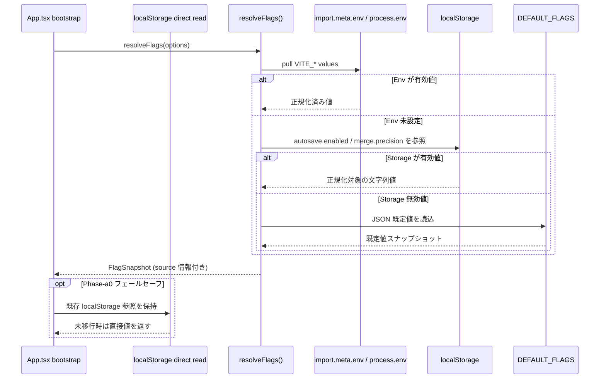
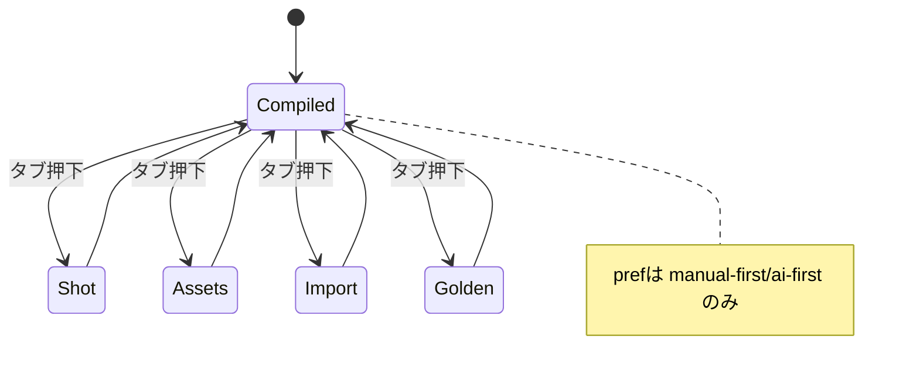
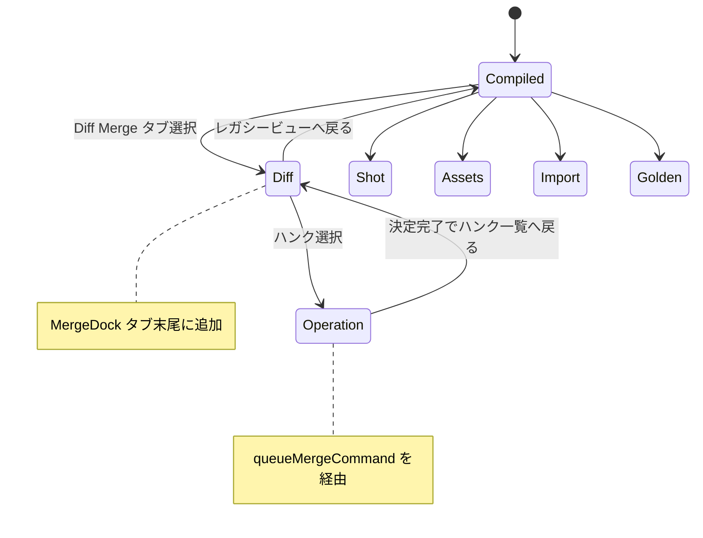
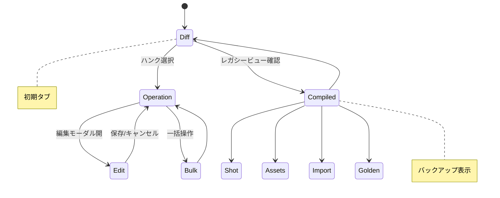
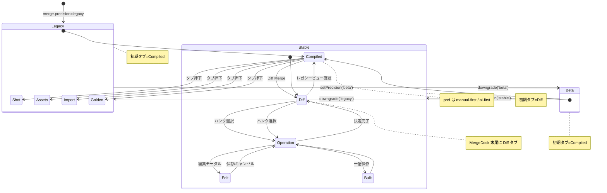
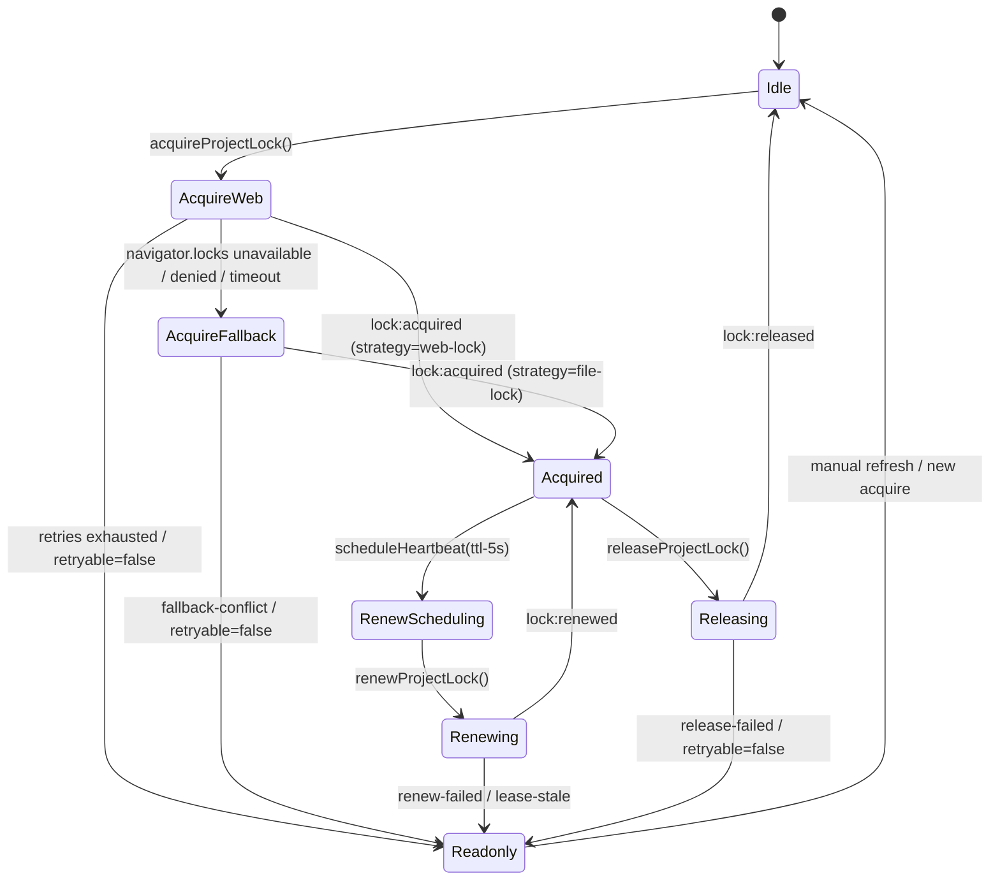
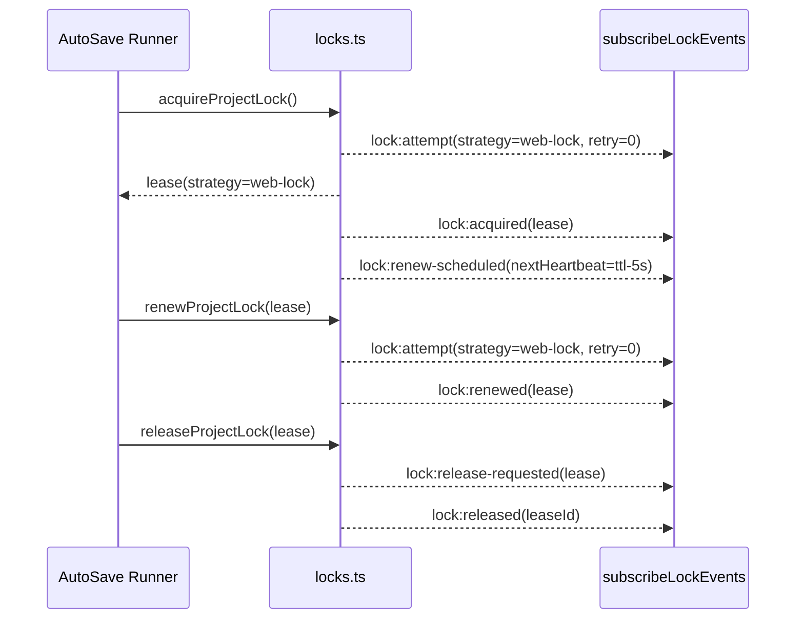
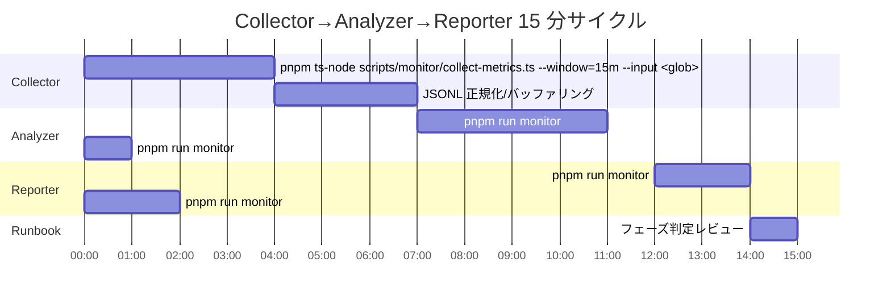

# v1.3 実装計画（AutoSave & 精緻マージ）

## 0) 方針とフラグポリシー
- 既存スキーマ（`Storyboard`/`Scene`）は**不変**。新規ファイルは OPFS に追加。
- 既存 UI の動線は維持。新規は**タブ**/小パネルとして追加。
- フラグで段階導入し、**機能別に既定値・観測指標・ロールバック条件を定義**する。

### 0.1 フラグ定義
- `autosave.enabled`
  - 既定値: Phase A まで `false`。
  - 目的: `App.tsx` の AutoSave ランナー初期化可否。
  - 切替手段: `import.meta.env.VITE_AUTOSAVE_ENABLED` → `localStorage.autosave.enabled` → `docs/CONFIG_FLAGS.md` 既定値。
- `merge.precision`
  - 既定値: Phase B 前は `legacy`（=既存マニュアル/AI 優先ロジック）。
  - 目的: `MergeDock.tsx` の Diff Merge タブ提示とマージ器の精度モード切替。
  - 切替手段: `import.meta.env.VITE_MERGE_PRECISION` → `localStorage.merge.precision` → `docs/CONFIG_FLAGS.md` 既定値。

### 0.2 設定ソースマッピング
| Consumer | Primary Source | Secondary | Fallback/備考 |
| --- | --- | --- | --- |
| `App.tsx` | `src/config/flags.ts`（新設: env→localStorage→既定値を解決） | `localStorage` 直接参照（後方互換） | `docs/CONFIG_FLAGS.md` の `autosave.enabled` を既定として AutoSave 起動判定に利用 |
| `MergeDock.tsx` | `src/config/flags.ts` から `merge.precision` を取得 | `localStorage`（既存 `dockOpen` と並列運用） | 既定 `legacy` で Diff Merge タブを隠蔽し、Phase B 以降に `beta/stable` で解放 |
| 共通 | `src/config/index.ts`（`OLLAMA_BASE` など既存値） | - | `App.tsx` では現行の `OLLAMA_BASE` 読み込みフローを保持し、副作用を隔離 |

#### 0.2.1 フラグ解決シーケンス

- `docs/CONFIG_FLAGS.md` で定義された優先順位（env → localStorage → 既定値）を `src/config/flags.ts` が忠実に再現することをレビュー観点として固定する。【F:docs/CONFIG_FLAGS.md†L57-L90】
- `FlagSnapshot.source` によって、後方互換のための `localStorage` 直接参照を段階的に排除しながらも既存 UI の動作確認が容易になる前提を保持する。
- `Phase-a0` の間は `App.tsx` 側でフェールセーフとして `localStorage` 直読を残しつつ、`FLAG_MIGRATION_PLAN` に従い `FlagSnapshot` 経由へ移行する。

#### 0.2.2 tests/config/flags.resolve.test.ts (RED) 観点
- env 優先（`VITE_AUTOSAVE_ENABLED` / `VITE_MERGE_PRECISION`）が真偽・精度ごとに正規化されること。
- env 未設定時、`localStorage` 模擬オブジェクトを介して最新のキーとレガシーキー (`flag:*`) が順に評価されること。
- `localStorage` が `null` の場合でも既定値へフォールバックし、`source='default'` となること。
- 正規化失敗（`invalid-boolean` / `invalid-precision`）時にエラーが蓄積され、次順位の値で決定されること。
- `ResolveOptions.clock` を注入した際に `updatedAt` が ISO8601 文字列で固定されること。
- `FlagSnapshot.autosave.enabled` / `merge.precision` の型安全なエイリアスが `value` と同期していること。

#### 0.2.3 `src/config/index.ts` 統合ポイントと段階的導入
1. **エクスポート整備**: `src/config/index.ts` が `resolveFlags`・`FlagSnapshot` などを透過公開している現状を維持しつつ、Phase-a0 では既存呼び出しファイルへ新関数を案内する。
2. **App.tsx 適用**: AutoSave 初期化前に `resolveFlags()` を呼び出し、`autosave.enabled` を `FlagSnapshot.autosave.enabled` から参照する。従来の `localStorage` 直読はフェールセーフとして残す（`FLAG_MIGRATION_PLAN.phase-a0`）。【F:src/config/index.ts†L1-L23】
3. **MergeDock 適用**: `merge.precision` を `FlagSnapshot.merge.precision` へ差し替え、`precision` フラグで Diff Merge タブの露出を制御する（Phase-b0）。後方互換のため `legacyStorageKeys` を監視し、削除タイミングをテレメトリで検証する。
4. **Collector 連携**: `FlagValidationError` と `FlagSnapshot.source` をテレメトリに送出し、Day8/Collector の JSONL に `flag_resolution` イベントを追加する。`docs/AUTOSAVE-DESIGN-IMPL.md` の保存ポリシーと整合すること。
5. **段階的差分**: Phase-a1 で AutoSave ランナーへ `FlagSnapshot` を渡し、Phase-b0 でレガシー参照を除去する。各段階は小粒な PR とし、既存読者が差分で追えるよう `FLAG_MIGRATION_PLAN` の exit criteria をレビュー checklist に転記する。

#### 0.2.2 Phase ガード解除時の挙動整理
Phase ガード（`autosave.enabled=false` + `AutoSaveOptions.disabled=true`）を順次解除する際は、段階ごとに UI とロック制御の既定値が変化する。切替点を明示し、ロールバック条件と一致させる。【F:docs/AUTOSAVE-DESIGN-IMPL.md†L19-L66】【F:docs/AUTOSAVE-INDICATOR-UI.md†L122-L176】

| 移行フェーズ | フラグ既定値 (`autosave.enabled`) | UI 表示の変化 | ロック/保存ポリシーの変化 | ロールバック条件 |
| --- | --- | --- | --- | --- |
| Phase A (初期) | `false` | Indicator 非表示。`snapshot().phase='disabled'` を固定 | 保存ジョブ・ロック取得とも停止 | フラグ反転後も `snapshot().phase` が `disabled` のまま 3 回継続 |
| Phase A-1 | `true` (限定ロールアウト) | Indicator 表示、`Retry` 非表示、履歴 CTA 非活性 | 保存は固定ポリシー（デバウンス500ms/アイドル2s）、ロック警告はトーストのみ | `lock:readonly-entered` が 24h 以内に連続 5 回以上発火 |
| Phase B | `true` (既定) | Retry CTA・履歴ドロップダウンを有効化 | Web Lock 優先 + `.lock` フォールバックを本番化 | `lock:warning(fallback-engaged)` が総保存数の 5% を超過 |
| Phase C | `true` + Precision `beta/stable` | Diff Merge 連動、Readonly 時の履歴 CTA を primary 強調 | ハートビート間隔の動的調整と保存ポリシー可変化 | `autosave:failure` (retryable=false) が 3 連続発生 |

##### 段階導入チェックリスト
- [ ] フラグの既定値変更に合わせて `docs/CONFIG_FLAGS.md` とリリースノートを更新したか
- [ ] ReadOnly 降格発生率を `reports/today.md` で観測し、上限を超えた場合にロールバック手順を準備したか
- [ ] `ui.autosaveIndicator.*` テレメトリの送信量を Collector SLO（±5%）内に収めるようレート制御を設定したか
- [ ] `Day8/docs/day8/design/03_architecture.md` の責務境界（Collector/Analyzer/Reporter）と矛盾する副作用を追加していないか

### 0.3 MergeDock / DiffMergeView タブ棚卸し
| コンポーネント | 露出タブ / ペイン | 補足 | 出典 |
| --- | --- | --- | --- |
| `MergeDock.tsx` | `compiled` / `shot` / `assets` / `import` / `golden` をタブボタンで制御。`pref` セレクタで `manual-first` / `ai-first` / `diff-merge` を保持し、既存書き出し・インポート・Golden Compare を同一レイアウトで提供。 | `legacy` precision 時は 5 タブ構成を維持し、`diff-merge` 選択はプレースホルダー扱い。 | 【F:src/components/MergeDock.tsx†L24-L147】 |
| `DiffMergeView.tsx`（計画） | `DiffMergeTabs`（タブヘッダ）配下に左 `HunkListPane`・右 `OperationPane`・`EditModal` などの複数ペインを配置し、ハンク操作を `queueMergeCommand` へ集約。 | MergeDock タブと同一階層に追加され、`precision` フラグで露出順を制御。 | 【F:docs/MERGE-DESIGN-IMPL.md†L140-L206】 |

#### 0.3.1 precision=`legacy` の遷移


#### 0.3.2 precision=`beta` の遷移


#### 0.3.3 precision=`stable` の遷移


#### 0.3.4 precision モード統合ステート図

- precision 切替は `merge.precision` フラグの再評価で発火し、`MergeDock` のタブ DOM を再構成する。【F:docs/design/merge/diff-merge-view.md†L26-L78】
- `stable` でのみ Diff タブが初期表示となり、`Legacy`/`Beta` は `Compiled` を初期タブとして `diff-merge` を遅延マウントする。既存 UI との整合は `docs/MERGE-DESIGN-IMPL.md` §5 のタブ制御要件と同期する。【F:docs/MERGE-DESIGN-IMPL.md†L168-L206】

## 1) 対象モジュール追加
- `src/lib/autosave.ts`（API・イベント・ローテ）
- `src/lib/locks.ts`（Web Locks + フォールバック）
- `src/lib/merge.ts`（3-way・スコア・決定化）
- `src/components/AutoSaveIndicator.tsx`（UI/履歴）
- `src/components/DiffMergeView.tsx`（衝突解消UI）
- 既存更新: `MergeDock.tsx`（Diff Mergeタブ追加）, `App.tsx`（AutoSave起動）

> 保存ポリシーと各モジュールの責務は [docs/AUTOSAVE-DESIGN-IMPL.md](./AUTOSAVE-DESIGN-IMPL.md) §1.1 のマッピング表と同期すること。

### ロックモジュール要件整理
- **Web Lock 取得を優先**: `navigator.locks.request('imgponic:project', { mode: 'exclusive' })` を基本とし、TTL はブラウザ依存のためリース更新 API を内製する（`docs/AUTOSAVE-DESIGN-IMPL.md` §3.1）。
- **フォールバックの責務**: Web Lock が利用不可または衝突検出時は `project/.lock` を用いて UUID・`mtime`・TTL(30s) を同期する（同 §3.3）。
- **失敗時の挙動**: ロック取得が最終的に失敗した場合は閲覧専用モードへ移行し、UI へ警告イベントを伝播する（同 §3.4）。
- **Collector/Analyzer との干渉防止**: Lock ファイルは `project/` 配下に限定し、`workflow-cookbook/` や `logs/` など Day8 系アーティファクトには触れない（`docs/day8/design/03_architecture.md`）。

#### 1.1 ロック API 状態遷移図


#### 1.2 API イベントマトリクス
| API | 呼び出し起点 | 主状態 | 発火イベント | 備考 |
| --- | --- | --- | --- | --- |
| `acquireProjectLock` | AutoSave 初期化・CLI | `Idle → AcquireWeb/AcquireFallback → Acquired` | `lock:attempt` → `lock:waiting`* → `lock:acquired` / `lock:error` / `lock:readonly-entered` | `lock:waiting` は再試行が残る場合のみ。フォールバック有効化時に `lock:warning(fallback-engaged)` を 1 度送出。 |
| `renewProjectLock` | ハートビートタイマー | `Acquired/RenewScheduling → Renewing → Acquired` | `lock:attempt` → `lock:renew-scheduled` → `lock:renewed` / `lock:error` / `lock:readonly-entered` | `.lock` モード時は `expiresAt` を `now + ttlMillis` へ上書きし、遅延時は `lock:warning(heartbeat-delayed)` を通知。 |
| `releaseProjectLock` | AutoSave 終了・手動保存 | `Acquired → Releasing → Idle` | `lock:release-requested` → `lock:released` / `lock:error` / `lock:readonly-entered` | 冪等性確保のため Web Lock と `.lock` を順に解放し、失敗が残っても readonly 降格で UI へ共有。 |
| `withProjectLock` | CLI / バッチ | `Idle` から各状態 | Acquire/Renew/Release のイベントを合成 | `renewIntervalMs` 未指定時は `ttlMillis-5000` を採用し、`onReadonly` コールバックで UI 通知。 |
| `subscribeLockEvents` | UI / Telemetry | - | 任意の `lock:*` イベント | `Set` ベースの購読管理。解除後はイベント配送を停止。 |

##### 1.2.1 AutoSaveIndicator イベント購読一覧
`AutoSaveIndicator` は AutoSave ランナーとロックモジュールの双方から状態を受け取り、`snapshot()` だけでは補足できない状態（再試行回数・ReadOnly 遷移など）を描画へ反映する。Phase A ガード下でも下記イベントを購読することで UI とテレメトリの一貫性を担保する。【F:docs/AUTOSAVE-DESIGN-IMPL.md†L27-L87】【F:docs/AUTOSAVE-INDICATOR-UI.md†L79-L176】

| 種別 | イベント | 主なトリガー | AutoSaveIndicator の利用目的 |
| --- | --- | --- | --- |
| AutoSave Runner | `autosave:progress` | `debouncing`→`awaiting-lock` などフェーズ遷移時 | スピナー表示・`aria-busy` 切替、次フェーズ候補のハイライト更新 |
| AutoSave Runner | `autosave:success` | 保存完了 (`phase='idle'`) | 「最新状態」ラベル更新、履歴アクセスを `available` へ復帰しテレメトリ `phaseChanged` を発火 |
| AutoSave Runner | `autosave:failure` | 再試行可否を伴う失敗 (`retryable` 含む) | バナー/トーストの分岐、`Retry` CTA の表示可否制御、`errorShown` テレメトリ送信 |
| ロック | `lock:attempt` / `lock:waiting` | ロック取得開始・バックオフ | ReadOnly への降格前兆として `Retry` ボタンを抑止し、状態テキストを「ロック取得中」へ更新 |
| ロック | `lock:acquired` / `lock:renewed` | ロック獲得・ハートビート更新 | ReadOnly 解除後の復帰表示、およびリトライ回数リセット |
| ロック | `lock:warning(*)` | フォールバック有効化・ハートビート遅延 | バナーの警告表示と Collector テレメトリ `ui.autosaveIndicator.warningShown`（後続拡張）への橋渡し |
| ロック | `lock:readonly-entered` | 衝突・リース期限切れ | 閲覧専用バナーの描画、履歴操作の `disabled` 化、ReadOnly テレメトリ発火 |
| ロック | `lock:released` | dispose や flush による解放完了 | Phase A の再初期化シグナルとして `snapshot()` 再取得を促し、ステータス行をリセット |

#### 1.3 イベントタイムライン（参考）


#### 1.4 フォールバック `.lock` と Day8 干渉防止
| 観点 | Day8 制約 | `.lock` 運用ポリシー | 監視/ロールバック |
| --- | --- | --- | --- |
| Collector | `collector/` / `workflow-cookbook/` の JSONL を 4 分で収集。【F:Day8/docs/day8/design/03_architecture.md†L5-L16】 | `.lock` は `project/` 直下のみ。Collector の巡回リストから除外し、`.lock` に JSONL を混在させない。 | `autosave.lock.readonly` イベントを Day8 Telemetry に送出し、Collector 集計値と突合。 |
| Analyzer | 4 分算出→1 分判定で `rollback_required` を決定。【F:Day8/docs/day8/design/03_architecture.md†L17-L31】 | Analyzer は `.lock` を参照しない前提で、AutoSave からの通知は `autosave.lock.*` メトリクス経由に限定。 | Analyzer が `.lock` を参照した形跡があれば lint/レビューで是正し、`readonly` 発生率が 5% 超でロールバック検討。 |
| Reporter | 4 分整形→承認フロー。【F:Day8/docs/day8/design/03_architecture.md†L31-L36】 | Reporter への通知は `autosave.lock.readonly` の集計結果のみ。ファイル削除失敗時も `.lock` を移動しない。 | Reporter が `.lock` 異常を検知した際は Runbook 手順 4（フォールバック無効化）でロールバック。 |

#### `src/lib/locks.ts` 公開 API と想定利用者
| API | 役割 | 想定利用者 |
| --- | --- | --- |
| `acquireProjectLock(opts?: AcquireLockOptions): Promise<ProjectLockLease>` | Web Lock 取得 → フォールバック取得までをラップ。リース UUID・期限を返す。 | AutoSave 初期化、将来のバッチ系ジョブ（例: 精緻マージの事前計算） |
| `renewProjectLock(lease: ProjectLockLease): Promise<ProjectLockLease>` | TTL 満了前に Web Lock もしくはフォールバックの `mtime` を更新。 | AutoSave の心拍タイマー、長時間実行する編集系機能 |
| `releaseProjectLock(lease: ProjectLockLease): Promise<void>` | Web Lock 解放とフォールバックファイル削除を保証。 | AutoSave 終了、手動保存完了フック |
| `withProjectLock<T>(fn: (lease: ProjectLockLease) => Promise<T>, opts?: AcquireLockOptions): Promise<T>` | 取得→処理→解放のオーケストレーションを簡略化。 | CLI 連携や将来のエクスポート機能 |
| `subscribeLockEvents(listener: (event: ProjectLockEvent) => void): () => void` | ロック状態変化（取得成功/競合/再試行失敗）を UI・テレメトリへ通知。 | AutoSaveIndicator、後続の監査ログ収集 |

> **備考**: API のオプション型・イベント型は `strict`/`mypy` 相当の型安全を維持し、再試行可否を識別するフラグを含める。

## 2) ロールアウトと運用統制

### 2.1 フェーズ基準と運用フロー

- フェーズ管理対象とモニタリングのみの項目は [docs/design/rollout/autosave-merge-phases.md](./design/rollout/autosave-merge-phases.md) のテンプレート（メタデータ／Scope）を唯一の参照元とし、Day8 アーキテクチャの Collector / Analyzer / Reporter による責務分掌を同期させる。【F:docs/design/rollout/autosave-merge-phases.md†L1-L86】【F:Day8/docs/day8/design/03_architecture.md†L1-L36】
- 15 分 ETL の中で Collector が **4 分収集→3 分正規化**、Analyzer が **4 分算出→1 分判定**、Reporter が **4 分整形・承認** を担当し、`scripts/monitor/collect-metrics.ts` が Day8 Collector のエントリポイントとして `rollback_required` 判定材料を整形する（§2.1.3 参照）。
- レビュー観点は (1) フェーズ別 SLO とロールバック条件、(2) Collector→Analyzer→Reporter の判断フロー、(3) ETL 15 分制約内の責務と通知経路の整合性の 3 点に整理し、テンプレートのメタデータに記載した Slack/PagerDuty 経路と乖離がないかを確認する。【F:docs/design/rollout/autosave-merge-phases.md†L11-L40】

#### 2.1.1 フェーズゲート一覧（Collector / Analyzer / Reporter 整合）
| フェーズ | 既定フラグ (`autosave.enabled` / `merge.precision`) | Collector（`scripts/monitor/collect-metrics.ts`） | Analyzer 判定（`governance/policy.yaml`） | Reporter 通知 / ロールバック |
| --- | --- | --- | --- | --- |
| Phase A-0 (準備) | `false` / `legacy` | JSONL 整合性・`autosave_p95` ベースラインを 15 分窓で確保 | 自動判定なし。レビュー議事録で手動確認 | Slack `#launch-autosave` メモ共有。ロールバック適用外 |
| Phase A-1 (QA Canary) | `true` (QA のみ) / `legacy` | `autosave_p95`, `restore_success_rate` を `observed_only=false` で収集 | `autosave_p95` ≤ 2500ms **かつ** `restore_success_rate` ≥ 0.995 を 2 バッチ連続で満たす【F:governance/policy.yaml†L4-L14】 | Slack `#launch-autosave` 警告、重大時 PagerDuty *Autosave & Precision Merge*。ロールバック: `pnpm run flags:rollback --phase A-0` |
| Phase A-2 (β導入) | `true` / `legacy` | `restore_success_rate`, `autosave_incident_rate` を Canary + β対象で収集 | `restore_success_rate` ≥ 0.995 維持、クラッシュ率 Δ≤+5% | Slack `#launch-autosave` + PagerDuty (P2)。ロールバック: `pnpm run flags:rollback --phase A-1` |
| Phase B-0 (Merge β) | `true` / `beta` | `merge_auto_success_rate`, `merge_conflict_rate` を 15 分窓で算出 | `merge_auto_success_rate` ≥ 0.80（連続 3 バッチで監視）【F:governance/policy.yaml†L8-L9】 | Slack `#merge-ops` 警告 + PagerDuty *Merge Duty*（critical）。ロールバック: `pnpm run flags:rollback --phase A-2` |
| Phase B-1 (GA) | `true` / `stable` | AutoSave / Merge 指標全件、`rollback_required` フラグ履歴 | AutoSave / Merge SLO を 5 日連続達成、重大事故 0 件【F:governance/policy.yaml†L15-L27】 | PagerDuty Incident-001（P1） + Slack `#incident`。ロールバック: `pnpm run flags:rollback --phase B-0` |

#### 2.1.2 運用フロー（監視→通知→ロールバック）
```mermaid
flowchart TD
    Start[フェーズ開始
    (flags push)] --> Collect[Collector
    (JSONL 15m 集約)]
    Collect --> Analyze[Analyzer
    (SLO 判定)]
    Analyze --> Reporter[Reporter
    (Slack/PagerDuty 整形)]
    Reporter --> Gate{フェーズ基準充足?}
    Gate -- はい --> Continue[次フェーズ準備]
    Gate -- いいえ --> Breach{重大閾値?}
    Breach -- いいえ --> Warn[Slack #launch-autosave
    通知 + 再測定 2h]
    Breach -- はい --> Rollback[pnpm run flags:rollback --phase <prev>
    (`policy.yaml` 参照)]
    Rollback --> PagerDuty[PagerDuty Incident-001
    (P1/P2 切替)]
    PagerDuty --> Slack[Slack #incident / #merge-ops
    テンプレ共有]
    Slack --> RCA[reports/rca/
    RCA 作成]
    Warn --> Collect
    Continue --> End[5 日連続グリーンで GA]
```

- Collector は `collect-metrics.ts` で JSONL を 15 分毎に出力し、Analyzer が SLO 判定 (`autosave_p95` / `restore_success_rate` / `merge_auto_success_rate`) を実施、Reporter が Slack/PagerDuty をトリガーする。判定結果は `rollback_required` フラグで一貫させる。【F:scripts/monitor/collect-metrics.ts†L1-L89】【F:Day8/docs/day8/design/03_architecture.md†L1-L36】
- Slack/PagerDuty 通知経路はフェーズ別に上表へ明記し、重大ロールバック時は PagerDuty Incident-001 と Slack `#incident`/`#merge-ops` に同報する。テンプレートは `templates/alerts/rollback.md` を利用し、`governance/policy.yaml` の `rollback.command` をログへ添付する。【F:governance/policy.yaml†L18-L24】【F:templates/alerts/rollback.md†L1-L23】
- ロールバック実行後は Phase を 1 段階戻し、Canary から再開する。RCA は 1 営業日以内に `reports/rca/` へ格納する。

#### 2.1.3 15 分 ETL タイムライン（Collector CLI 連携）

- Collector タスクは 0-7 分で JSONL を整形し、Analyzer は 7-12 分で SLO 判定・通知種別を決定、Reporter は 12-15 分でテンプレ適用とガバナンス報告を完了する。各担当が時間枠を厳守し、サイクル超過時は Analyzer が遅延イベントを Reporter へ通知する。
- `scripts/monitor/collect-metrics.ts` は `window=15m` を既定値とし、上図のコマンド列で Analyzer/Reporter へ渡す入出力（`autosave_p95` / `restore_success_rate` / `merge_auto_success_rate`）を保証する。【F:scripts/monitor/collect-metrics.ts†L1-L240】
- 各レイヤの SLO 指標とロールバック条件は下表の通りで、Reporter は `rollback_required=true` 時にテンプレート `templates/alerts/rollback.md` を展開する。【F:templates/alerts/rollback.md†L1-L23】

| レイヤ | 主コマンド | I/O | SLO 指標・閾値 | ロールバック条件 |
| --- | --- | --- | --- | --- |
| Collector | `pnpm ts-node scripts/monitor/collect-metrics.ts --window=15m` | 入力: `reports/canary/phase-*.jsonl`<br>出力: `reports/monitoring/<timestamp>.jsonl` | `autosave_p95`、`restore_success_rate`、`merge_auto_success_rate` を 15 分窓で正規化 | 入力欠損やパース失敗で `retryable=false` を返した場合は Phase を据え置き、次サイクルで再収集 |
| Analyzer | `pnpm run monitor:analyze` / `monitor:score` | 入力: Collector 出力 JSONL<br>出力: `monitor:score` メトリクスサマリ | `governance/policy.yaml` のフェーズ別 SLO（例: `autosave_p95` ≤ 2500ms）【F:governance/policy.yaml†L4-L27】 | `breach=true` かつ `rollbackTo` 指定ありで Reporter へ `rollback_required=true` を送信 |
| Reporter | `pnpm run monitor:report` / `monitor:notify` | 入力: Analyzer 判定 JSON<br>出力: Slack/PagerDuty 通知、`reports/alerts/<timestamp>.md` | 通知テンプレ整形と Incident-001 連携 | `rollback_required=true` で `pnpm run flags:rollback --phase <prev>` を実行し、結果ログをテンプレへ添付 |

- Runbook 手順（§2.2）は本サイクルの `d1` を基準に 15 分毎のレビューとロールバック判断を行う。

#### 2.1.4 Analyzer / Reporter I/O 契約
- **Input (Collector → Analyzer)**: `reports/monitoring/<timestamp>.jsonl` に書き出された JSONL。各レコードは `scripts/monitor/collect-metrics.ts` の `MetricsInputRecord` 仕様に従い、`autosave_p95` / `restore_success_rate` / `merge_auto_success_rate` を 15 分窓で提供する。
- **Output (Analyzer → Reporter)**: `monitor:score` が出力するメトリクスサマリ（`phase`, `metric`, `value`, `threshold`, `breach`）。Reporter はこれを受けて Slack/PagerDuty 通知テンプレート `templates/alerts/rollback.md` を展開し、`reports/alerts/<timestamp>.md` に保存する。
- **flags rollback コマンド**: Analyzer で `breach=true` かつ `PhaseGateCriterion.rollbackTo` が存在する場合、Reporter が `pnpm run flags:rollback --phase <prev>` を実行し、結果を通知本文に添付する。Incident-001 ワークフローと整合させ、PagerDuty へは `Incident-001` サービスを指定する。
- **通知エスカレーション**: `notify=auto` 時は `policy.yaml` の guardrail 毎の `notifyChannels` を使用し、Slack → PagerDuty の順で 1 サイクル以内に評価する。`notify=force` は全チャネルを即時通知、`notify=suppress` は通知ログを生成せずダッシュボード更新のみ行う。

#### 2.1.5 `tests` / `scripts` 向け TDD ケース（`collect-metrics.ts` 連携）
1. **メトリクス算出ユニットテスト** (`tests/monitoring/collector.metrics.test.ts`): フィクスチャ `tests/monitoring/fixtures/collector/base.jsonl` を入力し、`calculateWindowMetrics(window=15m)` が `autosave_p95` / `restore_success_rate` / `merge_auto_success_rate` を正規化することを検証する。閾値に近い値を用意し、境界条件を RED → GREEN の順で TDD する。
2. **通知テンプレ選択テスト** (`tests/monitoring/collector.notifications.test.ts`): `--simulate-breach` オプションで各ガードレールを強制し、Reporter へ送付する `AlertPayload` が `templates/alerts/rollback.md` のセクション（Slack/PagerDuty/RCA）を揃えることをモックで確認する。
3. **ロールバックコマンド発火テスト** (`tests/monitoring/collector.rollback.test.ts`): Analyzer モックが `rollback_required=true` を返すケースを用意し、Reporter が `pnpm run flags:rollback --phase <prev>` を実行するフローをスパイで検証する。エラー時は `retryable=true` の場合に 2 回まで指数バックオフ（15s, 45s）で再試行し、`retryable=false` は即時 PagerDuty エスカレーションとする。
4. **再試行・エスカレーションシナリオ** (`tests/monitoring/collector.retry.test.ts`): Collector の出力失敗 (`EPIPE`) をシミュレートし、`retryable=true` で 3 回（15s 間隔）再試行後に Analyzer へ `degraded` ステータスを通知する経路を TDD する。再試行尽きた場合は Reporter が Slack `#telemetry` に警告し、連続 2 サイクル失敗時は PagerDuty AutoSave を P2 で起動する。
5. **エンドツーエンド契約テスト** (`tests/monitoring/collector.e2e.test.ts`): `pnpm ts-node scripts/monitor/collect-metrics.ts --window=15m --input tests/monitoring/fixtures/collector/breach.jsonl --dry-run` を node:test から起動し、Collector → Analyzer → Reporter のハンドオフ JSON が Day8 アーキテクチャの順序と整合することを確認する。

#### 2.1.6 インシデント対応チェックリスト（Collector / Analyzer / Reporter）
- `scripts/monitor/collect-metrics.ts` で `retryable=false` を検出したら即座に Slack `#launch-autosave` または `#merge-ops` へ警告し、次サイクルの再収集時間を記録する。【F:docs/design/rollout/autosave-merge-phases.md†L31-L56】
- Analyzer の `monitor:score` が `rollback_required=true` を返した場合、Reporter は `templates/alerts/rollback.md` を展開し `pnpm run flags:rollback --phase <prev>` を実行してログを `reports/alerts/<timestamp>.md` に保存する。【F:templates/alerts/rollback.md†L1-L23】
- PagerDuty Incident-001 起動後 1 サイクル以内に `reports/rca/<phase>-<timestamp>.md` のドラフトを作成し、Slack `#incident` に共有する。
- フェーズ再開時は [docs/design/rollout/autosave-merge-phases.md](./design/rollout/autosave-merge-phases.md) の Scope に基づき対象フラグのみを再有効化し、`governance/policy.yaml` の guardrail と照合した記録を Runbook に追記する。【F:docs/design/rollout/autosave-merge-phases.md†L17-L40】【F:governance/policy.yaml†L4-L27】

### 2.2 ロールアウト Runbook（Incident-001 整合）
1. **Collector 確認 (00:00-04:00)**: `pnpm ts-node scripts/monitor/collect-metrics.ts --window=15m` の完了と JSONL 正常性（スキーマ/欠損値）を確認し、異常時は再収集。
2. **Analyzer 判定 (07:00-12:00)**: `pnpm run monitor:analyze` → `monitor:score` 実行ログをレビュー。`breach` 発生時は対象メトリクス・閾値・`rollbackTo` を Runbook に記録。
3. **Reporter 通知 (12:00-14:00)**: Slack 通知はフェーズ別チャンネル（Phase A: `#launch-autosave`、Phase B: `#merge-ops`）へ送信。重大 (`pagerduty`) 通知は Incident-001 サービスへ発砲し、オンコールを起動。
4. **ロールバック (14:00-15:00)**: Guardrail が `rollbackTo` を示す場合は `pnpm run flags:rollback --phase <prev>` を実行し、結果ログを `reports/alerts/<timestamp>.md` に追記。コマンド失敗時は PagerDuty へ `escalation_level=critical` で手動通報。
5. **RCA 着手 (15:00)**: ロールバック後 1 サイクル以内に RCA ドラフト (`reports/rca/<phase>-<timestamp>.md`) を作成し、Slack `#incident` へ共有。5 営業日以内にレビューを完了させる。

### 2.3 監視ダッシュボード要件
- **レイアウト**: 3 パネル（AutoSave、Restore、Merge）。各パネルに 24 時間のスパークライン、15 分ウィンドウの現在値、SLO 閾値線を表示。Phase 遷移時は縦線で注記。
- **フィルタ**: `phase`・`tenant`（Enterprise/Indie）・`client_version` を指定可能とし、Collector JSONL のメタデータをそのまま利用する。
- **通知ログ連携**: `reports/alerts/` ディレクトリから通知イベントを取り込み、Slack/PagerDuty 発砲履歴をツールチップ表示。Incident-001 起動時は赤色バッジで強調。
- **Runbook 連携**: ダッシュボード上から `docs/IMPLEMENTATION-PLAN.md#22-ロールアウト-runbookincident-001-整合` へのリンクを提供し、当該フェーズのフローへ即時アクセスできるようにする。

### 2.2 Canary / ローカル切替 Runbook
1. **Flag 既定値確認**: `docs/CONFIG_FLAGS.md` を最新に反映させ、QA 用 `.env.qa` に `VITE_AUTOSAVE_ENABLED=true`, `VITE_MERGE_PRECISION=beta` を記載。
2. **Canary 対象登録**: `ops/canary/phase-A1.csv`（スプレッドシート連携）へ QA アカウントを追記し、Slack `#launch-autosave` に通知。
3. **配布コマンド**: QA/開発は `pnpm run flags:pull` → `pnpm run flags:push --env qa` で `localStorage` を同期。ローカル確認用: `pnpm run flags:set autosave.enabled true`。
4. **観測**: Canary 期間中は `scripts/monitor/collect-metrics.ts --window=15m --input reports/canary/phase-A1/*.jsonl` を 15 分サイクル（§2.1.3）で実行し、Collector → Analyzer → Reporter の順にストリーミング投入する。
5. **判定**: Analyzer が出力する `autosave_p95` / `restore_success_rate` / `merge_auto_success_rate` の 2 バッチ連続グリーンを QA リードが確認し、`RUNBOOK.md` の承認欄へサイン。判定結果は Slack `#launch-autosave` に共有し、Reporter のテンプレ展開ログ（`reports/alerts/`）を添付。
6. **ロールバック即応**: 閾値逸脱検知時は `governance/policy.yaml` の `rollback.command`（`pnpm run flags:rollback --phase <prev>`）を実行し、Slack 通知テンプレート `templates/alerts/rollback.md` を `#launch-autosave` に投稿。PagerDuty Incident-001 をトリガーして on-call を招集し、再開は Phase A-1 からリトライ。【F:governance/policy.yaml†L18-L24】

#### ローカル切替手順書（I/O Contract）
```bash
# 1) 現状確認
pnpm run flags:status

# 2) AutoSave を個別検証する場合
pnpm run flags:set autosave.enabled true

# 3) 精緻マージ β を検証する場合
pnpm run flags:set merge.precision beta

# 4) 既定値へ戻す
pnpm run flags:reset
```

### 2.3 インシデント対応・ダッシュボード承認表

| ステップ | チェック内容 | PagerDuty/Slack 連携 | RCA 保存 | レビュー承認条件 |
| --- | --- | --- | --- | --- |
| 1. アラート受付 | `collect-metrics.ts` → Analyzer で `breach=true` を検知し、`rollback_required` を評価する。 | Slack `#launch-autosave` or `#merge-ops` へ自動投稿。重大時 PagerDuty Incident-001 (P1/P2)。 | - | 値の再計算ログを `reports/monitoring/` に添付できている。 |
| 2. フェーズ判定 | `docs/design/rollout/autosave-merge-phases.md` の対象フェーズ確認とロールバック要否の判断。 | Slack スレッドで `@oncall` メンション。 | - | Phase 判定コメントが Runbook に追記され、Reviewer が確認済み。 |
| 3. ロールバック実行 | `pnpm run flags:rollback --phase <prev>` を Reporter が実行し、成功/失敗ログを共有。 | PagerDuty Incident-001 に指令ログを残し、Slack へ結果を転送。失敗時は 2 回リトライ後 Escalation。 | `reports/alerts/<timestamp>.md` にコマンドログ保存。 | Reviewer がコマンド結果と次回測定時間を確認。 |
| 4. RCA 着手 | 1 サイクル以内に RCA ドラフト (`reports/rca/<phase>-<timestamp>.md`) を生成。 | Slack `#incident` に RCA 雛形リンクを共有。 | yes（RCA ファイル作成） | 承認者が RCA の責任者・期限をコメントで明示。 |
| 5. クローズ判定 | SLO 緑化 2 サイクル連続を確認し、PagerDuty インシデントを解消。 | Slack `#incident` でクローズ通知、PagerDuty で Resolved。 | RCA 最終版を `reports/rca/` にリンク。 | Reviewer がダッシュボード更新と RCA 承認を確認し、チェックリストに署名。 |

| ダッシュボードビュー | 必須指標 | データソース | PagerDuty 表示 | レビュー承認条件 |
| --- | --- | --- | --- | --- |
| AutoSave パネル | `autosave_p95`, `autosave_error_count`, フェーズ注記 | `reports/monitoring/*.jsonl` | Incident-001 発報時に赤バッジ表示 | Reviewer が SLO 線と実測値を照合し承認サインを残す。 |
| Restore パネル | `restore_success_rate`, `rollback_required` フラグ履歴 | Collector JSONL (`feature=autosave`) | PagerDuty チケット ID をツールチップ表示 | Incident 対応ログ（`reports/alerts/*.md`）と一致すること。 |
| Merge パネル | `merge_auto_success_rate`, `merge_conflict_rate` | Analyzer 出力 (`monitor:score`) | `#merge-ops` 通知リンク | Reviewer が Phase B 判定メモと一致を確認。 |
| SLA/SLO 集計 | Phase 別 SLO 達成率、`retryable` 失敗件数 | `monitor:score` 結果、`reports/rca/` メタ | PagerDuty Escalation Level を履歴表示 | ガバナンス会議で承認済み（議事録リンク添付）。 |

### 2.4 ロールバック意思決定ツリー（Runbook 抜粋）
```
監視アラート発報?
 └─いいえ → 継続モニタリング
 └─はい
     ├─SLO 違反検知? → はい
     │   ├─24h 内に復旧可能な対処案あり? → いいえ → `flags:rollback --phase <prev>` 実行
     │   │                                               └─ロールバック後 QA 再確認 → Phase 再開
     │   └─はい → 対処案実行 + 2h 以内に再測定
     └─QA 欠落/未承認? → はい → リリース凍結＋QA 補完
         └─いいえ → インシデント対応プロトコル（Incident-001）
```

ロールバック後は 1 営業日以内に根本原因分析（RCA）を `reports/rca/` へ格納し、Phase 再開時は Canary（QA のみ）からやり直す。

### 2.5 フェーズ別チェックリスト更新案
- Phase A（Canary）
  - [ ] `collect-metrics.ts` の `--simulate-latency` オプションで遅延を注入し、Slack 警告テンプレートの投稿を検証。
  - [ ] `reports/canary/phase-A*/` に Analyzer へ投入した JSONL を 48h 分保持し、`autosave_p95` の推移をレビュー。
- Phase B（精緻マージ β/GA）
  - [ ] `merge_auto_success_rate` が 3 バッチ連続で 80% を下回った際、PagerDuty Incident-001 が発火することをモック通知で確認し、Slack `#merge-ops` と Incident タイムラインを比較する。
  - [ ] `templates/alerts/rollback.md` の PagerDuty セクションに `pnpm run flags:rollback --phase <prev>` の実行ログリンクと `reports/rca/` プレースホルダーを添付。

### 2.6 テレメトリ検証テスト計画（シミュレーション）
1. **Collector 入力シミュレーション**: `tests/monitoring/fixtures/metrics.phase-a.jsonl` を `scripts/monitor/collect-metrics.ts --window=15m --input tests/monitoring/fixtures/metrics.phase-a.jsonl --dry-run` で読み込み、Analyzer への送出スキーマ（`autosave_p95`, `restore_success_rate`, `merge_auto_success_rate`）が `governance/policy.yaml` の閾値と一致するか確認。
2. **閾値越え試験**: `--simulate-breach autosave_p95=3200` を付与して Slack 警告が `#launch-autosave` に、`--simulate-breach merge_auto_success_rate=0.75` で PagerDuty が起動することをモックで検証。通知本文は `templates/alerts/rollback.md` の構成と一致させる。
3. **ロールバック演習**: Phase B-0 中に `--simulate-breach restore_success_rate=0.98` を実行し、テンプレートに沿って `pnpm run flags:rollback --phase A-2` と RCA 作成フローを 15 分以内（§2.1.3 タイムライン 1 サイクル）で完了できるかタイムボックス。
4. **再開確認**: ロールバック後に `collect-metrics.ts --window=15m --input reports/canary/phase-A1/*.jsonl --notify=suppress` を実行し、Collector が `phase=A-1` の JSONL のみを取り扱うことを確認。Reporter 出力に `rollback.command` 記載が残ることをチェック。

## 3) 工数（概算）
- AutoSave 実装 1.5–2.0 人日 + UI 0.5
- マージエンジン 2.0 人日 + UI 1.0 + ログ統合 0.5
- 試験（両機能） 1.0
**合計: 6.5〜7.0 人日/1名**

## 4) 受入基準（要約）
- AutoSave: 入力停止 ≤2.5s で保存。強制終了→起動で ≤5s 前の復元。
- マージ: ラベル付きケースで自動マージ率 ≥80%、再実行で決定的。

## 5) ロック運用チェックリスト
- [ ] `project/.lock` 以外に Day8 の Collector/Analyzer が参照する `workflow-cookbook/` 以下のパスを作成しない（`docs/day8/design/03_architecture.md`）。
- [ ] Lock 関連ログは `reports/`・`logs/` ではなく `project/autosave/` に限定し、Collector の JSONL 収集に影響させない（`docs/Architecture_ASCII.md`）。
- [ ] AutoSave UI から送出するイベント名は Day8 既存のメトリクス命名（`docs/day8/spec/01_requirements.md` の Observation Channel）と衝突しないプレフィックス（例: `autosave.lock.*`）を採用する。
- [ ] 強制解放や TTL 満了によるロック解放時は Analyzer が期待する `reports/` 配下の生成物を変更しないことを確認する。
## 5) 回帰試験計画（TDD チェックリスト）
- [ ] フラグ OFF (`autosave.enabled=false`) で既存保存ショートカット/手動保存が回帰しない（`App.tsx` キーバインド、OPFS 保存 2 種）。
- [ ] フラグ ON で AutoSave ワーカーが起動し、アイドル 2s 後に OPFS へ書き込みが行われるユニットテスト。
- [ ] フラグ OFF (`merge.precision=legacy`) で MergeDock のタブ構造（Compiled/Shot/Assets/Import/Golden）が不変。
- [ ] フラグ ON (`merge.precision=beta|stable`) で Diff Merge タブが追加され、手動/AI 優先セレクタとの後方互換テストを通過。
- [ ] CLI/JSON エクスポート（`downloadText`, `buildPackage`）がフラグ状態にかかわらずバイナリ互換であることをスナップショットテストで検証。
- [ ] `Collector` へのテレメトリ送信がフラグ ON/OFF 双方で同一スキーマ（JSONL）を維持する統合テスト。

> 詳細な観点とモック定義: [tests/autosave/TEST_PLAN.md](../tests/autosave/TEST_PLAN.md) ／ [tests/merge/TEST_PLAN.md](../tests/merge/TEST_PLAN.md) ／ [tests/cli/TEST_PLAN.md](../tests/cli/TEST_PLAN.md)

## 6) Telemetry / ログ監視とエラー通知

### 6.1 イベントスキーマ（AutoSave / 精緻マージ）
| イベント名 | 発火タイミング | 必須フィールド | 任意フィールド | 例外ポリシー連動 |
| --- | --- | --- | --- | --- |
| `autosave.schedule.requested` | デバウンス完了後、ロック取得前 | `ts`, `build_sha`, `phase`, `pending_bytes`, `retry_count` | `flag_source` (`env`/`localStorage`/`default`) | `disabled` 例外時は送信しない（`AutoSaveError.code='disabled'` は静的ガード）【F:docs/AUTOSAVE-DESIGN-IMPL.md†L89-L147】 |
| `autosave.write.completed` | `current.json` と `index.json` の更新成功時 | `ts`, `duration_ms`, `bytes_written`, `history_size`, `lease_uuid` | `gc_evicted`（削除数） | `write-failed` 例外発生時は代わりに `autosave.write.failed` を送信し `retryable` 値を boolean で付与 |
| `autosave.write.failed` | 書き込み失敗検知時 | `ts`, `duration_ms`, `error_code`, `retryable`, `cause`（シリアライズされたクラス名） | `context`（容量超過・権限情報） | `retryable=false` なら Analyzer で重大度 High にマッピング |
| `merge.precision.suggested` | 精緻マージ結果が提示された時 | `ts`, `build_sha`, `phase`, `scenario_id`, `auto_applied` | `confidence_score`, `conflict_count` | `auto_applied=false` かつ `retryable=false` の例外時は `merge.precision.blocked` を併送 |
| `merge.precision.blocked` | 精緻マージが停止した時 | `ts`, `error_code`, `retryable`, `conflict_count` | `cause`, `ui_surface` | `retryable=true` の場合は Collector 側で再開アラートを抑制 |

- `phase` は §2.1 のフェーズ名（`A-0` / `A-1` ...）を記録し、SLO 違反の再現性を向上させる。
- `lease_uuid` は `src/lib/locks.ts` のロック ID と一致させ、Collector で二重書き込みを集計可能にする。

### 6.2 Collector / Analyzer 連携
- Collector は `project/autosave/telemetry/*.jsonl` を 15 分周期で集約し、Day8 `workflow-cookbook/logs/autosave/*.jsonl` へ転送する。既存パイプライン（Collector → Analyzer → Reporter）に組み込み、Day8 設計書の責務分離を遵守する。【F:Day8/docs/day8/design/03_architecture.md†L1-L31】
- Analyzer では下記派生メトリクスを計算し、Phase ゲート判定に用いる。
  - `autosave_p95`: `autosave.write.completed.duration_ms` の P95。
  - `restore_success_rate`: `autosave.write.completed` 件数に対する `restore` 成功イベント（`src/lib/autosave.ts` 既存ログ）比。
  - `merge_auto_success_rate`: `merge.precision.suggested` のうち `auto_applied=true` の比率。
- Reporter は上記メトリクスを `reports/monitoring/autosave-merge.md` へ出力し、Slack 通知テンプレートで共有する。

### 6.3 例外ポリシーとの整合
- `docs/AUTOSAVE-DESIGN-IMPL.md` §4.5 の例外コードと `retryable` 属性をテレメトリの `error_code` / `retryable` に直結させ、Analyzer 側で再試行可否を分類する。【F:docs/AUTOSAVE-DESIGN-IMPL.md†L181-L214】
- `retryable=true` のイベントは Collector 側で自動ローテーションし、Analyzer が 3 回連続で検出した場合にのみ警告し、PagerDuty のノイズを防ぐ。
- `retryable=false` かつ `error_code='data-corrupted'` の場合は AutoSave を停止する例外（再開は手動）であるため、Reporter で即時に Incident トラッキング番号を付番し、§2.1 のロールバックフローに入る。
- AutoSave/Diff Merge のイベントは既存 Collector JSONL チャネルに `feature` タグを付与し、Analyzer が SLO を算出できるよう拡張する。【F:Day8/docs/day8/design/03_architecture.md†L1-L31】
- 保存遅延・マージ失敗は `Reporter` の日次サマリに集約し、Governance が方針判断できるようにする。
- 例外発生時は `Collector` 側で再試行可否を判定（IO エラー=再試行可、ロジックエラー=即通知）し、Slack Webhook への警告と GitHub Issue Draft を自動生成。
- 監視項目: 保存時間 P95、保存失敗率、自動マージ率、手動ロールバック発生数、Telemetry キュー滞留時間。

### 6.1 監視項目と通知要件（整理）
| 指標 | しきい値/変化検知 | 検知主体 | 通知チャネル | エスカレーション | 備考 |
| --- | --- | --- | --- | --- | --- |
| 保存時間 P95 | Phase ごとの基準超過（例: 2.5s 超）を 2 バッチ連続で検知 | Analyzer | Slack `#launch-autosave`（要 @oncall） | 4 バッチ連続で Incident ハンドオフ（L2） | Collector は遅延ラベル付きで JSONL を出力 |
| 保存失敗率 | 0.5% 超を単一バッチで検知 | Analyzer | PagerDuty AutoSave サービス | 即時ロールバック判定会議 | Collector は retryable/terminal を `error.retryable` で区別 |
| 自動マージ率 | 80% 未満が 3 バッチ連続 | Analyzer | Slack `#merge-ops` | Governance weekly review で対策決定 | Reporter が日次レポートへ併記 |
| 手動ロールバック件数 | 1 日で 1 件以上 | Collector（Webhook） | Slack `#launch-autosave` | 24h 以内に RCA 起案 | Reporter がロールバック履歴を追記 |
| Telemetry キュー滞留時間 | 15 分超でアラート | Collector | Grafana Alert → Slack `#telemetry` | Analyzer 処理を一時停止しキュー排出 | Collector が `queue.lag_seconds` を送出 |

### 6.2 Telemetry イベントスキーマ案（JSON Schema 下書き）
```json
{
  "$schema": "http://json-schema.org/draft-07/schema#",
  "$id": "https://conimgponic.dev/schemas/telemetry/autosave-merge-event.json",
  "title": "AutosaveMergeTelemetryEvent",
  "type": "object",
  "required": [
    "event_id",
    "feature",
    "component",
    "timestamp",
    "metrics"
  ],
  "properties": {
    "event_id": {
      "type": "string",
      "pattern": "^[A-F0-9]{8}-[A-F0-9]{4}-[A-F0-9]{4}-[A-F0-9]{4}-[A-F0-9]{12}$"
    },
    "feature": {
      "type": "string",
      "enum": ["autosave", "merge"],
      "description": "監視対象機能名"
    },
    "component": {
      "type": "string",
      "enum": ["collector", "analyzer", "reporter"],
      "description": "イベントを送出した Day8 コンポーネント"
    },
    "phase": {
      "type": "string",
      "enum": ["A-0", "A-1", "A-2", "B-0", "B-1"],
      "description": "ロールアウトフェーズ"
    },
    "timestamp": {
      "type": "string",
      "format": "date-time"
    },
    "metrics": {
      "type": "object",
      "required": ["window_minutes"],
      "properties": {
        "window_minutes": {
          "type": "integer",
          "minimum": 1
        },
        "save_latency_p95_ms": {
          "type": "number",
          "minimum": 0
        },
        "save_failure_rate": {
          "type": "number",
          "minimum": 0,
          "maximum": 1
        },
        "merge_success_rate": {
          "type": "number",
          "minimum": 0,
          "maximum": 1
        },
        "manual_rollbacks": {
          "type": "integer",
          "minimum": 0
        },
        "queue_lag_seconds": {
          "type": "number",
          "minimum": 0
        }
      },
      "additionalProperties": false
    },
    "error": {
      "type": "object",
      "properties": {
        "retryable": {
          "type": "boolean",
          "description": "再試行可能性のフラグ"
        },
        "code": {
          "type": "string"
        },
        "message": {
          "type": "string"
        }
      },
      "required": ["retryable"],
      "additionalProperties": false
    }
  },
  "additionalProperties": false
}
```

### 6.3 ロールバック/Incident 通知データ要件と検証
- 通知イベントには `feature`, `phase`, `error.retryable`, `manual_rollbacks` を必須とし、Slack テンプレート `templates/alerts/rollback.md` と連携させる。
- Incident 発火時は `reports/rca/` への格納物 ID、対応責任者、再発防止タスク ID を `Reporter` が追記し、Collector が同一イベントへ `incident_ref` として添付する。
- ロールバック後の再開判定には Analyzer から保存時間/失敗率の最新値を取得し、Reporter 日次サマリと整合することを SRE が確認する。

#### 実装チーム向けチェックリスト
- [ ] Collector: Telemetry JSONL に JSON Schema v1 を適用し、`feature`/`component`/`phase` を欠損なく出力する。
- [ ] Analyzer: イベントの `metrics` を集計し、しきい値超過時に通知ペイロードへ `error.retryable` と推奨アクションを付与する。
- [ ] Reporter: ロールバック/Incident 通知に `incident_ref` と RCA ステータスを追記し、Governance レビューへ添付する。
- [ ] Ops: Slack/PagerDuty 連携で上記ペイロードの必須フィールドが表示されることを確認する。

#### 検証コマンド案
```bash
# JSON Schema バリデーション（Collector 出力サンプル）
pnpm tsx scripts/monitor/validate-event.ts reports/monitoring/sample.jsonl \
  --schema schemas/telemetry/autosave-merge-event.schema.json

# Analyzer アラート閾値のドライラン（15 分窓）
pnpm tsx scripts/monitor/analyzer-dryrun.ts --window 15 --threshold-config configs/telemetry/thresholds.yml

# Reporter 通知テンプレートの整合性チェック
pnpm tsx scripts/reporter/preview-alert.ts templates/alerts/rollback.md \
  --incident-ref RCA-2024-042
```

## 7) 実装前のコード調査
- `App.tsx`: 初期化処理（`useEffect` キーバインド、`useState` 初期化）へフラグ連携ポイントを挿入できるか確認。
- `MergeDock.tsx`: 既存タブ構造と `pref` ステートを分析し、新規 Diff Merge タブ追加時に 200 行以内/差分 1 ファイルで収まるかを検証。
- `src/config.ts` と予定する `src/config/flags.ts`: env/localStorage/既定値の優先順位と後方互換性の影響を確認。
- 上記調査で差分が `App.tsx`・`MergeDock.tsx` の 2 ファイル以内に収まる見込みなら実装続行。スコープ超過が判明した場合はタスク分割を別途起票。
## 5) 精緻マージ 要約
- 対象API: `merge3(MergeInput, MergeProfile)` が hunk と統計を返却し、`MergeHunk` でセクション単位の決定を提供する。
- 性能: 100カット（セクション有り）で 5 秒以内の処理時間を達成する。
- 受入: lock と `prefer` を尊重した上で自動マージ率 80%以上、再実行で同一結果になること。
