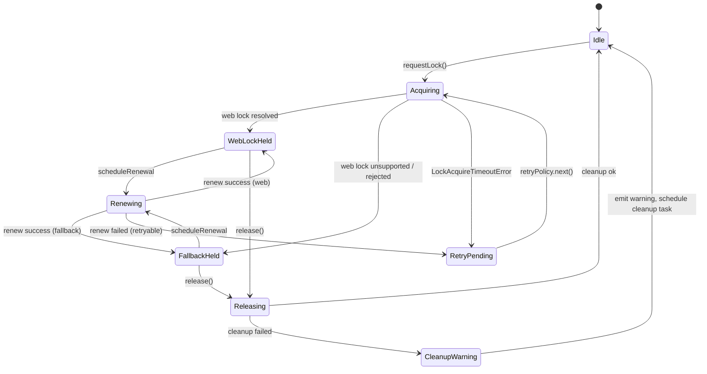

# ロック API 設計（`src/lib/locks.ts`）

- 参照ドキュメント: [AutoSave 実装詳細](./AUTOSAVE-DESIGN-IMPL.md), [Day8 アーキテクチャ](../Day8/docs/day8/design/03_architecture.md)
- 目的: AutoSave ファサードが Web Locks を最優先で利用し、Collector/Analyzer 系のファイルツリーと干渉しないロック管理を確定する。
- スコープ: `src/lib/locks.ts`, `tests/locks/**`（OPFS 直接書き込みの詳細実装は別タスク）。

## 1. ロック取得/更新/解放シーケンス

| フェーズ | Web Locks 優先経路 | フォールバック `.lock` 経路 |
| --- | --- | --- |
| Acquire | `navigator.locks.request(name, { mode: 'exclusive' })` で lease を取得。`AbortSignal` で 10s タイムアウトを注入。 | `project/.lock` を `createWritable({ keepExistingData: false })` で生成し、`{ leaseId, ttlExpiresAt }` を JSON で書き込む。既存ロックが残存する場合は TTL を検査し、期限切れは再取得、期限内は `LockAcquireTimeoutError`。 |
| Renew | Web Lock は自動延長されないため、`navigator.locks.request` のハンドラ中で `onExtend?: (leaseId) => Promise<boolean>` を呼び出し、true の場合のみ 5s 間隔で `setInterval` による再入要求を実施。 | `.lock` ファイルへ原子書き換え (`write + close`) し、`ttlExpiresAt` を `now + 30s` に更新する。更新失敗時は `LockRenewalError` をイベント通知。 |
| Release | `release()` 呼出しで Web Lock ハンドラの `finally` を通過。`AbortController` は必ず `abort()`。 | `.lock` を `removeEntry('.lock')` で削除。例外発生時は `LockCleanupWarning` としてログイベントを送出。 |

- Lease ID は `crypto.randomUUID()` に統一し、Web Lock / `.lock` 共通で `LeaseContext` に保持する。
- Collector/Analyzer は `Collector/` 以下のパスを使用するため、ロックファイル名は `project/.lock` 固定とし、`Collector/**` 配下でのファイル作成は禁止する。

## 2. 状態遷移（Web Locks + フォールバック）



- `RetryPending` は指数バックオフを適用し、最大再試行 5 回で `LockUnavailableError` に遷移。
- `CleanupWarning` は Collector への副作用を避けるため、`setTimeout` で非同期掃除ジョブを `project/.lock` のみに限定する。

## 3. API 型とイベント契約

```ts
export type LockBackend = 'web' | 'fallback';

export interface LeaseContext {
  readonly id: string; // UUID
  backend: LockBackend;
  acquiredAt: number;
  ttlExpiresAt: number;
}

export type LockEventType =
  | 'lock:acquired'
  | 'lock:renewed'
  | 'lock:released'
  | 'lock:cleanup-warning'
  | 'lock:retry-scheduled'
  | 'lock:error';

export interface LockEventBase {
  readonly type: LockEventType;
  readonly backend: LockBackend;
  readonly leaseId: string;
  readonly at: number; // epoch ms
}

export interface LockRetryScheduledEvent extends LockEventBase {
  readonly type: 'lock:retry-scheduled';
  readonly attempt: number;
  readonly delayMs: number;
}

export interface LockErrorEvent extends LockEventBase {
  readonly type: 'lock:error';
  readonly error: LockError;
}

export type LockEvent =
  | LockEventBase & { readonly type: 'lock:acquired' | 'lock:renewed' | 'lock:released' | 'lock:cleanup-warning' }
  | LockRetryScheduledEvent
  | LockErrorEvent;

export interface LockRequestOptions {
  readonly signal?: AbortSignal;
  readonly onEvent?: (event: LockEvent) => void;
  readonly onExtend?: (ctx: LeaseContext) => Promise<boolean>;
  readonly retryPolicy?: RetryPolicy;
}

export interface RetryPolicy {
  readonly next: (attempt: number) => number | null; // delay ms, null => give up
  readonly maxAttempts: number;
}

export async function withProjectLock<T>(
  scope: string,
  fn: (lease: LeaseContext) => Promise<T>,
  options?: LockRequestOptions
): Promise<T>;

export interface LockError extends Error {
  readonly code:
    | 'web-lock-unsupported'
    | 'lock-timeout'
    | 'lock-unavailable'
    | 'lock-renewal-failed'
    | 'lock-release-failed';
  readonly retryable: boolean;
  readonly cause?: unknown;
}
```

- `scope` は Collector/Analyzer の命名衝突を避けるため `"autosave" | "history"` のみを許可し、内部で `imgponic:project:${scope}` を Web Lock 名に利用する。
- `onEvent` は UI とログの両方で共通利用できるよう、`LockEvent` を逐次通知する。
- `RetryPolicy` のデフォルトは `(attempt) => attempt < 5 ? 2 ** attempt * 200 : null`。

## 4. 再試行と期限更新のテストシナリオ

| No. | シナリオ | 前提 | 操作 | 期待結果 |
| --- | --- | --- | --- | --- |
| T1 | 正常取得(Web Lock) | Web Locks 対応環境 | `withProjectLock('autosave', fn)` | `lock:acquired` → `fn` 実行 → `lock:released`。|
| T2 | Web Lock 非対応フォールバック | `navigator.locks` 未実装 | フォールバックパスで `.lock` 作成 | `backend === 'fallback'` のイベント列が発火し、`.lock` が削除される。|
| T3 | TTL 満了前更新 | フォールバック取得済 | `onExtend` が true を返す | `lock:renewed` が 5s 間隔で発火し、`ttlExpiresAt` が更新される。|
| T4 | 衝突通知 | 既存 `.lock` が TTL 内 | 再取得試行 | `lock:retry-scheduled` が指数バックオフで発火し、最終的に `lock-unavailable` エラーを返す。|
| T5 | フォールバック掃除 | `.lock` 削除失敗 | `release()` | `lock:cleanup-warning` イベントが発火し、次回取得時に孤児 `.lock` をクリーンアップする。|

## 5. Collector/Analyzer との干渉排除チェックリスト

1. Web Lock 名は `imgponic:project:${scope}` で固定し、Collector が利用する `collector:*` 命名と分離する。
2. フォールバック `.lock` は `project/.lock` のみ。`Collector/**` や `Analyzer/**` のディレクトリに触れない。
3. ログ/イベントは `console.warn` 1 行のみ（AutoSave ポリシーに準拠）で、Collector の JSONL 収集対象に書き込まない。
4. `RetryPolicy` の再試行は最大 5 回・合計 3.2s 遅延以内に抑え、Collector のアップロード間隔 15 分（Day8 アーキテクチャ）へ影響しない。
5. 例外クラス `LockError` は Collector/Analyzer のエラー階層と独立させ、共通エラーハンドラで `retryable` 判定が可能。

