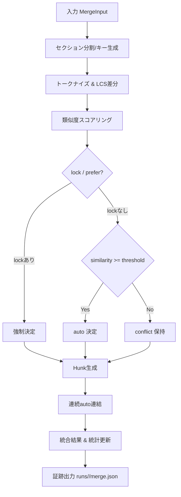
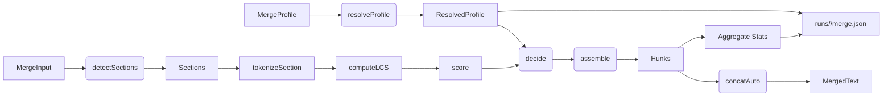

# 精緻マージ 実装詳細

## 0) サマリ
### 対象API
- `merge3` は Base/Ours/Theirs の 3-way マージを行い、hunk リストと統合済みテキストを返す。
- `MergeInput` は 3種類のソーステキストと任意の事前区切りセクションを受け付ける。
- `MergeHunk` はセクションごとの決定（自動/衝突）と比較指標を提供する。
- `MergeProfile` はトークナイザ・粒度・しきい値・優先度を制御し、部分指定を許容する。

### 性能・受入基準
- 100カット想定で 5 秒以内に完了すること（char トークン、セクション提供時）。
- ラベル付きケースで自動マージ率 80%以上を達成すること。
- 再実行時に決定的な結果が得られ、lock/優先度設定が尊重されること。

### `src/lib/merge.ts` 公開エクスポート一覧
| 名称 | 種別 | シグネチャ / 型 | 備考 |
| --- | --- | --- | --- |
| `MergeProfile` | Type | `{ tokenizer: 'char'|'word'|'morpheme'; granularity: 'section'|'line'; threshold: number; prefer: 'manual'|'ai'|'none' }` | 既定: `{ tokenizer: 'char', granularity: 'section', threshold: 0.75, prefer: 'none' }` |
| `MergeInput` | Type | `{ base: string; ours: string; theirs: string; sections?: string[] }` | 事前分割セクションは任意 |
| `MergeHunk` | Type | `{ section: string | null; decision: 'auto'|'conflict'; similarity?: number; merged?: string; manual?: string; ai?: string }` | 類似度は 0〜1 |
| `merge3` | Function | `(input: MergeInput, profile?: Partial<MergeProfile>) => { hunks: MergeHunk[]; mergedText: string; stats: { auto: number; conflicts: number; avgSim: number } }` | 決定的なマージと統計を返却 |

> **Note**: `src/lib/merge.ts` は現在未実装。上記は本ドキュメントに基づく公開 API 設計である。

## 1) 目的
- Base(前版) / Ours(Manual) / Theirs(AI) の3-way決定的マージ
- セクション（ラベル or 段落）単位で類似度により自動採用 or 衝突

## 2) プロファイル
```ts
type MergeProfile = {
  tokenizer: 'char'|'word'|'morpheme',   // 既定: 'char'（日本語安定）
  granularity: 'section'|'line',         // 既定: 'section'
  threshold: number,                     // 既定: 0.75
  prefer: 'manual'|'ai'|'none'           // lock未指定時のデフォ
}
```

### プロファイル仕様
- **デフォルト決定**: `prefer: 'none'` を起点とし、lock が存在しないセクションでは `similarity >= threshold` の場合 `auto` 採択。しきい値未満の場合は `conflict`。
- **閾値適用順序**: 1) セクションごとの lock（UI/外部入力）による強制決定 → 2) プロファイルの `prefer` に基づく候補決定 → 3) `similarity` と `threshold` による自動採択判定。前段が成立した場合、後続の評価はスキップ。
- **決定性確保**:
  - セクションは入力 `sections`、無い場合は検出した境界をキー化し、`section` ラベルで辞書順ソート。
  - 差分計算ではトークン列生成後に安定ソート（`localeCompare` with `'en'`、`numeric: true`）。
  - スコアリングで同率の場合は `prefer` の順序 (`manual` → `ai`) を固定し、`seed` は `hash(base + ours + theirs)` を用いるが deterministic hash のみ（乱数不使用）。
- **グローバル設定との連携**: `merge.precision` フラグで `threshold` の上下限を制約（例: precision=high → `min 0.8`）、`autosave.enabled` が true の場合はマージ結果保存時に証跡出力を強制。UI から渡される `MergeProfile` はグローバル設定を上書きしない。
- **フラグ適用**: Beta フラグ `features.merge.experimental` が false の場合、`prefer` を強制的に `'manual'` にリライトし安全側とする。

## 3) インタフェース
```ts
export type MergeInput = { base: string; ours: string; theirs: string; sections?: string[] }
export type MergeHunk = {
  section: string | null,
  decision: 'auto'|'conflict',
  similarity?: number,
  merged?: string,
  manual?: string,
  ai?: string
}
export function merge3(input: MergeInput, profile?: Partial<MergeProfile>): { hunks: MergeHunk[], mergedText: string, stats: { auto: number, conflicts: number, avgSim: number } }
```

## 4) アルゴリズム
1) セクション分割 → ラベル（`[主語]...`）の行を優先。無ければ空行で段落化
2) 各セクションで LCS 差分 → 類似度（Jaccard/Cosine簡易）
3) `similarity ≥ threshold` → **auto**。`lock`/`prefer` を反映
4) 未満 → **conflict** として両案を保持
5) 連続autoは連結。出力は決定的（乱数・時刻不使用）

## 5) UI / インタラクション
### Algorithm Details
#### 擬似コード
```pseudo
function merge3(input, profile):
  cfg = resolveProfile(profile)
  sections = detectSections(input, cfg.granularity)
  hunks = []
  stats = { auto: 0, conflicts: 0, sumSim: 0 }
  for section in sections sorted by section.key:
    tokens = tokenizeSection(section, cfg.tokenizer)
    diff = computeLCS(tokens.base, tokens.ours, tokens.theirs)
    similarity = score(diff, method="hybrid-jaccard-cosine")
    decision = decide(section.lock, cfg, similarity)
    hunk = assemble(section, decision, similarity)
    updateStats(stats, hunk, similarity)
    hunks.append(hunk)
  mergedText = concatAuto(hunks)
  stats.avgSim = stats.sumSim / max(1, len(hunks))
  return { hunks, mergedText, stats }
```

#### フローチャート


#### データフロー図


## 5) UI
- `MergeDock` に **Diff Merge** タブ
- セクション：自動採用（薄緑）／衝突（黄色）
- 衝突ごとに「Manual採用」「AI採用」「手動編集」
- 一括操作：しきい値スライダー、全Manual/全AI
- 「結果を採用」→ `Scene.manual` に書き戻し（既存フローと互換）

### 5.1 コンポーネント構成
```
MergeDock (既存タブ群)
└─ DiffMergeView (新規タブ本体)
   ├─ DiffMergeTabs …… MergeDock のタブバーに `Diff Merge`
   ├─ HunkListPane …… 左列。フィルタ/統計 + ハンク概要リスト
   │   ├─ MergeSummaryHeader …… auto/conflict 件数と閾値スライダー
   │   └─ MergeHunkRow[n] …… decision バッジ + section タイトル + ミニ差分
   └─ OperationPane …… 右列。選択中ハンクの詳細
       ├─ BulkActionBar …… 全Manual/全AI/全リセット + 選択操作
       ├─ MergeHunkDetail …… Base/Ours/Theirs 差分ビュー + ステータス
       │   ├─ DiffSplitView …… 左右比較（スクリーンリーダー向けテキスト複製）
       │   ├─ DecisionButtons …… Manual / AI / 編集 / AI再実行
       │   └─ StatusBadge …… 自動採用/衝突/進行中を色＋アイコン表示
       └─ EditModal …… 手動編集フォーム（保存/キャンセル/Undo）
```
レイアウトは左右 2 カラム（`minmax(280px, 35%)` + `auto`）とし、ハンク一覧は仮想スクロールで 100+ 件でも再描画負荷を抑える。

### 5.2 マージハンク状態機械
各ハンクは下記ステートマシンで管理し、UI 表示と `merge.ts` コマンドを同期する。

```
state MergeHunk {
  AutoResolved
  Conflict {
    Idle
    ApplyingManual
    ApplyingAI
    ManualEditing
  }
}
```

- 初期状態は `AutoResolved`（`decision:'auto'`）または `Conflict.Idle`（`decision:'conflict'`）。
- `Conflict.Idle --Manual採用--> AutoResolved` ：`queueMergeCommand({ type:'setManual', hunkId })` を `merge.ts` に送出。
- `Conflict.Idle --AI採用--> AutoResolved` ：`queueMergeCommand({ type:'setAI', hunkId })`。AI テキスト未生成時は `ApplyingAI` に遷移し、`merge.ts` が AI 呼び出し後に `AutoResolved` へ遷移するイベントを publish。
- `Conflict.Idle --手動編集--> Conflict.ManualEditing` ：DiffMergeView で `openEditModal(hunkId)` を dispatch。
- `Conflict.ManualEditing --保存--> AutoResolved` ：`queueMergeCommand({ type:'commitManualEdit', hunkId, text })`。
- `Conflict.ManualEditing --キャンセル--> Conflict.Idle` ：UI のみで state 戻し、副作用なし。
- `AutoResolved --再オープン--> Conflict.Idle` ：「リセット」操作時に `queueMergeCommand({ type:'resetDecision', hunkId })`。
- 一括操作（全Manual/全AI/全リセット）は対象ハンクへ順次コマンドを送出。送信中は `BulkActionBar` が progress 表示し、未完了ハンクを `ApplyingManual/AI` で表現する。

`queueMergeCommand` は `merge.ts` のコマンドキューラッパーで、UI からの要求をストアへ集約した後にバッチ書き戻しする。

### 5.3 書き戻しと履歴整合
- 全コマンドは `Scene.manual` を唯一のソースとし、反映は `merge.ts` → `store.ts` の既存アクション（`commitSceneManual(sceneId, text)`）経由で行う。Undo/Redo は `store.ts` のヒストリースタックに差分パッチを push して担保する。
- `DiffMergeView` は書き戻し完了イベントを購読し、ハンクリストの `merged` 断片を再描画。Undo 実行時は `merge.ts` が逆コマンドを emit（`type:'revertDecision'`）し UI 状態も巻き戻す。
- 書き戻し結果は AutoSave に委譲せず、AutoSave 側のファイル書き込みが完了したときのみ `Saved HH:MM:SS` を更新する（`AUTOSAVE-DESIGN-IMPL.md` に準拠）。
- アクセシビリティ：タブ到達順は `MergeDock` → ハンクリスト → 操作パネル。全ボタンへ `aria-pressed` / `aria-label` 付与。差分ビューは `aria-describedby` でベーステキストを読み上げ可能にし、キーボード操作は `ArrowUp/Down` でハンク選択、`Enter` で決定、`Shift+Enter` で編集開始。

### 5.4 異常系と AutoSave 協調
- マージ統計（`merge.ts` → `stats`）取得失敗時：`MergeSummaryHeader` にエラーバナーを表示し、「再取得」ボタンで `queueMergeCommand({ type:'refreshStats' })` を再送。取得中はスピナー表示。
- 証跡書き込み（`runs/<ts>/merge.json`）失敗時：フッターに `toast` + 詳細ダイアログ。「再試行」選択で `queueMergeCommand({ type:'persistTrace', hunkIds })` を再実行。連続失敗 3 回で `AUTOSAVE` と同様のバックオフ通知。
- AutoSave 連携：`DiffMergeView` の編集開始時に `navigator.locks` で merge セクション専用ロック `imgponic:merge` を獲得。AutoSave 側はロック保持中でも読み込みのみ許可し、書き込みはロック解放後に差分マージを再確認。UI はロック保持中に「保存中…」を抑制し、衝突時は `MergeConflictDialog` を表示して再読込 or 手動差分適用を促す。

### 5.5 TDD ケース・フィクスチャ
React Testing Library で以下をカバーする。
- `DiffMergeView` 初期表示：Auto/Conflict 件数・タブ切り替え・ハンク選択のキーボード操作。
- `DecisionButtons` 操作：Manual/AI ボタン押下で `queueMergeCommand` が正しい payload になる。
- `EditModal` 保存キャンセル：入力内容が `Scene.manual` 書き戻しに伝搬し、キャンセル時はコマンド送出なし。
- 異常系：統計失敗モックでバナー表示 → 再取得クリック時に再試行イベントが発火。
- アクセシビリティ：`aria` 属性、`tab` ナビゲーション順序、スクリーンリーダー用テキストが DOM 上に存在。

Storybook では以下のシナリオを用意。
- `AutoResolved` のみのプロファイル（100 件仮想スクロール）。
- 混在ケース（衝突 + AI再実行中 + 編集モーダル開）
- 異常系（統計取得失敗バナー表示）。

必要フィクスチャ：
- `merge-hunks/basic.json` …… auto/conflict 混在。`Scene.manual`/`ai` モック付き。
- `merge-hunks/all-auto.json` …… 大量 auto 用。
- `merge-hunks/error-stats.json` …… stats API 失敗レスポンス。
- `merge-commands/log.ts` …… `queueMergeCommand` 呼び出し追跡モック。

### 5.6 イベントログ出力チェックリスト
Day8 アーキテクチャの Reporter → Governance 流れに従い、マージ操作で下記ログを残す。

1. `merge:stats:refreshed` — 統計取得成功時。payload: 件数/類似度。
2. `merge:hunk:decision` — Manual/AI/編集確定時。payload: `hunkId`, `decision`, `actor`。
3. `merge:hunk:ai:requested` / `merge:hunk:ai:fulfilled` — AI 再実行の開始/完了。Reporter は AI 成果を草案ログへ追加。
4. `merge:trace:persisted` — 証跡書き込み完了。失敗時は `merge:trace:error` にエラーコード。
5. `merge:autosave:lock` — AutoSave ロック獲得/解放を Governance 監査に通知。
6. すべてのログに `sceneId`, `section`, `ts`, `userId` を含め、Reporter 側の propose-only 原則に従って Git への自動書き込みは行わない。

## 6) 証跡
- `runs/<ts>/merge.json` に hunkごとの `{section, similarity, decision}` を記録
- `meta.json` に `merge_profile` を追記

### JSON Schema
#### `runs/<ts>/merge.json`
```json
{
  "$schema": "https://json-schema.org/draft/2020-12/schema",
  "title": "MergeRun",
  "type": "object",
  "properties": {
    "run_id": { "type": "string", "pattern": "^\\d{8}T\\d{6}Z$" },
    "profile": {
      "type": "object",
      "properties": {
        "tokenizer": { "enum": ["char", "word", "morpheme"] },
        "granularity": { "enum": ["section", "line"] },
        "threshold": { "type": "number", "minimum": 0, "maximum": 1 },
        "prefer": { "enum": ["manual", "ai", "none"] }
      },
      "required": ["tokenizer", "granularity", "threshold", "prefer"],
      "additionalProperties": false
    },
    "hunks": {
      "type": "array",
      "items": {
        "type": "object",
        "properties": {
          "section": { "type": ["string", "null"] },
          "decision": { "enum": ["auto", "conflict"] },
          "similarity": { "type": "number", "minimum": 0, "maximum": 1 },
          "merged": { "type": "string" },
          "manual": { "type": "string" },
          "ai": { "type": "string" }
        },
        "required": ["section", "decision"],
        "additionalProperties": false
      }
    },
    "stats": {
      "type": "object",
      "properties": {
        "auto": { "type": "integer", "minimum": 0 },
        "conflicts": { "type": "integer", "minimum": 0 },
        "avgSim": { "type": "number", "minimum": 0, "maximum": 1 }
      },
      "required": ["auto", "conflicts", "avgSim"],
      "additionalProperties": false
    }
  },
  "required": ["run_id", "profile", "hunks", "stats"],
  "additionalProperties": false
}
```

#### `runs/<ts>/meta.json`
```json
{
  "$schema": "https://json-schema.org/draft/2020-12/schema",
  "title": "MergeMeta",
  "type": "object",
  "properties": {
    "merge_profile": {
      "type": "object",
      "properties": {
        "tokenizer": { "enum": ["char", "word", "morpheme"] },
        "granularity": { "enum": ["section", "line"] },
        "threshold": { "type": "number", "minimum": 0, "maximum": 1 },
        "prefer": { "enum": ["manual", "ai", "none"] }
      },
      "required": ["tokenizer", "granularity", "threshold", "prefer"],
      "additionalProperties": false
    },
    "stats": {
      "type": "object",
      "properties": {
        "auto": { "type": "integer", "minimum": 0 },
        "conflicts": { "type": "integer", "minimum": 0 },
        "avgSim": { "type": "number", "minimum": 0, "maximum": 1 }
      },
      "required": ["auto", "conflicts", "avgSim"],
      "additionalProperties": false
    }
  },
  "required": ["merge_profile", "stats"],
  "additionalProperties": false
}
```

### Collector への影響
- `MergeRun` は Collector の JSONL 取り込み対象外であり、個別ファイルとして保存されるが、Analyzer 連携のため `run_id` を `meta.json` と一致させる。
- Collector は `stats.auto`, `stats.conflicts`, `stats.avgSim` を抽出し、Day8 Analyzer のメトリクス `pass_rate` に相当する `auto_rate` を計算するよう拡張が必要。
- 既存の JSONL 契約には影響せず、Reporter は `meta.json` の `merge_profile` を参照して結果コメントに反映する。

## 7) 性能目標
- 100カットで ≤5秒（セクションあり、charトークン）
- 必要に応じ **Web Worker** 化（後段）

## 8) 受入
- ラベル付きで自動マージ率 ≥80%
- 再実行で同一結果（決定性）
- lock=manual/ai の優先が反映される

## 9) エッジケースと Test Matrix
### エッジケース
- **セクション欠如**: 入力にセクションラベルが無い場合、空行で段落抽出し `section` を連番付与。
- **文字コード差**: Base/Ours/Theirs のエンコーディングが混在する場合は UTF-8 へ正規化し、不可視差分を正規化（NFC）。
- **空入力**: いずれかが空文字の場合、他のテキストを `auto` として採用し、`similarity` を 0 とする。
- **不正プロファイル**: 許容外のトークナイザや閾値が渡された場合は `MergeProfileValidationError` を投げる。
- **トークナイザ未対応**: ブラウザで形態素分割が利用不可の場合、`tokenizer` を `'char'` にフォールバックし Warning を記録。

### Test Matrix（TDD 指針）
| Case | 入力条件 | 期待結果 | テスト戦略 | モック |
| --- | --- | --- | --- | --- |
| T1 | セクションラベル有り、`similarity` 高 | `auto` 連結、`avgSim` > threshold | node:test で `merge3` 単体 | トークナイザをスタブし固定トークン返却 |
| T2 | ラベル無し、空行分割 | 連番セクション、決定的順序 | node:test でセクション検出検証 | `detectSections` を spy しソート順確認 |
| T3 | lock=manual 指定 | lock を優先し `prefer`/threshold 無視 | node:test で lock 優先度確認 | `decide` 内部で lock 処理をモック |
| T4 | `prefer='ai'`, similarity 下回り | `conflict` 判定維持 | node:test でしきい値制御 | スコアラーを固定値返却にモック |
| T5 | 不正プロファイル（threshold=1.5） | `MergeProfileValidationError` 発火 | node:test で例外検証 | バリデーション関数を直接呼ぶ |
| T6 | トークナイザ未対応 | `'char'` フォールバック + Warning | node:test で fallback | 外部 tokenizer モジュールを `throws` で差し替え |
| T7 | 空入力（theirs 空） | ours を auto 採択 | node:test で空文字処理 | スコアリングを 0 返却にモック |
| T8 | 文字コード差（NFD/NFC） | 正規化後に同一判定 | node:test で normalization | `normalizeText` をモックし呼び出し検証 |

## 10) Analyzer/Reporter 連携チェックリスト
- [ ] Collector が `runs/<ts>/merge.json` を検知し、`auto_rate = auto / (auto + conflicts)` を算出できる。
- [ ] Analyzer が `avgSim` を `metrics.duration_p95` と同列に扱えるよう型を拡張済み。
- [ ] Reporter の Why-Why 草案が `merge_profile.prefer` を参照し、意図した判断理由を記述できる。
- [ ] `reports/today.md` に `auto/conflict` の推移グラフを追加するパイプラインが整備済み。
- [ ] `workflow-cookbook/scripts/analyze.py` が `MergeMeta` を JSON Schema に沿ってバリデーションする。
- [ ] Day8 ドキュメントに記載された JSONL ログとの互換性を保つため、`MergeRun` は JSONL 化せず別ファイルとして扱う運用が共有されている。
