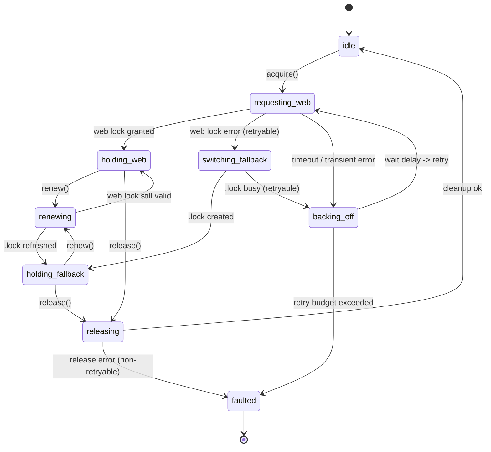

# プロジェクトロックサービス設計

## 0) 前提と全体方針
- `src/lib/locks.ts` は AutoSave ファサード（[docs/AUTOSAVE-DESIGN-IMPL.md](./AUTOSAVE-DESIGN-IMPL.md)）からのみ直接利用され、Collector / Analyzer が占有する領域に `.lock` を生成しない。
- Day8 設計資料（[Day8/docs/day8/design/03_architecture.md](../Day8/docs/day8/design/03_architecture.md)）と同様に、排他制御は Collector→Analyzer→Reporter のパイプラインに副作用を与えないことを最優先とする。
- Web Locks API を優先し、取得不能時のみ OPFS 内 `project/.lock` へのフォールバックを行う。両ロックは同一 `leaseId` を共有し、再入（同一タブによる重複取得）を検出する。
- 例外は `ProjectLockError` 階層に揃え、`retryable` フラグで指数バックオフ可否を示す。即時中断が必要なケース（フォーマット不整合、OPFS I/O 失敗）は非再試行とする。

## 1) 型定義と公開 API シグネチャ案
```ts
export type ProjectLockSource = 'web-lock' | 'opfs-lock';

export interface ProjectLockLease {
  readonly leaseId: string; // UUID (RFC4122)
  readonly expiresAt: number; // epoch millis
  readonly source: ProjectLockSource;
}

export interface ProjectLockAcquireOptions {
  readonly signal?: AbortSignal;
  readonly maxWaitMs?: number; // 既定: 5000
  readonly retryPolicy?: LockRetryPolicy; // 既定: exponential backoff (base=200ms, cap=5000ms)
}

export interface LockRetryPolicy {
  readonly initialDelayMs: number;
  readonly maxDelayMs: number;
  readonly multiplier: number; // 既定: 2.0
  readonly maxAttempts: number; // 既定: Infinity
}

export interface ProjectLockRenewOptions {
  readonly lease: ProjectLockLease;
  readonly extendByMs?: number; // 既定: 15000
}

export interface ProjectLockReleaseOptions {
  readonly lease: ProjectLockLease;
  readonly reason?: 'completed' | 'aborted' | 'expired';
}

export interface ProjectLockEvent {
  readonly type:
    | 'acquired'
    | 'acquire-failed'
    | 'renewed'
    | 'expired'
    | 'released'
    | 'release-failed'
    | 'backoff'
    | 'switch-to-fallback';
  readonly lease?: ProjectLockLease;
  readonly error?: ProjectLockError;
  readonly attempt?: number;
  readonly delayMs?: number;
}

export type ProjectLockEventListener = (event: ProjectLockEvent) => void;

export interface ProjectLockSubscription {
  unsubscribe(): void;
}

export class ProjectLockError extends Error {
  readonly code:
    | 'web-lock-unavailable'
    | 'web-lock-aborted'
    | 'fallback-open-failed'
    | 'fallback-read-failed'
    | 'fallback-write-failed'
    | 'lease-mismatch'
    | 'lease-expired';
  readonly retryable: boolean;
  readonly cause?: unknown;
  constructor(message: string, params: { code: ProjectLockError['code']; retryable: boolean; cause?: unknown });
}

export async function acquireProjectLock(options?: ProjectLockAcquireOptions): Promise<{
  lease: ProjectLockLease;
  didFallback: boolean;
}>;

export async function renewProjectLock(options: ProjectLockRenewOptions): Promise<ProjectLockLease>;

export async function releaseProjectLock(options: ProjectLockReleaseOptions): Promise<void>;

export async function withProjectLock<T>(
  options: ProjectLockAcquireOptions | undefined,
  work: (lease: ProjectLockLease) => Promise<T>
): Promise<T>;

export function subscribeLockEvents(listener: ProjectLockEventListener): ProjectLockSubscription;
```

## 2) 処理フローと状態遷移
### 2.1 処理段階
1. **取得試行 (request-web)**: `navigator.locks.request()` を最優先。AbortSignal 経由でキャンセル可能。
2. **フォールバック判定 (fallback-check)**: Web Lock が `NotSupportedError`・`SecurityError`・タイムアウトで失敗した場合に `project/.lock` を生成。
3. **リース発行 (lease-issue)**: 15s 先の `expiresAt` を設定し、Web Lock ハンドルまたは `.lock` ファイルに保存。フォールバックは JSON `{ leaseId, expiresAt }` を書き込み。
4. **リース監視 (lease-renew)**: AutoSave 側から `renewProjectLock` が呼ばれた場合は Web Lock なら no-op、フォールバックは `.lock` 更新。
5. **バックオフ (backoff)**: 取得失敗時は指数バックオフ。`retryable=false` の例外であれば即座にエラーを伝播。
6. **解放 (release)**: `releaseProjectLock` が呼ばれたら Web Lock ハンドル解放 or `.lock` 削除。期限超過 (`expiresAt < now`) なら `expired` イベントを発火し、`lease-expired` エラーを返す。

### 2.2 状態遷移図


## 3) エラー分類とバックオフ戦略
| エラーコード | 発生箇所 | retryable | 対応 | ログレベル |
| --- | --- | --- | --- | --- |
| `web-lock-unavailable` | Web Locks API 非対応 / 取得拒否 | true | フォールバック or バックオフ再試行 | warn |
| `web-lock-aborted` | AbortSignal 発火 | false | 呼び出し元へ即伝播、イベント `acquire-failed` | info |
| `fallback-open-failed` | `.lock` ファイル作成不可 | false | 即時例外、AutoSave 停止 | error |
| `fallback-read-failed` | `.lock` 読み込み失敗 | true | `.lock` 再生成を試行 | warn |
| `fallback-write-failed` | `.lock` 更新失敗 | true | 再試行しつつ `retryable=false` に達したら停止 | error |
| `lease-mismatch` | `leaseId` 不一致（再入検出） | false | AutoSave へ通知し再取得禁止 | error |
| `lease-expired` | `expiresAt` 超過で操作 | false | ロックを解放し再取得からやり直し | warn |

- バックオフは `delay = min(maxDelay, initialDelay * multiplier^(attempt-1))` で算出し、`attempt` ごとに `backoff` イベントを発火。
- 再試行上限超過時は `faulted` 状態へ遷移し、`acquire-failed` イベントとともに例外を投げる。

## 4) イベント通知
- `subscribeLockEvents` は複数リスナーを保持する Pub/Sub とし、AutoSave UI インジケータに状態変化を伝える。
- `acquired`／`renewed`／`released`／`expired`／`switch-to-fallback` など、ロック状態の変化をすべて `ProjectLockEvent` で表現。
- リスナーは `unsubscribe()` で登録解除。解放時には登録解除してメモリリークを避ける。

## 5) TDD 用テストダブル設計
| ダブル | 目的 | 実装要点 |
| --- | --- | --- |
| `MockNavigatorLocks` | Web Locks API をエミュレート | `request()` の行動を `queue` で制御し、成功／失敗／タイムアウト／Abort を検証。|
| `InMemoryOpfsFile` | OPFS `.lock` 代替 | `read`, `write`, `delete` を Promise 化し、競合シナリオ（既存 `leaseId`）を再現。|
| `FakeClock` | バックオフ・期限判定 | `now()` と `sleep()` をフックして `expiresAt` ロジックを deterministic に検証。|
| `EventProbe` | イベント通知検証 | `subscribeLockEvents` の出力を記録し、順序・内容を期待値と照合。|

## 6) テストケース一覧
| ID | シナリオ | 入力条件 | 期待結果 | 使用ダブル |
| --- | --- | --- | --- | --- |
| TC-01 | Web Lock 取得成功 | `MockNavigatorLocks` が即時成功 | `acquired` イベント、`didFallback=false` | MockNavigatorLocks, EventProbe |
| TC-02 | Web Lock 非対応でフォールバック成功 | `request()` が `NotSupportedError` | `switch-to-fallback` → `acquired`(fallback) | MockNavigatorLocks, InMemoryOpfsFile, EventProbe |
| TC-03 | `.lock` 競合で指数バックオフ | `.lock` が他 UUID を保持 | `backoff` が増加しつつリトライ、最終的に成功 | InMemoryOpfsFile, FakeClock, EventProbe |
| TC-04 | AbortSignal による取得中断 | `AbortController.abort()` 呼び出し | `acquire-failed` イベント、`ProjectLockError`(web-lock-aborted) | MockNavigatorLocks, EventProbe |
| TC-05 | リース更新で期限延長 | `renewProjectLock` 呼び出し | `expiresAt` が延長され `renewed` イベント | InMemoryOpfsFile, FakeClock |
| TC-06 | リリース時の `.lock` 削除失敗 | `delete` が失敗 | `release-failed` イベント、`ProjectLockError`(fallback-write-failed) | InMemoryOpfsFile, EventProbe |
| TC-07 | 期限切れ検出 | `FakeClock` で `expiresAt` 経過 | `expired` イベント、再取得が必要 | FakeClock, EventProbe |

## 7) I/O コントラクト
- `ProjectLockLease` は JSON シリアライズ可能で、フォールバックファイルは `{"leaseId": string, "expiresAt": number}` 形式に限定。
- AutoSave から渡される `AbortSignal` が中断した場合は Web Lock リクエストをキャンセルし、フォールバックへは移行しない。
- Collector/Analyzer 領域には `.lock` を作成せず、`project/` 直下に限定。

## 8) 未決定事項・フォローアップ
- `.lock` のファイルパーミッション／クォータ監視は Phase B で検討。
- 複数タブ間の `BroadcastChannel` 通知は次フェーズ課題として `TASKS` に追記する。
