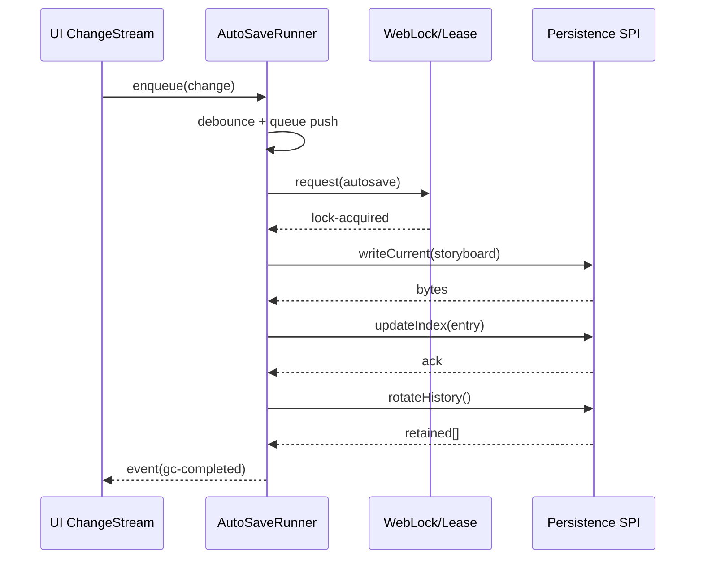

# AutoSave Runner 設計仕様

## 1. 目的
- `src/lib/autosave.ts` に保存ポリシー・イベント駆動ロジックを集約し、UI/永続化層から独立したランナー API を定義する。
- `autosave.enabled` フラグとオプション `AutoSaveOptions.disabled` の評価結果を単一箇所で判定し、起動/停止条件を明文化する。
- ストレージ書込は別実装に委譲し、本仕様では I/O 契約と状態遷移のみを扱う。

## 2. 状態遷移図
```mermaid
direction LR
stateDiagram-v2
    [*] --> disabled
    disabled --> idle: init + featureFlag
    idle --> debouncing: change-queued
    debouncing --> awaiting-lock: lock-acquired
    debouncing --> idle: cancelled(dispose)
    awaiting-lock --> writing-current: lock-acquired
    awaiting-lock --> error: lock-rejected(maxAttempts)
    writing-current --> updating-index: write-succeeded
    writing-current --> error: write-failed(non-retryable)
    updating-index --> gc: index-committed
    gc --> idle: gc-completed
    error --> awaiting-lock: retry-window
    error --> disabled: dispose
```

## 3. シーケンス (正常系)


## 4. ランナー API サーフェス
`AutoSaveRunnerApiSurface` を設計中心とし、以下の責務を持つ。

| メソッド | 概要 | 主要副作用 |
| --- | --- | --- |
| `start()` | フラグとロック可用性の評価。`autosave.enabled=false` または `options.disabled=true` の場合は `phase='disabled'` を維持。 | 状態を `idle` へ遷移、監視タイマー開始 |
| `enqueue(reason)` | `change`/`flushNow` イベントをキューへ追加。`flushNow` はデバウンスをスキップ。 | `AutoSaveRunnerEvent` 発火、ロック要求 |
| `cancel(reason)` | `dispose` でキューを破棄、`flushNow` キャンセル時は pending のみ削除。 | `cancelled` イベント、`phase='disabled'` への遷移準備 |
| `onEvent(handler)` | UI/テレメトリ購読。解除用 disposer を返却。 | イベントストリーム購読 |

## 5. 入出力契約
- **Input**
  - 保存トリガーイベント (`enqueue` / `flushNow`)
  - フラグスナップショット (`featureFlag`, `optionsDisabled`)
  - ロックリース (`lockAcquired(leaseMs)` / `lockRejected(reason)`)
- **Output**
  - 保存結果イベント (`AutoSaveRunnerEvent`)
  - テレメトリ payload (`AutoSaveTelemetryEvent` + `slo` タグ)

## 6. テスト観点 (TDD)
`AUTOSAVE_TDD_SCENARIOS` に記述された 3 ケースをベースに、以下を前提としてユニットテストを設計する。

| シナリオ | フィーチャーフラグ | ロック可用性 | 期待フェーズ | 主検証 |
| --- | --- | --- | --- | --- |
| 正常系 | true | true | idle | `change-queued → gc-completed` が順序通り発火し、`lastSuccessAt` 更新 |
| 失敗系 | true | false | error | `lock-rejected` で `retryCount` 増加、最大試行後 `phase='error'` |
| キャンセル系 | true | true | disabled | `dispose` で `cancelled` 発火、キュー空 |

## 7. エラーハンドリングマトリクス
| エラーコード | リトライ可否 | Runner アクション | テレメトリ SLO | 備考 |
| --- | --- | --- | --- | --- |
| `lock-unavailable` | 可 | `lock-rejected` → バックオフ再試行 | `p99-success` | `maxAttempts` 超過で `error` 固定 |
| `write-failed` | 可 | `write-failed` → バックオフ | `p99-success` | 原因別に `detail.cause` 付与 |
| `data-corrupted` | 不可 | `write-failed` 相当だが即時停止 | `p95-latency` | 復元 UI でモーダル通知想定 |
| `history-overflow` | 不可 | `gc-completed` 前に FIFO 処理 | `p99-success` | GC 成功で info ログのみ |
| `disabled` | 不可 | `cancelled` → `phase='disabled'` | `p95-latency` | Collector 通知なし |

## 8. フラグとロック条件
1. `autosave.enabled=false`
   - `start()` は `cancelled` を発火し、`snapshot.phase='disabled'` を維持。
2. `options.disabled=true`
   - init 時に即時終了。ロック要求を一切実行しない。
3. ロック取得失敗 (`lockRejected`)
   - `retryable=true` かつ `attempts<maxAttempts` の場合のみバックオフ再試行。
   - それ以外は `phase='error'` に確定、外部へ `lock-rejected` を通知。

## 9. テレメトリ仕様
- `AutoSaveRunnerEvent` 生成時に `telemetry` へ同一タイムスタンプで送信。
- 成功経路 (`gc-completed`) は `slo='p99-success'` で集計。
- バックオフ経路 (`lock-rejected`, `write-failed`) は `slo='p95-latency'` として遅延計測に活用。
- Collector 送信は 1 イベント 1 payload を基本とし、指数バックオフ中は最初のイベントのみ warn ログ。

## 10. 次ステップ
- `AutoSaveRunnerApiSurface` のモック実装を作成し、`AUTOSAVE_TDD_SCENARIOS` に沿ってユニットテストを追加。
- Lock SPI / Persistence SPI との統合テストを別タスクで設計。
