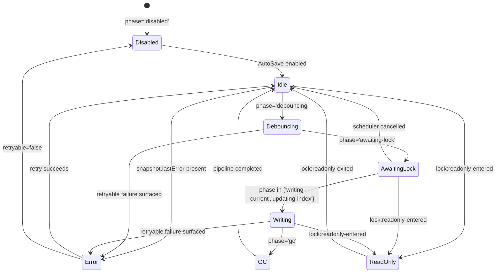

# AutoSave Indicator UI 状態・メッセージ仕様

本仕様は `src/components/AutoSaveIndicator.tsx` の表示ロジックと AutoSave/ロックイベント連携を定義する。`AUTOSAVE_INDICATOR_MESSAGE_SPEC` 定数に従い、成功/失敗/ロック警告のバナー・トースト挙動を一貫させる。

## 1. ステートマシン


- `ReadOnly` はロックイベントでのみ遷移し、フェーズは `idle` のままでも `banner.variant='warning'` を維持する。
- `retryable=false` のエラーは `Disabled` 相当の扱いで、再初期化または履歴復元まで継続表示する。

## 2. メッセージ仕様
| キー | 発火条件 | バナー | トースト | 履歴アクセス | ノート |
| --- | --- | --- | --- | --- | --- |
| `success` | `autosave:success` 直後 / `phase='idle'` 遷移直後 | なし | なし | `available` | 正常完了時は UI を静穏化。`statusLabel` のみ更新。 |
| `retryableFailure` | `autosave:failure` かつ `retryable=true` / `awaiting-lock` 再試行中 | なし | `variant='warning'`、最新エラーメッセージ | `available` | 自動再試行継続。履歴導線は補助目的で維持。 |
| `fatalFailure` | `phase='error'` かつ `retryable=false` | `variant='error'`、`lastError.message` を表示 | なし | `available` | 履歴復元を primary CTA とし、再試行導線は非表示。 |
| `readonlyEntered` | `lock:readonly-entered` / `lockState.mode='readonly'` | `variant='warning'`、原因に応じて文言切替 | なし | `disabled` | 排他解除まで履歴操作不可。`statusLabel='閲覧専用モード'` を維持。 |

- `AutoSaveIndicator` は `AUTOSAVE_INDICATOR_MESSAGE_SPEC` を参照し、該当するキーを順に評価して UI を更新する。
- `readonlyEntered` が優先され、次いで `fatalFailure`、`retryableFailure`、`success` の順で評価する。
- トースト発火時は `onToast` コールバックを単一イベントで呼び出し、連続発火時は最新のみを表示する。

## 3. I/O 契約
```ts
export type AutoSaveRunnerEvent =
  | { type: 'autosave:success'; snapshot: AutoSaveStatusSnapshot; committedGeneration: number; completedAt: string }
  | { type: 'autosave:failure'; snapshot: AutoSaveStatusSnapshot; error: { code: AutoSaveErrorCode; message: string; retryable: boolean }; failedAt: string }
  | { type: 'autosave:progress'; snapshot: AutoSaveStatusSnapshot; phase: AutoSavePhase; retryCount: number; emittedAt: string };

export interface AutoSaveIndicatorMessageSpecEntry {
  when: string;
  banner?: AutoSaveIndicatorBanner;
  toast?: AutoSaveIndicatorToast;
  historyAccess?: AutoSavePhaseHistoryRequirement['access'];
  notes: readonly string[];
}
```

- AutoSave ランナーは `AutoSaveRunnerEvent` を発火し、`snapshot()` は常に最新の `AutoSaveStatusSnapshot` を返す。
- ロックサービスは `ProjectLockEvent` を `subscribeLockEvents` 経由で通知し、`AutoSaveIndicator` 側では `reduceLockState()` で集約する。
- UI 層は `AutoSaveIndicatorMessageSpecEntry` に従ってバナー/トースト/履歴アクセス状態を投影する。

## 4. テストケース
| No. | シナリオ | モック入力 | 期待 UI | 確認ポイント |
| --- | --- | --- | --- | --- |
| 1 | 成功 → Idle | `autosave:success` と `phase='idle'` | バナー/トーストなし、履歴ボタン活性 | `statusLabel='最新状態'`、`aria-live='polite'` |
| 2 | 再試行可エラー | `autosave:failure`（`retryable=true`）+ `phase='awaiting-lock'` | トースト warning、履歴ボタン活性 | `toast.message` が最新エラー、`isAnimating=true` |
| 3 | 再試行不可エラー | `phase='error'`、`lastError.retryable=false` | エラーバナー表示、履歴ボタン primary | `indicator='error'`、`aria-live='assertive'` |
| 4 | ロック競合 | `lock:readonly-entered` (`reason='acquire-failed'`) | 警告バナー、履歴ボタン disabled | `statusLabel='閲覧専用モード'`、`history.note` が表示継続 |
| 5 | ロック解除後成功 | `lock:readonly-exited` → `autosave:success` | バナー消滅、履歴ボタン活性 | トースト再発火なし、`isReadOnly=false` |
| 6 | 連続失敗トースト抑制 | `autosave:failure` を連続発火 | トーストは最新メッセージのみ | `onToast` が 1 回ずつ呼ばれる |

テストは `tests/components/AutoSaveIndicator.test.tsx` に `node:test` で追加し、React Testing Library を用いて DOM のラベルと `aria-*` 属性を検証する。異常系（No.2〜4）を必須カバレッジとし、再試行可否差分とロック競合の両方を網羅する。
