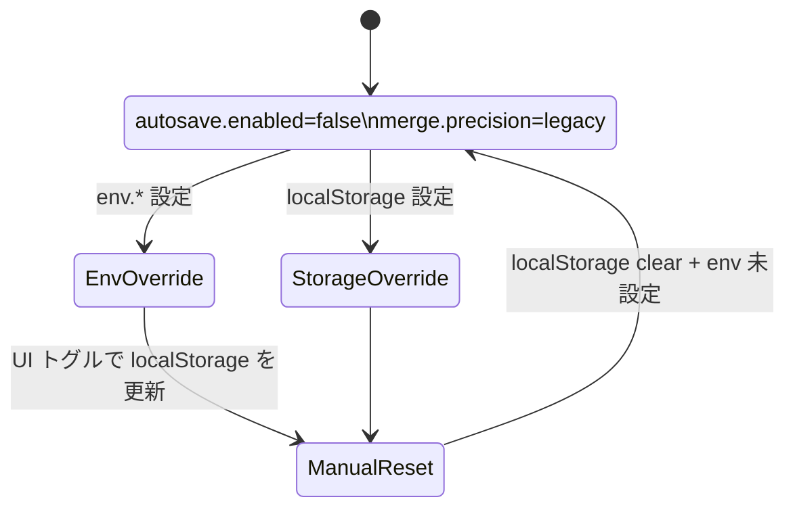

# フラグ解決モジュール設計（src/config/flags.ts）

AutoSave 仕様【F:docs/AUTOSAVE-DESIGN-IMPL.md†L1-L118】と Day8 アーキテクチャ整理【F:Day8/docs/day8/design/03_architecture.md†L1-L58】を踏まえ、`env → localStorage → 既定値` の優先順位とソース追跡を備えた `FlagSnapshot` 解決フローを定義する。

## 1. 既存フローと新モジュールの責務境界

```mermaid
graph TD
  App[App bootstrap] -->|useFlagSnapshot()| FlagResolver
  Merge[Merge Dock bootstrap] -->|useFlagSnapshot()| FlagResolver
  FlagResolver -->|load| Env(import.meta.env)
  FlagResolver -->|load| Storage(localStorage)
  FlagResolver -->|defaults| SpecDefaults(docs/CONFIG_FLAGS.md)
  FlagResolver --> Snapshot
  Snapshot -->|autosave.enabled| AutoSaveFacade
  Snapshot -->|merge.precision| MergePrecision
  subgraph Isolation
    FlagResolver ---|pure resolution| ConfigIndex(src/config/index.ts)
    AutoSaveFacade -.->|options.disabled| AutoSaveCore(src/lib/autosave.ts)
  end
```

- `FlagResolver`（`src/config/flags.ts`）は**値の正規化とソース判定のみ**を行い、副作用や UI ハンドリングは担わない。
- `FlagSnapshot` を `ConfigIndex` 経由で UI や AutoSave へ伝播し、`autosave.enabled=false` なら AutoSave 側で no-op を確実化する（AutoSave ドキュメントの不変条件参照）。
- 既存の `ResolveOptions` を活用し、テストと Node 環境での差し替えを許容する。

### 1.1 直接参照排除ロードマップ

| フェーズ | 対象 | 手順 | 完了条件 |
| --- | --- | --- | --- |
| phase-a0 | `App.tsx` / `MergeDock` | `src/config/index.ts` から `resolveFlags()` をインポートし、従来の `localStorage` 読み取りをフェールセーフとして残す | `FLAG_MIGRATION_PLAN` のとおり snapshot 経由で初期化してもリグレッションが無いことを QA で確認 |
| phase-a1 | AutoSave Runner | AutoSave 初期化時に `FlagSnapshot.autosave.enabled` を参照し、`localStorage` 直接アクセスを削除。テレメトリへ `FlagValidationError` を JSONL 送信 | Runner 初期化ログが snapshot の `source` を記録し、Collector が受理 |
| phase-b0 | Merge Precision UI/API | `merge.precision` を resolver のみで取得し、`legacyStorageKeys` を削除。UI トグルは `ConfigIndex` 経由で更新 | 旧キー参照が 0 件になり、`FLAG_MIGRATION_PLAN` の exit 条件を満たす |

Phase a0 では互換性のため `localStorage` 直読が残るが、以降のフェーズで段階的に排除する。`src/config/index.ts` は resolver をエクスポートするゲートウェイのみを担い、副作用を持たない。

## 2. FlagSnapshot 定義とバリデーション

| フィールド | 型 | 解釈 | バリデーション | エラー処理 |
| --- | --- | --- | --- | --- |
| `autosave.enabled` | `boolean` | AutoSave を起動するか | `coerceBoolean(raw)`：`'1'/'true'/'false'/'0'`。不正文字列は `ValidationError` | エラーを記録し `defaultValue` へフォールバック、`source` を `"default"` に固定 |
| `merge.precision` | `'legacy' \| 'beta' \| 'stable'` | マージアルゴリズム段階導入 | `coercePrecision(raw)`：`legacy/beta/stable` 大文字小文字不問 | 不正値は `ValidationError` を添えて `defaultValue='legacy'` に戻す |
| `source.*` | `FlagSource` | 値が採用されたソース | `env`/`localStorage`/`default` のみ許容 | 不一致はプログラミングエラー扱いで `assertUnreachable` |

- `ValidationError` は `Retryable=false` としてロギングのみ（AutoSave 側に副作用を波及させない）。
- 既存ローカルストレージキー (`flag:autoSave.enabled`, `flag:merge.precision`) をそのまま利用し、後方互換を維持する。

### 2.1 FlagSnapshot 型スケッチ

```ts
interface FlagSnapshot {
  readonly autosave: {
    readonly enabled: boolean
    readonly source: FlagSource
    readonly errors: readonly ValidationError[]
  }
  readonly merge: {
    readonly precision: 'legacy' | 'beta' | 'stable'
    readonly source: FlagSource
    readonly errors: readonly ValidationError[]
  }
  readonly updatedAt: string // ISO8601 for telemetry
}
```

- `errors` を各フラグ単位で保持し、Collector への JSONL 送出時に追跡可能とする（Day8 アーキテクチャの Collector 経路参照）。
- `updatedAt` は AutoSave テレメトリと整合するため `new Date().toISOString()` を採用。

### 2.2 既定値・露出条件・切替手段



- 既定値: `autosave.enabled=false`, `merge.precision='legacy'`。
- 露出条件: Phase-a0 では UI に露出しない。Phase-a1 で AutoSave 開発者向け設定パネルに `autosave.enabled` トグルを追加予定。Phase-b0 で MergeDock 内 `Precision` セレクタ公開。
- 切替手段: `env`（デプロイ単位 override）、`localStorage`（デバイス単位）、および将来的な UI トグルから `localStorage` を更新する。UI は `src/config/index.ts` 経由で resolver を呼び、直接 storage を触らない。

## 3. 正規化・フォールバックのエラーハンドリング

1. ソースを優先順位順に探索し、最初に取得した値を `tryCoerce` で正規化。
2. 正規化で `ValidationError` が発生したら `errors` に追加し、次のソースへフォールバック。
3. すべてのソースで失敗した場合は `defaultValue` を適用し、`source` を `"default"` に設定。
4. フォールバック後も `errors` は保持し、Collector へ通知する。
5. 例外は `ConfigFlagError`（`retryable=false`）としてラップし、呼出元がエラーバナーを抑制できるようにする。

## 4. I/O コントラクト

| 入力 | 型 | ノート |
| --- | --- | --- |
| `ResolveOptions.env` | `Record<string, unknown>` | Node/Vite 環境のメタ env を統合。テストでは任意値を注入可能。 |
| `ResolveOptions.storage` | `Pick<Storage, 'getItem'> \| null` | DOM が無い環境では `null` を明示。TDD では `StorageStub` を利用。 |
| `ResolveOptions.clock` | `() => Date` | `FlagSnapshot.updatedAt` を安定化させるためテストで差し替え。 |
| raw 値 | `string \| null \| undefined` | `attemptResolve()` で `string` に正規化し、空文字は未設定扱い。 |
| 既定値 | `DEFAULT_FLAGS` | `docs/CONFIG_FLAGS.md` と同期。 |

| 出力 | 型 | ノート |
| --- | --- | --- |
| `FlagValueSnapshot<T>` | `{ value: T; source: FlagSource; errors: FlagValidationError[] }` | `source` は `env`/`localStorage`/`default` のみ。 |
| `FlagSnapshot` | `{ autosave, merge, updatedAt }` | `autosave.enabled`/`merge.precision` が最終値。 |
| `FlagValidationError` | 既存定義 | `retryable=false` で Collector へ送信。 |

## 5. TDD テストケース一覧

### 5.1 autosave.enabled
- env: `'true'` → `enabled=true`, `source='env'`, `errors=[]`。
- env: `'INVALID'` → フォールバックで localStorage (`'0'`) を使用、`errors` に Validation を追加。
- env unset, storage `'1'` → `source='localStorage'`。
- storage unset → `default=false`, `source='default'`。

### 5.2 merge.precision
- env `'beta'`（大文字混在）→ `precision='beta'`, `source='env'`。
- env `'ALPHA'`（無効）& storage `'stable'` → storage 採用、`errors` に env のエラー。
- env/storage 不正 → `default='legacy'`、`errors` に両方の Validation。
- localStorage 互換：既存 `flag:merge.precision` に `'legacy'` があればそのまま利用。

### 5.3 ソース追跡

## 6. フェーズ整合性チェックリスト

- [ ] Phase-a0: `App` / `MergeDock` が `src/config/index.ts` 経由で snapshot を取得し、`localStorage` 直読はテレメトリで観測できる範囲に限定されている。
- [ ] Phase-a1: AutoSave Runner が snapshot を single source of truth とし、`FlagValidationError` を Collector へ送出する。
- [ ] Phase-b0: Merge Precision UI/API が resolver 以外から設定値を参照せず、`legacyStorageKeys` が削除済み。
- [ ] Rollback: `ResolveOptions` で env/storage を差し替えるだけで旧挙動を再現できる。
- env と storage が同値でも env が優先されること。
- `updatedAt` が ISO8601 形式で更新されること（モッククロックで固定）。
- 2 つのフラグが独立した `errors` 配列を持ち、片方の失敗が他方へ波及しないこと。

