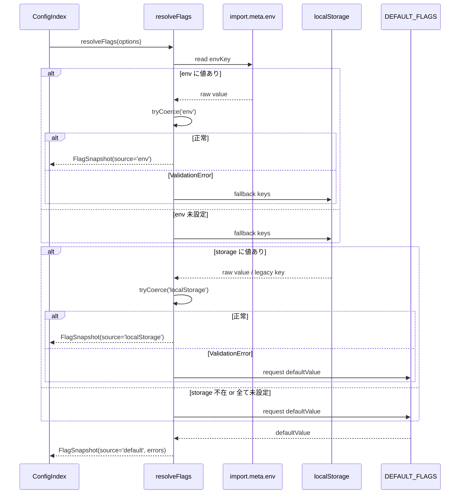
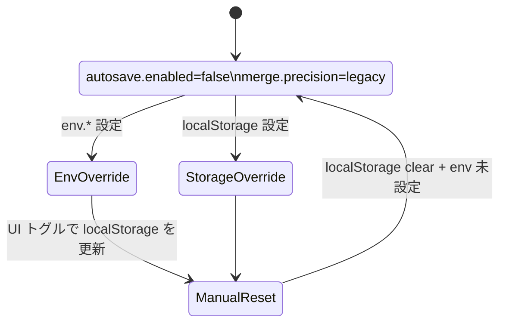

# フラグ解決モジュール設計（src/config/flags.ts）

AutoSave 仕様【F:docs/AUTOSAVE-DESIGN-IMPL.md†L1-L118】と Day8 アーキテクチャ整理【F:Day8/docs/day8/design/03_architecture.md†L1-L58】を踏まえ、`env → localStorage → 既定値` の優先順位とソース追跡を備えた `FlagSnapshot` 解決フローを定義する。

## 1. 単体テスト仕様（先行起票）

| ID | シナリオ | 入力条件 | 期待される出力 / 監視ポイント | 補足 |
| --- | --- | --- | --- | --- |
| T1 | env が boolean 文字列 | `env.VITE_AUTOSAVE_ENABLED='true'`、storage 未設定 | `autosave.enabled=true`、`source='env'`、`errors=[]`、`updatedAt` はモッククロック値 | `tests/config/flags.spec.ts` の `resolves_env_boolean` |
| T2 | env が不正・storage がフェールバック | `env.VITE_AUTOSAVE_ENABLED='INVALID'`、`storage['autosave.enabled']='0'` | `autosave.enabled=false`、`source='localStorage'`、`errors` に env エントリ1件、`code='invalid-boolean'` | 不正 env は Collector に転送（Day8 03_architecture 参照） |
| T3 | storage の legacy key を尊重 | `storage['flag:autoSave.enabled']='1'` のみ | `autosave.enabled=true`、`source='localStorage'`、`errors=[]` | Phase-a0 フェールセーフ確認 |
| T4 | precision env が大小混在 | `env.VITE_MERGE_PRECISION='BeTa'` | `merge.precision='beta'`、`source='env'`、`errors=[]` | `coerceMergePrecision` の大小文字吸収 |
| T5 | precision env 不正 + storage 正常 | `env.VITE_MERGE_PRECISION='ALPHA'`、`storage['merge.precision']='stable'` | `merge.precision='stable'`、`source='localStorage'`、`errors` に env 1 件 | 後方互換 storage 鍵（`flag:merge.precision`）も検証 |
| T6 | すべて未設定時のデフォルト | env/storage 未設定 | `autosave.enabled=false`、`merge.precision='legacy'`、`source='default'`、`errors=[]` | `DEFAULT_FLAGS` と docs/CONFIG_FLAGS.md の整合 |
| T7 | エラー独立性 | `env.VITE_AUTOSAVE_ENABLED='-1'`、`env.VITE_MERGE_PRECISION='ALPHA'`、storage 未設定 | 両フラグとも default、`errors` は各フラグ個別に 1 件ずつ、混在しない | Collector に送信する JSONL の整合 |
| T8 | `updatedAt` 安定化 | `clock` モックで固定日時を返却 | `FlagSnapshot.updatedAt` が `clock().toISOString()` と一致 | `ResolveOptions.clock` テストダブル |
| T9 | storage 不在環境 | `options.storage=null` 明示 | env 未設定時に default フォールバックし、storage アクセスしない | Node/SSR 対応 |

## 2. フラグ解決シーケンスと責務境界



- `FlagResolver`（`src/config/flags.ts`）は**値の正規化とソース判定のみ**を行い、副作用や UI ハンドリングは担わない。
- `FlagSnapshot` を `ConfigIndex` 経由で UI や AutoSave へ伝播し、`autosave.enabled=false` なら AutoSave 側で no-op を確実化する（AutoSave ドキュメントの不変条件参照）。
- 既存の `ResolveOptions` を活用し、テストと Node 環境での差し替えを許容する。

### 2.1 直接参照排除ロードマップ

| フェーズ | 対象 | 手順 | 完了条件 |
| --- | --- | --- | --- |
| phase-a0 | `App.tsx` / `MergeDock` | `src/config/index.ts` から `resolveFlags()` をインポートし、従来の `localStorage` 読み取りをフェールセーフとして残す | `FLAG_MIGRATION_PLAN` のとおり snapshot 経由で初期化してもリグレッションが無いことを QA で確認 |
| phase-a1 | AutoSave Runner | AutoSave 初期化時に `FlagSnapshot.autosave.enabled` を参照し、`localStorage` 直接アクセスを削除。テレメトリへ `FlagValidationError` を JSONL 送信 | Runner 初期化ログが snapshot の `source` を記録し、Collector が受理 |
| phase-b0 | Merge Precision UI/API | `merge.precision` を resolver のみで取得し、`legacyStorageKeys` を削除。UI トグルは `ConfigIndex` 経由で更新 | 旧キー参照が 0 件になり、`FLAG_MIGRATION_PLAN` の exit 条件を満たす |

Phase a0 では互換性のため `localStorage` 直読が残るが、以降のフェーズで段階的に排除する。`src/config/index.ts` は resolver をエクスポートするゲートウェイのみを担い、副作用を持たない。

## 3. FlagSnapshot 定義とバリデーション

| フィールド | 型 | 解釈 | バリデーション | エラー処理 |
| --- | --- | --- | --- | --- |
| `autosave.enabled` | `boolean` | AutoSave を起動するか | `coerceBoolean(raw)`：`'1'/'true'/'false'/'0'`。不正文字列は `ValidationError` | エラーを記録し `defaultValue` へフォールバック、`source` を `"default"` に固定 |
| `merge.precision` | `'legacy' \| 'beta' \| 'stable'` | マージアルゴリズム段階導入 | `coercePrecision(raw)`：`legacy/beta/stable` 大文字小文字不問 | 不正値は `ValidationError` を添えて `defaultValue='legacy'` に戻す |
| `source.*` | `FlagSource` | 値が採用されたソース | `env`/`localStorage`/`default` のみ許容 | 不一致はプログラミングエラー扱いで `assertUnreachable` |

- `ValidationError` は `Retryable=false` としてロギングのみ（AutoSave 側に副作用を波及させない）。
- 既存ローカルストレージキー (`flag:autoSave.enabled`, `flag:merge.precision`) をそのまま利用し、後方互換を維持する。

### 3.1 FlagSnapshot 型スケッチ

```ts
interface FlagSnapshot {
  readonly autosave: {
    readonly enabled: boolean
    readonly source: FlagSource
    readonly errors: readonly ValidationError[]
  }
  readonly merge: {
    readonly precision: 'legacy' | 'beta' | 'stable'
    readonly source: FlagSource
    readonly errors: readonly ValidationError[]
  }
  readonly updatedAt: string // ISO8601 for telemetry
}
```

- `errors` を各フラグ単位で保持し、Collector への JSONL 送出時に追跡可能とする（Day8 アーキテクチャの Collector 経路参照）。
- `updatedAt` は AutoSave テレメトリと整合するため `new Date().toISOString()` を採用。

### 3.2 既定値・露出条件・切替手段



- 既定値: `autosave.enabled=false`, `merge.precision='legacy'`。
- 露出条件: Phase-a0 では UI に露出しない。Phase-a1 で AutoSave 開発者向け設定パネルに `autosave.enabled` トグルを追加予定。Phase-b0 で MergeDock 内 `Precision` セレクタ公開。
- 切替手段: `env`（デプロイ単位 override）、`localStorage`（デバイス単位）、および将来的な UI トグルから `localStorage` を更新する。UI は `src/config/index.ts` 経由で resolver を呼び、直接 storage を触らない。

## 4. 正規化・フォールバックのエラーハンドリング

1. ソースを優先順位順に探索し、最初に取得した値を `tryCoerce` で正規化。
2. 正規化で `ValidationError` が発生したら `errors` に追加し、次のソースへフォールバック。
3. すべてのソースで失敗した場合は `defaultValue` を適用し、`source` を `"default"` に設定。
4. フォールバック後も `errors` は保持し、Collector へ通知する。
5. 例外は `ConfigFlagError`（`retryable=false`）としてラップし、呼出元がエラーバナーを抑制できるようにする。

## 5. I/O コントラクト

| 入力 | 型 | ノート |
| --- | --- | --- |
| `ResolveOptions.env` | `Record<string, unknown>` | Node/Vite 環境のメタ env を統合。テストでは任意値を注入可能。 |
| `ResolveOptions.storage` | `Pick<Storage, 'getItem'> \| null` | DOM が無い環境では `null` を明示。TDD では `StorageStub` を利用。 |
| `ResolveOptions.clock` | `() => Date` | `FlagSnapshot.updatedAt` を安定化させるためテストで差し替え。 |
| raw 値 | `string \| null \| undefined` | `attemptResolve()` で `string` に正規化し、空文字は未設定扱い。 |
| 既定値 | `DEFAULT_FLAGS` | `docs/CONFIG_FLAGS.md` と同期。 |

| 出力 | 型 | ノート |
| --- | --- | --- |
| `FlagValueSnapshot<T>` | `{ value: T; source: FlagSource; errors: FlagValidationError[] }` | `source` は `env`/`localStorage`/`default` のみ。 |
| `FlagSnapshot` | `{ autosave, merge, updatedAt }` | `autosave.enabled`/`merge.precision` が最終値。 |
| `FlagValidationError` | 既存定義 | `retryable=false` で Collector へ送信。 |

## 6. フェーズ整合性チェックリスト

| チェック項目 | フェーズ | Legacy 直接参照 | コントロール手段 | 検証方法 |
| --- | --- | --- | --- | --- |
| App/MergeDock が resolver を入口にする | phase-a0 | `localStorage.getItem` が UI 初期化に残存 | フェールセーフとして残すが Telemetry で監視 | QA で snapshot 取得成功と direct-read ログの減少を確認 |
| AutoSave Runner で snapshot が唯一の参照元 | phase-a1 | Runner 初期化時の `flag:autoSave.enabled` 読み | Runner 起動前に `resolveFlags()` を注入、Collector へ Validation JSONL | Day8 Collector 経路で `FlagValidationError` 受信を確認 |
| Merge Precision UI/API から legacy keys を排除 | phase-b0 | `legacyStorageKeys` 経由の読み込み | UI は `ConfigIndex` API を通す、legacy key はリードオンリーに移行 | `rg 'flag:merge.precision'` が UI コードから消えていること |
| Rollback 手順 | all | env/storage の切り替え | `ResolveOptions` 差し替えのみで挙動再現 | テスト T9 で Node/SSR を担保 |
| `updatedAt` の ISO8601 一貫性 | all | - | `clock` モックを必須化 | テスト T8 で検証 |
| エラー分離 | all | - | 各フラグ毎に `errors` を保持 | テスト T7 で検証 |

---

Autosave 実装詳細は `docs/AUTOSAVE-DESIGN-IMPL.md`、コンポーネント依存関係は `Day8/docs/day8/design/03_architecture.md` を参照。両ドキュメントとの整合を維持するため、本設計の更新時は該当セクション（AutoSave 保存ポリシー、Collector 経路、Config 層の責務）に影響が無いかレビューで確認する。

