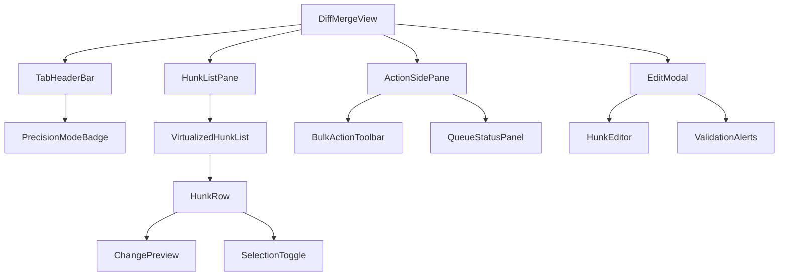
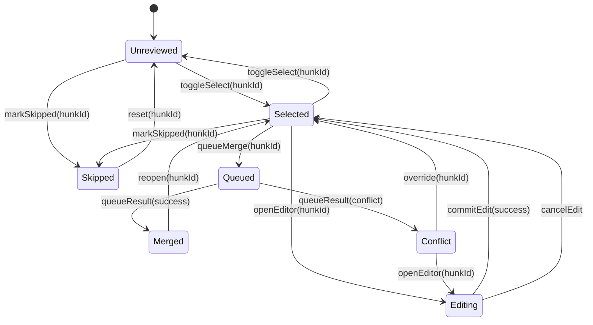

# DiffMergeView 設計

## 1. MergeDock 連携と露出条件
- `MergeDock` の `pref` 選択肢 `diff-merge` 選択時のみ `DiffMergeView` をレンダリングし、`merge.precision` フラグが `true` の環境でタブヘッダ（"Diff Merge" 仮称）を有効化する。タブ自体は既存タブ群の再配置を伴わず、新規タブボタンを追加するだけに留めることで既存 UI と後方互換性を維持する。【F:src/components/MergeDock.tsx†L24-L89】
- `merge.precision=false` の場合は従来どおり `pref` セレクタに `diff-merge` を表示せず、`DiffMergeView` へのルーティングもスキップする。フラグ判定は AutoSave 同様の設定解決ルール（フラグ優先・UI 無副作用）を踏襲する。【F:docs/AUTOSAVE-DESIGN-IMPL.md†L6-L63】
- `DiffMergeView` は `MergeDock` から `scenes`・`queueMergeCommand`・`merge.precision` を props 経由で受け取り、他タブと状態衝突しないようステートは内部管理に限定する。`queueMergeCommand` はタスク6で提供予定の Merge エンジン契約に従い、非同期コマンド投入専用 API として利用する（引数は後述の操作イベント契約で定義）。

## 2. コンポーネント構成

- `TabHeaderBar`: 既存タブ群に準じたスタイルで `Diff`, `Merged`, `Review` のサブタブを表現。`merge.precision` が false の場合はサブタブ全体を非表示にして既存レイアウトを変えない。
- `HunkListPane`: 仮想スクロール (`react-window` 相当) を前提に `VirtualizedHunkList` コンポーネントを内包し、各ハンク行で状態表示・選択操作をまとめる。ハンク行はフォーカス可能なボタン群とし、キーボード操作で移動・選択が可能なロービジョン対応を行う。
- `ActionSidePane`: 選択中ハンク／バルク操作を提供する側部ペイン。`queueMergeCommand` への操作集約と、進行中コマンドステータスを `QueueStatusPanel` で表示。
- `EditModal`: ハンク編集用モーダル。`ActionSidePane` から開かれ、`HunkEditor` で差分編集を行い `ValidationAlerts` で衝突などのガードを表示。

## 3. ハンク状態マシン

- 状態キーは `Unreviewed | Selected | Skipped | Editing | Queued | Merged | Conflict`。`Editing` はモーダル表示中のみの一時状態で、閉じると自動的に `Selected` へ戻す。
- `Queued` 以降の遷移は Merge エンジンのレスポンスを `queueMergeCommand` 経由で受領して更新する。`queueResult` は `success | conflict | error` を返し、`error` は `Selected` に戻して通知する。

## 4. 操作イベント契約
| イベント | トリガ | `queueMergeCommand` ペイロード | 副作用 |
| --- | --- | --- | --- |
| `toggleSelect` | ハンク行のチェックボックス / キーボード Enter | - | 内部状態のみ更新。
| `markSkipped` | ハンク行メニュー「Skip」 | `{ type: 'skip-hunk', hunkId }` | エンジンへスキップ登録、成功時に `Skipped` 状態。失敗時は `Selected` に戻す。
| `openEditor` | ActionSidePane の「Edit」ボタン / ハンク行のショートカット | - | `EditModal` を開き、編集開始 (`Editing`)。
| `commitEdit` | EditModal 保存 | `{ type: 'update-hunk', hunkId, payload: { patchedText } }` | 成功時に `Selected` 状態へ戻し差分を再計算。失敗時はモーダル内でエラー表示。
| `queueMerge` | ActionSidePane「Queue Merge」 / バルク実行 | `{ type: 'queue-merge', hunkIds: string[], mode: precisionMode }` | キュー投入後 `Queued`、レスポンスに応じて `Merged` / `Conflict` / `Selected` に遷移。
| `bulkSelectAll` | サブタブ「Diff」上部トグル | `{ type: 'prefetch-hunks', viewportRange }` | 表示範囲のハンクを先読みし選択状態へ。
| `reopen` | Merged ハンク行「Reopen」 | `{ type: 'reopen-hunk', hunkId }` | 再度レビュー対象として `Selected` に戻す。
| `override` | Conflict ハンク行「Force Apply」 | `{ type: 'force-merge', hunkId }` | エンジンへ強制適用を依頼し、成功時は `Merged`。失敗時は `Conflict` のまま保持。

## 5. テストケース草案
- `merge.precision` フラグ
  - precision=false: `DiffMergeView` タブが DOM に出現しない。
  - precision=true: タブが表示され、初期サブタブが `Diff` になる。
- ハンク状態遷移
  - `toggleSelect` で `Unreviewed` ↔ `Selected` を往復。
  - `markSkipped` で `Skipped` になり `reset` 操作で `Unreviewed` に戻る。
  - `queueMerge` 成功レスポンスで `Merged` へ、`conflict` で `Conflict` へ遷移。
- バルク操作
  - 表示中ハンクに対する `bulkSelectAll` が全行に `Selected` を適用し、`queueMerge` が配列で呼ばれる。
- EditModal 遷移
  - `openEditor` でモーダルが開き `Editing` 状態になる。
  - `commitEdit` 成功時にモーダルが閉じ `Selected` に戻る。失敗時はエラーバナー表示。
- アクセシビリティ
  - タブヘッダが `role="tablist"`、各タブに `aria-selected` を付与。
  - `HunkRow` が `aria-expanded` と `aria-controls` で詳細領域を結び付け、キーボード操作でフォーカス移動が可能。
- バーチャルスクロール
  - `VirtualizedHunkList` が 1000 ハンクのモックデータでもレンダー数がビューポート分のみであることをスナップショットで確認。

## 6. 今後の依存
- Merge エンジン契約（タスク6）で `queueMergeCommand` の詳細型が確定次第、上記ペイロードを具体化。
- フラグ解決（タスク3）で `merge.precision` の取得手段が整理され次第、`MergeDock` → `DiffMergeView` の props を正式実装。
