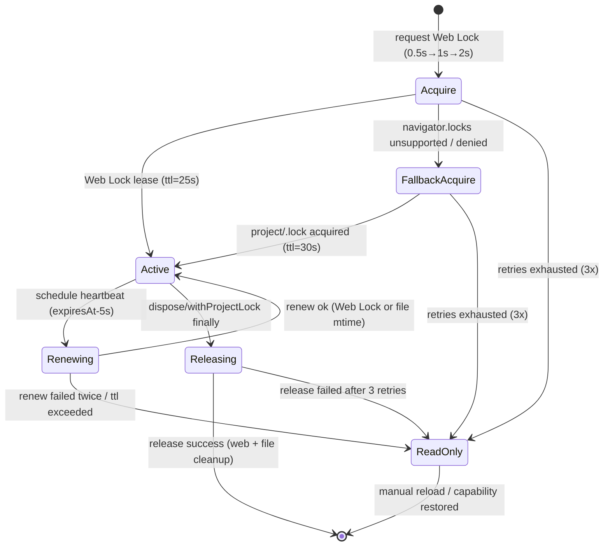

# AutoSave ロック設計メモ

## 1. ロック要件の抽出（docs/IMPLEMENTATION-PLAN.md より）
- Web Locks API (`navigator.locks.request('imgponic:project', { mode: 'exclusive' })`) を第一選択とする。
- ブラウザ依存の TTL を補うため、クライアント側でリース更新 API を内製し 25s TTL（安全マージン 5s）を擬似的に管理する。
- Web Lock が未実装・競合・失敗の場合は `project/.lock` に UUID・`mtime`・TTL(30s) を保持するフォールバックを適用する。
- 取得に失敗した場合は閲覧専用モードへ遷移し、UI へ警告イベントを送出する。
- Lock ファイルは `project/` 直下に限定し、Day8 Collector/Analyzer が扱う `workflow-cookbook/`・`logs/` 等へ副作用を波及させない。
## 0. 合意事項と受入基準
- Web Lock を第一優先とし、`navigator.locks` 非対応・拒否・競合時は `project/.lock` のフォールバックで UUID/TTL=30s を共有する。Acquire/renew/release のハートビートとバックオフは実装計画と詳細設計の §3.* を唯一の参照元とする。【F:docs/IMPLEMENTATION-PLAN.md†L63-L139】【F:docs/AUTOSAVE-DESIGN-IMPL.md†L108-L218】
- Heartbeat は `expiresAt-5s` で発火し、連続 2 回失敗または Acquire リトライ上限超過で閲覧専用モードへ移行する。閲覧専用化は UI・テレメトリへ `autosave.lock.readonly` を通知し、再取得はユーザー操作に委ねる。【F:docs/IMPLEMENTATION-PLAN.md†L97-L139】【F:docs/AUTOSAVE-DESIGN-IMPL.md†L142-L218】
- Collector/Analyzer の ETL（15 分間隔）を阻害しないよう、`.lock` ファイルは `project/` 直下のみ、イベントは JSONL 1 行で完結させる。Day8 パイプラインのアーキテクチャ境界を越える処理は禁止する。【F:docs/IMPLEMENTATION-PLAN.md†L120-L139】【F:Day8/docs/day8/design/03_architecture.md†L1-L31】

**受入基準**
1. Acquire→Active→Renew→Release のステートと遷移条件が Implementation Plan と AutoSave 詳細設計の要件と一致している。
2. `ProjectLockError.retryable` の真偽が表 3 の整理と一致し、閲覧専用化の条件が UI/Collector 伝搬要件を満たす。
3. テレメトリが `autosave.lock.*` で統一され、Collector/Analyzer の JSONL 契約へ追加副作用を発生させない。

## 1. `src/lib/locks.ts` 状態遷移ドラフト
AutoSave/精緻マージが `ProjectLockApi` を通じて利用するロックライフサイクルを、Web Locks 優先・ファイルロックをフォールバックとする形で整理する。実装計画と AutoSave 詳細設計に記載されたポリシーへ準拠する。【F:docs/IMPLEMENTATION-PLAN.md†L63-L139】【F:docs/AUTOSAVE-DESIGN-IMPL.md†L108-L218】

## 2. `src/lib/locks.ts` 状態図


## 3. `src/lib/locks.ts` API ドラフト
```ts
export type ProjectLockStrategy = 'web-lock' | 'file-lock';

export interface AcquireLockOptions {
  readonly signal?: AbortSignal;
  readonly ownerId?: string; // 省略時は origin + tabId hash
  readonly retryLimit?: number; // 既定 3
  readonly backoffMs?: readonly [number, number, number]; // 既定 [500, 1000, 2000]
}
    [*] --> Idle: ready
    Idle --> AcquireWebLock: acquireProjectLock()
    AcquireWebLock --> ActiveWebLock: navigator.locks.request ok (TTL=25s)
    AcquireWebLock --> AcquireFileLock: unsupported/denied/timeout
    AcquireWebLock --> Idle: abort/cancelled
    AcquireFileLock --> ActiveFileLock: project/.lock persisted (TTL=30s)
    AcquireFileLock --> Readonly: conflict unresolved
    AcquireFileLock --> Idle: abort/cancelled
    ActiveWebLock --> HeartbeatQueued: schedule expiresAt-5s heartbeat
    ActiveFileLock --> HeartbeatQueued: schedule expiresAt-5s heartbeat
    HeartbeatQueued --> Renewing: renewProjectLock()
    Renewing --> ActiveWebLock: Web Lock renewed
    Renewing --> ActiveFileLock: `.lock` mtime updated
    Renewing --> Readonly: renew retries exhausted / lease stale
    ActiveWebLock --> Releasing: releaseProjectLock()
    ActiveFileLock --> Releasing: releaseProjectLock()
    Releasing --> Idle: release ok / cleanup done
    Releasing --> Readonly: release retries exhausted
    Readonly --> Idle: manual reset / force release succeeds
```

### 状態遷移補足
- `Readonly` 遷移は AutoSave を閲覧専用モードへ落とし、UI と Collector へ警告を送る。
- `HeartbeatQueued` は `expiresAt-5s` でトリガーする心拍タイマー。`Renewing` が `retryable=true` の場合は指数バックオフ（0.5s→1s→2s→4s）で `HeartbeatQueued` へ戻る。
- `Renewing` 中に `lease-stale` 判定となった場合、フォールバックファイルを削除して再取得を促す。再取得も失敗した場合は `Readonly` 固定。
- `Releasing` で発生した `.lock` 削除失敗は最大 3 回までバックオフ再試行し、最終失敗時のみ `Readonly` を通知する。

## 2. API 一覧（責務と失敗モード）
| API | 主な副作用 | 失敗モード (`ProjectLockError.code`) | retryable | 再試行ポリシー | 備考 |
| --- | --- | --- | --- | --- | --- |
| `acquireProjectLock(options)` | Web Lock 取得、フォールバック `.lock` 作成 | `web-lock-unsupported`, `acquire-denied`, `acquire-timeout`, `fallback-conflict` | `unsupported`: false, 他: true (timeout は上限回数後 false) | `backoff` (初期 500ms, ×2, `MAX_LOCK_RETRIES` まで) | AbortSignal でキャンセル可。成功時は `strategy` と `expiresAt` を含むリースを返却。【F:docs/IMPLEMENTATION-PLAN.md†L97-L106】 |
| `renewProjectLock(lease, options)` | Web Lock 再リクエスト or `.lock` mtime 更新 | `lease-stale`, `renew-failed` | `renew-failed`: true, `lease-stale`: false | 心拍タイマーごとに指数バックオフ、連続失敗で `Readonly` | TTL 超過で lease を破棄し再取得誘導。【F:docs/AUTOSAVE-DESIGN-IMPL.md†L142-L218】 |
| `releaseProjectLock(lease, options)` | Web Lock 解放、`.lock` 削除 | `release-failed` | true（force 時 false） | `backoff` で最大 3 回。最終失敗は ReadOnly 通知。 | `force=true` の場合はフォールバックファイル削除を試行し、Collector へ `lock:release-failed` を発火。 |
| `withProjectLock(fn, options)` | 上記取得→コールバック→解放 | 取得/更新/解放で発生したコードをそのまま伝播 | 呼び出し元へ伝播 | Acquire のリトライ設定を継承 | `releaseOnError=false` の場合は呼び出し側が明示 release。 |
| `subscribeLockEvents(listener)` | イベントストリーム購読 | - | - | - | `ProjectLockEvent` により UI・テレメトリへ通知。 |

export interface ProjectLockLease {
  readonly leaseId: string;
  readonly strategy: ProjectLockStrategy;
  readonly acquiredAt: string; // ISO8601
  readonly expiresAt: string; // ISO8601
}

export interface ProjectLockReadonlyInfo {
  readonly reason: ProjectLockErrorCode;
  readonly lastError?: ProjectLockError;
}
### テレメトリイベント案
| `type` | 主要フィールド | 発火タイミング | 備考 |
| --- | --- | --- | --- |
| `autosave.lock.attempt` | `strategy`, `retry`, `leaseId?` | Acquire / Renew / Release 開始時 | `strategy` に `web-lock`/`file-lock`。`retry` は 0 起点。 |
| `autosave.lock.acquired` | `leaseId`, `strategy`, `expiresAt` | ロック獲得直後 | Acquire 成功時のみ。`expiresAt` は 25s/30s ベース。 |
| `autosave.lock.renewed` | `leaseId`, `strategy`, `retry` | 心拍更新成功時 | `retry` で直前の失敗回数を示し、Analyzer が復旧率を算出。 |
| `autosave.lock.readonly-entered` | `reason`, `retry`, `leaseId?` | Acquire/Renew/Release で閾値到達 | UI の閲覧専用化と同期し、Incident 判定に利用。 |
| `autosave.lock.release-failed` | `leaseId`, `retry`, `force` | Release 再試行時 | `force` が true の場合はフォールバック削除を試行済み。 |
| `autosave.lock.released` | `leaseId`, `strategy`, `durationMs` | Release 成功時 | Acquire からの保持時間を記録し、SLO に活用。 |

## 3. 失敗モードとリトライ可否整理
| フェーズ | 想定エラー | `retryable` | ReadOnly 遷移条件 | Collector/Analyzer 影響 | テレメトリ試験観点 |
| --- | --- | --- | --- | --- | --- |
| Web Lock 取得 | Web Locks 未対応 (`web-lock-unsupported`) | false | 直ちにフォールバック切替。フォールバックも失敗で readonly。 | `.lock` 運用へ移行するだけで既存 ETL へ影響なし。 | Web Lock 不在環境で `lock:attempt`(`strategy='web-lock'`)→`lock:acquired`(`strategy='file-lock'`) のシーケンスを検証。 |
| Web Lock 取得 | 権限拒否/タイムアウト (`acquire-denied`/`acquire-timeout`) | true (上限超過で false) | `MAX_LOCK_RETRIES` 消費後に readonly。 | Acquire 遅延で AutoSave が停止中となるが、Collector の JSONL は継続。 | バックオフイベント (`lock:attempt`, `retry`) が JSONL に累積されること。 |
| フォールバック取得 | `.lock` 有効リース (`fallback-conflict`) | true（最大 `MAX_LOCK_RETRIES`） | stale 判定失敗で readonly。 | 競合で AutoSave が停止するが `.lock` は Day8 の監視対象外。 | 競合再現テストで `lock:readonly-entered` に `reason='fallback-conflict'` が載ること。 |
| 心拍更新 | `.lock` ステール (`lease-stale`) | false | 検知時に即 readonly。 | 保存欠落が発生し得るが Analyzer への入力スキーマは不変。 | `lock:readonly-entered` の `reason='lease-stale'` を確認。 |
| 心拍更新 | API 例外 (`renew-failed`) | true | 連続 2 回失敗で readonly。 | 成功すれば Collector は警告のみで継続。 | 指数バックオフ後の `lock:renewed` で `retry` が増えること。 |
| 解放 | 削除失敗 (`release-failed`) | true（force 以降 false） | 3 回失敗で readonly 通知を維持。 | `.lock` 残骸でも Day8 側のディレクトリ境界外。 | 解放失敗→再試行→成功のイベント順序。 |

export type ProjectLockEvent =
  | { type: 'lock:attempt'; strategy: ProjectLockStrategy; retry: number }
  | { type: 'lock:acquired'; lease: ProjectLockLease }
  | { type: 'lock:renew-scheduled'; lease: ProjectLockLease; nextHeartbeatInMs: number }
  | { type: 'lock:renewed'; lease: ProjectLockLease }
  | { type: 'lock:release-requested'; lease: ProjectLockLease }
  | { type: 'lock:released'; leaseId: string }
  | { type: 'lock:readonly-entered'; info: ProjectLockReadonlyInfo };

export type ProjectLockErrorCode =
  | 'web-lock-unsupported'
  | 'acquire-denied'
  | 'acquire-timeout'
  | 'fallback-conflict'
  | 'lease-stale'
  | 'renew-failed'
  | 'release-failed';
## 5. テレメトリ観点テストリスト
1. Web Locks 利用可能環境で `lock:acquired`→`lock:renewed`→`lock:released` のイベントシーケンスが Collector へ JSONL 連携される。
2. Web Locks 不在環境で `fallback-conflict` まで再現し、`lock:readonly-entered` に `reason='fallback-conflict'` が設定される。
3. 心拍失敗 (`renew-failed`) を 2 回発生させた後、3 回目で成功し `retry` カウントが増加する。
4. 解放失敗 (`release-failed`) によりバックオフ後の再試行が成功し、`lock:released` が最終的に発生する。
5. AutoSave 停止後も Collector の JSONL が Analyzer で正しく集計される（`feature=autosave` フィルタで抽出可能）。

export interface ProjectLockError extends Error {
  readonly code: ProjectLockErrorCode;
  readonly retryable: boolean;
  readonly cause?: unknown;
  readonly context?: Record<string, unknown>;
}

export interface ProjectLockApi {
  acquireProjectLock(opts?: AcquireLockOptions): Promise<ProjectLockLease>;
  renewProjectLock(lease: ProjectLockLease): Promise<ProjectLockLease>;
  releaseProjectLock(lease: ProjectLockLease): Promise<void>;
  withProjectLock<T>(fn: (lease: ProjectLockLease) => Promise<T>, opts?: AcquireLockOptions): Promise<T>;
  subscribeLockEvents(listener: (event: ProjectLockEvent) => void): () => void;
}
```

## 4. 例外分類と `retryable` 判定（docs/AUTOSAVE-DESIGN-IMPL.md §3 より）
| Error `code` | Web Locks / フォールバック対応 | retryable | 背景 |
| --- | --- | --- | --- |
| `web-lock-unsupported` | Web Locks 未実装時に発火。フォールバックへ即移行。 | false | フォールバック強制切替で再試行不要。 |
| `acquire-denied` | Web Lock が競合で拒否。フォールバックも競合時は同様。 | true | 0.5s→1s→2s の指数バックオフで最大 3 回再試行。 |
| `acquire-timeout` | Web Lock 応答なし / `.lock` stale 判定の失敗。 | true | Acquire やり直しで回復期待。 |
| `fallback-conflict` | `.lock` が TTL 以内で他タブ所有。 | true | TTL 失効待ち後に再取得。 |
| `lease-stale` | `expiresAt` 超過時に再取得が必要。 | true | Renew 失敗後に Acquire へ戻す。 |
| `renew-failed` | Heartbeat 連続失敗。 | true → 2 回連続で readonly 移行。 |
| `release-failed` | Web Lock release / `.lock` 削除失敗。 | true | 3 回まで再試行、失敗時 readonly 通知。 |

## 5. イベント通知と Day8 パイプラインへの影響
- `lock:*` イベントは Collector 既存スキーマ（JSONL）と干渉しない命名を採用し、Collector が収集する `workflow-cookbook/` 系ログを生成しない。
- `lock:readonly-entered` イベントで閲覧専用モードへ遷移する際、AutoSave は保存 I/O を停止し、Analyzer が参照する `reports/` 配下の成果物を変更しない。
- Heartbeat（renew）や release のイベントは Telemetry 向けに留め、Collector への自動送信は行わない方針とする。

### Collector / Analyzer への適用指針
1. Lock 関連ログは `project/autosave/` 配下に限定し、Day8 パイプライン（Collector→Analyzer→Reporter）の入力ディレクトリを汚染しない。
2. ReadOnly 遷移時は UI 通知のみで `workflow-cookbook/logs` の JSONL 出力を発生させず、Analyzer のメトリクス計算に影響を与えない。
3. 将来的にロックイベントをメトリクス化する場合は、Collector で別チャンネル (`autosave.lock.*`) を新設し、既存 Observation Channel と衝突させない。

## 6. 今後の実装ノート
- Web Lock とフォールバックで共通のリース構造 (`ProjectLockLease`) を維持し、AutoSave からは戦略非依存で扱えるようにする。
- `withProjectLock` は Acquire→fn→Release の例外処理を包含し、`retryable` エラーのみを内部で再試行する。
- Heartbeat タイマーは `expiresAt - 5000ms` で起動し、連続失敗時に `lock:readonly-entered` を通知して AutoSave 停止を促す。
```
