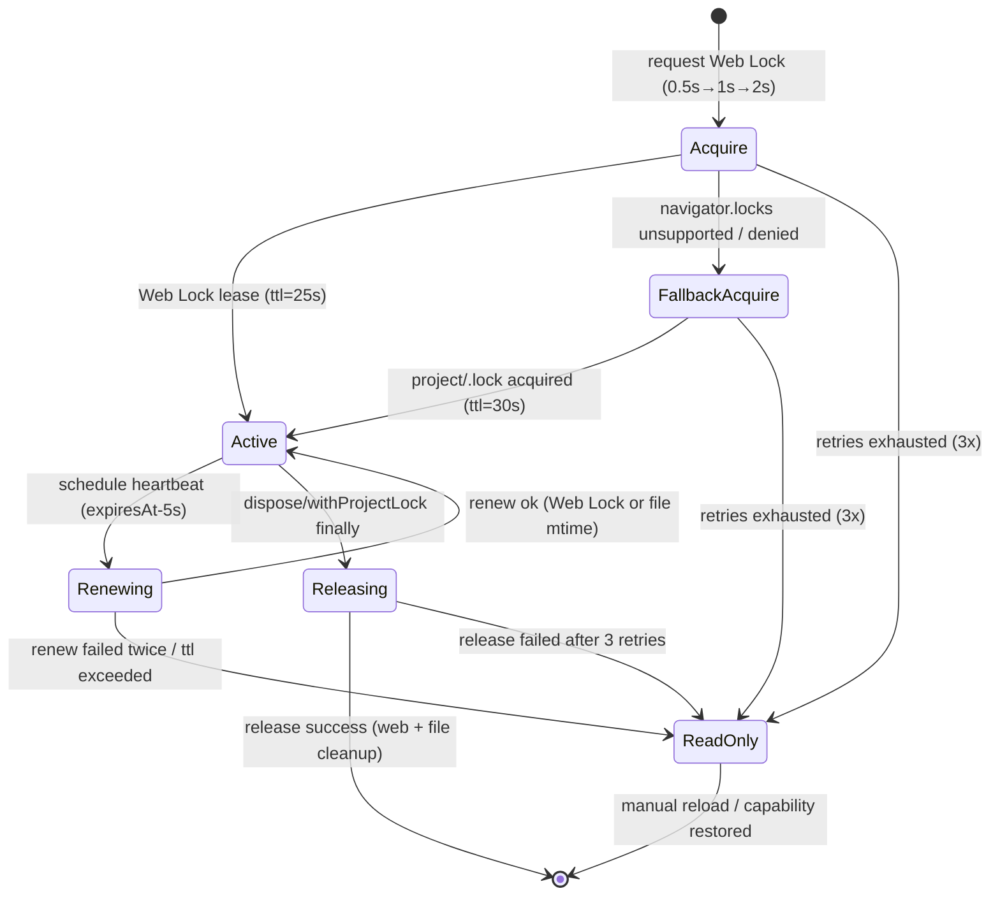

# AutoSave ロック設計メモ

## 1. ロック要件の抽出（docs/IMPLEMENTATION-PLAN.md より）
- Web Locks API (`navigator.locks.request('imgponic:project', { mode: 'exclusive' })`) を第一選択とする。
- ブラウザ依存の TTL を補うため、クライアント側でリース更新 API を内製し 25s TTL（安全マージン 5s）を擬似的に管理する。
- Web Lock が未実装・競合・失敗の場合は `project/.lock` に UUID・`mtime`・TTL(30s) を保持するフォールバックを適用する。
- 取得に失敗した場合は閲覧専用モードへ遷移し、UI へ警告イベントを送出する。
- Lock ファイルは `project/` 直下に限定し、Day8 Collector/Analyzer が扱う `workflow-cookbook/`・`logs/` 等へ副作用を波及させない。

## 2. `src/lib/locks.ts` 状態図


## 3. `src/lib/locks.ts` API ドラフト
```ts
export type ProjectLockStrategy = 'web-lock' | 'file-lock';

export interface AcquireLockOptions {
  readonly signal?: AbortSignal;
  readonly ownerId?: string; // 省略時は origin + tabId hash
  readonly retryLimit?: number; // 既定 3
  readonly backoffMs?: readonly [number, number, number]; // 既定 [500, 1000, 2000]
}

export interface ProjectLockLease {
  readonly leaseId: string;
  readonly strategy: ProjectLockStrategy;
  readonly acquiredAt: string; // ISO8601
  readonly expiresAt: string; // ISO8601
}

export interface ProjectLockReadonlyInfo {
  readonly reason: ProjectLockErrorCode;
  readonly lastError?: ProjectLockError;
}

export type ProjectLockEvent =
  | { type: 'lock:attempt'; strategy: ProjectLockStrategy; retry: number }
  | { type: 'lock:acquired'; lease: ProjectLockLease }
  | { type: 'lock:renew-scheduled'; lease: ProjectLockLease; nextHeartbeatInMs: number }
  | { type: 'lock:renewed'; lease: ProjectLockLease }
  | { type: 'lock:release-requested'; lease: ProjectLockLease }
  | { type: 'lock:released'; leaseId: string }
  | { type: 'lock:readonly-entered'; info: ProjectLockReadonlyInfo };

export type ProjectLockErrorCode =
  | 'web-lock-unsupported'
  | 'acquire-denied'
  | 'acquire-timeout'
  | 'fallback-conflict'
  | 'lease-stale'
  | 'renew-failed'
  | 'release-failed';

export interface ProjectLockError extends Error {
  readonly code: ProjectLockErrorCode;
  readonly retryable: boolean;
  readonly cause?: unknown;
  readonly context?: Record<string, unknown>;
}

export interface ProjectLockApi {
  acquireProjectLock(opts?: AcquireLockOptions): Promise<ProjectLockLease>;
  renewProjectLock(lease: ProjectLockLease): Promise<ProjectLockLease>;
  releaseProjectLock(lease: ProjectLockLease): Promise<void>;
  withProjectLock<T>(fn: (lease: ProjectLockLease) => Promise<T>, opts?: AcquireLockOptions): Promise<T>;
  subscribeLockEvents(listener: (event: ProjectLockEvent) => void): () => void;
}
```

## 4. 例外分類と `retryable` 判定（docs/AUTOSAVE-DESIGN-IMPL.md §3 より）
| Error `code` | Web Locks / フォールバック対応 | retryable | 背景 |
| --- | --- | --- | --- |
| `web-lock-unsupported` | Web Locks 未実装時に発火。フォールバックへ即移行。 | false | フォールバック強制切替で再試行不要。 |
| `acquire-denied` | Web Lock が競合で拒否。フォールバックも競合時は同様。 | true | 0.5s→1s→2s の指数バックオフで最大 3 回再試行。 |
| `acquire-timeout` | Web Lock 応答なし / `.lock` stale 判定の失敗。 | true | Acquire やり直しで回復期待。 |
| `fallback-conflict` | `.lock` が TTL 以内で他タブ所有。 | true | TTL 失効待ち後に再取得。 |
| `lease-stale` | `expiresAt` 超過時に再取得が必要。 | true | Renew 失敗後に Acquire へ戻す。 |
| `renew-failed` | Heartbeat 連続失敗。 | true → 2 回連続で readonly 移行。 |
| `release-failed` | Web Lock release / `.lock` 削除失敗。 | true | 3 回まで再試行、失敗時 readonly 通知。 |

## 5. イベント通知と Day8 パイプラインへの影響
- `lock:*` イベントは Collector 既存スキーマ（JSONL）と干渉しない命名を採用し、Collector が収集する `workflow-cookbook/` 系ログを生成しない。
- `lock:readonly-entered` イベントで閲覧専用モードへ遷移する際、AutoSave は保存 I/O を停止し、Analyzer が参照する `reports/` 配下の成果物を変更しない。
- Heartbeat（renew）や release のイベントは Telemetry 向けに留め、Collector への自動送信は行わない方針とする。

### Collector / Analyzer への適用指針
1. Lock 関連ログは `project/autosave/` 配下に限定し、Day8 パイプライン（Collector→Analyzer→Reporter）の入力ディレクトリを汚染しない。
2. ReadOnly 遷移時は UI 通知のみで `workflow-cookbook/logs` の JSONL 出力を発生させず、Analyzer のメトリクス計算に影響を与えない。
3. 将来的にロックイベントをメトリクス化する場合は、Collector で別チャンネル (`autosave.lock.*`) を新設し、既存 Observation Channel と衝突させない。

## 6. 今後の実装ノート
- Web Lock とフォールバックで共通のリース構造 (`ProjectLockLease`) を維持し、AutoSave からは戦略非依存で扱えるようにする。
- `withProjectLock` は Acquire→fn→Release の例外処理を包含し、`retryable` エラーのみを内部で再試行する。
- Heartbeat タイマーは `expiresAt - 5000ms` で起動し、連続失敗時に `lock:readonly-entered` を通知して AutoSave 停止を促す。
```
