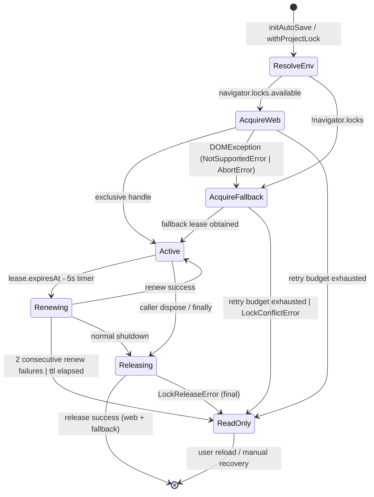

# AutoSave ロック設計メモ（v1.3 下書き）

## 1. 目的とスコープ
- `src/lib/locks.ts` の Web Lock 優先ロック制御とフォールバック (`project/.lock`) オーケストレーションの振る舞いを定義する。
- `docs/IMPLEMENTATION-PLAN.md` の「ロックモジュール要件整理」と `docs/AUTOSAVE-DESIGN-IMPL.md` §3 の制約に適合していることを確認する。
- AutoSave/Collector/Analyzer 連携で必要となるテレメトリ、UIイベント、例外分類、TDD 前提テストを整理する。

## 2. 状態図（Web Lock → フォールバック遷移）


- `ResolveEnv` フェーズでフラグ `autosave.enabled` と `AcquireLockOptions.mode` を評価し、`docs/IMPLEMENTATION-PLAN.md` の Web Lock 優先ポリシーに従う。【F:docs/IMPLEMENTATION-PLAN.md†L32-L56】
- `AcquireWeb` 失敗時は `DOMException.name` に応じてフォールバックへ遷移し、指数バックオフ（0.5→1→2s、最大3回）で再試行する (`docs/AUTOSAVE-DESIGN-IMPL.md` §3.4)。【F:docs/AUTOSAVE-DESIGN-IMPL.md†L99-L149】
- `AcquireFallback` では `project/.lock` の TTL 30s、`updatedAt`/`mtime` の二重チェックで競合判定し、`LockConflictError` を非再試行扱いとして閲覧専用モードに遷移する。【F:docs/AUTOSAVE-DESIGN-IMPL.md†L120-L164】

## 3. API シグネチャ（案）
```ts
export interface AcquireLockOptions {
  readonly ownerHint?: string;
  readonly signal?: AbortSignal;
  readonly retry?: { attempts?: number; baseDelayMs?: number };
  readonly allowFallback?: boolean; // default true
}

export interface ProjectLockLease {
  readonly leaseId: string;
  readonly origin: string;
  readonly acquiredAt: number; // epoch ms
  readonly expiresAt: number;  // epoch ms (<= acquiredAt + 25_000)
  readonly mode: 'web' | 'fallback';
  readonly fallbackPath?: string; // when mode === 'fallback'
}

type LockEventType =
  | 'lock.acquired'
  | 'lock.renewed'
  | 'lock.released'
  | 'lock.retry'
  | 'lock.conflict'
  | 'lock.readonly'
  | 'lock.error';

export interface ProjectLockEvent {
  readonly type: LockEventType;
  readonly lease: ProjectLockLease | null;
  readonly attempt?: number;
  readonly retryable?: boolean;
  readonly reason?: 'conflict' | 'timeout' | 'irrecoverable';
  readonly cause?: unknown;
}

export interface LockTelemetryEmitter {
  record(event: ProjectLockEvent): void;
}

export type LockEventListener = (event: ProjectLockEvent) => void;

export async function acquireProjectLock(
  options?: AcquireLockOptions
): Promise<ProjectLockLease>;

export async function renewProjectLock(
  lease: ProjectLockLease,
  options?: Pick<AcquireLockOptions, 'signal'>
): Promise<ProjectLockLease>;

export async function releaseProjectLock(
  lease: ProjectLockLease,
  options?: Pick<AcquireLockOptions, 'signal'>
): Promise<void>;

export async function withProjectLock<T>(
  fn: (lease: ProjectLockLease) => Promise<T>,
  options?: AcquireLockOptions
): Promise<T>;

export function subscribeLockEvents(
  listener: LockEventListener
): () => void;

export function bindTelemetryEmitter(emitter: LockTelemetryEmitter): void;
```

- `bindTelemetryEmitter` で Collector 連携のフックを外部注入し、Analyzer の JSONL スキーマを侵さない（`Day8/docs/day8/design/03_architecture.md` の Collector→Analyzer パイプラインにおける副作用隔離）。【F:Day8/docs/day8/design/03_architecture.md†L1-L32】
- `ProjectLockLease.expiresAt` は Web Lock 時 25s（`docs/AUTOSAVE-DESIGN-IMPL.md` §3.1）を標準値とし、フォールバックは `updatedAt + ttlSeconds` を採用する。

## 4. テレメトリ & UI イベント列挙
| Event | 発火タイミング | Payload 例 | Collector チャネル | UI 連携 |
| --- | --- | --- | --- | --- |
| `autosave.lock.acquired` | Web Lock / フォールバック取得成功 | `{ leaseId, mode, expiresAt }` | JSONL (`feature=autosave`) | AutoSaveIndicator で点灯 |
| `autosave.lock.retry` | 再試行時 | `{ attempt, retryable, delayMs }` | JSONL | トースト「再試行中」 |
| `autosave.lock.conflict` | 競合検出 (`LockConflictError`) | `{ leaseId, ownerHint }` | JSONL（severity=warn） | 閲覧専用バナー |
| `autosave.lock.readonly` | 再試行上限越え/TTL超過 | `{ reason }` | JSONL（severity=error） | 編集入力を disable |
| `autosave.lock.renewed` | リース更新成功 | `{ leaseId, mode, expiresAt }` | JSONL | 心拍表示更新 |
| `autosave.lock.error` | 例外発生（`retryable` true/false） | `{ code, retryable, cause }` | JSONL | エラートースト |
| `autosave.lock.released` | 解放完了 | `{ leaseId, mode }` | JSONL | Indicator 消灯 |

- イベント名は `docs/IMPLEMENTATION-PLAN.md` の命名ポリシー（`autosave.lock.*`）を踏襲する。【F:docs/IMPLEMENTATION-PLAN.md†L124-L138】
- Collector 側は JSONL の `feature=autosave` タグを既存チャネルに付与し、Analyzer は従来どおりログを走査するだけで新規メトリクス（取得成功率・競合率）を算出できる。

## 5. テスト観点と `tests/` 追加案
| 観点 | テスト種別 | 追加予定ファイル | 概要 |
| --- | --- | --- | --- |
| Web Lock 取得成功 | node:test (JSDOM モック) | `tests/locks/acquire.spec.ts` | `navigator.locks.request` が即成功するケースで `lock.acquired` イベントと `expiresAt` 25s を検証。
| フォールバック取得（Web Lock 非対応） | node:test | `tests/locks/fallback.spec.ts` | `navigator.locks` 未定義時に OPFS スタブ経由で `.lock` JSON を生成し、モード `fallback` を返すことを確認。
| 競合検出 → 閲覧専用移行 | node:test | `tests/locks/conflict.spec.ts` | `.lock` の `leaseId` 不一致/`mtime` 有効時に `LockConflictError` と `lock.readonly` イベントを検証。
| リース更新失敗の再試行 | node:test | `tests/locks/renew.spec.ts` | `renewProjectLock` で 2 回失敗→閲覧専用遷移を検証し、`retryable` フラグのハンドリングを確認。
| 解放失敗のバックグラウンド再試行 | node:test | `tests/locks/release.spec.ts` | `releaseProjectLock` が OPFS remove 失敗を投げた際に `LockReleaseError`（`retryable=true`）を送出し、再試行スケジュールを記録することを確認。
| UI イベント配信 | node:test | `tests/locks/events.spec.ts` | `subscribeLockEvents` で購読したリスナーへ順序通りイベントが届くことをアサート。

- すべて TDD で先行実装し、`node:test` ランナー＋`ts-node` 変換で `strict` 型チェックを通す。

## 6. 例外階層と `retryable` ルール
| 例外名 | `retryable` | 主なトリガー | 対応 | Analyzer/Collector 影響 |
| --- | --- | --- | --- | --- |
| `LockAcquisitionError` | true | Web Lock 一時失敗、OPFS 書き込みロック競合 | 指数バックオフで `autosave.lock.retry` 連続送出 | Collector は `retryable=true` を評価し、Analyzer が再試行回数メトリクスを算出。
| `LockConflictError` | false | `.lock` の他タブ占有、`mtime` 有効 | 即時 `autosave.lock.conflict` → 閲覧専用 | Analyzer は `severity=error` として競合率を SLO に加味。
| `LockRenewalError` | true | Web Lock 再取得失敗、フォールバック `mtime` 更新失敗 | 2 回連続で `autosave.lock.readonly` | Collector は連続失敗をバッチ集計、Analyzer は TTL 遵守を監視。
| `LockReleaseError` | true | Web Lock release 例外、`project/.lock` 削除失敗 | バックグラウンド再試行（最大3回） | Analyzer は未解放率を報告、`workflow-cookbook` のパスには触れない（Day8 方針準拠）。
| `LockIrrecoverableError` | false | OPFS 破損、不整合検知 | 即時停止 + ユーザ通知 | Collector は重大アラート、Analyzer は Postmortem トリガー。

- `retryable` 判定は `docs/AUTOSAVE-DESIGN-IMPL.md` §3.4 の方針を踏襲し、`LockConflictError` のみを非再試行に分類する。【F:docs/AUTOSAVE-DESIGN-IMPL.md†L135-L149】
- Analyzer/Collector は `Day8/docs/day8/design/03_architecture.md` が定義する JSONL パイプラインに従い、ロック関連ログは `workflow-cookbook/` 以下を汚染しない（`project/.lock` のみに限定）。【F:Day8/docs/day8/design/03_architecture.md†L1-L32】【F:docs/IMPLEMENTATION-PLAN.md†L56-L71】

## 7. レビュー観点
1. Web Lock 非対応ブラウザでのフォールバック取得パスが `project/` 配下に限定され、Day8 アーティファクトを生成しないこと。
2. `retryable` フラグの付与が UI と Collector 双方で一貫して扱える構造体になっていること。
3. `subscribeLockEvents` のリスナー解除がメモリリークを起こさない（`() => void` の破棄関数を必ず返す）。
4. `withProjectLock` が例外時でも `releaseProjectLock` を確実に呼び出し、二重解放を防ぐこと。
5. 既存 AutoSave API (`initAutoSave`) からの移行が段階的に可能で、Public API 互換性を壊さないこと。

## 8. TDD テストリスト
- [ ] `acquireProjectLock` が Web Lock 正常取得を返す。
- [ ] Web Lock 非対応時にフォールバックを生成する。
- [ ] `.lock` 競合で `LockConflictError` を throw し UI が閲覧専用へ遷移する。
- [ ] 連続更新失敗で `autosave.lock.readonly` イベントが届く。
- [ ] `releaseProjectLock` 失敗時に `LockReleaseError.retryable === true` が送出される。
- [ ] `withProjectLock` が例外時もリソース解放する。
- [ ] `bindTelemetryEmitter` で Collector へのメトリクスレコードが漏れなく送信される。
