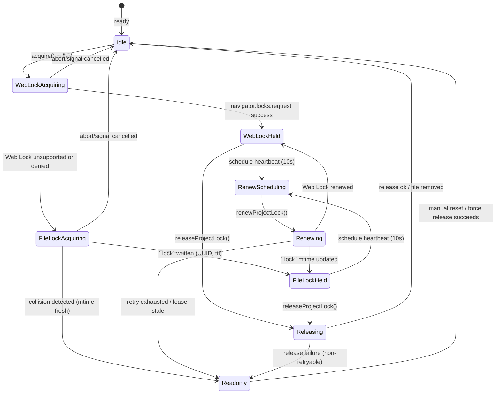

# AutoSave ロック設計メモ

## 1. `src/lib/locks.ts` 状態遷移ドラフト
AutoSave/精緻マージが `ProjectLockApi` を通じて利用するロックライフサイクルを、Web Locks 優先・ファイルロックをフォールバックとする形で整理する。実装計画と AutoSave 詳細設計に記載されたポリシーへ準拠する。【F:docs/IMPLEMENTATION-PLAN.md†L63-L106】【F:docs/AUTOSAVE-DESIGN-IMPL.md†L27-L79】

### 状態遷移補足
- `Readonly` 遷移は AutoSave を閲覧専用モードへ落とし、UI と Collector へ警告を送る。
- `RenewScheduling` は `LOCK_HEARTBEAT_INTERVAL_MS` に基づく心拍タイマーを表す。`Renewing` が失敗しても `retryable=true` であればバックオフ後に `RenewScheduling` へ戻る。
- `Renewing` 中に `lease.stale` 判定となった場合、フォールバックファイルを削除して再取得を促す。再取得も失敗した場合は `Readonly` 固定。

## 2. API 一覧（責務と失敗モード）
| API | 主な副作用 | 失敗モード (`ProjectLockError.code`) | retryable | 再試行ポリシー | 備考 |
| --- | --- | --- | --- | --- | --- |
| `acquireProjectLock(options)` | Web Lock 取得、フォールバック `.lock` 作成 | `web-lock-unsupported`, `acquire-denied`, `acquire-timeout`, `fallback-conflict` | `unsupported`: false, 他: true (timeout は上限回数後 false) | `backoff` (初期 500ms, ×2, `MAX_LOCK_RETRIES` まで) | AbortSignal でキャンセル可。最終失敗時は閲覧専用化。【F:docs/IMPLEMENTATION-PLAN.md†L97-L106】 |
| `renewProjectLock(lease, options)` | Web Lock 再リクエスト or `.lock` mtime 更新 | `lease-stale`, `renew-failed` | `renew-failed`: true, `lease-stale`: false | 心拍タイマーごとに指数バックオフ、連続失敗で `Readonly` | TTL 超過で lease を破棄し再取得誘導。【F:docs/AUTOSAVE-DESIGN-IMPL.md†L80-L142】 |
| `releaseProjectLock(lease, options)` | Web Lock 解放、`.lock` 削除 | `release-failed` | true（force 時 false） | `backoff` で最大 3 回。最終失敗は ReadOnly 通知。 | `force=true` の場合はフォールバックファイル削除を試行。 |
| `withProjectLock(fn, options)` | 上記取得→コールバック→解放 | 取得/更新/解放で発生したコードをそのまま伝播 | 呼び出し元へ伝播 | Acquire のリトライ設定を継承 | `releaseOnError=false` の場合は呼び出し側が明示 release。 |
| `subscribeLockEvents(listener)` | イベントストリーム購読 | - | - | - | `ProjectLockEvent` により UI・テレメトリへ通知。 |

### イベント利用者
- `AutoSaveIndicator`：`lock:acquired`/`lock:readonly-entered` を UI 表示に反映。
- テレメトリ：`autosave.lock.*` 命名で Collector へ JSONL を送信し、Analyzer が SLO を評価する。【F:docs/IMPLEMENTATION-PLAN.md†L163-L204】【F:Day8/docs/day8/design/03_architecture.md†L1-L31】

## 3. 失敗モードとリトライ可否整理
| フェーズ | 想定エラー | `retryable` | Collector/Analyzer 影響 | テレメトリ試験観点 |
| --- | --- | --- | --- | --- |
| Web Lock 取得 | Web Locks 未対応 (`web-lock-unsupported`) | false | フォールバックへ即切替。Collector 入力は変化なし。 | Web Lock 不在環境で `.lock` 移行イベントが出ること。 |
| Web Lock 取得 | 権限拒否/タイムアウト (`acquire-denied`/`acquire-timeout`) | true (回数上限後は readonly) | ロック取得遅延により AutoSave が遅延。Analyzer の保存時間指標に影響。 | バックオフログが JSONL に記録されること。 |
| フォールバック取得 | `.lock` 存在 (`fallback-conflict`) | true（最大 `MAX_LOCK_RETRIES`） | 競合で AutoSave が ReadOnly 化。Collector は `autosave.lock.conflict` を記録。 | 競合再現テストで ReadOnly 遷移・イベント順序を検証。 |
| 心拍更新 | `.lock` ステール (`lease-stale`) | false | AutoSave 停止で保存データ欠落。Analyzer は欠損期間をカバー不能。 | ステール検知で `lock:readonly-entered` が出ること。 |
| 心拍更新 | API 例外 (`renew-failed`) | true | 再試行成功すれば Collector へ一時的な警告のみ。 | 指数バックオフで成功したケースのイベント整合性。 |
| 解放 | 削除失敗 (`release-failed`) | true（force 以降 false） | `.lock` 残骸があると次回取得が遅延。Collector は `lock:release-failed` を記録。 | 解放失敗→再試行→成功のケース。 |

## 4. Collector / Analyzer 影響分析
- Collector は `project/autosave/` 外のパスを監視しないため、ロック情報は JSONL イベントのみで伝播する。`.lock` ファイルは Day8 系パイプラインには読み込まれない前提を維持する。【F:docs/IMPLEMENTATION-PLAN.md†L107-L139】【F:Day8/docs/day8/design/03_architecture.md†L1-L31】
- AutoSave 由来イベントは `feature=autosave` タグと `autosave.lock.*` プレフィックスを付与し、Analyzer が保存遅延や ReadOnly 遷移率を計算できるようにする。Collector から Analyzer への ETL 頻度（15 分）内でイベントがロストしないよう、失敗時でも 1 行ログを必ず出力する。 
- Analyzer はロック失敗を重大度 `warning` として扱い、3 回連続で `lock:readonly-entered` が発生した場合は Reporter の日次サマリに Incident 候補として挙げる。AutoSave の保存履歴 JSON には手を加えず、既存メトリクス生成フローを汚染しない。

## 5. テレメトリ観点テストリスト
1. Web Locks 利用可能環境で `lock:acquired`→`lock:renewed`→`lock:released` のイベントシーケンスが Collector へ JSONL 連携される。
2. Web Locks 不在環境で `fallback-conflict` まで再現し、`lock:readonly-entered` に `reason='acquire-failed'` が設定される。
3. 心拍失敗 (`renew-failed`) を 2 回発生させた後、3 回目で成功し `retry` カウントが増加する。
4. 解放失敗 (`release-failed`) によりバックオフ後の再試行が成功し、`lock:released` が最終的に発生する。
5. AutoSave 停止後も Collector の JSONL が Analyzer で正しく集計される（`feature=autosave` フィルタで抽出可能）。

## 6. レビュー用チェックリスト
- [ ] Web Lock 取得→フォールバック→閲覧専用遷移のステートが設計と整合している。
- [ ] `ProjectLockError` の `retryable` 設定が表3の整理と一致する。
- [ ] イベント名が `autosave.lock.*` プレフィックスで統一されている。
- [ ] `.lock` ファイルの TTL/UUID が Implementation Plan の要件と合致する。
- [ ] Collector/Analyzer への副作用が Day8 アーキテクチャの境界を超えない。

## 7. TDD テスト計画（ロックモジュール）
1. `acquireProjectLock` が Web Locks 成功時に `strategy='web-lock'` のリースを返し、イベントが順序通り発火する。
2. Web Locks 未対応モックでフォールバック取得が成功し、`.lock` に UUID/TTL が保存される。
3. `.lock` 競合時に `ProjectLockError` (`fallback-conflict`) が発生し、`retryable=true` でリトライ後に ReadOnly 遷移イベントが飛ぶ。
4. 心拍タイマーで `renewProjectLock` が呼ばれ、`renewAttempt` がインクリメントされる。連続失敗後は `retryable=false` で停止。
5. `releaseProjectLock` が `.lock` を確実に削除し、失敗時に `release-failed` が throw され `retryable` が設定される。
6. `withProjectLock` が例外発生時でも `releaseOnError=true` ならロック解放を実行する（Collector イベントで確認）。
