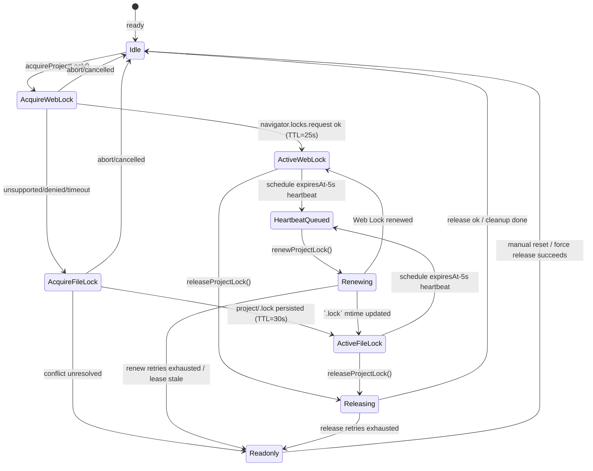

# AutoSave ロック設計メモ

## 0. 合意事項と受入基準
- Web Lock を第一優先とし、`navigator.locks` 非対応・拒否・競合時は `project/.lock` のフォールバックで UUID/TTL=30s を共有する。Acquire/renew/release のハートビートとバックオフは実装計画と詳細設計の §3.* を唯一の参照元とする。【F:docs/IMPLEMENTATION-PLAN.md†L63-L139】【F:docs/AUTOSAVE-DESIGN-IMPL.md†L108-L218】
- Heartbeat は `expiresAt-5s` で発火し、連続 2 回失敗または Acquire リトライ上限超過で閲覧専用モードへ移行する。閲覧専用化は UI・テレメトリへ `autosave.lock.readonly` を通知し、再取得はユーザー操作に委ねる。【F:docs/IMPLEMENTATION-PLAN.md†L97-L139】【F:docs/AUTOSAVE-DESIGN-IMPL.md†L142-L218】
- Collector/Analyzer の ETL（15 分間隔）を阻害しないよう、`.lock` ファイルは `project/` 直下のみ、イベントは JSONL 1 行で完結させる。Day8 パイプラインのアーキテクチャ境界を越える処理は禁止する。【F:docs/IMPLEMENTATION-PLAN.md†L120-L139】【F:Day8/docs/day8/design/03_architecture.md†L1-L31】

**受入基準**
1. Acquire→Active→Renew→Release のステートと遷移条件が Implementation Plan と AutoSave 詳細設計の要件と一致している。
2. `ProjectLockError.retryable` の真偽が表 3 の整理と一致し、閲覧専用化の条件が UI/Collector 伝搬要件を満たす。
3. テレメトリが `autosave.lock.*` で統一され、Collector/Analyzer の JSONL 契約へ追加副作用を発生させない。

## 1. `src/lib/locks.ts` 状態遷移ドラフト
AutoSave/精緻マージが `ProjectLockApi` を通じて利用するロックライフサイクルを、Web Locks 優先・ファイルロックをフォールバックとする形で整理する。実装計画と AutoSave 詳細設計に記載されたポリシーへ準拠する。【F:docs/IMPLEMENTATION-PLAN.md†L63-L139】【F:docs/AUTOSAVE-DESIGN-IMPL.md†L108-L218】

### 状態遷移補足
- `Readonly` 遷移は AutoSave を閲覧専用モードへ落とし、UI と Collector へ警告を送る。
- `HeartbeatQueued` は `expiresAt-5s` でトリガーする心拍タイマー。`Renewing` が `retryable=true` の場合は指数バックオフ（0.5s→1s→2s→4s）で `HeartbeatQueued` へ戻る。
- `Renewing` 中に `lease-stale` 判定となった場合、フォールバックファイルを削除して再取得を促す。再取得も失敗した場合は `Readonly` 固定。
- `Releasing` で発生した `.lock` 削除失敗は最大 3 回までバックオフ再試行し、最終失敗時のみ `Readonly` を通知する。

## 2. API 一覧（責務と失敗モード）
| API | 主な副作用 | 失敗モード (`ProjectLockError.code`) | retryable | 再試行ポリシー | 備考 |
| --- | --- | --- | --- | --- | --- |
| `acquireProjectLock(options)` | Web Lock 取得、フォールバック `.lock` 作成 | `web-lock-unsupported`, `acquire-denied`, `acquire-timeout`, `fallback-conflict` | `unsupported`: false, 他: true (timeout は上限回数後 false) | `backoff` (初期 500ms, ×2, `MAX_LOCK_RETRIES` まで) | AbortSignal でキャンセル可。成功時は `strategy` と `expiresAt` を含むリースを返却。【F:docs/IMPLEMENTATION-PLAN.md†L97-L106】 |
| `renewProjectLock(lease, options)` | Web Lock 再リクエスト or `.lock` mtime 更新 | `lease-stale`, `renew-failed` | `renew-failed`: true, `lease-stale`: false | 心拍タイマーごとに指数バックオフ、連続失敗で `Readonly` | TTL 超過で lease を破棄し再取得誘導。【F:docs/AUTOSAVE-DESIGN-IMPL.md†L142-L218】 |
| `releaseProjectLock(lease, options)` | Web Lock 解放、`.lock` 削除 | `release-failed` | true（force 時 false） | `backoff` で最大 3 回。最終失敗は ReadOnly 通知。 | `force=true` の場合はフォールバックファイル削除を試行し、Collector へ `lock:release-failed` を発火。 |
| `withProjectLock(fn, options)` | 上記取得→コールバック→解放 | 取得/更新/解放で発生したコードをそのまま伝播 | 呼び出し元へ伝播 | Acquire のリトライ設定を継承 | `releaseOnError=false` の場合は呼び出し側が明示 release。 |
| `subscribeLockEvents(listener)` | イベントストリーム購読 | - | - | - | `ProjectLockEvent` により UI・テレメトリへ通知。 |

### イベント利用者
- `AutoSaveIndicator`：`lock:acquired`/`lock:readonly-entered` を UI 表示に反映。
- テレメトリ：`autosave.lock.*` 命名で Collector へ JSONL を送信し、Analyzer が SLO を評価する。【F:docs/IMPLEMENTATION-PLAN.md†L163-L204】【F:Day8/docs/day8/design/03_architecture.md†L1-L31】

### テレメトリイベント案
| `type` | 主要フィールド | 発火タイミング | 備考 |
| --- | --- | --- | --- |
| `autosave.lock.attempt` | `strategy`, `retry`, `leaseId?` | Acquire / Renew / Release 開始時 | `strategy` に `web-lock`/`file-lock`。`retry` は 0 起点。 |
| `autosave.lock.acquired` | `leaseId`, `strategy`, `expiresAt` | ロック獲得直後 | Acquire 成功時のみ。`expiresAt` は 25s/30s ベース。 |
| `autosave.lock.renewed` | `leaseId`, `strategy`, `retry` | 心拍更新成功時 | `retry` で直前の失敗回数を示し、Analyzer が復旧率を算出。 |
| `autosave.lock.readonly-entered` | `reason`, `retry`, `leaseId?` | Acquire/Renew/Release で閾値到達 | UI の閲覧専用化と同期し、Incident 判定に利用。 |
| `autosave.lock.release-failed` | `leaseId`, `retry`, `force` | Release 再試行時 | `force` が true の場合はフォールバック削除を試行済み。 |
| `autosave.lock.released` | `leaseId`, `strategy`, `durationMs` | Release 成功時 | Acquire からの保持時間を記録し、SLO に活用。 |

## 3. 失敗モードとリトライ可否整理
| フェーズ | 想定エラー | `retryable` | ReadOnly 遷移条件 | Collector/Analyzer 影響 | テレメトリ試験観点 |
| --- | --- | --- | --- | --- | --- |
| Web Lock 取得 | Web Locks 未対応 (`web-lock-unsupported`) | false | 直ちにフォールバック切替。フォールバックも失敗で readonly。 | `.lock` 運用へ移行するだけで既存 ETL へ影響なし。 | Web Lock 不在環境で `lock:attempt`(`strategy='web-lock'`)→`lock:acquired`(`strategy='file-lock'`) のシーケンスを検証。 |
| Web Lock 取得 | 権限拒否/タイムアウト (`acquire-denied`/`acquire-timeout`) | true (上限超過で false) | `MAX_LOCK_RETRIES` 消費後に readonly。 | Acquire 遅延で AutoSave が停止中となるが、Collector の JSONL は継続。 | バックオフイベント (`lock:attempt`, `retry`) が JSONL に累積されること。 |
| フォールバック取得 | `.lock` 有効リース (`fallback-conflict`) | true（最大 `MAX_LOCK_RETRIES`） | stale 判定失敗で readonly。 | 競合で AutoSave が停止するが `.lock` は Day8 の監視対象外。 | 競合再現テストで `lock:readonly-entered` に `reason='fallback-conflict'` が載ること。 |
| 心拍更新 | `.lock` ステール (`lease-stale`) | false | 検知時に即 readonly。 | 保存欠落が発生し得るが Analyzer への入力スキーマは不変。 | `lock:readonly-entered` の `reason='lease-stale'` を確認。 |
| 心拍更新 | API 例外 (`renew-failed`) | true | 連続 2 回失敗で readonly。 | 成功すれば Collector は警告のみで継続。 | 指数バックオフ後の `lock:renewed` で `retry` が増えること。 |
| 解放 | 削除失敗 (`release-failed`) | true（force 以降 false） | 3 回失敗で readonly 通知を維持。 | `.lock` 残骸でも Day8 側のディレクトリ境界外。 | 解放失敗→再試行→成功のイベント順序。 |

## 4. Collector / Analyzer 影響分析
- Collector は `project/autosave/` 外のパスを監視しないため、ロック情報は JSONL イベントのみで伝播する。`.lock` ファイルは Day8 系パイプラインには読み込まれない前提を維持する。【F:docs/IMPLEMENTATION-PLAN.md†L107-L139】【F:Day8/docs/day8/design/03_architecture.md†L1-L31】
- AutoSave 由来イベントは `feature=autosave` タグと `autosave.lock.*` プレフィックスを付与し、Analyzer が保存遅延や ReadOnly 遷移率を計算できるようにする。Collector から Analyzer への ETL 頻度（15 分）内でイベントがロストしないよう、失敗時でも 1 行ログを必ず出力する。 
- Analyzer はロック失敗を重大度 `warning` として扱い、3 回連続で `lock:readonly-entered` が発生した場合は Reporter の日次サマリに Incident 候補として挙げる。AutoSave の保存履歴 JSON には手を加えず、既存メトリクス生成フローを汚染しない。

## 5. テレメトリ観点テストリスト
1. Web Locks 利用可能環境で `lock:acquired`→`lock:renewed`→`lock:released` のイベントシーケンスが Collector へ JSONL 連携される。
2. Web Locks 不在環境で `fallback-conflict` まで再現し、`lock:readonly-entered` に `reason='fallback-conflict'` が設定される。
3. 心拍失敗 (`renew-failed`) を 2 回発生させた後、3 回目で成功し `retry` カウントが増加する。
4. 解放失敗 (`release-failed`) によりバックオフ後の再試行が成功し、`lock:released` が最終的に発生する。
5. AutoSave 停止後も Collector の JSONL が Analyzer で正しく集計される（`feature=autosave` フィルタで抽出可能）。

## 6. レビュー用チェックリスト
- [ ] Web Lock 取得→フォールバック→閲覧専用遷移のステートが設計と整合している。
- [ ] `ProjectLockError` の `retryable` 設定が表3の整理と一致する。
- [ ] イベント名が `autosave.lock.*` プレフィックスで統一されている。
- [ ] `.lock` ファイルの TTL/UUID が Implementation Plan の要件と合致する。
- [ ] Collector/Analyzer への副作用が Day8 アーキテクチャの境界を超えない。

## 7. TDD テスト計画（ロックモジュール）
1. `acquireProjectLock` が Web Locks 成功時に `strategy='web-lock'` のリースを返し、イベントが順序通り発火する。
2. Web Locks 未対応モックでフォールバック取得が成功し、`.lock` に UUID/TTL が保存される。
3. `.lock` 競合時に `ProjectLockError` (`fallback-conflict`) が発生し、`retryable=true` でリトライ後に ReadOnly 遷移イベントが飛ぶ。
4. 心拍タイマーで `renewProjectLock` が呼ばれ、`renewAttempt` がインクリメントされる。連続失敗後は `retryable=false` で停止。
5. `releaseProjectLock` が `.lock` を確実に削除し、失敗時に `release-failed` が throw され `retryable` が設定される。
6. `withProjectLock` が例外発生時でも `releaseOnError=true` ならロック解放を実行する（Collector イベントで確認）。
