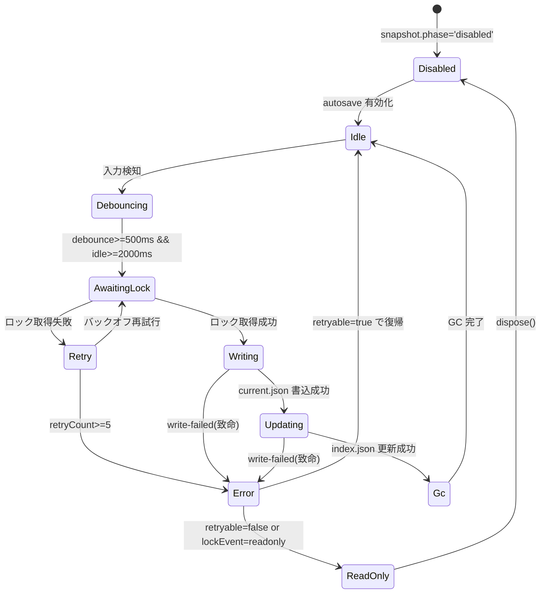

# AutoSaveIndicator UI/UX 設計

## 目的
- `AutoSaveStatusSnapshot` と `ProjectLockEvent` を統合し、閲覧専用モードやエラーを即座に視覚化する。
- 履歴 20 世代・容量 50MB 制限の利用状況をリアルタイムに提示し、上限到達時のユーザー行動を導く。
- Collector/Analyzer の監視要件を満たしつつ、不要なログ出力を発生させない UI シグナル設計を定義する。

## ビュー・モデル
| 要素 | 入力 | ロジック | 出力 |
| --- | --- | --- | --- |
| `statusLabel` | `snapshot.phase`, `snapshot.retryCount` | `retryCount >= 3` で `再試行中 (n)` へ差し替え。その他はフェーズ定義を使用。 | プライマリラベル |
| `indicator` | `snapshot.phase`, `snapshot.lastError`, `lockEvent` | 致命エラー/閲覧専用バナーで `error`、書込・ロック待機は `progress`。 | 色・アニメーション制御 |
| `history.access` | `phase` | `awaiting-lock` 以降は `disabled`、`disabled` フェーズは `hidden`。 | 履歴ボタン活性状態 |
| `history.usageWarning` | `historySummary` | 世代または容量が 90% 以上で警告、100% で上限文言、`overflowDetected` true で削除通知。 | 履歴下部バナー |
| `banner` | `lockEvent`, `snapshot.lastError` | `lock:readonly-entered` で警告、`lastError.retryable=false` で致命バナー。 | 表示内警告バナー |
| `toast` | `snapshot.lastError`, `snapshot.retryCount` | 再試行エラー・ロック再試行中を `warning` として通知。 | 上位トースト API への通知 |

## UI フロー（ワイヤフレーム）
```
┌─────────────────────────────────────────────┐
│ AutoSaveIndicator                             │
│ ┌───────────────┐  ┌─────────────────────┐ │
│ │バナー (任意)  │  │ステータスラベル      │ │
│ │[warning/error]│  │説明テキスト          │ │
│ └───────────────┘  └─────────────────────┘ │
│ ┌───────────────┐                          │
│ │メタ情報 DL    │ 最終保存 / 再試行 /      │
│ │               │ 保留サイズ / 履歴利用状況│
│ └───────────────┘                          │
│ [履歴利用警告] (role=alert)                 │
│ [履歴を開く] ボタン (disabled/aria-disabled) │
│ 履歴ノート                                   │
└─────────────────────────────────────────────┘
```

## 状態遷移（Indicator ビュー）


## トースト/バナー仕様
- **バナー**: インジケータ直上に常駐。`lock:readonly-entered` で警告（黄色）、致命エラーで赤色。`aria-live="assertive"`。ユーザーには復元操作と再試行抑止を案内。
- **トースト**: 上位コンポーネントが `onToast` で購読。`retryable` な `lastError` や `awaiting-lock` の再試行中に 1 回だけ表示。Collector への追加ログは禁止。

## UI テスト観点
1. **正常系**: `phase='idle'`、履歴 5/20 世代・5MB/50MB で警告なし。履歴ボタン活性。
2. **警告系**: `phase='awaiting-lock'`、`retryCount=3` → ラベル `再試行中 (3)`、トースト `ロック取得を再試行中です (3)` 発火、履歴ボタン無効。
3. **致命エラー**: `phase='error'`、`lastError.retryable=false` → バナー赤、履歴ボタン活性、`history.access='available'`。トーストなし。
4. **閲覧専用**: `lock:readonly-entered` 受信時に黄色バナー表示、`aria-live='assertive'`。
5. **履歴上限**: 履歴 20/20 世代または 50MB 到達で `history-warning` が表示される。

## Task Seed
1. AutoSave ストアに `historySummary` と `lockEvent` の最新値を保持する selector を追加。
2. `AutoSaveIndicator` 呼び出し元で `onToast` を接続し、トーストシステムへ橋渡しする。
3. UI テスト（React Testing Library）で上記 5 観点を自動化。
