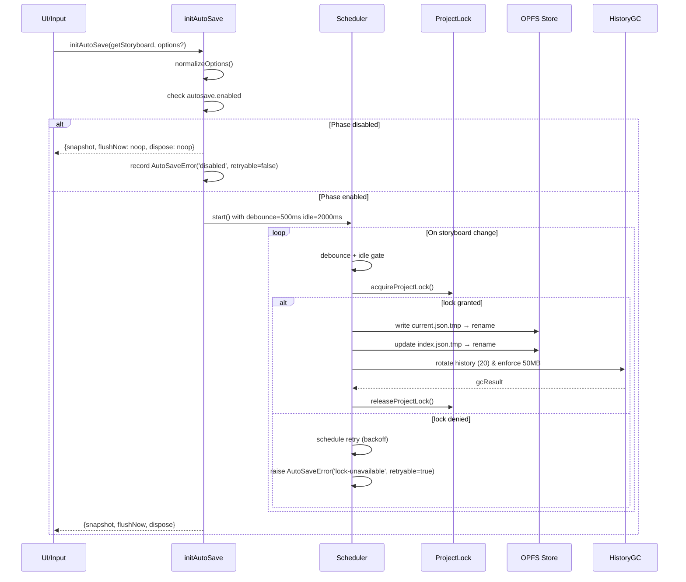
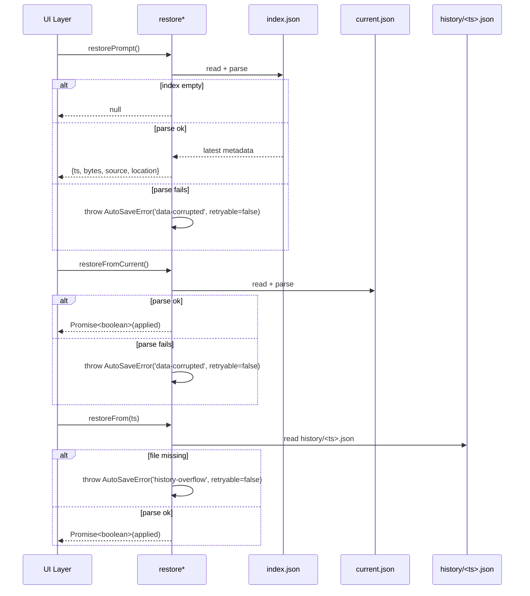
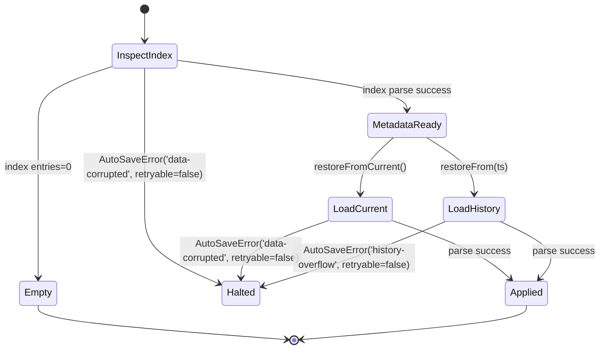
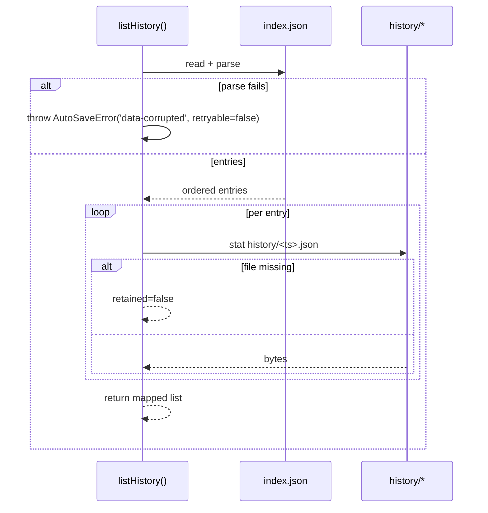
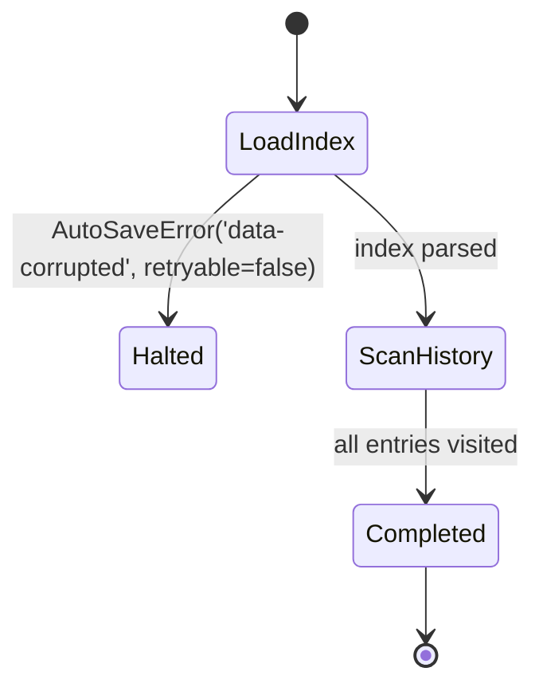

# Task Seed Template

## メタデータ

```yaml
task_id: 20240218-autosave-core
repo: https://github.com/Conimgponic/Conimgponic
base_branch: main
work_branch: feat/autosave-core-facade
priority: P1
langs: [typescript]
```

## Objective

`docs/AUTOSAVE-DESIGN-IMPL.md` §0-§2 で定義された Phase A の保存要件を、`initAutoSave` ファサードを中心に保存・復元・履歴参照へ統合する。

## Scope

- In: `src/lib/autosave.ts`, `docs/AUTOSAVE-DESIGN-IMPL.md`, `docs/design/autosave/**`, `tests/autosave/*.spec.ts`
- Out: UI レイヤ、Collector/Analyzer、ロック実装 (`src/lib/locks.ts`)

## Requirements

- Behavior:
  - Phase A 固定値（デバウンス 500ms、アイドル 2s、履歴 20、容量 50MB）を厳守しつつ、自動保存の init/flush/restore/list API を提供。
  - `AutoSaveOptions.disabled` および feature flag `autosave.enabled` の二重ガードで安全に無効化できる。
- I/O Contract:
  - Input: `StoryboardProvider`, `AutoSaveOptions`, feature flag `autosave.enabled`
  - Output: `AutoSaveInitResult`, 復元 API 戻り値、履歴メタデータ
- Constraints:
  - 既存API破壊なし / 不要な依存追加なし
  - Lint/Type/Test はゼロエラー
- Acceptance Criteria:
  - 保存・履歴・復元のシーケンス図が Phase A 要件を満たす
  - TDD 方針とガードのリスク/ロールバック条件が docs に反映されている

## Affected Paths

- docs/design/autosave/**
- docs/AUTOSAVE-DESIGN-IMPL.md
- tests/autosave/*.spec.ts

## Local Commands（存在するものだけ実行）

```bash
pnpm lint && pnpm typecheck && pnpm test
```

## Deliverables

- PR: タイトル/要約/影響/ロールバックに加え、本文へ `Intent: INT-001` と `## EVALUATION` アンカーを明記
- Artifacts: 変更パッチ、テスト、必要ならREADME/CHANGELOG差分

---

## Plan

### Steps

1) 現状把握（対象ファイル列挙、既存テストとI/O確認）
2) 小さな差分で仕様を満たす実装
3) sample::fail の再現手順/前提/境界値を洗い出し、必要な工程を増補
4) テスト追加/更新（先に/同時）
5) コマンド群でゲート通過
6) ドキュメント最小更新（必要なら）

## Patch

***Provide a unified diff. Include full paths. New files must be complete.***

## Tests

### Outline

- Unit:
  - init/flush の遷移が固定ポリシー通りに完了する
  - エラー復帰（lock/GC/restore）が規定通りに失敗・停止・通知する
- Integration:
  - フラグ無効時に No-op で終了する

## Commands

### Run gates

- pnpm lint && pnpm typecheck && pnpm test

## Notes

### Rationale

- Phase A の固定ポリシーと将来拡張の足場を両立するため、ファサード主導で制御する。

### Risks

- 固定値からの逸脱を検出できないと将来の動的設定導入時に不整合が発生する。

### Follow-ups

- Phase B: `AutoSaveOptions` の動的パラメータ化と Collector/Analyzer への通知拡張。

---

## Runtime Digest（`AUTOSAVE-DESIGN-IMPL` §0-§2 準拠）

### `initAutoSave`

#### I/O マトリクス

| Input | Output | 副作用 | 主な例外 |
| --- | --- | --- | --- |
| `StoryboardProvider`, `AutoSaveOptions`, feature flag `autosave.enabled` | `AutoSaveInitResult`（`snapshot`, `flushNow`, `dispose`） | Web Locks / `.lock` 取得、`project/autosave/*.json` 更新、`history/` ローテーション、`warn` ログ | `AutoSaveError('disabled')`, `'lock-unavailable'`, `'write-failed'`, `'history-overflow'` |

#### シーケンス図



#### 状態図


### `restorePrompt` / `restoreFrom*`

#### シーケンス図



#### 状態図



### `listHistory`

#### シーケンス図



#### 状態図



---

## Phase A 固定値 & ガードマトリクス

| 区分 | 固定値 / 条件 | 実装ポイント | ロールバック条件 | 将来拡張メモ |
| --- | --- | --- | --- | --- |
| デバウンス遅延 | 500ms | `initAutoSave` スケジューラ | GC が `history-overflow` を連続検知した場合に保存停止 | Phase B で `AutoSaveOptions.debounceMs` を追加予定 |
| アイドル猶予 | 2000ms | `initAutoSave` アイドル検知 | 保存待機が 5 回連続で TTL 超過なら手動リセット | 動的調整時は UI インジケータ連動が必要 |
| 履歴世代 | 20 世代 | 履歴ローテーション | GC が整合性崩壊を検知したら直前世代へ復旧 | `autosave.history.maxEntries` フラグ追加候補 |
| 容量上限 | 50MB | 履歴 GC | 容量超過で FIFO 削除が失敗したら保存停止 | ストレージ残量連動の自動調整を検討 |
| `AutoSaveOptions.disabled` | `true` で強制無効 | `normalizeOptions()` → init ガード | `snapshot().phase==='disabled'` が 3 回継続したら通知後にガード解除 | 追加オプション導入時は互換チェック必須 |
| Feature flag `autosave.enabled` | `false` で無効 | フラグリーダー | 24h 無効が続けばオペレーション通知→完全停止 | 配信ラグ検知用の Telemetry カウンタを追加予定 |

> 将来拡張ポイント: ガード条件は `normalizeOptions()` を中心に拡張し、Phase B で動的ポリシーを導入する際は API 後方互換を維持したままパラメータを opt-in で追加する。

---

## tests/autosave 向け TDD チェックリスト

- [ ] **ケース: `initAutoSave` 正常系** — Phase A 固定値（500ms/2000ms/20/50MB）をモックタイマで検証し、`snapshot()` の状態遷移と `flushNow()` が同期完了を返すこと。
- [ ] **ケース: 二重ガード無効化** — `AutoSaveOptions.disabled=true` または `autosave.enabled=false` で `flushNow`/`dispose` が no-op、`snapshot().phase==='disabled'` となること。
- [ ] **ケース: ロック取得失敗** — `acquireProjectLock` が拒否された場合に `AutoSaveError('lock-unavailable', retryable=true)` をスローし、再試行バックオフがスケジュールされること。
- [ ] **ケース: 書込失敗ロールバック** — `current.json` 書込失敗でロールバックし `retryable=true` を維持、履歴と index が巻き戻ること。
- [ ] **ケース: 履歴溢れ停止** — `history` 側 GC が `AutoSaveError('history-overflow', retryable=false)` を返した場合にファサードが `halted` へ遷移し、`flushNow` が停止すること。
- [ ] **ケース: `restorePrompt` 空状態** — `index.json` 空で `null` を返すこと。
- [ ] **ケース: `restoreFromCurrent` 正常系/破損系** — 正常時に `true` を返し、破損時は `AutoSaveError('data-corrupted')` を送出して UI へ伝播しないこと。
- [ ] **ケース: `restoreFrom(ts)` 欠落** — ファイル欠落で `AutoSaveError('history-overflow', retryable=false)`。
- [ ] **ケース: `listHistory` 正常 & 欠落** — 正常時にサイズ情報を返し、欠落ファイルは `retained=false` でマーキングされること。パース失敗時は `AutoSaveError('data-corrupted')`。
- [ ] **リスク監視: ローカルロールバック** — いずれかのテストで `retryable=false` が発生した際はミューテーションを巻き戻し、`project/autosave` のテストフィクスチャを初期化すること。
- [ ] **ロールバック条件: Phase ガード誤判定** — ガード誤判定を検証するテストで `snapshot().phase==='disabled'` が継続したら、ガード解除と通知を検証し、副作用をリセットすること。
