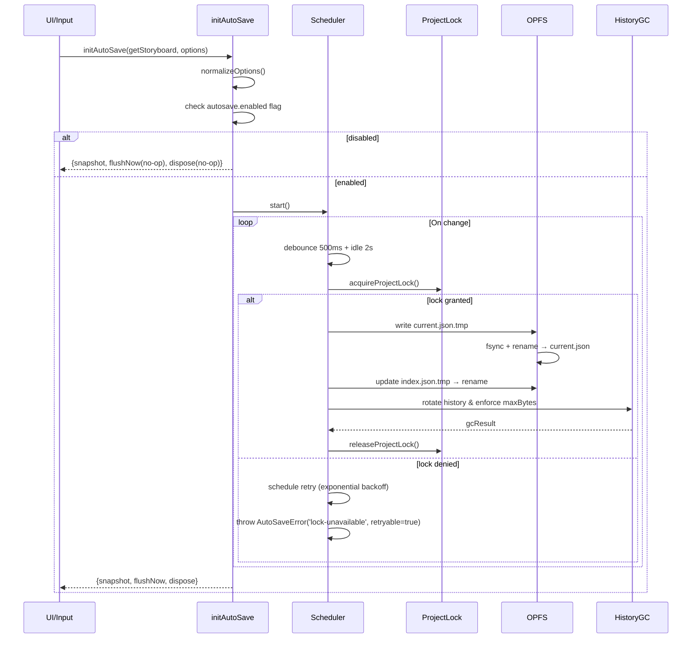
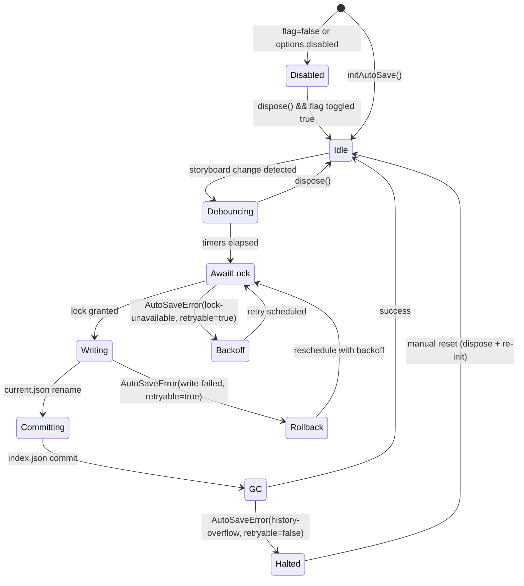
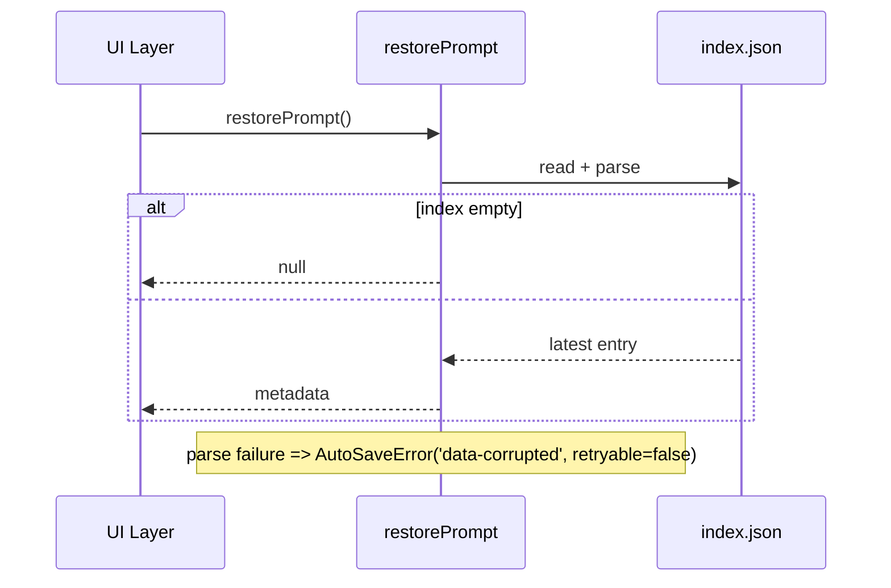
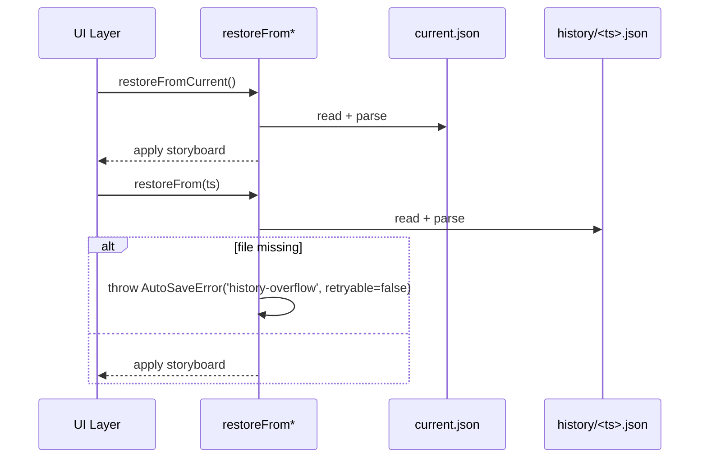
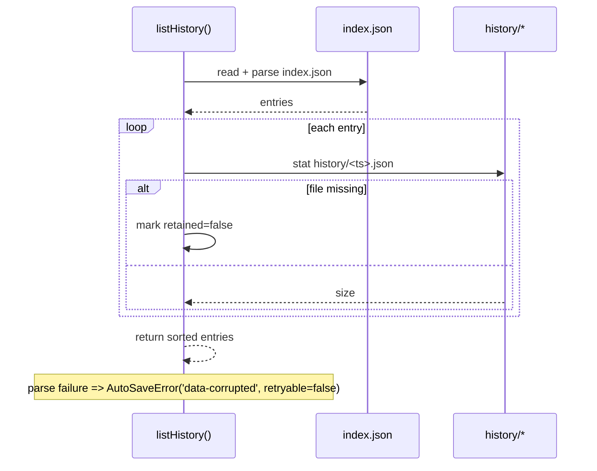

# AutoSave Core Facade Task Seed

## メタデータ

```yaml
task_id: 20240215-auto-facade
repo: https://github.com/imgponic/Conimgponic
base_branch: main
work_branch: feat/autosave-core-facade
priority: P1
langs: [typescript]
```

## Objective

AutoSave 中核ファサード (`src/lib/autosave.ts`) の Phase A 要件を満たしつつ、履歴復元・保存制御の API を安定提供する。【F:docs/AUTOSAVE-DESIGN-IMPL.md†L5-L70】

## Scope

- In: `src/lib/autosave.ts`, `src/lib/locks.ts`, `docs/AUTOSAVE-DESIGN-IMPL.md`
- Out: UI レイヤ、Collector/Analyzer、外部同期バックエンド

## I/O ・状態遷移サマリ

### `initAutoSave`

| 観点 | 要約 | 典拠 |
| --- | --- | --- |
| 入力 | `getStoryboard: () => Storyboard`, `options?: AutoSaveOptions`, feature flag `autosave.enabled`. | 【F:docs/AUTOSAVE-DESIGN-IMPL.md†L35-L43】 |
| 出力 | `AutoSaveInitResult` (`snapshot`, `flushNow`, `dispose`)。`snapshot` は同期取得、`flushNow` は保存完了で解決。 | 【F:docs/AUTOSAVE-DESIGN-IMPL.md†L35-L47】 |
| 副作用 | Web Locks / `.lock` 取得、`project/autosave/current.json` と `index.json` の原子的更新、履歴ローテーション、容量制御、`warn` ログ。 | 【F:docs/AUTOSAVE-DESIGN-IMPL.md†L8-L33】【F:docs/AUTOSAVE-DESIGN-IMPL.md†L37-L49】 |
| 主な例外 | `AutoSaveError('disabled')`, `'lock-unavailable'`, `'write-failed'`, `'history-overflow'`。`retryable` フラグで再試行可否を明示。 | 【F:docs/AUTOSAVE-DESIGN-IMPL.md†L8-L19】【F:docs/AUTOSAVE-DESIGN-IMPL.md†L49-L52】 |





### `restorePrompt` / `restoreFrom*`

| 関数 | 入力 | 出力 | 主な例外 | 典拠 |
| --- | --- | --- | --- | --- |
| `restorePrompt()` | なし | `null` または `{ ts, bytes, source, location }` | `AutoSaveError('data-corrupted', retryable=false)` (`index.json` 解析失敗)。 | 【F:docs/AUTOSAVE-DESIGN-IMPL.md†L54-L60】 |
| `restoreFromCurrent()` | なし | `Promise<boolean>` | `AutoSaveError('data-corrupted', retryable=false)` / `'write-failed'`（UI反映不可）。 | 【F:docs/AUTOSAVE-DESIGN-IMPL.md†L60-L63】 |
| `restoreFrom(ts)` | `ts: string` | `Promise<boolean>` | `AutoSaveError('data-corrupted', retryable=false)` / `'history-overflow'`（履歴欠落）。 | 【F:docs/AUTOSAVE-DESIGN-IMPL.md†L63-L66】 |





### `listHistory`

| 入力 | 出力 | 例外 | 典拠 |
| --- | --- | --- | --- |
| なし | `{ ts, bytes, location: 'history', retained }[]` | `AutoSaveError('data-corrupted', retryable=false)` (`index.json` 解析失敗)。 | 【F:docs/AUTOSAVE-DESIGN-IMPL.md†L66-L70】 |



## Phase A 固定値とガード仕様

| 項目 | 固定値 / 条件 | 効果 | リトライ/ロールバック条件 | 典拠 |
| --- | --- | --- | --- | --- |
| デバウンス遅延 | 500ms | 入力スパイクを抑制し、保存ジョブをバッチング。 | 連続 `write-failed` 時は指数バックオフを適用し、成功でリセット。 | 【F:docs/AUTOSAVE-DESIGN-IMPL.md†L20-L29】【F:docs/AUTOSAVE-DESIGN-IMPL.md†L37-L52】 |
| アイドル猶予 | 2000ms | 安定したアイドル確認後にロック取得開始。 | `lock-unavailable` が 4 回続いた場合は 5 回目で `phase='error'` に遷移し再初期化。 | 【F:docs/AUTOSAVE-DESIGN-IMPL.md†L20-L33】【F:docs/design/autosave-facade.md†L40-L47】 |
| 履歴世代上限 | 20 世代 | FIFO ローテーションで最新世代を保持。 | `history-overflow` を 2 回連続検出したら最後の成功世代へ復帰。 | 【F:docs/AUTOSAVE-DESIGN-IMPL.md†L20-L33】【F:docs/AUTOSAVE-DESIGN-IMPL.md†L33-L34】 |
| 容量上限 | 50MB | 合計容量超過時に旧世代を削除。 | 容量制御が失敗し例外発火時はロールバック後に `phase='error'` へ。 | 【F:docs/AUTOSAVE-DESIGN-IMPL.md†L20-L33】 |
| `AutoSaveOptions.disabled` | `true` であれば常時無効化。 | `snapshot.phase='disabled'`、保存副作用なし。 | 連続 3 回 `disabled` 判定でも `autosave.enabled=true` の場合はガード解除し通知。 | 【F:docs/AUTOSAVE-DESIGN-IMPL.md†L7-L11】【F:docs/AUTOSAVE-DESIGN-IMPL.md†L41-L53】 |
| Feature flag `autosave.enabled` | `false` であれば保存完全停止。 | Phase `disabled` のまま永続化 API を呼ばない。 | フラグ false のまま 24h 経過でオペレーション通知→ロールバック。 | 【F:docs/AUTOSAVE-DESIGN-IMPL.md†L7-L11】【F:docs/AUTOSAVE-DESIGN-IMPL.md†L45-L53】 |

## TDD テストケース & レビュー基準

### `tests/autosave/*.spec.ts` で追加すべきケース

1. **ガード動作**: `autosave.enabled=false` または `options.disabled=true` のとき、`flushNow`/`dispose` が no-op で `snapshot.phase='disabled'` を確認。
2. **正常保存フロー**: デバウンス→アイドル→ロック取得→`current.json`/`index.json` 更新が順序通り進むこと、`flushNow` が保留分を即時書き込みすること。
3. **履歴ローテーション**: 21 世代目投入で FIFO 削除と `retained=false` マークの整合を検証。容量 50MB 超過時の削除も併せて確認。
4. **復元 API**: `restorePrompt` が最新メタデータを返し、`restoreFromCurrent`/`restoreFrom(ts)` が正常復元・`history-overflow` を適切に表面化すること。
5. **再試行・ロールバック**: `lock-unavailable` が連続した場合の指数バックオフ、`write-failed` 後のロールバックと再試行、`history-overflow` で再初期化を要求する流れ。

### 再試行・ロールバック チェックリスト

- [ ] `lock-unavailable` 発生時は指数バックオフが適用され、所定回数で `phase='error'` へ遷移する。
- [ ] `write-failed` は `retryable=true` を保持し、ロールバック後に再スケジュールされる。
- [ ] `history-overflow` は `retryable=false` で GC 停止、手動リカバリを促す。
- [ ] フラグ/オプション不整合 (`autosave.enabled=false` かつ `options.disabled=false`) を 24h 以内に検知し通知を記録する。
- [ ] `flushNow` は進行中ジョブ完了・失敗を待機し、失敗時は例外を透過させる。

### レビュー基準への追加項目

- TDD で上記ケースを先行実装し、`node:test` と Fake タイマーで determinism を確保すること。
- 例外は既存 `AutoSaveError` ツリーに正規化し、`retryable` フラグの付与漏れがないこと。
- 永続化操作は `project/autosave/current.json` → `index.json` → 履歴ローテーションの順序を厳守すること。
- フェーズ遷移 (`disabled`/`idle`/`error`) のログ出力と状態スナップショット整合を確認すること。
- Feature flag・オプション変更時に `dispose`/`re-init` パスがテストで担保されていること。
