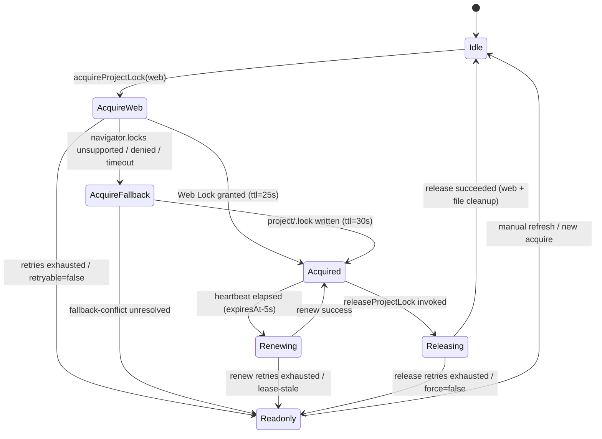

# AutoSave プロジェクトロック設計図

## 目的
- `src/lib/locks.ts` が提供する `acquireProjectLock` / `renewProjectLock` / `releaseProjectLock` / `withProjectLock` とイベント購読 API を Implementation Plan §1 と AutoSave 詳細設計 §3.2 に沿って統合的に定義する。
- 再試行・フォールバック戦略と Day8 アーキテクチャ制約を明文化し、テストケースを先行定義することで TDD の出発点を固定する。

## 前提
- Web Locks API を最優先で利用し、非対応・拒否・競合時にフォールバック `.lock` を利用する。【F:docs/IMPLEMENTATION-PLAN.md†L92-L122】【F:docs/AUTOSAVE-DESIGN-IMPL.md†L166-L206】
- ロックファイルは `project/` 直下に限定し、Day8 Collector パス（`workflow-cookbook/` 等）へ副作用を波及させない。【F:docs/IMPLEMENTATION-PLAN.md†L123-L139】【F:docs/AUTOSAVE-DESIGN-IMPL.md†L163-L170】
- Heartbeat (`renew`) は `expiresAt - 5000ms` を基準に起動し、TTL（Web Lock=25s, `.lock`=30s）管理でリース更新を保証する。【F:docs/IMPLEMENTATION-PLAN.md†L98-L105】【F:docs/AUTOSAVE-DESIGN-IMPL.md†L166-L178】

## 成果物
- ロック API の状態遷移・イベント設計図とフォールバック手順を網羅した設計ドキュメント。
- Day8 アーキテクチャと干渉しない運用ルールの整理。
- `tests/autosave/locks.spec.ts` に向けた TDD ケース一覧とロールバック手順案。

## 詳細設計

### 1. スコープ
- AutoSave ランタイムが依存するプロジェクト排他制御（Web Lock 優先・フォールバック `.lock`）の API 契約。
- イベントストリーム、状態遷移、TTL/ハートビート設計とテレメトリ連携。
- `tests/autosave/locks.spec.ts`（想定）における先行テストケース洗い出し。

### 2. API サマリ
| API | 主要入力 | 主要出力 | リトライ/バックオフ | 主なイベント | 補足 |
| --- | --- | --- | --- | --- | --- |
| `acquireProjectLock(opts?: AcquireLockOptions)` | `signal?`, `ttlMs?`, `retryLimit?`, `backoffMs?`, `preferredStrategy?`, `onReadonly?` | `ProjectLockLease { leaseId, ownerId, strategy, viaFallback, resource, acquiredAt, expiresAt, ttlMillis, nextHeartbeatAt, renewAttempt }` | 既定 3 回、0.5s→1s→2s（指数）。`retry=false` で 1 回のみ。 | `lock:attempt`, `lock:waiting`, `lock:acquired`, `lock:renew-scheduled`, `lock:error`, `lock:readonly-entered` | Web Lock 取得を試行し、失敗時にフォールバック `.lock` を同一 UUID で取得。【F:docs/AUTOSAVE-DESIGN-IMPL.md†L166-L198】 |
| `renewProjectLock(lease, opts?: RenewProjectLockOptions)` | `lease`, `signal?` | 更新後の `ProjectLockLease`（`expiresAt` / `nextHeartbeatAt` 更新） | 心拍タイマー毎に 2 回まで指数バックオフ、3 回目失敗で readonly | `lock:attempt`, `lock:renewed`, `lock:warning`, `lock:error`, `lock:readonly-entered` | Web Lock 再取得 or `.lock` mtime 更新。`lease.strategy==='file-lock'` 時は TTL を書換。【F:docs/AUTOSAVE-DESIGN-IMPL.md†L199-L218】 |
| `releaseProjectLock(lease, opts?: ReleaseProjectLockOptions)` | `lease`, `signal?`, `force?` | `void` | 0.5s→1s→2s 再試行。`force=true` で最終通知のみ。 | `lock:release-requested`, `lock:released`, `lock:error`, `lock:readonly-entered` | Web Lock ハンドル破棄・`.lock` 削除を冪等化。【F:docs/AUTOSAVE-DESIGN-IMPL.md†L199-L218】 |
| `withProjectLock<T>(fn, opts?: WithProjectLockOptions)` | `fn: (lease) => Promise<T>`, `renewIntervalMs?`, Acquire 同等オプション | `Promise<T>` | Acquire のポリシー継承。`renewIntervalMs` で心拍を自動起動。 | Acquire/Renew/Release で発火する全イベント | Acquire→fn→Release を内包。`releaseOnError` 既定 `true`。 |
| `subscribeLockEvents(listener)` | `listener: (event: ProjectLockEvent) => void` | `unsubscribe: () => void` | - | `lock:*` 全般 | 単一イベントバスで UI/Telemetry が購読。 |

### 2.1 型構成
```ts
export type ProjectLockStrategy = 'web-lock' | 'file-lock';
export interface ProjectLockLease {
  readonly leaseId: string;
  readonly ownerId: string;
  readonly strategy: ProjectLockStrategy;
  readonly viaFallback: boolean;
  readonly resource: string; // 'imgponic:project'
  readonly acquiredAt: string; // ISO8601
  readonly expiresAt: string; // ISO8601
  readonly ttlMillis: number;
  readonly nextHeartbeatAt: string; // ISO8601
  readonly renewAttempt: number;
}
export type ProjectLockEvent =
  | { type: 'lock:attempt'; strategy: ProjectLockStrategy; retry: number }
  | { type: 'lock:waiting'; retry: number; delayMs: number }
  | { type: 'lock:acquired'; lease: ProjectLockLease }
  | { type: 'lock:renew-scheduled'; lease: ProjectLockLease; nextHeartbeatInMs: number }
  | { type: 'lock:renewed'; lease: ProjectLockLease }
  | { type: 'lock:warning'; lease: ProjectLockLease; warning: 'fallback-engaged' | 'fallback-degraded' | 'heartbeat-delayed'; detail?: string }
  | { type: 'lock:release-requested'; lease: ProjectLockLease }
  | { type: 'lock:released'; leaseId: string }
  | { type: 'lock:error'; operation: 'acquire' | 'renew' | 'release'; error: ProjectLockError; retryable: boolean }
  | { type: 'lock:readonly-entered'; reason: ProjectLockErrorCode; lastError?: ProjectLockError };
export interface ProjectLockError extends Error {
  readonly code: ProjectLockErrorCode;
  readonly retryable: boolean;
  readonly cause?: unknown;
}
export type ProjectLockErrorCode =
  | 'web-lock-unsupported'
  | 'acquire-denied'
  | 'acquire-timeout'
  | 'fallback-conflict'
  | 'lease-stale'
  | 'renew-failed'
  | 'release-failed';
```

### 3. 状態遷移ダイアグラム


### 4. 再試行・フォールバック・TTL 更新ポリシー
- **Acquire**: `retryLimit` 既定 3。`backoffMs` 既定 `[500, 1000, 2000]`。全失敗で `lock:readonly-entered(reason='acquire-timeout')`。フォールバック発動時に `lock:warning('fallback-engaged')` を 1 度発火。
- **Renew**: Heartbeat 毎に `renewAttempt` を 0 リセット。連続 2 失敗で `lock:readonly-entered(reason='renew-failed')`。`.lock` の `expiresAt` は更新時に `now + ttlMillis` へ書換え、失敗時は stale 判定で `reason='lease-stale'` を通知。
- **Release**: 3 回失敗時に `reason='release-failed'` で readonly へ降格し、`.lock` が残留しても Day8 Collector パスへは影響しない。
- **withProjectLock**: Acquire/renew/release の結果イベントを集約し、`onReadonly` コールバックで UI へ即時通知。`renewIntervalMs` 未指定時は `ttlMillis - 5000` を採用。

### 5. イベント購読モデル
- `subscribeLockEvents` は単一の `Set<ProjectLockEventListener>` を保持し、即時同期でイベントを送出。解除はリスナー削除で副作用なし。
- Collector/Analyzer へはデフォルト非送信。UI/TL 層が必要に応じて Telemetry Publisher へ転送する。`lock:readonly-entered` のみ Telemetry Publish Hook で `autosave.lock.readonly` を発火し、Collector の JSONL チャネルを汚染しない方針。【F:docs/IMPLEMENTATION-PLAN.md†L123-L139】【F:docs/AUTOSAVE-DESIGN-IMPL.md†L211-L218】

### 6. リスクと副作用遮断方針
- Day8 Collector パスに触れない: `.lock` は `project/` 直下限定で Collector (`collector/`, `workflow-cookbook/`) への書き込みを禁止。【F:docs/IMPLEMENTATION-PLAN.md†L123-L139】
- イベント出力制御: `lock:*` イベントはアプリ内バスへ留め、Collector へ流すのは `autosave.lock.readonly` のみ。Day8 ETL (Collector→Analyzer→Reporter) の JSONL 契約を変更しない。【F:docs/AUTOSAVE-DESIGN-IMPL.md†L211-L218】【F:Day8/docs/day8/design/03_architecture.md†L1-L31】
- Collector/Analyzer によるロックファイル読取を禁止する lint/レビュー項目を設け、Day8 アーキテクチャの副作用遮断を維持する。

### 7. TDD 先行テストケース（`tests/autosave/locks.spec.ts` 想定）
1. **Web Lock 正常系**: Acquire→Renew→Release の成功パスで `lock:acquired`→`lock:renewed`→`lock:released` を順序確認。【F:docs/AUTOSAVE-DESIGN-IMPL.md†L167-L218】
2. **フォールバック切替**: Web Locks 不在で `fallback-engaged` イベントと `.lock` TTL 書換が行われる。
3. **再試行バックオフ**: Acquire 失敗を 2 回発生させ、`lock:waiting.delayMs` が `[500, 1000]` を返す。3 回目失敗で readonly 遷移。
4. **Renew 連続失敗**: 2 回連続の `renew-failed` 後に readonly 降格し、`.lock` が stale の場合 `reason='lease-stale'` を返す。
5. **Release 失敗フォールバック**: Release 2 回失敗→3 回目成功で `lock:readonly-entered` が発火しないこと。
6. **Readonly 降格イベント**: Acquire 上限到達・renew stale・release 強制失敗の各ケースで `reason` が適切に分岐する。
7. **withProjectLock ハートビート**: 長時間タスクで自動 renew が呼ばれ、`renewIntervalMs`=TTL-5s が反映される。
8. **イベント購読解除**: `unsubscribe` 呼び出し後はイベントが届かない。
9. **Fallback TTL 更新**: `.lock` 更新時に `expiresAt` が `now + 30000ms` へ延長される。
10. **Readonly コールバック**: `onReadonly` が呼ばれた際に UI 通知フックが走る（spy で確認）。

### 8. 承認チェックリスト
- [ ] API シグネチャが Implementation Plan/詳細設計と一致しているかレビューした。
- [ ] Web Lock → フォールバック切替時のイベントシーケンスを手順書で再現確認した。
- [ ] 再試行・TTL・readonly 降格の TDD ケースがテスト計画に反映されている。
- [ ] Day8 Collector/Analyzer パスを汚染しない副作用遮断ポリシーをレビューで確認した。
- [ ] `autosave.lock.readonly` テレメトリが Analyzer に副作用を与えないことをステージングで検証した。
