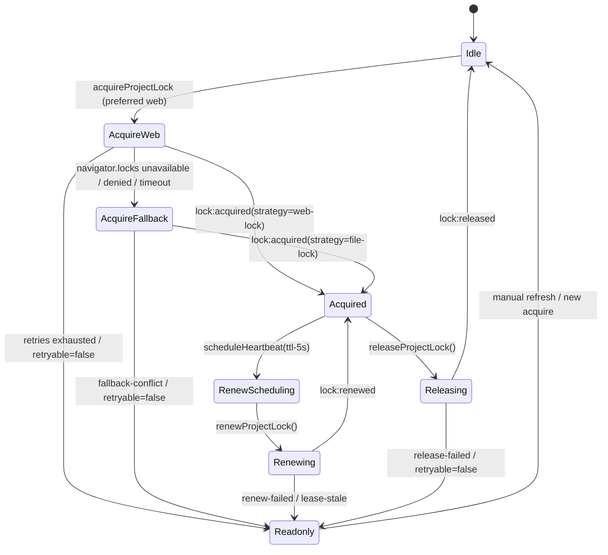

# AutoSave プロジェクトロック設計（Implementation Sync）

## 目的
- `acquireProjectLock` / `renewProjectLock` / `releaseProjectLock` / `withProjectLock` / `subscribeLockEvents` の契約を Implementation Plan §1 と AutoSave 詳細設計 §3.2 に沿って同期し、状態遷移とイベント仕様を単一ドキュメントで参照可能にする。【F:docs/IMPLEMENTATION-PLAN.md†L120-L188】【F:docs/AUTOSAVE-DESIGN-IMPL.md†L291-L352】
- Web Lock 優先・`.lock` フォールバック・Readonly 降格の判断基準を整理し、UI/Telemetry/Runbook が同一条件で挙動を把握できるようにする。【F:docs/IMPLEMENTATION-PLAN.md†L120-L178】【F:docs/AUTOSAVE-DESIGN-IMPL.md†L293-L359】
- `tests/autosave/locks.spec.ts` で先行 TDD ケースとロールバック演習手順を固定化し、実装前に期待値をロックする。【F:docs/IMPLEMENTATION-PLAN.md†L145-L206】【F:docs/AUTOSAVE-DESIGN-IMPL.md†L295-L359】

## 前提
- Web Locks API を最優先で取得し、非対応・拒否・タイムアウト時は `project/.lock` ファイルへ自動フォールバックする（TTL: Web=25s, file=30s）。【F:docs/IMPLEMENTATION-PLAN.md†L120-L136】【F:docs/AUTOSAVE-DESIGN-IMPL.md†L295-L318】
- Heartbeat は `expiresAt-5000ms` で起動し、成功時に `lock:renew-scheduled` / `lock:renewed` を発火、連続失敗で Readonly へ降格する。【F:docs/IMPLEMENTATION-PLAN.md†L135-L152】【F:docs/AUTOSAVE-DESIGN-IMPL.md†L295-L352】
- 例外は `retryable` で UI/Runner へ共有し、`lock:readonly-entered` イベントをもって保存停止とロールバック検討を開始する。【F:docs/IMPLEMENTATION-PLAN.md†L120-L178】【F:docs/AUTOSAVE-DESIGN-IMPL.md†L325-L352】

## 成果物
1. API 状態遷移図とイベントマトリクス（Implementation Plan §1 ←→ AutoSave 詳細設計 §3.2 の合成版）。【F:docs/IMPLEMENTATION-PLAN.md†L125-L170】【F:docs/AUTOSAVE-DESIGN-IMPL.md†L305-L352】
2. Web Lock フォールバック運用と Day8 Collector/Analyzer 非干渉要件の明文化。【F:docs/IMPLEMENTATION-PLAN.md†L120-L178】【F:docs/AUTOSAVE-DESIGN-IMPL.md†L291-L359】
3. `tests/autosave/locks.spec.ts` に向けた再試行・TTL 更新・Readonly 降格テストケースとロールバック Runbook の下書き。【F:docs/IMPLEMENTATION-PLAN.md†L145-L206】【F:docs/AUTOSAVE-DESIGN-IMPL.md†L295-L359】

---

## 1. API 状態遷移とイベント

### 1.1 状態遷移ダイアグラム

【F:docs/IMPLEMENTATION-PLAN.md†L125-L142】【F:docs/AUTOSAVE-DESIGN-IMPL.md†L305-L323】

### 1.2 イベント／状態マトリクス
| API | 主状態 | 代表イベント | リトライ / TTL | 備考 |
| --- | --- | --- | --- | --- |
| `acquireProjectLock` | `Idle → AcquireWeb/AcquireFallback → Acquired` | `lock:attempt` → `lock:waiting` → `lock:acquired` / `lock:error` / `lock:readonly-entered` | 既定 3 回、指数バックオフ。`viaFallback` で `.lock` 利用を通知。 | フォールバック初回で `lock:warning(fallback-engaged)`。【F:docs/IMPLEMENTATION-PLAN.md†L145-L149】【F:docs/AUTOSAVE-DESIGN-IMPL.md†L295-L318】 |
| `renewProjectLock` | `Acquired/RenewScheduling → Renewing → Acquired` | `lock:attempt` → `lock:renew-scheduled` → `lock:renewed` / `lock:error` / `lock:readonly-entered` | Heartbeat ごとに 2 回まで指数再試行。`.lock` は `expiresAt` 書換。 | 遅延時は `lock:warning(heartbeat-delayed)`。【F:docs/IMPLEMENTATION-PLAN.md†L135-L151】【F:docs/AUTOSAVE-DESIGN-IMPL.md†L295-L339】 |
| `releaseProjectLock` | `Acquired → Releasing → Idle` | `lock:release-requested` → `lock:released` / `lock:error` / `lock:readonly-entered` | 0.5s→1s→2s 再試行。`force` 可。 | Web Lock / `.lock` の冪等解放を保証。【F:docs/IMPLEMENTATION-PLAN.md†L139-L152】【F:docs/AUTOSAVE-DESIGN-IMPL.md†L295-L336】 |
| `withProjectLock` | Acquire/Renew/Release の合成 | 上記イベントを順次伝播 | `renewIntervalMs` 既定 `ttlMillis-5000`。 | `onReadonly` で UI 通知。【F:docs/IMPLEMENTATION-PLAN.md†L150-L152】【F:docs/AUTOSAVE-DESIGN-IMPL.md†L295-L352】 |
| `subscribeLockEvents` | - | 任意の `lock:*` | - | `Set` ベース購読。解除で即停止。【F:docs/IMPLEMENTATION-PLAN.md†L152-L152】【F:docs/AUTOSAVE-DESIGN-IMPL.md†L300-L352】 |

### 1.3 エラーコードとイベント対応
| Error Code | 発火元 | retryable | 対応イベント / 動作 |
| --- | --- | --- | --- |
| `web-lock-unsupported` | Acquire | true | `lock:warning(fallback-engaged)` → `.lock` 取得へ遷移。【F:docs/AUTOSAVE-DESIGN-IMPL.md†L327-L333】 |
| `acquire-denied` / `fallback-conflict` | Acquire | true | `lock:error` → 再試行。`.lock` が競合する場合は `lock:warning(fallback-degraded)`。【F:docs/AUTOSAVE-DESIGN-IMPL.md†L329-L334】 |
| `acquire-timeout` | Acquire | false | `lock:readonly-entered(reason='acquire-timeout')` で保存停止。【F:docs/AUTOSAVE-DESIGN-IMPL.md†L331-L352】 |
| `renew-failed` / `lease-stale` | Renew | `true` / `false` | 連続失敗で `lock:readonly-entered`。`.lock` TTL 不整合時は stale 判定。【F:docs/AUTOSAVE-DESIGN-IMPL.md†L333-L336】 |
| `release-failed` | Release | true | `lock:error`。再試行枯渇で readonly。【F:docs/AUTOSAVE-DESIGN-IMPL.md†L334-L335】 |

---

## 2. Web Lock 非対応時の `.lock` 運用要件
- `.lock` は `project/` 直下に限定し、UUID・所有者 ID・`expiresAt` を保持する。`renewProjectLock` が更新時に `expiresAt = now + 30000ms` を上書きする。【F:docs/IMPLEMENTATION-PLAN.md†L120-L178】【F:docs/AUTOSAVE-DESIGN-IMPL.md†L293-L359】
- Web Lock 利用不可 (`web-lock-unsupported`) や拒否時は即時フォールバックし、イベント `lock:warning(fallback-engaged)` を単発で発火する。【F:docs/IMPLEMENTATION-PLAN.md†L120-L149】【F:docs/AUTOSAVE-DESIGN-IMPL.md†L295-L333】
- `.lock` 取得失敗・更新遅延は `retryable` 判定で分岐し、連続 2 回失敗時に `lock:readonly-entered(reason='renew-failed'|'lease-stale')` を通知する。【F:docs/IMPLEMENTATION-PLAN.md†L135-L152】【F:docs/AUTOSAVE-DESIGN-IMPL.md†L333-L352】

## 3. Collector / Analyzer 非干渉策
- Collector/Analyzer の監視ディレクトリ（`collector/`, `workflow-cookbook/`, `analyzer/`）へ `.lock` を配置しない。巡回リストから除外し、JSONL 汚染を防ぐ。【F:docs/IMPLEMENTATION-PLAN.md†L120-L178】
- Telemetry は `lock:readonly-entered` を `autosave.lock.readonly` として Publisher に転送し、Collector ではイベント統計のみ扱う。`.lock` そのものを読み取らない。【F:docs/IMPLEMENTATION-PLAN.md†L173-L178】【F:docs/AUTOSAVE-DESIGN-IMPL.md†L293-L359】
- Analyzer が `.lock` を参照した痕跡があれば lint/レビューで是正し、Readonly 発生率が 5% 超でロールバック判定を実施する。【F:docs/IMPLEMENTATION-PLAN.md†L173-L178】

---

## 4. `tests/autosave/locks.spec.ts` テスト駆動ケース
1. **Web Lock 正常フロー**: acquire→renew→release の連鎖で `lock:acquired`→`lock:renewed`→`lock:released` を検証し、`ttlMillis-5000` で Heartbeat を予約する。【F:docs/IMPLEMENTATION-PLAN.md†L135-L152】【F:docs/AUTOSAVE-DESIGN-IMPL.md†L295-L345】
2. **フォールバック切替**: Web Lock 不在時に `.lock` が作成され `lease.viaFallback=true`、イベント `lock:warning(fallback-engaged)` が単発で発火することを確認する。【F:docs/IMPLEMENTATION-PLAN.md†L120-L149】【F:docs/AUTOSAVE-DESIGN-IMPL.md†L295-L333】
3. **再試行バックオフ**: Acquire が 2 回失敗した際に `lock:waiting.delayMs` が `[500,1000]` を返し、3 回目失敗で `lock:readonly-entered(reason='acquire-timeout')` へ遷移する。【F:docs/IMPLEMENTATION-PLAN.md†L145-L149】【F:docs/AUTOSAVE-DESIGN-IMPL.md†L329-L333】
4. **TTL 更新 (`renewProjectLock`)**: `.lock` 戦略で `expiresAt` が 30s 延長されることと、2 回失敗後に stale 判定へ移行することをモックファイルで検証する。【F:docs/IMPLEMENTATION-PLAN.md†L135-L152】【F:docs/AUTOSAVE-DESIGN-IMPL.md†L333-L359】
5. **Readonly 降格イベント**: `renew-failed` / `lease-stale` / `release-failed` の各ケースで `lock:readonly-entered` が適切な `reason` を持つことを Snapshot 固定する。【F:docs/IMPLEMENTATION-PLAN.md†L135-L152】【F:docs/AUTOSAVE-DESIGN-IMPL.md†L333-L352】
6. **`withProjectLock` 心拍制御**: 長時間タスクで自動 Heartbeat がスケジュールされ、`onReadonly` が呼ばれた際に処理が中断されることを検証する。【F:docs/IMPLEMENTATION-PLAN.md†L150-L152】【F:docs/AUTOSAVE-DESIGN-IMPL.md†L300-L352】
7. **イベント購読解除**: `subscribeLockEvents` で登録→解除後にイベントが届かないこと、および解除が冪等であることをテストする。【F:docs/IMPLEMENTATION-PLAN.md†L152-L152】【F:docs/AUTOSAVE-DESIGN-IMPL.md†L300-L352】

### ロールバック手順（演習シナリオ）
- `lock:readonly-entered` の発生率がフェーズ閾値を超えた際は Reporter が `pnpm run flags:rollback --phase <prev>` を実行し、Slack/PagerDuty テンプレートで通知することをテスト手順に含める。【F:docs/IMPLEMENTATION-PLAN.md†L203-L223】
- ロールバック演習後に `collect-metrics.ts --window=15m` を再実行し、Collector が前フェーズのみ集計することと Incident ログへコマンド実行結果を添付することを確認する。【F:docs/IMPLEMENTATION-PLAN.md†L223-L236】

---

このドキュメントをロック API 実装・テスト・運用レビューの共通参照点として扱い、差分が発生した場合は Implementation Plan §1 / AutoSave 詳細設計 §3.2 と同時更新する。
