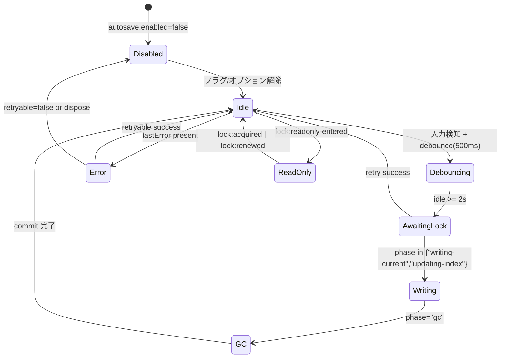

# AutoSave Indicator UI 実装ガイド

`AutoSaveIndicator` コンポーネントが AutoSave ランナーとロックモジュールから得る情報を UI に射影するための要件をまとめる。保存ポリシーと API 契約は [docs/AUTOSAVE-DESIGN-IMPL.md](../../AUTOSAVE-DESIGN-IMPL.md) に、Day8 系コンポーネント責務は [Day8/docs/day8/design/03_architecture.md](../../../Day8/docs/day8/design/03_architecture.md) に従う。

## 1. ステートマシン
`AutoSaveStatusSnapshot.phase` とロックイベントを統合し、下図のステートマシンで描画を制御する。【F:docs/AUTOSAVE-INDICATOR-UI.md†L33-L77】【F:docs/AUTOSAVE-DESIGN-IMPL.md†L90-L141】

- `ReadOnly` はロックイベントのみで遷移し、`snapshot().phase` が `idle` のままでもバナー表示を維持する。
- `phase='error'` かつ `retryable=false` は `Disabled` に準ずる扱いとし、履歴復元以外の CTA を無効化する。

## 2. 表示要素
表示要素は現行ツールバーの 240px 幅内に収め、Collector/Analyzer との責務分離を維持する。【F:docs/AUTOSAVE-INDICATOR-UI.md†L8-L118】【F:docs/AUTOSAVE-DESIGN-IMPL.md†L496-L587】

| 要素 | 内容 | 表示条件 | 実装メモ |
| --- | --- | --- | --- |
| PhaseBadge | `phase` に応じた色とアイコン | 常時 | `aria-live` と `role="status"` を併用し、`idle`/`error` は `assertive`、その他は `polite` |
| StatusLine | `lastSuccessAt`、`pendingBytes` の説明 | 常時 | テキスト更新時に `ui.autosaveIndicator.phaseChanged` を送信 |
| CTAHistory | 履歴ダイアログ導線 | `history.access !== 'hidden'` | `awaiting-lock`/`writing-current`/`gc` は `disabled`、ReadOnly では `data-emphasis="primary"` |
| CTARetry | 再試行ボタン | `lastError.retryable === true` | クリックで `onRequestRetry` を呼び、即時に `retry` テレメトリ発火 |
| CTAFlush | 手動保存ボタン | `pendingBytes > 0` かつ ReadOnly でない | 押下時に `aria-busy=true` と `ui.autosaveIndicator.flush` を送信 |
| ErrorBanner | エラー / ReadOnly 通知 | `lastError` あり or `lockState.mode==='readonly'` | 再試行不可時は履歴 CTA を primary 強調 |

## 3. アクセシビリティ要件
Day8 の UI ガイドラインと整合するよう、キーボード操作とスクリーンリーダー向け配慮を徹底する。【F:docs/AUTOSAVE-INDICATOR-UI.md†L118-L176】

- `PhaseBadge` / `StatusLine` を `role="status"` に設定し、`Idle`/`Error` を `aria-live="assertive"`、その他は `polite` とする。
- `CTAHistory` は `AutoSaveHistoryDialog` の `id` を `aria-controls` で参照し、フォーカス移動を優先する。
- `CTARetry` は DOM 挿入時のみフォーカスに入るよう条件レンダリングし、ReadOnly 時は非表示。
- 色覚補助として各フェーズにアイコンテキスト（例: Idle=チェック、Waiting=スピナー、Warning=エクスクラメーション）を併記する。
- ReadOnly バナーは `aria-live="assertive"` で即時通知し、解除時には `lock:acquired` を受領して `aria-live` で復帰を告知する。

## 4. テレメトリ出力条件
Collector/Analyzer が既存パイプラインで集計できるよう、UI から送信するイベントを最小限に整理する。【F:docs/AUTOSAVE-INDICATOR-UI.md†L176-L196】【F:docs/AUTOSAVE-DESIGN-IMPL.md†L861-L886】

| イベント | 送信条件 | Payload | 備考 |
| --- | --- | --- | --- |
| `ui.autosaveIndicator.phaseChanged` | `autosave:progress` / `autosave:success` でフェーズ遷移した直後 | `{ fromPhase, toPhase, retryCount }` | `StatusLine` 更新後に単発送信し、±5% SLO 内に抑制 |
| `ui.autosaveIndicator.errorShown` | `autosave:failure` でバナー/トースト表示時 | `{ code, retryable, sourcePhase }` | 再表示時は重複送信しないよう `lastError` を比較 |
| `ui.autosaveIndicator.historyOpened` | 履歴 CTA またはバナーからダイアログを開いた時 | `{ trigger: 'badge' | 'banner' }` | ReadOnly 中は `trigger='banner'` を優先 |
| `ui.autosaveIndicator.retry` | `CTARetry` またはバナーから再試行した時 | `{ source: 'cta' | 'banner' }` | ロック競合中は送信せず `lock:attempt` を待つ |
| `ui.autosaveIndicator.flush` | 手動保存ボタンを押下し、`flushNow` が開始した時 | `{ pendingBytes, fromPhase }` | `pendingBytes` は `snapshot()` の最新値を採用 |

- テレメトリ送信時は Collector へのイベント投入を 250ms デバウンスし、Day8 Collector の 4 分バッチに影響しないようバーストを抑制する。
- ReadOnly 解除後は `phaseChanged` を優先的に送信し、`errorShown` と重複しないよう `lock:readonly-entered` の発火履歴をチェックする。
