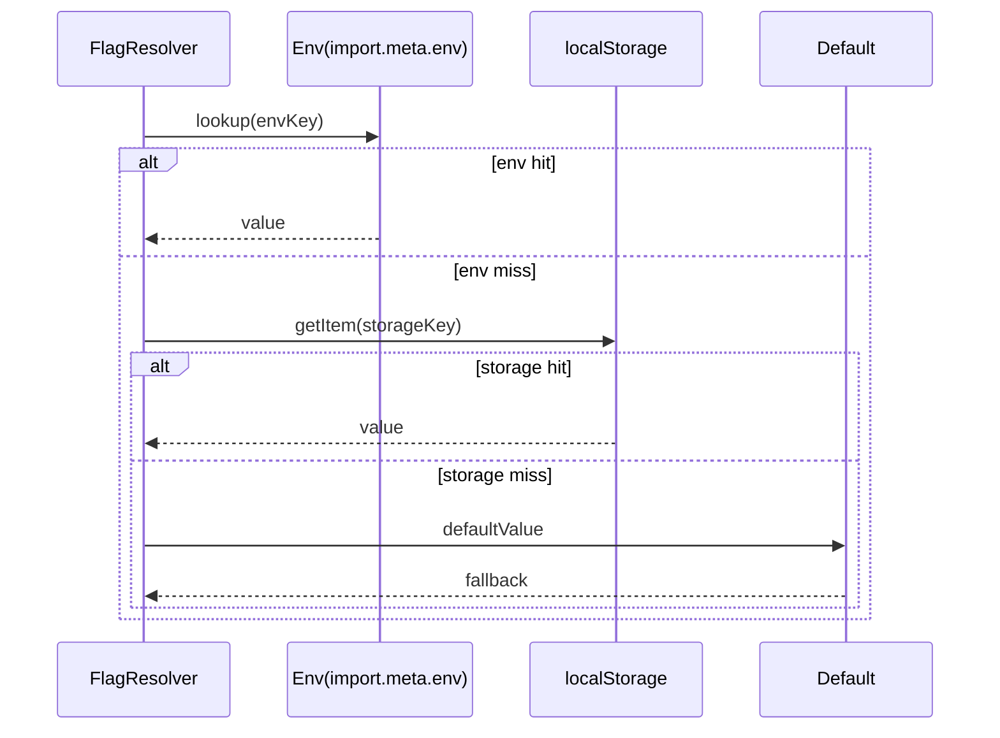

# Config Flags 設計メモ

## 1. フラグ解決モデル
`src/config/flags.ts` でフラグの解決順序とスキーマを定義する。`resolveFlag` は env → localStorage → default の優先順位で値を探索し、解決過程を `FlagResolution` として返す。

## 2. API 仕様
- `FlagDefinition<T>`: envキー・localStorageキー・既定値・coerceを保持する定義。既定の coerce は文字列を `T` にキャスト。
- `resolveFlag(def, options)`:
  - env/Storage モックを受け取れるため、ブラウザ外のテストも可能。
  - 返り値 `FlagResolution<T>` で解決ソースを明示。
- `resolveFeatureFlag(name)`:
  - `FeatureFlagName`（`'autoSave.enabled' | 'merge.diffTab'`）を引数に取り、`FEATURE_FLAG_DEFINITIONS` から解決。
  - `autoSave.enabled`: 既定 `false`。`VITE_FLAG_AUTOSAVE` または `flag:autoSave.enabled`。
  - `merge.diffTab`: 既定 `true`。`VITE_FLAG_MERGE_DIFF` または `flag:merge.diffTab`。

## 3. 既存 config との整合
- 現行 `src/config.ts`（OLLAMA_BASE）を `src/config/index.ts` で再エクスポートし、`flags.ts` も同一ディレクトリ配下に配置する。
- 後方互換: 既存 `import { OLLAMA_BASE } from './config'` は `src/config/index.ts` で `export * from '../config'` を行うか、既存ファイルを `src/config/index.ts` に移設後 `src/config.ts` から re-export する方針とする。
- 新 API は `import { resolveFeatureFlag } from './config/flags'` の直接利用、もしくは `src/config/index.ts` 経由で `export { resolveFeatureFlag, FEATURE_FLAG_DEFINITIONS } from './flags'` を提供する。

## 4. `App.tsx` / `MergeDock.tsx` への適用設計
- `src/App.tsx`
  - `useFeatureFlags()` フック（追って実装）で `autoSaveEnabled` を購読。
  - フラグ変化時: `autoSaveEnabled` が `true` になった瞬間に OPFS 自動保存処理を起動。`false` に戻った場合は定期保存タイマーを停止。
  - 既存 UI/API は変更せず、フラグ経由で副作用のみ制御する。
- `src/components/MergeDock.tsx`
  - `useFeatureFlags()` から `mergeDiffTabVisible` を受け取り、`tab==='golden'` 相当の切替ロジックに追加。
  - Diff Merge タブ（`pref==='diff-merge'` 選択肢）をフラグで制御し、非表示時は他の選択肢へフォールバック。

## 5. TDD テスト計画 (`tests/` 配置案)
1. `tests/config/flags.test.ts`
   - env 優先: env 値がある場合に localStorage を読まない。
   - localStorage フォールバック: env 未設定で localStorage ヒット。
   - default フォールバック: 両方未設定で default。
   - coerce: `'true'/'1'` → `true` に変換。
2. `tests/app/autosave-flag.test.tsx`
   - 初期状態: `autoSave.enabled=false` でタイマー未設定。
   - フラグが `false→true` に変化: AutoSave タイマーがセットされ、保存モックが1回以上起動。
   - `true→false` でタイマー解除・以降保存しない。
3. `tests/components/merge-dock-flag.test.tsx`
   - `merge.diffTab=true`: Diff Merge タブが表示され、選択可。
   - `merge.diffTab=false`: タブ非表示、既存 state が diff だった場合は `manual-first` に自動リセット。

## 6. テストゲート
- 上記テストが `node --test` または `vitest`（選定時）で green になること。
- `resolveFlag` のカバレッジ 100%（分岐網羅: env/local/default）。

## 7. ノート
- 後方互換維持: 既存の `src/config.ts` を削除せず、段階的移行を推奨。
- レイテンシ影響: フラグ解決は初期ロード時のみ実行し、5% 未満を想定。
