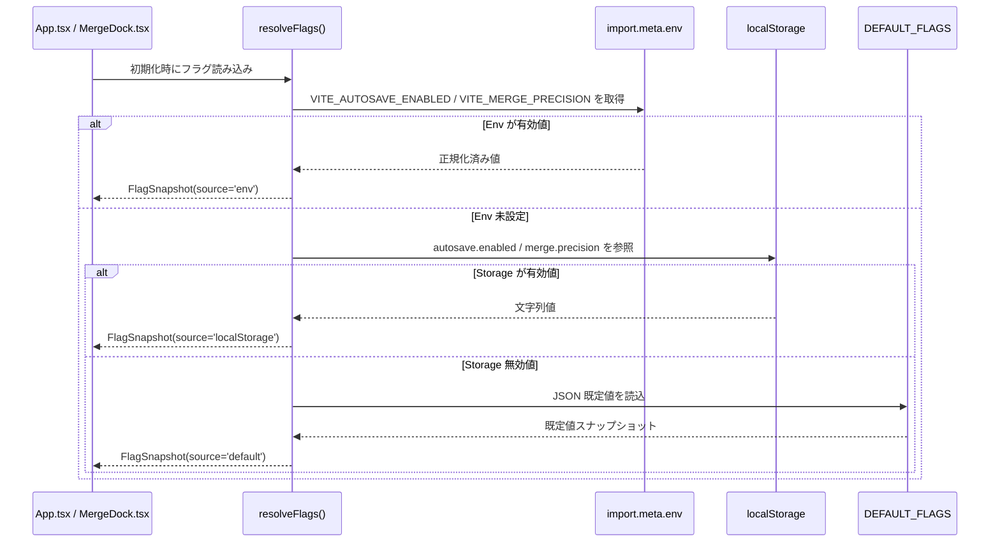

# Task Seed Template

## メタデータ

```yaml
task_id: 20250513-01
repo: https://github.com/Conimgponic/app
base_branch: main
work_branch: feat/config-flags-resolution
priority: P1
langs: [typescript]
```

## Objective

`src/config/flags.ts` を中核に、AutoSave / 精緻マージ向けのフラグ解決を `env→localStorage→既定値` の優先順位で統合し、`FlagSnapshot.source` で入力ソースの追跡を保証する。

## Scope

- In: `src/config/flags.ts`, `docs/CONFIG_FLAGS.md`, `App.tsx`, `MergeDock.tsx`
- Out: AutoSave ランナー本体、Diff Merge UI 実装

## Requirements

- Behavior:
  - `resolveFlags()` が `FlagSnapshot` を返し、各フラグの `source` とバリデーション結果を同梱する。
  - Phase A では既存 UI の `localStorage` 直接参照を許容しつつ、段階的に FlagSnapshot 経由へ誘導する。
- I/O Contract:
  - Input: `ResolveOptions` (`env`, `storage`, `clock`)
  - Output: `FlagSnapshot` (`autosave.enabled`, `merge.precision`, `updatedAt`)
- Constraints:
  - 既存API破壊なし / 不要な依存追加なし
  - Lint/Type/Test はゼロエラー
- Acceptance Criteria:
  - env → localStorage → 既定値の優先順位が `docs/CONFIG_FLAGS.md` と一致することをテストで担保。【F:docs/IMPLEMENTATION-PLAN.md†L5-L55】【F:docs/CONFIG_FLAGS.md†L57-L90】
  - 不正値入力時に既定値へフェールオーバーし、`FlagSnapshot.errors` に詳細が残ること。

## Affected Paths

- src/config/**
- docs/CONFIG_FLAGS.md
- src/App.tsx
- src/components/MergeDock.tsx
- tests/config/**

## Local Commands（存在するものだけ実行）

```bash
pnpm lint && pnpm typecheck && pnpm test
```

## Deliverables

- PR: タイトル/要約/影響/ロールバックに加え、本文へ `Intent: INT-001` と `## EVALUATION` アンカーを明記
- Artifacts: 変更パッチ、テスト、必要なら README/CHANGELOG 差分

---

## Plan

### Steps

1) 現状把握（対象ファイル列挙、既存テストと I/O 確認）
2) 小さな差分で仕様を満たす実装
3) sample::fail の再現手順/前提/境界値を洗い出し、必要な工程を増補
4) テスト追加/更新（先に/同時）
5) コマンド群でゲート通過
6) ドキュメント最小更新（必要なら）

## 設計詳細

### 入力ソース優先順位（シーケンス）



### `FlagSnapshot.source` 設計テーブル

| 優先順位 | 読み取り層 | `FlagSnapshot.source` | 主な用途 | フェールオーバー時のログ/対策 |
| --- | --- | --- | --- | --- |
| 1 | `import.meta.env` (`process.env` 同期含む) | `env` | CI / pnpm スクリプトからの強制切替。【F:docs/IMPLEMENTATION-PLAN.md†L17-L43】 | env が無効値ならバリデーションエラーを蓄積し、Storage 解決を試みる。
| 2 | `localStorage`（旧キー含む） | `localStorage` | Phase A の既存 UI 互換、ユーザーごとの上書き。【F:docs/IMPLEMENTATION-PLAN.md†L38-L55】 | 破損時は `FlagValidationError` を発行し、既定値へフォールバック。
| 3 | `DEFAULT_FLAGS`（`docs/CONFIG_FLAGS.md` 由来） | `default` | 新規起動や破損時の安全な既定値。【F:docs/IMPLEMENTATION-PLAN.md†L5-L33】 | `source` を `default` として Collector ログへ送信し、後方互換参照の削除判断に活用。

### 後方互換マトリクス（`docs/IMPLEMENTATION-PLAN.md` §0.1-0.2 連携）

| 既存利用箇所 | 互換要件 | 対応策 |
| --- | --- | --- |
| `App.tsx` AutoSave 起動 | `localStorage.autosave.enabled` 直参照を Phase A で維持。【F:docs/IMPLEMENTATION-PLAN.md†L30-L43】 | FlagSnapshot 経由を優先しつつ、`source!=='env'` 時は旧コードと整合するイベントログを残す。
| `MergeDock.tsx` タブ制御 | `merge.precision` が `legacy` の場合 Diff タブ非表示。【F:docs/IMPLEMENTATION-PLAN.md†L45-L76】 | FlagSnapshot の `precision` で分岐し、既定フォールバック時も旧挙動を維持。
| CLI (`scripts/config-dump.ts`) | Node 環境で env のみから解決 | `resolveFlags({ storage: null, env: process.env })` を露出し、副作用を隔離。

## テスト駆動シナリオ（`tests/config/flags.spec.ts`）

| ラベル | 想定ユース / 事前条件 | 期待結果 |
| --- | --- | --- |
| T1 | `import.meta.env` 未設定、`localStorage` 正常 (`autosave.enabled='false'`, `merge.precision='beta'`) | `source==='localStorage'` で正規化された値を返し、`errors` は空。|
| T2 | `import.meta.env` 未設定、`localStorage` 破損（`autosave.enabled='???'`） | `source==='default'` へフォールバックし、`invalid-boolean` を `errors` に記録。|
| T3 | `import.meta.env` 正常（`VITE_*` 設定済み）、`localStorage` 破損 | env 優先で `source==='env'`。Storage エラーは `errors` に蓄積するが値は env を採用。|
| T4 | env・Storage とも値無し | `DEFAULT_FLAGS` を採用し `source==='default'`、`updatedAt` が注入 Clock に従う。|
| T5 | 旧キーのみ存在（`flag:autoSave.enabled='true'`） | `source==='localStorage'` で旧キーから読める。|
| T6 | `localStorage` 非存在（null 注入） | env→default のみで解決し、Storage アクセスが行われない。|

> 各ケースは node:test を利用し、`ResolveOptions` へモックを注入するテストファーストで追加する。

## レビュー観点

- env→localStorage→既定値の優先順位が実装・テスト・ドキュメントで一貫しているか。
- `FlagSnapshot.source` のログ活用方針が App/Merge/Collector の要件と整合しているか。
- 上表の TDD ケースが `tests/config/flags.spec.ts` に網羅されているか。

## 承認フロー

- [ ] 後方互換ガード: 既存 `localStorage` 直接参照を残す箇所の TODO / Issue 化、Phase-B0 で除去する計画を `FLAG_MIGRATION_PLAN` と同期。【F:src/config/flags.ts†L110-L191】
- [ ] ロールバック条件: `env` 上書きで事故が発生した場合、`pnpm run flags:rollback --phase <prev>` を実行し Phase を 1 段階戻す運用手順が `docs/IMPLEMENTATION-PLAN.md` §2.1 と一致。【F:docs/IMPLEMENTATION-PLAN.md†L107-L173】

