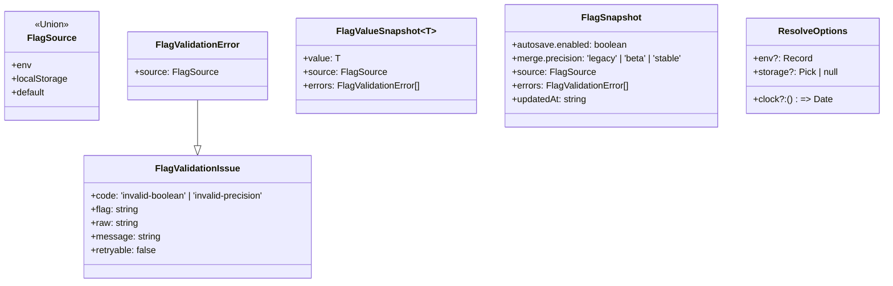
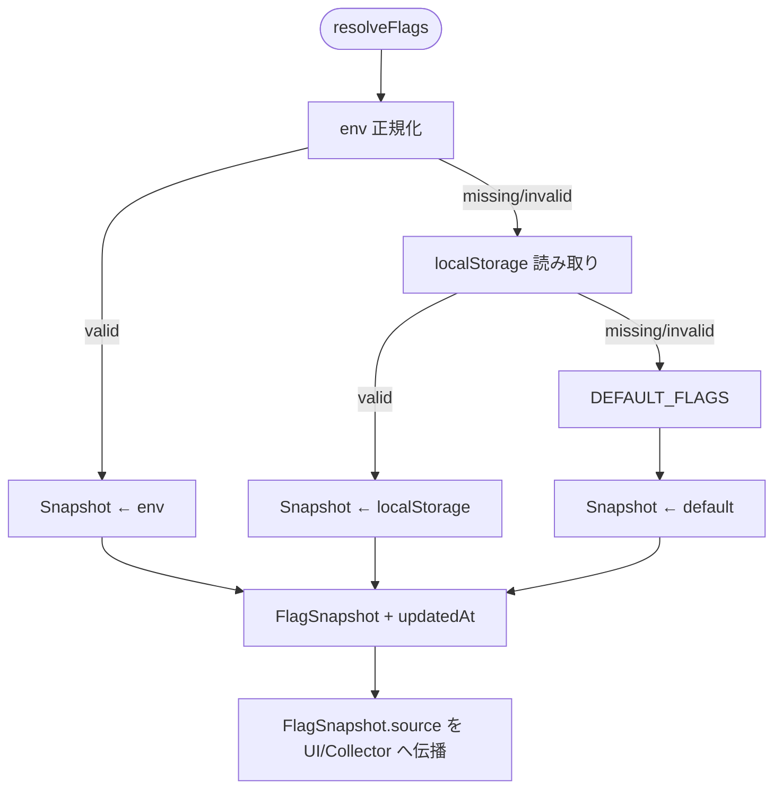

# Task Seed Template

## メタデータ

```yaml
task_id: 20240505-01
repo: https://github.com/Conimgponic/app
base_branch: main
work_branch: feat/config-flags-resolution
priority: P1
langs: [typescript]
```

## Objective

`src/config/flags.ts` を新設し、AutoSave/精緻マージ両機能のフラグ解決を env→localStorage→既定値の優先順位で統合する。

## Scope

- In: `src/config/flags.ts`, `docs/CONFIG_FLAGS.md`, `App.tsx`, `MergeDock.tsx`
- Out: AutoSave ランナー実装、Diff Merge UI 実装

## Requirements

- Behavior:
  - `resolveFlags()` が `FlagSnapshot` を返し、各フラグの `source` とバリデーション結果を同梱する。
  - 既存 UI の `localStorage` 直接参照を維持しつつ段階的移行を可能にする。
- I/O Contract:
  - Input: `ResolveOptions` (`env`, `storage`, `clock`)
  - Output: `FlagSnapshot` (`autosave.enabled`, `merge.precision`, `updatedAt`)
- Constraints:
  - 既存API破壊なし / 不要な依存追加なし
  - Lint/Type/Test はゼロエラー
- Acceptance Criteria:
  - FlagSnapshot が env/localStorage/既定値を正しく特定することを単体テストで証明する。
  - 後方互換の `localStorage` 値が不正な場合でも既定値へフェールオーバーし、`errors` が記録される。

## Affected Paths

- src/config/**
- docs/CONFIG_FLAGS.md
- src/App.tsx
- src/components/MergeDock.tsx
- tests/config/**

## Local Commands（存在するものだけ実行）

```bash
pnpm lint && pnpm typecheck && pnpm test
```

## Deliverables

- PR: タイトル/要約/影響/ロールバックに加え、本文へ `Intent: INT-001` と `## EVALUATION` アンカーを明記
- Artifacts: 変更パッチ、テスト、必要ならREADME/CHANGELOG差分

---

## Plan

### Steps

1) 現状把握（対象ファイル列挙、既存テストとI/O確認）
2) 小さな差分で仕様を満たす実装
3) sample::fail の再現手順/前提/境界値を洗い出し、必要な工程を増補
4) テスト追加/更新（先に/同時）
5) コマンド群でゲート通過
6) ドキュメント最小更新（必要なら）

## 設計詳細

### 型構成（`src/config/flags.ts`）



- `FlagDefinition<T>` と `FlagCoercer<T>` を内部ユーティリティとして保持し、入力値検証とエラー集約を一元化する。
- `legacyStorageKeys` により Phase A で残る旧キー互換を確保する。

### 解決フロー



### 後方互換マトリクス

| 既存利用箇所 | 互換要件 | 対応策 |
| --- | --- | --- |
| `App.tsx` AutoSave 起動判定 | `localStorage.autosave.enabled` を直接参照する旧ロジックを Phase A で維持 | `FlagSnapshot.autosave.source==='localStorage'` の場合はイベントログへ `source` を残し、旧参照の削除は Phase B-0 以降に限定 |
| `MergeDock.tsx` タブ露出 | `localStorage.merge.precision` が `beta`/`stable` でない時の既定挙動を維持 | `merge.precision` が既定値へフォールバックした場合でも Diff タブが露出しないようガードを継続 |
| CLI (`scripts/config-dump.ts`) | `process.env` 参照互換 | `resolveFlags({ storage: null, env: process.env })` を提供してブラウザ依存を排除 |

## テスト駆動シナリオ（`tests/config/flags.spec.ts`）

1. env 優先: `import.meta.env` に `VITE_AUTOSAVE_ENABLED='true'`, `VITE_MERGE_PRECISION='beta'` を与える → `source==='env'`, `value` 正常化。
2. localStorage フォールバック: env 未設定、`localStorage.autosave.enabled='false'`, `localStorage.merge.precision='stable'` → `source==='localStorage'`。
3. 既定値: env/localStorage が未設定 → 既定 JSON を採用し `source==='default'`。
4. 不正値処理: env が `"maybe"`/`"hyper"` → `errors` に `invalid-boolean`/`invalid-precision` を追加し、localStorage も不正な場合は既定値にフォールバック。
5. 旧キー互換: `legacyStorageKeys=['autosaveEnabled']` など旧キーに値があり、新キー無し → 旧キーから読み取り、`source==='localStorage'`。
6. `FlagSnapshot.source` 伝播: env→storage→default の各分岐をモックし、`App`/`MergeDock` ダミーコンシューマーへ `source` が渡ることを検証。
7. Clock 注入: `clock` を固定して `updatedAt` が ISO8601 になることを確認。

## レビュー用チェックリスト

- [ ] 入力ソースマッピング: env→localStorage→既定値の優先順位が `docs/CONFIG_FLAGS.md` と一致しているか。
- [ ] 回帰リスク評価: Phase A の旧 `localStorage` 直接参照が継続し、Diff タブ露出条件が変化していないか。
- [ ] ロールバック手順: `pnpm run flags:rollback --phase <prev>` を実行し、`FlagSnapshot.source` が `default` へ戻ることを確認済みか。

### 承認フロー

1. Config WG（Owner）: 設計整合性レビュー
2. QA リード: TDD シナリオと回帰リスク評価
3. リリースマネージャー: ロールバック手順確認後に承認

