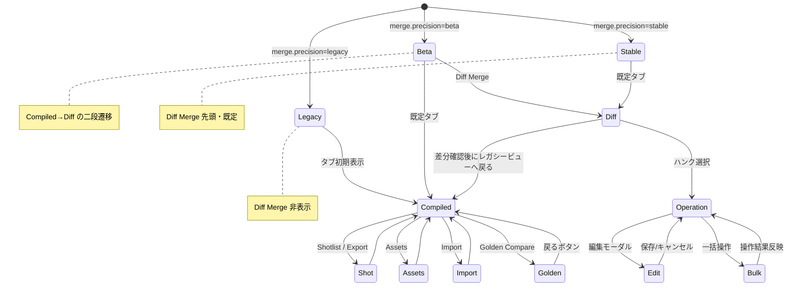

# Diff Merge UI 設計メモ

## 0. MergeDock / DiffMergeView 役割整理

### 0.1 MergeDock.tsx
- **タブ制御のハブ**: `MergeDock` はコンパイル済みスクリプト、ショットリスト、アセット、インポート、ゴールデン比較といった既存タブを束ね、`tab` ステートで現在表示を管理する。【F:src/components/MergeDock.tsx†L44-L118】
- **プレーンテキスト統合の既定値**: Compiled タブでは `pref` ステートによる `manual-first` / `ai-first` 優先順位に基づき各シーンの手動/AI案を連結し、`diff-merge` モードが未実装の現行ロジックを提供する。【F:src/components/MergeDock.tsx†L26-L82】
- **入出力ゲートウェイ**: Export/Import 操作、OPFS スナップショット保存、Golden Compare への導線など周辺ユースケースのボタン群を保持し、Diff Merge 導入後もこれらレガシーフローが継続利用できるようにする。【F:src/components/MergeDock.tsx†L84-L141】

### 0.2 DiffMergeView.tsx（予定）
- **精緻マージ UI 本体**: `DiffMergeView` は `merge3` の結果（ハンク一覧・統計）を表示し、各ハンクへの手動採用/AI採用/編集コマンドを `queueMergeCommand` 経由で `merge.ts` に伝搬する役割を担う。【F:docs/MERGE-DESIGN-IMPL.md†L145-L205】
- **ロック/AutoSave 調停**: ハンク編集時に `imgponic:merge` ロックを取得し、AutoSave 側へ再保存タイミングを通知することで競合を回避する。【F:docs/MERGE-DESIGN-IMPL.md†L184-L194】【F:docs/AUTOSAVE-DESIGN-IMPL.md†L35-L132】
- **テレメトリ集約ポイント**: 各操作を Collector 用 JSONL ログ（`merge:hunk:*`、`merge:trace:*`）へ出力し、Day8 パイプラインへ連携する。【F:docs/MERGE-DESIGN-IMPL.md†L210-L222】【F:Day8/docs/day8/design/03_architecture.md†L3-L27】

## 1. タブ構成と `merge.precision` フラグ別 UI

### 1.1 MergeDock 外部タブ
| precision | 表示タブ | 既定タブ | 備考 |
| --- | --- | --- | --- |
| `legacy` | Compiled / Shotlist / Assets / Import / Golden | Compiled | 既存の `pref` セレクタは `manual-first` / `ai-first` のみを露出し、Diff Merge 関連 UI を隠蔽。【F:src/components/MergeDock.tsx†L24-L147】 |
| `beta` | Compiled / Diff Merge / Shotlist / Assets / Import / Golden | Compiled | `Diff Merge` を新設。Compiled ビューの `pref` から `diff-merge` オプションへ遷移可能だが既定は `manual-first`。Beta 表示は QA 向け限定。【F:src/components/MergeDock.tsx†L24-L83】【F:docs/CONFIG_FLAGS.md†L28-L34】 |
| `stable` | Diff Merge / Compiled / Shotlist / Assets / Import / Golden | Diff Merge | `Diff Merge` を先頭・既定に昇格。Compiled ビューはバックアップ表示として維持し、`pref` の初期値を `diff-merge` に変更。精緻マージ結果を既定採用する安定版要件と整合。【F:docs/CONFIG_FLAGS.md†L28-L34】【F:docs/MERGE-DESIGN-IMPL.md†L184-L188】 |

### 1.2 DiffMergeView 内部ペイン
`DiffMergeView` は MergeDock 内タブの本体として、左ハンク一覧と右操作パネルで構成する。`DiffMergeTabs` をタブバーに追加し、以下の子要素を持つ。【F:docs/MERGE-DESIGN-IMPL.md†L145-L183】  
- **HunkListPane**: 自動/衝突件数、閾値スライダー、ハンク行バッジ。  
- **OperationPane**: Bulk 操作バー、ハンク詳細、差分ビュー、決定ボタン、編集モーダル。  
- **State Machine**: `AutoResolved` ⇄ `Conflict`（`Idle`/`ApplyingManual`/`ApplyingAI`/`ManualEditing`）。UI 操作は `queueMergeCommand` を通じて `merge.ts` へ集約する。【F:docs/MERGE-DESIGN-IMPL.md†L170-L183】  
- **アクセシビリティ**: MergeDock→ハンク→操作パネルのタブ順、ARIA 属性、キーボード操作。precision=`stable` で初期表示となるため、フォーカス管理とスクリーンリーダ対応を必須とする。【F:docs/MERGE-DESIGN-IMPL.md†L184-L188】

## 2. `merge3` API 入出力とテスト優先ケース

### 2.1 API 仕様整理
| 型 / 関数 | 役割 | 主なフィールド |
| --- | --- | --- |
| `MergeProfile` | トークナイザ/粒度/閾値/優先度設定。precision により `threshold` 下限を制御。 | `{ tokenizer, granularity, threshold, prefer }`【F:docs/MERGE-DESIGN-IMPL.md†L16-L48】 |
| `MergeInput` | Base/Ours/Theirs の 3 テキストと任意セクション配列。 | `{ base, ours, theirs, sections? }`【F:docs/MERGE-DESIGN-IMPL.md†L16-L61】 |
| `MergeHunk` | セクション単位の判定結果。`decision` が `auto` or `conflict`。 | `{ section, decision, similarity?, merged?, manual?, ai? }`【F:docs/MERGE-DESIGN-IMPL.md†L16-L61】 |
| `merge3` | `MergeInput` + `Partial<MergeProfile>` を受け、`{ hunks, mergedText, stats }` を返す決定的 3-way マージ。 | 類似度算出と統計更新、trace 出力までをカバー。【F:docs/MERGE-DESIGN-IMPL.md†L16-L110】 |

### 2.2 テスト優先ケース（TDD）
1. **自動確定**: `similarity ≥ threshold` のハンクが `decision:'auto'` となり、`mergedText` に連結されること。`prefer:'none'` でも lock が無い場合に成立することを確認。【F:docs/MERGE-DESIGN-IMPL.md†L40-L70】  
   - 期待イベント: `merge:stats:refreshed`、`merge:hunk:decision(auto)`。【F:docs/MERGE-DESIGN-IMPL.md†L215-L220】
2. **競合ハンドリング**: `similarity < threshold` で `decision:'conflict'`、Manual/AI ボタン操作で `queueMergeCommand` が適切な payload を送る。UI テストは React Testing Library で操作を再現。【F:docs/MERGE-DESIGN-IMPL.md†L170-L201】
3. **ロールバック/リセット**: `resetDecision`／Undo により `AutoResolved` → `Conflict.Idle` へ戻り、`mergedText` が再生成される。証跡書き込みの失敗時は再試行イベントを確認。【F:docs/MERGE-DESIGN-IMPL.md†L179-L194】

## 3. UIイベント × AutoSave / Collector データフロー照合
| UIイベント | AutoSave 連携 | Collector/Analyzer パイプライン | 備考 |
| --- | --- | --- | --- |
| ハンク決定 (`setManual`/`setAI`/`commitManualEdit`) | Merge 専用ロック `imgponic:merge` を取得し、AutoSave は書き込みをロック解放後に再実行する。`autosave.lock.*` イベントは再試行状況を UI へ通知。【F:docs/MERGE-DESIGN-IMPL.md†L190-L194】【F:docs/AUTOSAVE-DESIGN-IMPL.md†L186-L209】 | `merge:hunk:decision` ログを Collector が収集し、Analyzer→Reporter→Governance の Day8 パイプラインに流す。【F:docs/MERGE-DESIGN-IMPL.md†L215-L222】【F:Day8/docs/day8/design/03_architecture.md†L3-L36】 | AutoSave は `workflow-cookbook/logs` への直接書込を避け、既存 logger を使用する方針に従う。【F:docs/AUTOSAVE-DESIGN-IMPL.md†L375-L377】 |
| 統計再取得 (`refreshStats`) | ロック影響なし。AutoSave は書き込み待機中でも読み込みのみ行い、UI バナーで再試行を促す。【F:docs/MERGE-DESIGN-IMPL.md†L190-L193】 | `merge:stats:refreshed` ログが Analyzer のメトリクス算出に利用される。【F:docs/MERGE-DESIGN-IMPL.md†L215-L219】【F:Day8/docs/day8/design/03_architecture.md†L3-L27】 | 再取得失敗は `merge:trace:error` と紐づけて調査用 JSONL に残す。【F:docs/MERGE-DESIGN-IMPL.md†L215-L222】 |
| 証跡書込 (`persistTrace`) | AutoSave が `Saved` トリガーを出すまで `MergeDock` は保存完了を表示しない。ロック解放後に AutoSave が OPFS 書込完了を通知。【F:docs/MERGE-DESIGN-IMPL.md†L184-L194】【F:docs/AUTOSAVE-DESIGN-IMPL.md†L305-L318】 | `merge:trace:persisted` / `merge:trace:error` が Collector → Analyzer → Reporter で追跡され、Governance 監査へ連携。【F:docs/MERGE-DESIGN-IMPL.md†L215-L222】【F:Day8/docs/day8/design/03_architecture.md†L3-L36】 | AutoSave の JSONL ログ形式に合わせ、Reporter が Why-Why 素材を抽出しやすくする。【F:docs/AUTOSAVE-DESIGN-IMPL.md†L375-L377】 |

## 4. 画面遷移・データフロー・テスト計画

### 4.1 画面遷移図（フラグ条件別）

`merge.precision=legacy` では Diff Merge タブを出さず従来タブのみを循環させ、`beta` で Compiled → Diff Merge への明示遷移を設ける。`stable` では Diff Merge が初期フォーカスとなり、操作ペイン → 編集モーダル → 一括操作が循環経路として機能する。【F:docs/IMPLEMENTATION-PLAN.md†L9-L60】【F:docs/CONFIG_FLAGS.md†L28-L34】【F:docs/MERGE-DESIGN-IMPL.md†L145-L205】

### 4.2 データフロー

`merge.ts` の統合結果は Store 経由で UI へ戻り、AutoSave Provider が lock イベントと保存完了を仲介する。Collector は Merge/AutoSave 双方の JSONL を取り込み、Day8 パイプラインに渡す。【F:docs/MERGE-DESIGN-IMPL.md†L170-L222】【F:docs/AUTOSAVE-DESIGN-IMPL.md†L186-L318】【F:Day8/docs/day8/design/03_architecture.md†L3-L27】

### 4.3 テスト計画
- **ユニット (`merge.ts`)**: `merge3` 自動確定/競合/ロールバック、統計平均、trace 出力。差分検出の determinism をハッシュ比較で保証。【F:docs/MERGE-DESIGN-IMPL.md†L16-L110】【F:docs/MERGE-DESIGN-IMPL.md†L170-L194】
- **コンポーネント (React Testing Library)**: タブ表示切替、ハンク決定ボタン、EditModal 操作、統計エラーバナー、Diff Merge 既定表示（precision=`stable`）。【F:docs/MERGE-DESIGN-IMPL.md†L170-L201】
- **統合 (AutoSave 連携)**: Merge ロック取得→AutoSave 再保存→`Saved` 表示までのフロー、Collector への JSONL ログ整合。AutoSave のリトライ/readonly 遷移を再現し、Diff Merge UI が正しいステータスを表示すること。【F:docs/MERGE-DESIGN-IMPL.md†L190-L222】【F:docs/AUTOSAVE-DESIGN-IMPL.md†L186-L318】

## 5. テレメトリ・Collector 連携メモ

- **Collector 契約**: Diff Merge の操作イベントは JSONL で `workflow-cookbook/logs` に保存し、Day8 パイプライン（Collector → Analyzer → Reporter）で自動処理される。Collector の責務と流れは Day8 設計ドキュメントに準拠し、イベント名は `merge:*` / `autosave:*` のプレフィックスを採用する。【F:Day8/docs/day8/design/03_architecture.md†L3-L36】【F:docs/IMPLEMENTATION-PLAN.md†L231-L280】
- **AutoSave 協調**: AutoSave API は `initAutoSave` を起点に `snapshot` / `flushNow` / `dispose` などを提供し、Diff Merge 側のロック操作中は書き込みを保留する。`MergeDock` からの書き戻し完了後、AutoSave が `current.json` / `index.json` を原子的に更新する流れを保持する。【F:docs/AUTOSAVE-DESIGN-IMPL.md†L3-L132】
- **エラー分類と再試行**: `AutoSaveError` の `retryable` 属性と Day8 Collector の再試行ポリシーを統合し、ロック取得失敗（`lock-unavailable`）は指数バックオフで再試行し、`data-corrupted` は即 Reporter 通知。Diff Merge 側は `merge:trace:error` を Collector へ発火し、Analyzer が Why-Why に反映できるようにする。【F:docs/AUTOSAVE-DESIGN-IMPL.md†L61-L180】【F:Day8/docs/day8/design/03_architecture.md†L3-L27】【F:docs/MERGE-DESIGN-IMPL.md†L210-L222】

本メモを基に Diff Merge タブの実装・テストを TDD で進め、QA レビューへ共有する。
