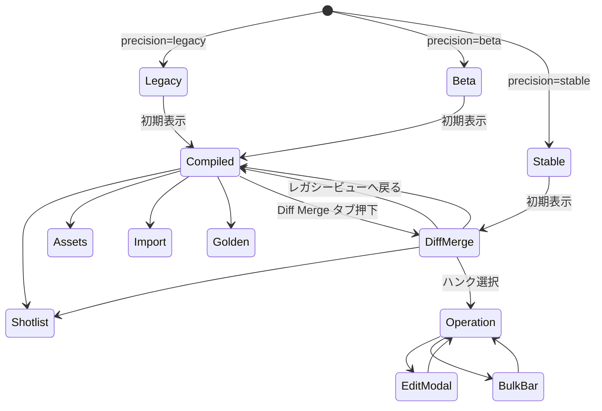
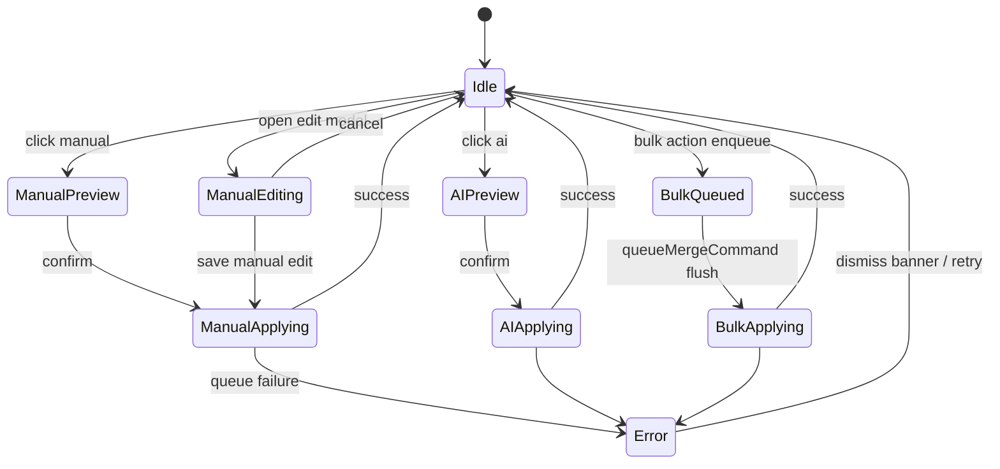

# DiffMergeView Component Design

## 1. Scope & Context
- **対象**: `src/components/DiffMergeView.tsx` とそのサブ構成要素（`DiffMergeTabs`, `HunkListPane`, `OperationPane`, 編集モーダル群）。
- **参照仕様**: AutoSave の保存ポリシーとロック運用【docs/AUTOSAVE-DESIGN-IMPL.md】、Day8 パイプラインの Collector→Analyzer→Reporter 連携【Day8/docs/day8/design/03_architecture.md】。
- **目的**: `merge.precision` フラグ (`legacy`/`beta`/`stable`) に応じたタブ露出制御と、ハンク操作の状態管理・`queueMergeCommand` 連携を統合する。
- **非対象**: 実際のマージアルゴリズム（`src/lib/merge.ts`）。

## 2. UI 設計図
### 2.1 タブ構成（MergeDock 配下）
| precision | タブ配列 (`DiffMergeTabs`) | 初期選択 | 備考 |
| --- | --- | --- | --- |
| `legacy` | `Compiled / Shotlist / Assets / Import / Golden` | `Compiled` | Diff Merge はプレースホルダー。既存 5 タブを `DiffMergeTabs` でそのまま描画し、`DiffMergeView` 本体は `null` を返却。 |
| `beta` | `Compiled / Diff Merge / Shotlist / Assets / Import / Golden` | `Compiled` | Diff Merge は QA 用追加タブ。`pref='diff-merge'` 選択で遷移。 |
| `stable` | `Diff Merge / Compiled / Shotlist / Assets / Import / Golden` | `Diff Merge` | Diff Merge を既定表示へ昇格。Compiled は後方互換タブとして残す。 |

### 2.2 タブ遷移図

- `precision` の変更は `useEffect` で `activeTab` を再初期化し、`legacy` へ降格した場合は Diff Merge 関連ステートを破棄する。【F:docs/IMPLEMENTATION-PLAN.md†L38-L83】

### 2.4 MergeDock 連携
- `MergeDock.tsx` は `merge.precision` フラグを解決し、`pref` セレクタに `diff-merge` オプションを差し込む。`legacy` フェーズではタブを隠し、`beta/stable` で `DiffMergeView` を遅延ロードする。【F:docs/IMPLEMENTATION-PLAN.md†L38-L83】【F:src/components/MergeDock.tsx†L24-L147】
- `DiffMergeView` は `mergePrecision`, `activeTab`, `scenes`, `mergeProfile`, `queueMergeCommand` を props で受信し、`activeTab==='diff-merge'` のときのみペインを描画する。タブ離脱時は内部ステートを `snapshot()` しておき、戻った際に復元することで既存タブとの衝突を防ぐ。
- `DiffMergeTabs` は `MergeDock` 直下で制御されるが、`DiffMergeView` が `onTabChange` ハンドラを提供し、precision 切替と同時に `pref` を調停する。これにより `compiled` など legacy タブとの往復でもタブ順序／遷移図（Implementation Plan §0.3）と一致させる。
- `queueMergeCommand` 実行結果は `MergeDock` の Telemetry レイヤーへ伝播させ、Day8 Collector が取りこぼさないようイベント名を `merge:ui:*` に統一する。【F:Day8/docs/day8/design/03_architecture.md†L1-L41】

### 2.3 レイアウト
```
┌ DiffMergeTabs ──────────────────────────────┐
│ [Diff Merge] [Compiled] [Shotlist] …        │
├─────────────────────────────────────────────┤
│ HunkListPane        │ OperationPane         │
│ ├ StatsHeader       │ ├ HunkHeader          │
│ ├ FilterControls    │ ├ DecisionButtons     │
│ └ HunkVirtualList   │ ├ DiffViewer          │
│                     │ └ BulkBar / Modals    │
└─────────────────────────────────────────────┘
```
- `OperationPane` 内で編集操作が開始された場合はモーダル (`EditModal`, `ApplyDecisionModal`) をポータル描画し、`DiffMergeView` が開閉制御を持つ。

## 3. 状態管理仕様
### 3.1 主要ステート
| キー | 型 | 説明 |
| --- | --- | --- |
| `mergePrecision` | `'legacy' \| 'beta' \| 'stable'` | フラグ変更時にタブ・ハンク状態を同期。`legacy` 時は `DiffMergeView` をアンマウント。 |
| `activeTab` | `'compiled' \| 'diff-merge' \| 'shotlist' \| …` | `DiffMergeTabs` が制御。precision 切替時に再初期化。 |
| `selectedHunkId` | `string \| null` | ハンク選択。`legacy` 降格・ハンク削除時は `null`。 |
| `hunkState` | `Record<string, HunkUIState>` | ハンクごとの UI 状態キャッシュ。`HunkUIState` は下記ステートマシンに従う。 |
| `queue` | `MergeCommandQueue` | `queueMergeCommand` へ送るペンディング操作。OperationPane で enqueue。 |
| `modalState` | `{ type: 'edit' | 'bulk' | null; hunkId?: string }` | モーダル開閉制御。 |
| `autosaveLock` | `'idle' \| 'acquiring' \| 'held'` | AutoSave とのロック同期。ハンク編集時に `'acquiring'` → `'held'`。 |

### 3.2 ハンク操作ステートマシン

- `queueMergeCommand` への投入は `ManualApplying` / `AIApplying` / `BulkApplying` / `ManualEditing` から発火し、成功時に `merge.ts` からの完了イベントで `Idle` に戻す。
- `queueMergeCommand` 失敗時は `Error` へ遷移し、`retryable` なら再度 `queueMergeCommand` を呼び出す。非 retryable はバナー表示＋ Collector 送信。

### 3.3 `queueMergeCommand` 連携と責務境界
| Command | 発火元 | Payload | `queueMergeCommand` 側責務 | UI リアクション |
| --- | --- | --- | --- | --- |
| `setManual` | ManualApplying | `{ hunkId, source: 'manual', actor }` | ハンク決定を永続キューへ投入。競合検知時は `retryable`=`true` で再試行を指示。 | ハンク行に `manual` バッジ付与。 |
| `setAI` | AIApplying | `{ hunkId, source: 'ai', actor }` | AI 決定の適用と統計更新。非 retryable エラーは `MergeError` として返却。 | ハンク行に `ai` バッジ。 |
| `commitManualEdit` | ManualEditing | `{ hunkId, diff }` | 編集内容を 3-way マージへ転送し、OPFS 書込完了イベントを publish。 | モーダル閉鎖、`autosaveLock` 解放。 |
| `queueBulk` | BulkApplying | `{ hunkIds, decision }` | 一括処理のバックプレッシャ制御。進捗イベントを段階的に emit。 | リストを一括更新。 |
| `revertDecision` | Error banner action | `{ hunkId }` | 差分復元とロールバックログ記録。Collector へ incident-level を送信。 | ハンクを `Idle` へ戻し再描画。 |

- `queueMergeCommand` は **非同期コマンドキュー**として機能し、UI からは fire-and-forget。戻り値は `Promise<MergeCommandResult>` で、UI は `retryable`/`fatal` フラグのみ参照する。キュー内部での実ファイル更新や Day8 Collector へのテレメトリ送出は UI の外に閉じ込める。
- DiffMergeView 側はコマンド発火前に入力検証（選択済みハンクの存在確認など）を行い、結果イベント (`subscribeMergeEvents`) に応じて UI ステートを更新する。これにより Merge エンジンのリプレース時も UI 契約を維持できる。【F:docs/MERGE-DESIGN-IMPL.md†L140-L238】

### 3.4 AutoSave 連携
- 編集開始時 (`ManualEditing` へ遷移) に `navigator.locks` で `imgponic:merge` を取得し、AutoSave の保存シーケンスを一時停止。【F:docs/AUTOSAVE-DESIGN-IMPL.md†L1-L135】
- ロック解放後に `autosave.lock.released` を受信して `autosaveLock='idle'` へ戻す。保存再開時は Diff Merge 側の更新完了イベントと整合させる。

## 4. Precision 切替時の UI 遷移
1. `merge.precision` 変更検知 (`useEffect`)。
2. `legacy` 遷移: `activeTab` を `compiled` へリセット、`DiffMergeView` をアンマウント、ハンク関連ステートを初期化。
3. `beta` 遷移: `activeTab` を保持。`pref='diff-merge'` が選択されていた場合のみ `diff-merge` タブを表示。`selectedHunkId` は保持。
4. `stable` 遷移: `activeTab` を強制的に `diff-merge` に設定。初回表示で `selectedHunkId` を最初の衝突ハンクに設定し、操作ペインを表示。
5. いずれの遷移でも `DiffMergeTabs` がタブリストを再構成し、`HunkListPane` のスクロール位置は `selectedHunkId` に応じて復元。

## 5. モーダル連携
- `OperationPane` から `openEditModal(hunkId)` を dispatch → `modalState={type:'edit',hunkId}` → `EditModal` をポータル描画。
- `EditModal` 保存時に `queueMergeCommand({ type:'commitManualEdit', ... })` を実行し、成功時に AutoSave ロックを解放。
- Bulk 操作は `modalState={type:'bulk'}` を介して確認ダイアログを表示し、確定で `queueBulk` を発火。
- モーダル閉鎖時はフォーカスを元の決定ボタンへ戻し、アクセシビリティを確保する。

## 6. テストケース（TDD）
| ID | precision | シナリオ | 期待結果 |
| --- | --- | --- | --- |
| DM-TAB-01 | `legacy` | precision=`legacy` で Diff Merge タブが非表示 | `DiffMergeTabs` が 5 タブのみ描画。`DiffMergeView` は `null`。 |
| DM-TAB-02 | `beta` → `stable` | `beta` で Compiled → Diff Merge タブ遷移後、`stable` に切替 | `activeTab` が `diff-merge` に固定、ハンク選択が持続。 |
| DM-TAB-03 | `stable` → `legacy` | `stable` から `legacy` へ降格 | ハンク選択リセット、Compiled タブへ戻る。 |
| DM-HUNK-01 | `stable` | Manual ボタン押下 → confirm | `queueMergeCommand('setManual')` が 1 回発火し、ハンクが `manual` 表示に遷移。 |
| DM-HUNK-02 | `stable` | AI ボタンで失敗 (`retryable=true`) | `Error` ステート表示、再試行で成功→`Idle`。 |
| DM-HUNK-03 | `stable` | EditModal 保存 | AutoSave ロック取得→`commitManualEdit` 発火→ロック解放イベントを待機。 |
| DM-HUNK-04 | `beta` | Bulk 操作で複数ハンク決定 | `queueBulk` が対象ハンク数分の更新イベントを受信。 |
| DM-MODAL-01 | `stable` | モーダル閉鎖時のフォーカス復帰 | 前回ボタンへフォーカスが戻る。 |
| DM-QUEUE-01 | 全 precision | `queueMergeCommand` が拒否（非 retryable） | バナー表示、Collector へ `merge:trace:error` を送信。 |
| DM-AUTOSAVE-01 | `stable` | 編集開始時の AutoSave 停止 | `autosaveLock='held'` 中は AutoSave が書込を遅延し、解放後に保存再開。 |

## 7. データフロー整合性
- `queueMergeCommand` 成功時に `merge.ts` が統計・JSONL ログを更新し、Day8 パイプラインへ渡す。【F:Day8/docs/day8/design/03_architecture.md†L1-L41】
- AutoSave はロックフェーズを尊重し、`current.json` と `index.json` の整合を維持する。【docs/AUTOSAVE-DESIGN-IMPL.md】

