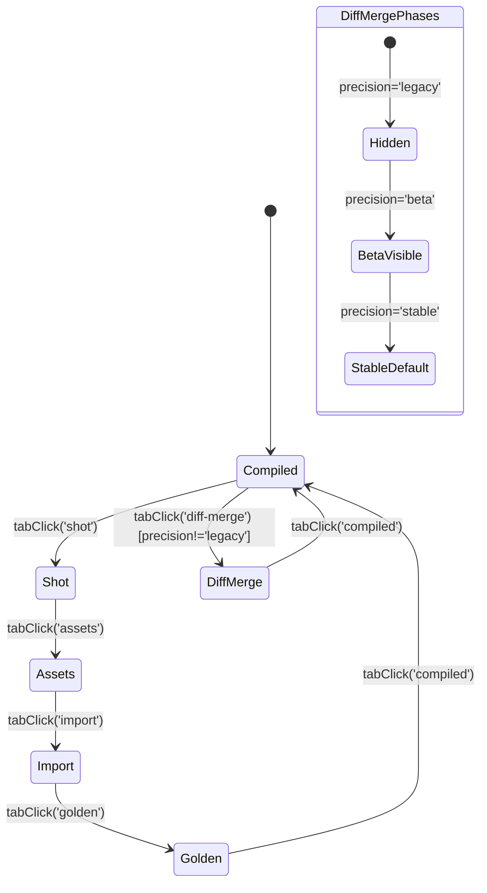
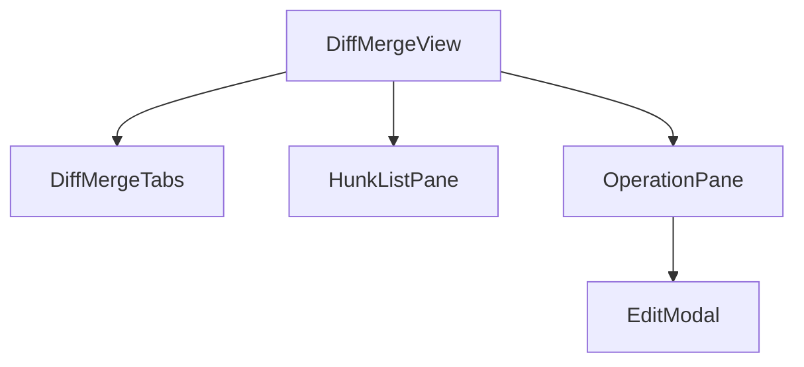
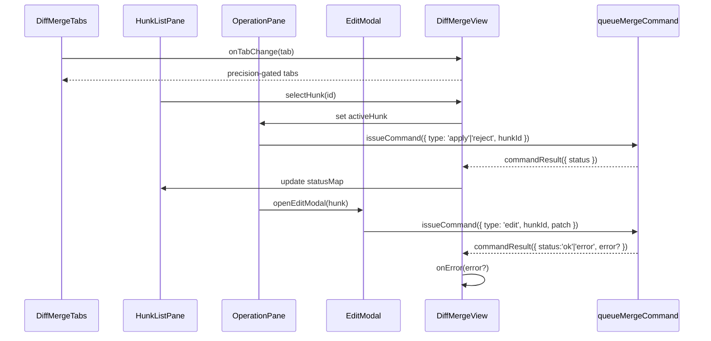

# DiffMergeView 設計

## 1. 参照ドキュメント
- [AutoSave 実装詳細](../AUTOSAVE-DESIGN-IMPL.md): フィーチャーフラグ段階導入・副作用隔離の原則
- [Day8 アーキテクチャ方針](../../Day8/docs/day8/design/03_architecture.md): コンポーネント責務分離と Collector/Analyzer 依存の整理

## 2. 目的と前提
Diff Merge タブの UI スケルトンを `MergeDock` に統合し、`merge.precision` フラグ（`legacy` → `beta` → `stable`）に応じて露出を制御する。`queueMergeCommand` を中心としたハンク選択・操作イベントのデータフローを定義し、副作用は既存 Collector/Analyzer 連携モジュールへ委譲する。

## 3. フィーチャーフラグ別 UX フロー
### 3.1 precision フラグとタブ露出
| precision | MergeDock タブ | 初期表示 | 備考 |
| --- | --- | --- | --- |
| `legacy` | Diff Merge タブ非表示 | - | 設定変更のみで復帰可能。|
| `beta` | `Diff Merge (Beta)` タブ追加 | 既存タブ維持 | 初期選択は従来タブ。警告ラベルをタブ名に付加。|
| `stable` | `Diff Merge` タブ常設 | Diff Merge を初期表示 | タブ切替は永続化（`localStorage.mergePref`）。|

### 3.2 タブ遷移図（MergeDock 全体）

- `precision='beta'` 時は `DiffMerge` へ遷移後も `compiled` を初期表示とする。
- `precision='stable'` では `DiffMerge` が `MergeDock` マウント時の初期タブ。

## 4. コンポーネント構造
### 4.1 階層構成

### 4.2 責務一覧
| コンポーネント | 入力 | 出力/イベント | 概要 |
| --- | --- | --- | --- |
| `DiffMergeView` | `precision`, `hunks`, `queueMergeCommand`, `selection` | `onSelectionChange`, `onError` | ペイン配置、状態管理、エラーハンドオフ。|
| `DiffMergeTabs` | `precision`, `activeTab`, `onTabChange` | タブ操作イベント | タブ UI・精度ラベル表示。|
| `HunkListPane` | `hunks`, `selection`, `statusMap` | `selectHunk`, `toggleApply` | ハンク一覧・ステータス表示。|
| `OperationPane` | `activeHunk`, `queueMergeCommand`, `pendingCommand` | `issueCommand`, `openEditModal` | 操作用ボタン群。|
| `EditModal` | `activeHunk`, `open`, `onCommit` | `queueMergeCommand('edit', payload)` | 編集 UI、Modal 管理。|

## 5. queueMergeCommand を中心としたデータフロー

- `queueMergeCommand` は `Promise<CommandResult>` を返却。UI 側は解決結果を監視し、Collector/Analyzer への副作用は別モジュールが担う。
- ペイン間データ共有は `DiffMergeView` で一元管理し、`useReducer` で状態遷移を記述。

## 6. イベントハンドリングと状態
### 6.1 内部状態マシン
| 状態 | 遷移イベント | 次状態 |
| --- | --- | --- |
| `idle` | `selectHunk` | `focused(hunkId)` |
| `focused(hunkId)` | `issueCommand:start` | `pending(hunkId, command)` |
| `pending` | `commandResult:ok` | `idle`（成功時 `statusMap` 更新）|
| `pending` | `commandResult:error` | `error(hunkId, message)` |
| `error` | `dismissError` | `focused` |

### 6.2 エラー設計
- `commandResult:error` は `retryable` を判定し、UI では `OperationPane` の再試行ボタンを活性化する。Collector/Analyzer への通知は親層で行い、本ビューではトースト表示のみ。

## 7. MergeDock との統合ポイント
1. `MergeDock` に `precision`（`merge.precision` 設定値）を注入し、タブレンダリングをガード。
2. `pref` 状態に `diff-merge` を追加し、`stable` フェーズでは初期値を `diff-merge` に更新。
3. キーボード操作:
   - `Alt+Shift+[` / `Alt+Shift+]` でタブ移動（既存ショートカットに統合）。
   - `Tab` / `Shift+Tab` で `DiffMergeTabs`→`HunkListPane`→`OperationPane`→`EditModal` のロービジョン順を保証。
4. `DiffMergeView` は `pref==='diff-merge'` の時のみマウントし、他タブへ離脱時は `queueMergeCommand` の未決完了を待機後にアンマウント。

## 8. アクセシビリティ要件
- タブボタンは `role="tab"` を設定し、`aria-selected` を `precision` ガード後の表示タブに付与。
- `HunkListPane` の一覧は `aria-activedescendant` と `aria-controls` で選択ハンクを示す。
- `OperationPane` のボタンはラベルテキストと `aria-keyshortcuts` を持ち、キーボードのみで操作完了が可能。
- `EditModal` はフォーカストラップを実装し、`Esc` で閉じる。

## 9. TDD シナリオ
1. **ハンク選択**: `precision='stable'` かつ `DiffMergeView` マウント時、`selectHunk` イベントで `activeHunk` が更新され、`HunkListPane` の `aria-activedescendant` が一致すること。
2. **操作完了**: `queueMergeCommand` モックが `resolve({ status:'ok' })` の場合、`pending` → `idle` へ遷移し、対象ハンクの `statusMap` が `applied` へ変化すること。
3. **エラー処理**: `queueMergeCommand` が `resolve({ status:'error', retryable:true })` を返した際、`error` 状態へ遷移し、再試行ボタンがフォーカス可能になること。
4. **precision 切替**: `MergeDock` に `precision='legacy'` を渡した場合、`Diff Merge` タブが DOM に存在しないこと。`beta` では表示されるが初期タブが既存値を保持し、`stable` では初期タブが `diff-merge` に固定されること。
5. **キーボード操作**: `Alt+Shift+]` ショートカットが `MergeDock` のタブを `Diff Merge` に移動し、`Tab` 連打で `DiffMergeTabs`→`HunkListPane`→`OperationPane` の順でフォーカス移動すること。

## 10. 今後の検討事項
- マージ結果プレビュー（ハイライト付き diff 表示）の UI レイヤ分割。
- `queueMergeCommand` 失敗時の Collector 再送戦略のエラーハンドリング整備。
