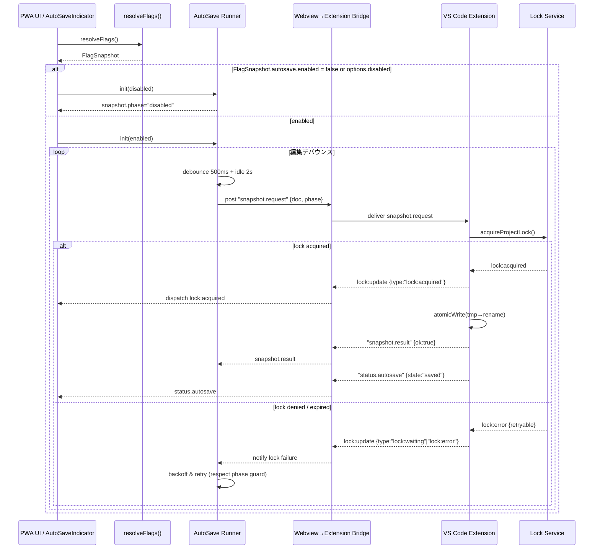

# VS Code 拡張 AutoSave/Lock ブリッジ設計

## 1. 拡張⇄PWA 責務マトリクス

| 観点 | PWA (Webview) の責務 | 拡張ホストの責務 | 根拠 / 備考 |
| --- | --- | --- | --- |
| フラグ評価 | `resolveFlags()` で `FlagSnapshot` を取得し、`autosave.enabled` フェーズガードを評価する。 | フラグは参照せず、PWA からのメッセージで有効/無効を受け取る。 | Phase A で二重ガード (`FlagSnapshot.autosave.enabled` + `AutoSaveOptions.disabled`) を維持。【F:docs/IMPLEMENTATION-PLAN.md†L12-L63】【F:docs/AUTOSAVE-DESIGN-IMPL.md†L39-L66】 |
| AutoSave ランナー | デバウンス/アイドル監視と `snapshot.request` の送信、`status.autosave` の描画反映。 | `snapshot.request` を受けて `atomicWrite`・履歴ローテーションを実行し、結果を `snapshot.result` と `status.autosave` で返却。 | PWA は 500ms デバウンス + 2s アイドルで送信。拡張は tmp→rename と世代管理を担う。【F:docs/src-1.35_addon/AUTOSAVE.md†L4-L27】【F:docs/AUTOSAVE-DESIGN-IMPL.md†L67-L136】 |
| ロック制御 | `lock:*` イベントを購読し UI（インジケータ/CTA）へ反映、Readonly への降格 UI を実装。 | Web Locks 取得と `.lock` フォールバック、心拍更新と降格判定を実行しイベントを push。 | Web Lock 優先と降格条件は拡張側で吸収し、UI はイベント表示に専念。【F:docs/IMPLEMENTATION-PLAN.md†L135-L210】【F:docs/AUTOSAVE-DESIGN-IMPL.md†L103-L206】 |
| テレメトリ | `autosave:*` / `lock:*` イベントを Collector へ転送し、UI 側の操作履歴と突合。 | ロック戦略や失敗分類を添えてイベントを返却し、PWA が Collector パイプラインへ連結しやすい形式に整える。 | Day8 Collector/Analyzer/Reporter 連携を維持するため、PWA 起点で JSONL 収集。【F:docs/AUTOSAVE-DESIGN-IMPL.md†L207-L273】【F:Day8/docs/day8/design/03_architecture.md†L1-L39】 |
| 例外処理 | `FlagSnapshot.phase` が `disabled` の場合は UI を idle のまま維持し、再試行/履歴 CTA を封じる。 | `AutoSaveError` / `ProjectLockError` を `retryable` 属性付きでエンコードし `snapshot.result` / `lock:*` に添付。 | AutoSave 側の retryable 判定と Phase ガードのロールバック条件を守る。【F:docs/AUTOSAVE-DESIGN-IMPL.md†L1-L64】【F:docs/IMPLEMENTATION-PLAN.md†L64-L118】 |

## 2. メッセージタイムライン（Mermaid）

## 3. API 契約サマリ

| メッセージ | 方向 | 必須フィールド | 失敗時の振る舞い | 備考 |
| --- | --- | --- | --- | --- |
| `snapshot.request` | Webview→Extension | `reqId`, `doc`, `phase` (`FlagSnapshot.phase`) | 応答が `ok:false` の場合、`error.code` に `autosave.lock` / `autosave.write` / `autosave.disabled` を設定。 | `doc` は全量 JSON。Phase guard で `phase="disabled"` の際は送信を抑制可。【F:docs/src-1.35_addon/API-CONTRACT-EXT.md†L15-L46】 |
| `snapshot.result` | Extension→Webview | `reqId`, `ok`, `error?` | `ok:false` 時は `error.retryable` をブリッジ側が `AutoSaveError.retryable` からコピー。 | 失敗分類は §4 を参照。【F:docs/AUTOSAVE-DESIGN-IMPL.md†L137-L206】 |
| `status.autosave` | Extension→Webview | `payload.state` (`idle`/`dirty`/`saving`/`saved`) | エラー時も最後に送出し UI の CTA を降格。 | 500ms 以内に UI を同期し Phase A UI 仕様を満たす。【F:docs/src-1.35_addon/API-CONTRACT-EXT.md†L47-L68】 |
| `lock:update`（仮称） | Extension→Webview | `payload.type`, `strategy`, `retryable`, `ts` | `retryable=false` の場合は即座に readonly 降格イベントへ昇格。 | Web Lock と `.lock` のどちらで取得したかを `strategy` で区別しテレメトリへ継承。【F:docs/IMPLEMENTATION-PLAN.md†L135-L210】 |

## 4. 失敗分類と例外連携

| 区分 | 想定エラーコード | 再試行方針 | UI / テレメトリ対応 |
| --- | --- | --- | --- |
| ロック競合 | `autosave.lock.timeout`, `autosave.lock.denied` | 指数バックオフ（100→300→900ms）。`retryable=true`。 | `lock:waiting` → `lock:warning(fallback-engaged)` → 再試行上限到達で `lock:readonly-entered` を送出。【F:docs/AUTOSAVE-DESIGN-IMPL.md†L103-L206】 |
| 書込失敗 | `autosave.write.failed`, `autosave.history.overflow` | `retryable` は `write.failed` のみ true。履歴溢れは GC 後に `retryable=false`。 | `status.autosave` で `state="dirty"` を維持し、UI で復旧バナー表示。Collector へ `autosave:failure` (`retryable` 属性付) を転送。【F:docs/AUTOSAVE-DESIGN-IMPL.md†L137-L206】【F:docs/AUTOSAVE-DESIGN-IMPL.md†L207-L273】 |
| フラグ/設定異常 | `autosave.disabled.phase`, `autosave.options.invalid` | 再試行不可。`FlagSnapshot.phase='disabled'` を維持し UI を idle 固定。 | UI は CTA を封じ、テレメトリで Phase A ガードのロールバック判定 (`phase='disabled'` 継続) を支援。【F:docs/IMPLEMENTATION-PLAN.md†L64-L118】 |
| 拡張→PWA 通信障害 | `bridge.transport.closed`, `bridge.timeout` | リトライ 3 回で降格。`retryable` は `timeout` のみ true。 | `lock:readonly-entered` による降格と `autosave:failure` を Collector へ送出。Day8 Reporter のインシデントテンプレートと突合。【F:Day8/docs/day8/design/03_architecture.md†L1-L39】 |

## 5. テレメトリ出力方針

1. **イベント種別**: `autosave.phaseChanged`, `autosave.failure`, `lock.warning`, `lock.readonlyEntered`, `bridge.transport` を JSONL で Collector へ push。`retryable` と `strategy` を必須項目に含める。
2. **相関情報**: `reqId`, `phaseBefore`, `phaseAfter`, `lockStrategy`, `retryCount`, `flagSource`（`FlagSnapshot.source`）を添付し、Analyzer が Phase ガード解除時のリスクを算出可能にする。
3. **頻度制御**: `autosave.phaseChanged` は 500ms 以下の連続送出を抑制（ドロップ率をログ）、`lock.warning` はフォールバック突入時に 1 回のみ送出。Collector SLO（±5%）を満たすため、エラー時以外はバッチで送信。【F:docs/AUTOSAVE-DESIGN-IMPL.md†L207-L273】【F:docs/IMPLEMENTATION-PLAN.md†L210-L247】【F:Day8/docs/day8/design/03_architecture.md†L1-L39】
4. **Readonly 降格**: `lock:readonly-entered` 時は `autosave:failure(retryable=false)` とセットで送信し、Reporter がロールバック判定を実施できるよう `incident_ref` を生成する。

## 6. 今後のタスク候補

- `lock:update` イベントの正式な型定義と `status.autosave` との整合チェック。
- Phase B での可変保存ポリシー導入に合わせた `status.autosave` 拡張とテレメトリの更新。
