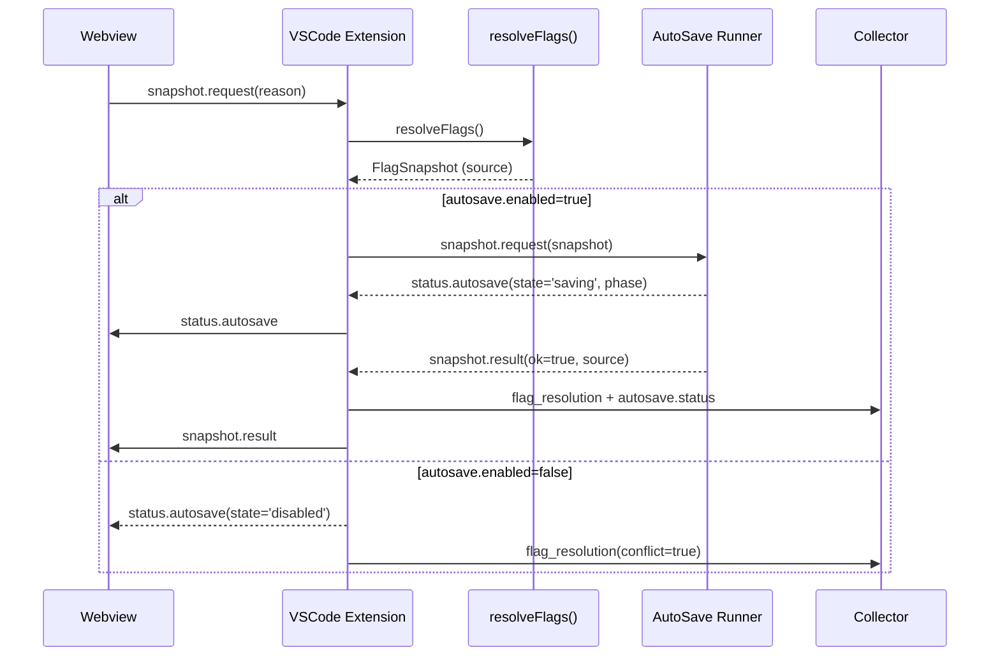

# VSCode Flags Handshake 設計

## 1. 概要と参照資料
- `docs/IMPLEMENTATION-PLAN.md` §0 のフラグポリシーと Phase ガード優先度表を VSCode 拡張に適用する。【F:docs/IMPLEMENTATION-PLAN.md†L1-L93】
- VSCode 側の設定キーは `docs/src-1.35_addon/CONFIG.md` で定義された `conimg.autosave.*` / `conimg.merge.threshold` を用い、アプリ側の `FlagSnapshot` と整合させる。【F:docs/src-1.35_addon/CONFIG.md†L1-L9】
- AutoSave の保存ポリシー・ロック制御は `docs/AUTOSAVE-DESIGN-IMPL.md` の契約に従い、Day8 パイプライン（Collector → Analyzer → Reporter）の責務を侵さない形でテレメトリを出力する。【F:docs/AUTOSAVE-DESIGN-IMPL.md†L1-L152】【F:Day8/docs/day8/design/03_architecture.md†L1-L39】

## 2. API 契約
| イベント | 送信元 → 宛先 | Payload | Phase ガード適用 | 備考 |
| --- | --- | --- | --- | --- |
| `flags:init` | Extension → Webview | `{ snapshot: FlagSnapshot }` | `snapshot.source` が `env/config/localStorage/default` を明示 | Phase A-0 では `autosave.enabled` が `false` の場合 `phase='disabled'` を維持。【F:docs/IMPLEMENTATION-PLAN.md†L11-L60】 |
| `snapshot.request` | Webview → Extension | `{ reason: 'bootstrap' | 'user-toggle' }` | `autosave.enabled` が true で `AutoSaveOptions.disabled!==true` のときのみ forward | 失敗時は `retryable` 属性を付与した `snapshot.result` を返す。【F:docs/AUTOSAVE-DESIGN-IMPL.md†L61-L209】 |
| `status.autosave` | Extension → Webview | `{ state, phase, updatedAt }` | Phase A/B の状態遷移を `disabled/idle/saving/saved` で同期 | Collector へ `autosave.status` テレメトリを送信し、Day8 Analyzer が逸脱を集計。【F:docs/AUTOSAVE-DESIGN-IMPL.md†L152-L318】【F:Day8/docs/day8/design/03_architecture.md†L1-L39】 |
| `flags:update` | Extension → Webview | `{ diff: Partial<FlagSnapshot> }` | `conimg.autosave.enabled` / `conimg.merge.threshold` 更新時に Phase ガードへ即反映 | Phase rollback 条件に達した場合は `source='config'` を維持しつつ `autosave.phase='disabled'` へ戻す。【F:docs/IMPLEMENTATION-PLAN.md†L70-L93】 |
| `snapshot.result` | Extension → Webview | `{ ok, source, retryable?, error? }` | `source` が `env/config/localStorage/default` を保持 | `retryable=false` の場合は UI が CTA を無効化し、Phase ガードがリトライを停止する。【F:docs/AUTOSAVE-DESIGN-IMPL.md†L61-L209】 |

## 3. 失敗時フォールバック
1. `flags:init` で `FlagSnapshot` が取得できない場合、Extension は `localStorage` 直読の `legacy` フローへフォールバックし、`source='legacy'` を付与する。Phase B 移行前に Collector WARN を出力し、Analyzer レポートで検知する。【F:docs/IMPLEMENTATION-PLAN.md†L25-L64】【F:docs/AUTOSAVE-DESIGN-IMPL.md†L1-L85】
2. `snapshot.request` が `AutoSaveError(retryable=true)` を返した場合、指数バックオフで 3 回再試行し、`status.autosave.state='backoff'` を経由させる。3 回失敗で `snapshot.result` に `retryable=false` を設定し Phase A ロールバック条件を満たしたら `autosave.enabled` を `false` に戻す。【F:docs/AUTOSAVE-DESIGN-IMPL.md†L61-L209】【F:docs/IMPLEMENTATION-PLAN.md†L70-L93】
3. VSCode 設定変更 (`flags:update`) で Phase ガード条件と矛盾する場合（例: env が true で config が false）、`FlagSnapshot.source` の優先度表を参照し env 値を維持しつつ UI へ警告バナーを表示する。Collector には `flag_resolution` イベントで `conflict: true` を出力し、Day8 Reporter がロールバック推奨を生成する。【F:docs/IMPLEMENTATION-PLAN.md†L70-L93】【F:Day8/docs/day8/design/03_architecture.md†L1-L39】

## 4. Telemetry 出力条件
- `flag_resolution`：`FlagSnapshot` 解決ごとに `source`・`phase`・`autosave.enabled`・`merge.precision` を JSONL append。Analyzer が Phase 進捗を追跡し、Reporter が `reports/today.md` に逸脱を反映する。【F:docs/IMPLEMENTATION-PLAN.md†L1-L93】【F:Day8/docs/day8/design/03_architecture.md†L1-L39】
- `autosave.status`：`status.autosave` 受信ごとに state 遷移をログ化。`retryable=false` のエラーは AutoSave SLA 逸脱として即時アラート対象。【F:docs/AUTOSAVE-DESIGN-IMPL.md†L152-L318】
- `merge.precision`：`flags:update` で `conimg.merge.threshold` が変動した場合、Diff Merge 露出率としきい値を JSONL に出力し、Phase C の精度 SLO を監視する。【F:docs/IMPLEMENTATION-PLAN.md†L1-L137】【F:docs/MERGE-DESIGN-IMPL.md†L114-L206】

## 5. シーケンス図（snapshot.request / status.autosave 往復）

## 6. 実装ノート
- Telemetry は Collector 既定の JSONL 形式 (`workflow-cookbook/logs`) に追記し、Analyzer/Reporter のバッチ処理を阻害しないよう 15 分窓口でアップロードする。【F:Day8/docs/day8/design/03_architecture.md†L1-L39】
- Phase ガード解除時は `docs/IMPLEMENTATION-PLAN.md` のチェックリストに従い、`reports/today.md` とリリースノート更新を同一コミットで行う。【F:docs/IMPLEMENTATION-PLAN.md†L70-L137】
