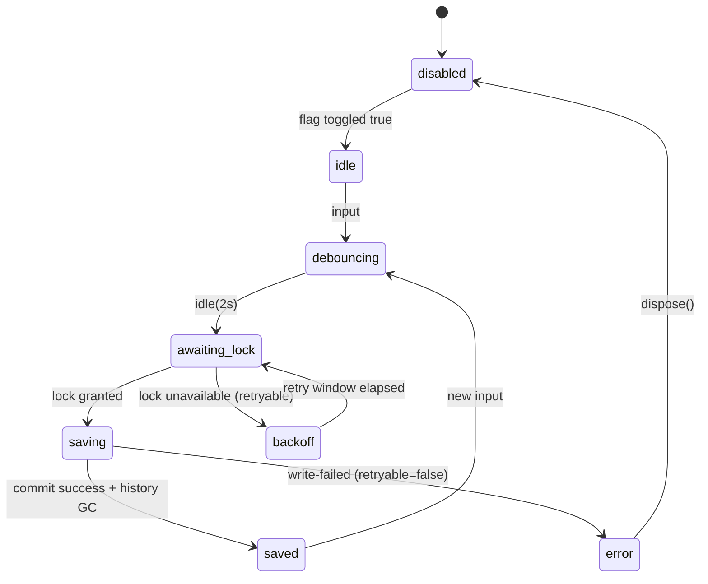

# Webview AutoSave 設計ノート

## 1. 表示状態と保存インジケータ要件
| 状態 | 表示要件 | 保存インジケータ | 備考 |
| --- | --- | --- | --- |
| Idle (変更なし) | タイトルバーに保存済みシグナルを表示し、フォーカスリングとARIAラベルを維持する。 | `○`（保存済） | 共通UI仕様のアクセシビリティ要件を継承。【F:docs/src-1.35_addon/UI-SPEC.md†L5-L24】 |
| Dirty (編集検知) | 入力検知から500msのデバウンスと2sアイドル猶予中に未保存扱いとする。 | `●`（未保存） | 保存ポリシーのデバウンス値と整合させる。【F:docs/src-1.35_addon/AUTOSAVE.md†L8-L12】【F:docs/src-1.35_addon/UI-SPEC.md†L25-L27】 |
| Saving (永続化中) | Web Lock取得から`current.json`/`index.json`書込・履歴GCまで進行中を示す。 | `↻`（AutoSave中） | アトミック保存手順を可視化し、UIスナップショットへ伝播する。【F:docs/src-1.35_addon/AUTOSAVE.md†L13-L18】【F:docs/AUTOSAVE-DESIGN-IMPL.md†L33-L92】 |
| Saved (直近成功) | 保存完了後に履歴スナップショットの世代追加と最終成功時刻を反映。 | `○`（保存済） | 20世代・50MB制限の履歴ローテーション完了後に遷移。【F:docs/src-1.35_addon/AUTOSAVE.md†L13-L18】【F:docs/AUTOSAVE-DESIGN-IMPL.md†L63-L92】 |
| Disabled / Error フェイルセーフ | フィーチャーフラグ/オプションでAutoSaveが抑止、もしくは非再試行エラー。 | 文言ラベル `AutoSave disabled` + `○` グレーアウト | Phase Aガードの挙動を遵守し、アクセシブルなテキストを提供。【F:docs/AUTOSAVE-DESIGN-IMPL.md†L21-L146】 |

## 2. RED想定のレンダリング/遷移テストケース
`tests/webview/autosave-indicator.spec.tsx` で初期実装が満たさないことを前提に、以下をREDケースとして列挙する。

1. Idle初期化: `status.autosave.phase==='idle'` で `○` とARIAラベル `"保存済"` が描画される。
2. Dirty検知: 入力イベント後にデバウンス待機中 `●` へ切り替わる。
3. Saving進入: ロック取得イベントで `↻` を表示し、スピナーに `role="status" aria-live="polite"` が付与される。
4. Saved完了: 保存成功イベントで `○` へ戻り、`lastSuccessAt` タイムスタンプが表示領域に更新される。
5. Disabledフォールバック: フラグ `autosave.enabled=false` 時に `AutoSave disabled` テキストを表示し、アイコンは操作不可スタイルになる。
6. Errorフェイルセーフ: `phase==='error'` で警告トースト（`aria-live="assertive"`）と再試行CTAが表示される。
7. Phase遷移: `disabled → idle → debouncing → awaiting-lock → saving → saved` をモックシーケンスで順次アサート。
8. Phaseバックオフ: `awaiting-lock` から `backoff` 遷移時にリトライバナーを表示し、`retryable` 属性がARIAで告知される。

## 3. 状態遷移図とアクセシビリティ要件

- 各状態は `AutoSaveStatusSnapshot` を通じて 250ms 間隔でUIへプッシュされる。【F:docs/AUTOSAVE-DESIGN-IMPL.md†L94-L164】
- `role="status" aria-live` を Idle/Dirty/Saving/Saved で切替え、Dirty/Savingは `polite`、Errorは `assertive` を要求する。【F:docs/src-1.35_addon/UI-SPEC.md†L5-L24】
- バックオフ通知はフォーカス移動時にもスクリーンリーダーが再読上できるよう、`aria-describedby` を再設定する。

## 4. 実装ガイド
### 4.1 イベント購読
- `AutoSaveProvider` が `initAutoSave()` の `snapshot` と `flushNow` を取得し、`status.autosave` をContextで配信する。【F:docs/AUTOSAVE-DESIGN-IMPL.md†L33-L164】
- Webview側では `useEffect` で Providerイベントを購読し、Day8 Collectorが要求するJSONLログを`autosave.*`イベントとして透過する。【F:Day8/docs/day8/design/03_architecture.md†L1-L32】【F:docs/AUTOSAVE-DESIGN-IMPL.md†L131-L164】

### 4.2 フォールバック表示
- Mermaid非対応環境向けにASCIIインジケータ (`[●]`, `[○]`, `[↻]`) を提供し、アクセシブルネームは同一文字列を付ける。【F:docs/src-1.35_addon/UI-SPEC.md†L5-L27】
- AutoSave disabled/error時はテキストバナーで理由と対処（再試行/設定見直し）を明示し、Day8設計書のASCIIフォールバック方針と整合させる。【F:Day8/docs/day8/design/03_architecture.md†L33-L52】

### 4.3 テレメトリ連携
- `autosave.indicator.render` / `autosave.lock.backoff` / `autosave.restore.prompt` の3系統イベントをCollectorへ送信し、AnalyzerがP95・成功率を算出できるようにする。【F:Day8/docs/day8/design/03_architecture.md†L1-L32】【F:docs/AUTOSAVE-DESIGN-IMPL.md†L131-L164】
- `AutoSaveError` の `retryable` 属性をJSONLへ含め、Reporterがincident判定を行えるようにする。【F:docs/AUTOSAVE-DESIGN-IMPL.md†L13-L64】【F:Day8/docs/day8/design/03_architecture.md†L1-L32】
