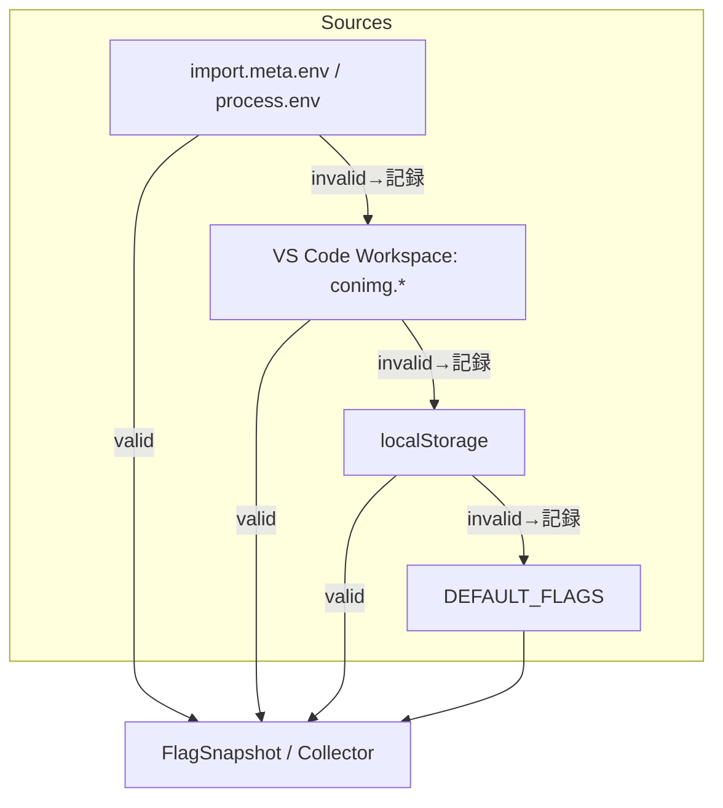

# Flag Resolution Integration Notes

## 優先順位フロー（env → workspace → localStorage → defaults）

- AutoSave ガード: `autosave.enabled` が `true` のとき `docs/AUTOSAVE-DESIGN-IMPL.md` の保存ポリシーを許可。
- 精緻マージガード: `merge.precision` に応じ `Day8/docs/day8/design/03_architecture.md` の MergeDock フローを段階開放。
- 無効値は `FlagResolutionError`（`source` 付き）として蓄積し、Collector に送るテレメトリに利用。

## テストドリブン導入メモ（RED→GREEN）

1. **RED**: `tests/config/flags.resolve.test.ts` に env/workspace/localStorage/default の各ケース、無効値時のエラー集約、`withErrors` オプションを追加。
2. **GREEN**: `resolveFlags()` へ `withErrors` 付きオーバーロードを実装し、`FlagSnapshot` を生成した後にエラーリストを集約。
3. **REFACTOR**: Collector 連携を想定して `FlagResolutionError` を `FlagSnapshot` とは別に返却する構造へ整理。

## Telemetry/レビュー観点

- `FlagSnapshot.source` と `FlagResolutionError.source` をセットで Collector に渡し、Phase ガード解除を監視。
- レビューでは `env → workspace → localStorage → DEFAULT_FLAGS` の順序がコード・テスト・`docs/src-1.35_addon/CONFIG.md` で一致しているかを確認。
- チェックリスト案: AutoSave/Merge のフェーズガード、Collector ログキー、`resolveFlags({ withErrors: true })` の導入箇所を点検。
