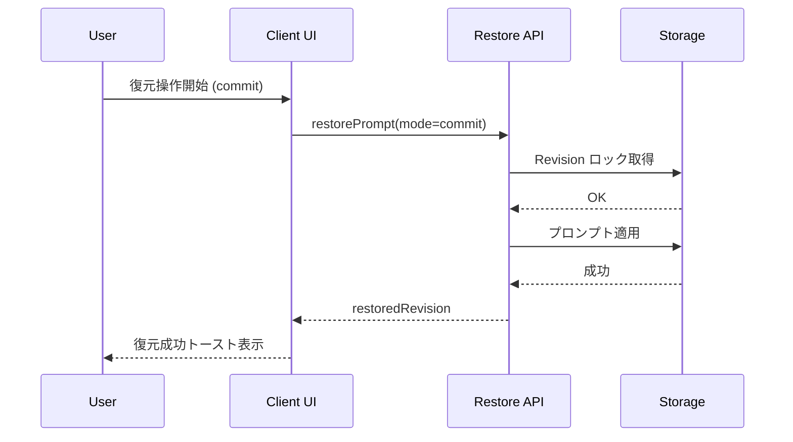
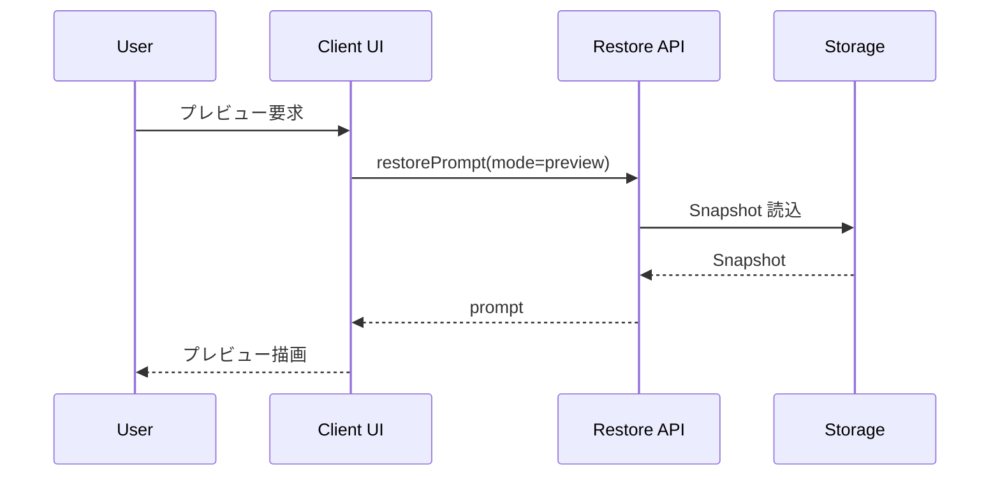
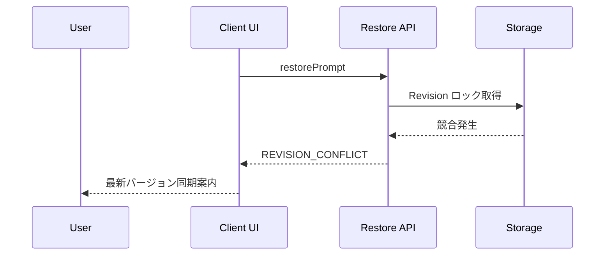

# 復元フローおよび履歴整合性リカバリ設計

## 1. 復元 API 入出力と例外コード

### restorePrompt
- **HTTP**: `POST /api/history/restore`
- **リクエスト**
  - `historyId: string` — 対象履歴 UUID。
  - `promptId: string` — 復元対象プロンプト ID。
  - `mode: "preview" | "commit"` — プレビュー時は一時領域のみ更新。
- **レスポンス**
  - `status: "ok"`
  - `prompt: PromptSnapshot` — `mode=preview` 時にのみ付与。
  - `restoredRevision: number` — `commit` 時に適用された revision。
- **例外コード**
  - `HISTORY_NOT_FOUND` — `historyId` 不一致。再試行不可。
  - `PROMPT_NOT_FOUND` — 削除済みプロンプト。再試行不可、UI で削除通知。
  - `REVISION_CONFLICT` — 競合。最新 revision を同期後に再試行。
  - `RECOVERABLE_STORAGE_ERROR` — ストレージ一時障害。指数バックオフで 3 回まで再試行。

### restoreSession
- **HTTP**: `POST /api/session/restore`
- **リクエスト**: `sessionId`, `checkpointId`。
- **レスポンス**: `status`, `restoredAt`。
- **例外コード**
  - `SESSION_NOT_FOUND` — 再試行不可。
  - `CHECKPOINT_CONFLICT` — 新規チェックポイントが先行。UI で差分比較誘導。
  - `RECOVERABLE_STORAGE_ERROR` — 再試行可。

## 2. UI/UX シナリオ別シーケンス

## 3. 履歴整合性リカバリ手順

1. `index.json` を読み込み、`history/*.json` の実体と差分比較。
2. インデックスに存在し実体が無い場合: `RECOVERABLE_STORAGE_ERROR` としてシステム通知、バックグラウンドで再同期。
3. 実体のみ存在する場合: 新規履歴として `index.json` に追記し、ユーザへ「自動修復完了」を通知。
4. 不整合が 3 回連続で解消しない場合: 影響履歴をリードオンリーに設定し、サポート連絡を促す。
5. バックアップから復元する場合は、`index.json` → `history/*.json` の順で書き戻し。

### ユーザ通知と再試行条件
- 一時障害 (`RECOVERABLE_STORAGE_ERROR`): スナックバーで自動再試行を示し、最大 3 回の結果を表示。
- 不整合修復成功: 成功トースト + 詳細リンク。
- 恒久的障害 (再試行不可エラー): ダイアログでサポートチケット誘導。

## 4. Collector/Analyzer 連携とログ粒度

| イベント | トリガ | ペイロード | Collector 転送 | Analyzer 利用 | Incident 対応 |
| --- | --- | --- | --- | --- | --- |
| `restore_attempt` | API 呼び出し開始 | `historyId`, `promptId`, `mode` | 即時 | 成功率/遅延分析 | SLG 指標監視 |
| `restore_conflict` | `REVISION_CONFLICT` 発生 | `historyId`, `currentRevision`, `requestedRevision` | 即時 | 競合頻度分析 | オンコール通知閾値 5/min |
| `restore_failure` | 再試行不可エラー | `errorCode`, `historyId` | 即時 | エラー分類 | SEV2 以上で PagerDuty |
| `restore_retry_exhausted` | 再試行枠使い切り | `historyId`, `attempts` | 即時 | 耐障害性監視 | ナレッジ共有に追加 |
| `history_repair` | リカバリ成功 | `historyId`, `action` | 5 分バッチ | 修復率分析 | 週次レポート |

### ログ
- **INFO**: API 呼び出し成功、リカバリ成功。
- **WARN**: 競合検知、再試行開始、部分的修復。
- **ERROR**: 再試行不可エラー、リカバリ失敗、バックアップ復元失敗。
- ログは Correlation ID (リクエスト ID + 履歴 ID) で紐付け、Incident レポートのトレースと整合。

