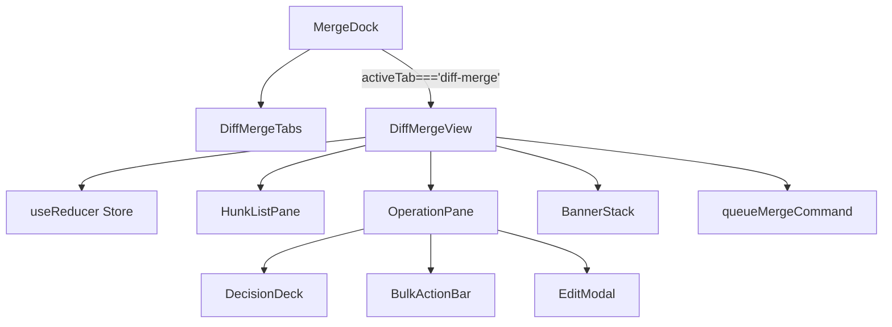
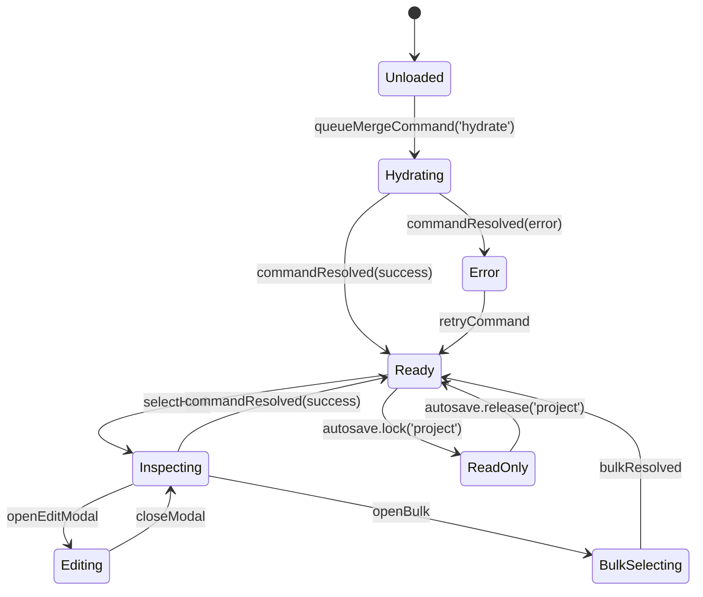
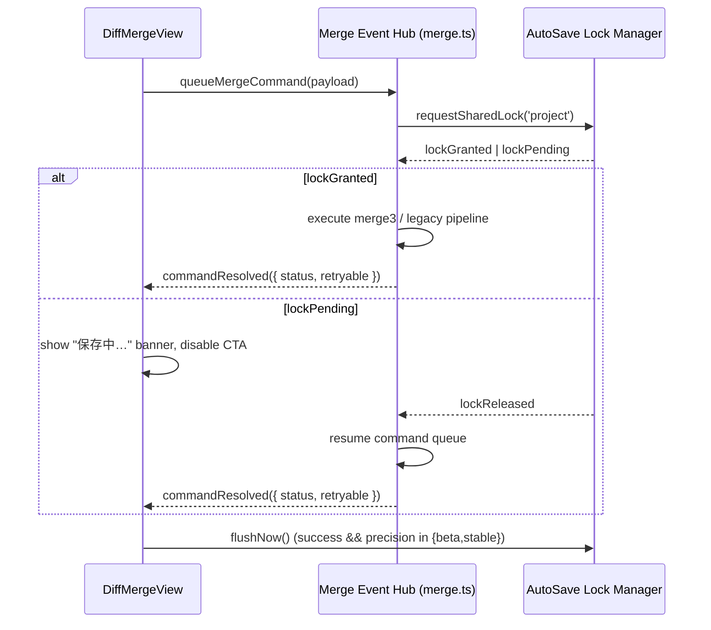

# DiffMergeView / MergeDock 設計テンプレート

## メタデータ

```yaml
task_id: 20250217-diff-merge-view
repo: https://github.com/imgponic/Conimgponic
base_branch: main
work_branch: feat/diff-merge-view
priority: P1
langs: [typescript, react]
```

## 1. 対象モジュール
- `src/components/MergeDock.tsx`
- `src/components/DiffMergeView.tsx`
- `src/lib/merge.ts`

## 2. precision フラグ別タブ設計

| precision | タブ配列 (`MergeDock`) | 初期タブ | DiffMergeView マウント条件 | AutoSave/Lock 協調 | 備考 |
| --- | --- | --- | --- | --- | --- |
| `legacy` | `Compiled`, `Shot`, `Assets`, `Import`, `Golden` | `Compiled` | 常にアンマウント。`activeTab==='diff-merge'` は `compiled` へフォールバック。 | AutoSave ロックは `merge` スコープを要求しない。`queueMergeCommand` は noop。 | 既存 UI を維持し Diff タブへのショートカットも非表示。
| `beta` | 既存 5 タブ + `Diff Merge` (末尾) | `Compiled` | `queueMergeCommand('hydrate')` 成功時に遅延マウント。 | AutoSave `locks.isShared('project')` が true の場合、Diff タブを読み取り専用にし `aria-live` で警告。 | `Diff Merge (Beta)` バナーと再試行 CTA を表示し、`queueMergeCommand` はリトライ可能。
| `stable` | `Diff Merge`, `Compiled`, `Shot`, `Assets`, `Import`, `Golden` | `Diff Merge` | 常時マウント。`MergeDock` がタブスナップショットを `merge.lastTab` に保持。 | AutoSave が `project` ロックを独占するときは `MergeDock` がタブ変更をロックし、解除直後に `queueMergeCommand` キューを drain。 | CTA を主要ボタンへ昇格し、AutoSave `flushNow()` を確定実行。

- precision 降格時 (`stable→beta→legacy`) は `MergeDock` が Diff タブの DOM を破棄し、未完了キューをキャンセルする。
- AutoSave と同時編集を防ぐため、`DiffMergeView` は `locks.onChange` を購読し、ロック中は `queueMergeCommand` を enqueue のみに制限する。

## 3. コンポーネント構造と状態遷移

### 3.1 Component Tree
## 1. 目的と対象モジュール
### 1.1 目的
`merge.precision` フラグ（`legacy` → `beta` → `stable`）に応じた Diff Merge タブ制御と `queueMergeCommand` 起点の操作フローを `MergeDock` に統合し、AutoSave 連携を前提に UI/ステートの責務を整理する。

### 1.2 対象モジュール
- `src/components/MergeDock.tsx`
- `src/components/DiffMergeView.tsx`
- `src/lib/merge.ts`



- `MergeDock` が precision に応じたタブ露出と初期化を制御し、Diff タブのみ `DiffMergeView` をマウントする。
- `DiffMergeView` は `useReducer` ベースのストアでハンク状態・ロック状態・AutoSave ステータスを集約する。

### 3.2 Hunk 状態機械


    [*] --> Legacy
    [*] --> Beta
    [*] --> Stable

    state Legacy {
        [*] --> Compiled
        Compiled --> Shot: tabClick('shot')
        Compiled --> Assets: tabClick('assets')
        Compiled --> Import: tabClick('import')
        Compiled --> Golden: tabClick('golden')
        Shot --> Assets: tabClick('assets')
        Assets --> Import: tabClick('import')
        Import --> Golden: tabClick('golden')
        Shot --> Compiled
        Assets --> Compiled
        Import --> Compiled
        Golden --> Compiled
    }

    state Beta {
        [*] --> Compiled
        Compiled --> Shot: tabClick('shot')
        Compiled --> Assets: tabClick('assets')
        Compiled --> Import: tabClick('import')
        Compiled --> Golden: tabClick('golden')
        Compiled --> Diff: tabClick('diff-merge')
        Shot --> Compiled
        Assets --> Compiled
        Import --> Compiled
        Golden --> Compiled
        Diff --> Compiled: tabClick('compiled')
        Diff --> Operation: selectHunk
        Operation --> Diff: commandResolved
    }

    state Stable {
        [*] --> Diff
        Diff --> Compiled: tabClick('compiled')
        Compiled --> Shot: tabClick('shot')
        Shot --> Assets: tabClick('assets')
        Assets --> Import: tabClick('import')
        Import --> Golden: tabClick('golden')
        Golden --> Compiled: tabClick('compiled')
        Diff --> Operation: selectHunk
        Operation --> Edit: openEditModal
        Edit --> Operation: closeModal
        Operation --> Bulk: openBulkActions
        Bulk --> Operation: bulkResolved
        Compiled --> Diff: tabClick('diff-merge')
    }
```
- `Legacy` フェーズでは Diff Merge UI を生成せず、既存 5 タブが往復する。
- `Beta` フェーズは `Diff` タブを末尾に追加し、操作完了で `Diff` へ復帰する単純ループ。
- `Stable` フェーズは Diff Merge を初期表示とし、編集・一括操作・レガシータブ往復まで含めた遷移を保証する。
- 出典: [docs/IMPLEMENTATION-PLAN.md §0.3.1-§0.3.3](../../IMPLEMENTATION-PLAN.md#03-mergedock--diffmergeview-タブ棚卸し)

| 状態 | UI 表示 | トリガー | Exit 条件 |
| --- | --- | --- | --- |
| `Unloaded` | Diff ペイン非表示 | precision が `beta/stable` | `queueMergeCommand('hydrate')` |
| `Hydrating` | スケルトン表示 + CTA ローディング | 初期データフェッチ | `commandResolved(success/error)` |
| `Ready` | ハンク一覧 + 操作バー | 正常ロード済み | AutoSave 独占ロック or ユーザ操作 |
| `Inspecting` | ハンク詳細 / 操作ボタン | `selectHunk` | `commandResolved`, `openBulk`, `openEditModal` |
| `Editing` | 編集モーダル + focus trap | `openEditModal` | `closeModal`, `commandResolved` |
| `BulkSelecting` | 一括操作バー固定 | `openBulk` | `bulkResolved`, `closeBulk` |
| `ReadOnly` | バナー `「AutoSave により保存中…」` | AutoSave がロックを保持 | `autosave.release('project')` |
| `Error` | バナー `「再試行してください」` | `commandResolved(error)` | `retryCommand` |

### 3.3 `queueMergeCommand` フロー



| ステップ | 説明 | precision 依存 | AutoSave 連携 |
| --- | --- | --- | --- |
| 1. enqueue | UI から `queueMergeCommand` を発行。payload は `type`, `hunkId`, `context`. | 全 precision | `ReadOnly` 時は enqueue のみで遅延実行。 |
| 2. lock 交渉 | `merge.ts` が AutoSave 共有ロック (`isShared`) を試行。 | `legacy` はスキップ。`beta/stable` は必須。 | `lockPending` 時は UI にローディングバナー。 |
| 3. 実行 | ロック取得後に `merge3` or レガシーパイプラインを実行。 | `beta/stable` は Diff ハンク更新、`legacy` は従来処理。 | 実行時間が SLA 超過なら `retryable=true` を付与。 |
| 4. 結果通知 | `commandResolved` を UI へ通知しステータス更新。 | 全 precision | `retryable` の場合 UI がリトライ CTA を露出。 |
| 5. AutoSave flush | 成功かつ Diff タブ有効時は AutoSave `flushNow()`。 | `beta/stable` のみ | ロック解除タイミングを Telemetry へ送信。 |

## 4. リスクとロック協調要件
- AutoSave 独占ロック (`exclusive`) 発生時は `MergeDock` がタブ操作を無効化し、解除後に `merge.lastTab` を復元する。
- Diff タブが `legacy` へ降格した際は `queueMergeCommand` キューを破棄し、AutoSave へ `releaseShared('project')` を明示送信する。
- `retryable=false` のエラーでは `MergeDock` が `Compiled` タブへ遷移し、Diff 状態を再初期化する。

## 5. `tests/merge/diff-merge-view.spec.ts` TDD チェックリスト

### 5.1 キーボード操作
- [ ] `ArrowLeft/Right` で `role="tab"` が precision ごとのタブ配列順に移動する。
- [ ] `ArrowUp/Down` でハンクリストのフォーカスが移動し、`Enter` で詳細パネルへ遷移する。
- [ ] `Esc` で編集モーダルが閉じ、フォーカスが元のハンクへ戻る。

### 5.2 バナー表示
- [ ] AutoSave ロック中に `"保存中…"` バナーが `aria-live="polite"` で表示される。
- [ ] `retryable` エラー時に警告バナーが `aria-live="assertive"` で読み上げられる。
- [ ] precision 降格 (`stable→beta`) 後に Diff 特有バナーが DOM から除去される。

### 5.3 コマンド送出
- [ ] `queueMergeCommand('hydrate')` 成功後に `commandResolved` が `Ready` 状態へ遷移させる。
- [ ] AutoSave 独占ロック中でもコマンドがエンキューされ、解除後にまとめて実行される。
- [ ] `retryable=false` エラーで `MergeDock` が `Compiled` タブへ戻り、Diff ステートが破棄される。

### 5.4 リスク / ロールバック条件
- [ ] AutoSave ロック解除イベントが 5 秒以内に届かない場合は Diff タブを自動で隠蔽する。
- [ ] precision を `legacy` へ戻した際に未処理コマンドが全てドロップされる。
- [ ] Telemetry が `merge.precision.blocked` を受信した場合、Diff タブを非表示にして既存 UI へロールバックする。

- `legacy` では Diff Merge UI を描画しない。
- `beta` ではタブにベータラベルを付与し、CTA は従来ボタンを保持しつつ警告表示を追加する。
- `stable` では Diff Merge CTA を主要アクションへ昇格し、タブ初期表示も Diff Merge に切り替える。
- 出典: [docs/MERGE-DESIGN-IMPL.md §5](../../MERGE-DESIGN-IMPL.md#5-ui--インタラクション)

## 3. TDD ケース集約（予定: `tests/merge/diff-merge-view.spec.ts`）
1. **`queueMergeCommand` フローと AutoSave 連携**
   - ハンク選択→`queueMergeCommand` 呼び出し→`commandResolved` 受信で `HunkListPane` の `statusMap` が同期される。
   - `queueMergeCommand` が `error: { retryable: true }` を返した場合、OperationPane がリトライ CTA をフォーカスし `aria-live="assertive"` で通知する。
   - `queueMergeCommand` 実行中に AutoSave が `project` ロックを保持していても CTA 文言が `「保存中…」` へ更新され、ロック解放と同時に `「結果を採用」` へ復帰する（ロック共存）。
   - AutoSave が `readonly` へ遷移したとき、操作ボタンが `disabled` となり `queueMergeCommand` 呼び出しが抑止される。
2. **タブ制御と精度フェーズ**
   - `precision='legacy'` では `Diff Merge` タブが DOM へ描画されず、`activeTab='diff-merge'` 指定時は `compiled` へフォールバックする。
   - `precision` を `legacy`→`beta`→`stable` に変更すると、タブ配列・初期選択が Implementation Plan §0.3 の遷移と一致する。
   - `stable` フェーズで `pref` が `diff-merge` に保存され、`beta` へ降格するとレガシータブ構成へロールバックされる。
3. **CTA 更新とロールバック**
   - `precision` を `stable` から `beta` へ降格すると Diff Merge 固有 CTA が DOM から除去され、ハンクペインが `hidden` となる。
   - 降格後に `queueMergeCommand` を発火しても noop が返り AutoSave 状態へ副作用が生じない。

## 4. リスクと対応策
- **アクセシビリティ / キーボード操作**: タブボタンへ `role="tab"` と `aria-controls` を付与し、`Tab` と `Arrow` ナビゲーションを保証。ハンク行は `aria-activedescendant` で示し、`Enter` / `Space` による CTA 実行とモーダルのフォーカストラップを強制する。
- **ARIA ライブリージョン**: `queueMergeCommand` 成功/失敗・AutoSave ロック取得/解除を `aria-live="assertive"` で告知し、スクリーンリーダー利用者への遅延を防ぐ。
- **仮想スクロール性能**: `HunkListPane` は `react-window` 等の仮想化を必須とし、ハンク 500 件規模でも 16ms 以内のフレームを維持するため Telemetry にスクロール Jank メトリクスを追加する。
- **ロールバック戦略**: `precision` 降格時は Diff Merge UI/CTA を完全非表示とし、`localStorage.mergePref` を `compiled` へリセット。旧 CTA と統計表示のみ残し、利用者へ段階的案内を提供する。
