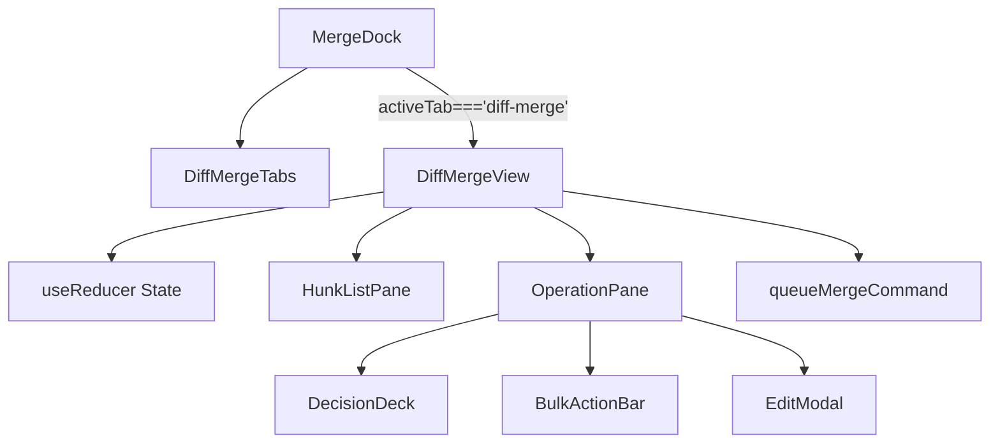
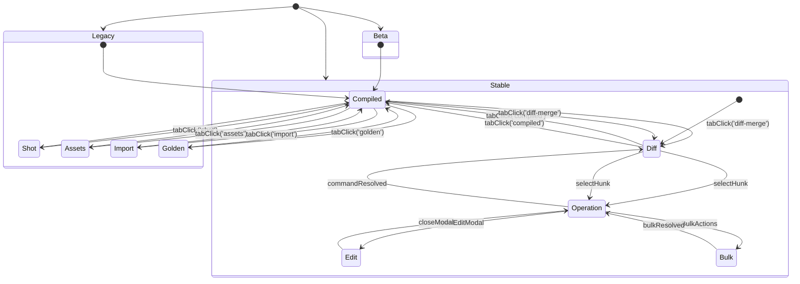

# DiffMergeView / MergeDock 連携設計メモ

## 1. 目的と対象モジュール
- **目的**: `merge.precision` フラグ（`legacy`/`beta`/`stable`）に基づく Diff Merge タブ制御と、`queueMergeCommand` を中心とした操作フローを `MergeDock` に統合する。
- **対象モジュール**:
  - `src/components/MergeDock.tsx`
  - `src/components/DiffMergeView.tsx`
  - `src/lib/merge.ts`

## 2. ダイアグラム
### 2.1 コンポーネントツリー

- `MergeDock` がタブ露出を制御し、`DiffMergeView` マウント時のみ内部ペインが生成される。
- `DiffMergeView` は `useReducer` を介してタブ内ステートを保持し、`queueMergeCommand` と AutoSave イベントを集約する。

### 2.2 タブ状態機械（Implementation Plan §0.3 準拠）

- `Legacy` フェーズでは Diff Merge UI を生成せず、既存 5 タブが往復する。
- `Beta` フェーズは `Diff` タブを末尾に追加し、操作完了で `Diff` へ復帰する単純ループ。
- `Stable` フェーズは Diff Merge を初期表示とし、編集・一括操作・レガシータブ往復まで含めた遷移を保証する。

### 2.3 precision 別 UX ダイアグラム（MERGE-DESIGN-IMPL §5 準拠）
```mermaid
graph TD
    subgraph legacy
        L1[タブ: Compiled / Shot / Assets / Import / Golden]
        L2[Diff Merge: 非表示]
        L3[CTA: 従来の書き戻しのみ]
    end
    subgraph beta
        B1[タブ: Compiled -> Diff Merge -> Shot -> Assets -> Import -> Golden]
        B2[Diff Merge ペイン: ハンク一覧 + 操作バー]
        B3[CTA: "Diff Merge (Beta)" + 警告ラベル]
        B4[初期タブ: Compiled]
    end
    subgraph stable
        S1[タブ: Diff Merge -> Compiled -> Shot -> Assets -> Import -> Golden]
        S2[Diff Merge ペイン: AI/Manual/編集モーダル]
        S3[CTA: "結果を採用" を主要ボタンに昇格]
        S4[初期タブ: Diff Merge]
    end
    legacy --> beta --> stable
```
- `legacy` では Diff Merge UI を描画しない。
- `beta` ではタブにベータラベルを付与し、CTA は従来ボタンを保持しつつ警告表示を追加する。
- `stable` では Diff Merge CTA を主要アクションへ昇格し、タブ初期表示も Diff Merge に切り替える。

## 3. TDD ケース集約（予定: `tests/merge/diff-merge-view.spec.ts`）
1. **タブ制御**
   - `precision='legacy'` で `Diff Merge` タブがレンダリングされず、`activeTab` を `diff-merge` へ強制しても `compiled` にフォールバックする。
   - `precision` を `legacy`→`beta`→`stable` と遷移させると、タブ配列と初期選択が Implementation Plan §0.3 のシーケンスと一致する。
2. **`queueMergeCommand` フロー**
   - ハンク選択→`queueMergeCommand` 呼び出し→`commandResolved` イベントでステータスが `HunkListPane` に反映される。
   - `queueMergeCommand` が `error: retriable` を返した場合、OperationPane がリトライ CTA を提示しつつフォーカスを維持する。
   - `bulkResolved` イベント受信後、`BulkActionBar` が閉じ、`selectedHunkIds` が初期化される。
3. **AutoSave 連携**
   - `queueMergeCommand` 実行中に `AutoSave` が `project` ロックを保持している場合でも、`DiffMergeView` が `locks.isShared` を監視し CTA を `「保存中…」` に更新する。
   - AutoSave がロックを解放した瞬間に `queueMergeCommand` が成功した場合、CTA 表示が `「結果を採用」` に戻る（ロック共存）。
   - AutoSave が `readonly` フラグを発火したケースで、`DiffMergeView` が操作ボタンを `disabled` にして `aria-live="assertive"` で警告を通知する。
4. **CTA 更新とロールバック**
   - `precision` が `stable` から `beta` へ降格した際、Diff Merge 特有の CTA が DOM から除去され、ハンクペインが `hidden` になる。
   - 降格後に `queueMergeCommand` を呼び出しても noop となり、AutoSave への副作用が生じない。

## 4. リスクと対応策
- **アクセシビリティ**: タブ操作を `Tab`/`Arrow` キーで辿れるよう `role="tablist"` と `aria-controls` を整備し、操作結果は `aria-live` で告知。モーダル内は `focus-trap` を強制。
- **キーボード操作**: ハンク行のフォーカス移動を `ArrowUp/Down` で実装し、`Enter` で詳細ペインへ遷移する設計を前提に QA を実施。
- **仮想スクロール性能**: ハンク 500 件規模で 16ms 以内のフレームを維持するため、`HunkListPane` は `react-window` 相当の仮想化を必須とし、Telemetry にスクロール Jank メトリクスを追加。
- **ロールバック戦略**: `precision` 降格時は Diff Merge UI を完全非表示にし、`localStorage.mergePref` を `compiled` へ強制リセット。既存タブの CTA と統計表示のみを残す。
