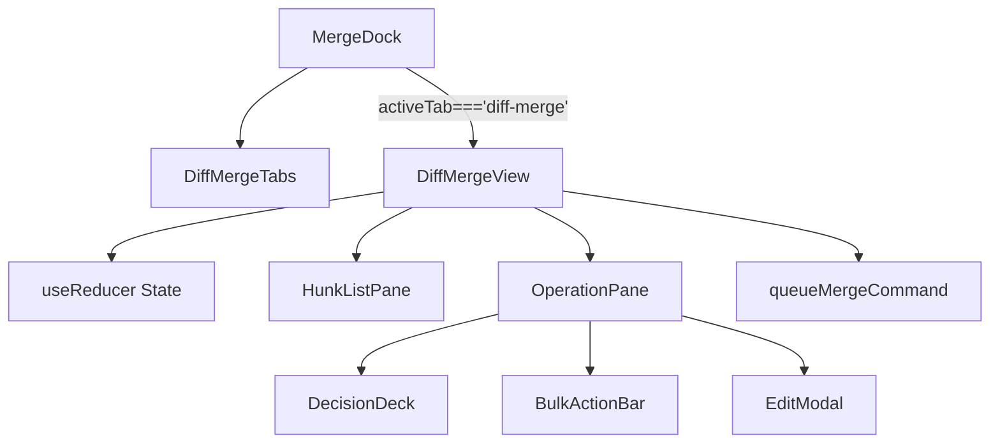
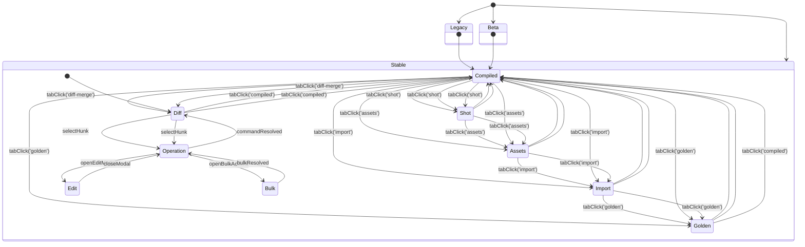

# DiffMergeView / MergeDock 連携設計メモ

## 1. 目的と対象モジュール
### 1.1 目的
`merge.precision` フラグ（`legacy` → `beta` → `stable`）に応じた Diff Merge タブ制御と `queueMergeCommand` 起点の操作フローを `MergeDock` に統合し、AutoSave 連携を前提に UI/ステートの責務を整理する。

### 1.2 対象モジュール
- `src/components/MergeDock.tsx`
- `src/components/DiffMergeView.tsx`
- `src/lib/merge.ts`

## 2. ダイアグラム
### 2.1 コンポーネントツリー

- `MergeDock` がタブ露出を制御し、`DiffMergeView` マウント時のみ内部ペインが生成される。
- `DiffMergeView` は `useReducer` を介してタブ内ステートを保持し、`queueMergeCommand` と AutoSave イベントを集約する。

### 2.2 タブ状態機械（Implementation Plan §0.3 準拠）

- `Legacy` フェーズでは Diff Merge UI を生成せず、既存 5 タブが往復する。
- `Beta` フェーズは `Diff` タブを末尾に追加し、操作完了で `Diff` へ復帰する単純ループ。
- `Stable` フェーズは Diff Merge を初期表示とし、編集・一括操作・レガシータブ往復まで含めた遷移を保証する。
- 出典: [docs/IMPLEMENTATION-PLAN.md §0.3.1-§0.3.3](../../IMPLEMENTATION-PLAN.md#03-mergedock--diffmergeview-タブ棚卸し)

### 2.3 precision 別 UX ダイアグラム（MERGE-DESIGN-IMPL §5 準拠）
```mermaid
graph TD
    subgraph legacy
        L1[タブ: Compiled / Shot / Assets / Import / Golden]
        L2[Diff Merge: 非表示]
        L3[CTA: 従来の書き戻しのみ]
    end
    subgraph beta
        B1[タブ: Compiled -> Diff Merge -> Shot -> Assets -> Import -> Golden]
        B2[Diff Merge ペイン: ハンク一覧 + 操作バー]
        B3[CTA: "Diff Merge (Beta)" + 警告ラベル]
        B4[初期タブ: Compiled]
    end
    subgraph stable
        S1[タブ: Diff Merge -> Compiled -> Shot -> Assets -> Import -> Golden]
        S2[Diff Merge ペイン: AI/Manual/編集モーダル]
        S3[CTA: "結果を採用" を主要ボタンに昇格]
        S4[初期タブ: Diff Merge]
    end
    legacy --> beta --> stable
```
- `legacy` では Diff Merge UI を描画しない。
- `beta` ではタブにベータラベルを付与し、CTA は従来ボタンを保持しつつ警告表示を追加する。
- `stable` では Diff Merge CTA を主要アクションへ昇格し、タブ初期表示も Diff Merge に切り替える。
- 出典: [docs/MERGE-DESIGN-IMPL.md §5](../../MERGE-DESIGN-IMPL.md#5-ui--インタラクション)

## 3. TDD ケース集約（予定: `tests/merge/diff-merge-view.spec.ts`）
1. **`queueMergeCommand` フローと AutoSave 連携**
   - ハンク選択→`queueMergeCommand` 呼び出し→`commandResolved` 受信で `HunkListPane` の `statusMap` が同期される。
   - `queueMergeCommand` が `error: { retryable: true }` を返した場合、OperationPane がリトライ CTA をフォーカスし `aria-live="assertive"` で通知する。
   - `queueMergeCommand` 実行中に AutoSave が `project` ロックを保持していても CTA 文言が `「保存中…」` へ更新され、ロック解放と同時に `「結果を採用」` へ復帰する（ロック共存）。
   - AutoSave が `readonly` へ遷移したとき、操作ボタンが `disabled` となり `queueMergeCommand` 呼び出しが抑止される。
2. **タブ制御と精度フェーズ**
   - `precision='legacy'` では `Diff Merge` タブが DOM へ描画されず、`activeTab='diff-merge'` 指定時は `compiled` へフォールバックする。
   - `precision` を `legacy`→`beta`→`stable` に変更すると、タブ配列・初期選択が Implementation Plan §0.3 の遷移と一致する。
   - `stable` フェーズで `pref` が `diff-merge` に保存され、`beta` へ降格するとレガシータブ構成へロールバックされる。
3. **CTA 更新とロールバック**
   - `precision` を `stable` から `beta` へ降格すると Diff Merge 固有 CTA が DOM から除去され、ハンクペインが `hidden` となる。
   - 降格後に `queueMergeCommand` を発火しても noop が返り AutoSave 状態へ副作用が生じない。

## 4. リスクと対応策
- **アクセシビリティ / キーボード操作**: タブボタンへ `role="tab"` と `aria-controls` を付与し、`Tab` と `Arrow` ナビゲーションを保証。ハンク行は `aria-activedescendant` で示し、`Enter` / `Space` による CTA 実行とモーダルのフォーカストラップを強制する。
- **ARIA ライブリージョン**: `queueMergeCommand` 成功/失敗・AutoSave ロック取得/解除を `aria-live="assertive"` で告知し、スクリーンリーダー利用者への遅延を防ぐ。
- **仮想スクロール性能**: `HunkListPane` は `react-window` 等の仮想化を必須とし、ハンク 500 件規模でも 16ms 以内のフレームを維持するため Telemetry にスクロール Jank メトリクスを追加する。
- **ロールバック戦略**: `precision` 降格時は Diff Merge UI/CTA を完全非表示とし、`localStorage.mergePref` を `compiled` へリセット。旧 CTA と統計表示のみ残し、利用者へ段階的案内を提供する。
