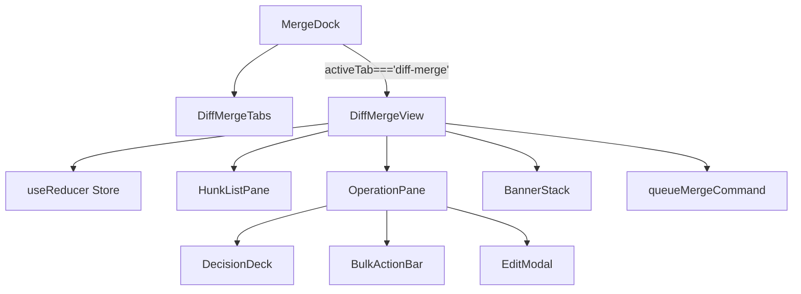
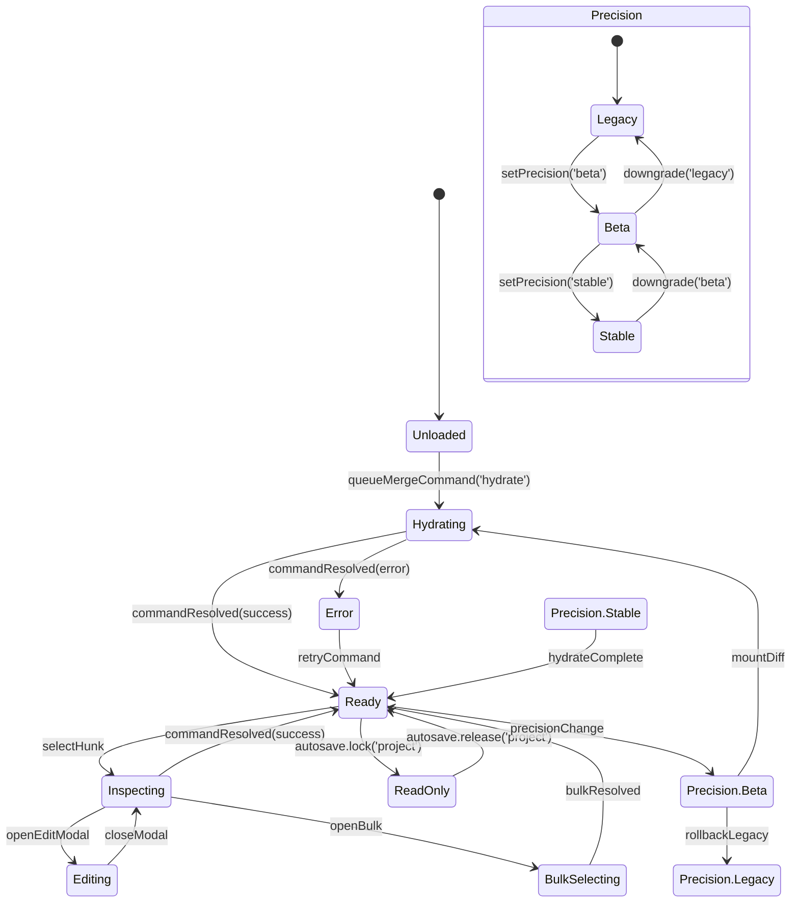
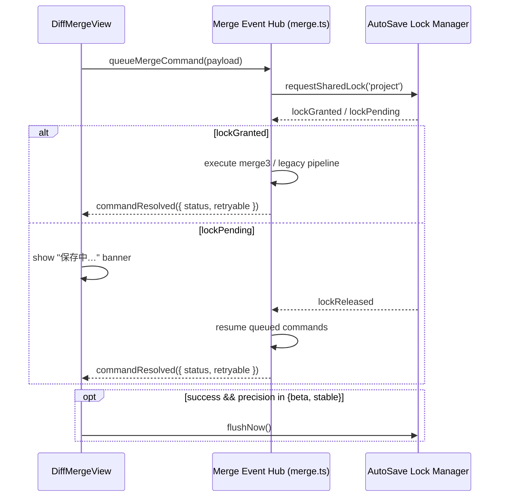

# DiffMergeView / MergeDock 設計テンプレート

## メタデータ

```yaml
task_id: 20250304-diff-merge-view
repo: https://github.com/imgponic/Conimgponic
base_branch: main
work_branch: feat/diff-merge-view
author: platform-merge
priority: P1
langs: [typescript, react]
```

## 1. 対象モジュール
- `src/components/MergeDock.tsx`
- `src/components/DiffMergeView.tsx`
- `src/components/DiffMergeTabs.tsx`
- `src/lib/merge.ts`
- `tests/merge/diff-merge-view.spec.ts`

## 2. precision フラグ別タブ設計

`docs/MERGE-DESIGN-IMPL.md` §5 と `docs/IMPLEMENTATION-PLAN.md` §0.3 の指針を継承し、`merge.precision` ごとのタブ構成・初期表示・AutoSave 協調要件を下表に整理する。

| precision | タブ配列 (`MergeDock`) | 初期タブ | DiffMergeView マウント条件 | AutoSave/Lock 協調 | 備考 |
| --- | --- | --- | --- | --- | --- |
| `legacy` | `Compiled`, `Shot`, `Assets`, `Import`, `Golden` | `Compiled` | 常にアンマウント。`activeTab==='diff-merge'` は `compiled` へフォールバック。 | AutoSave は `merge` スコープの共有ロックを要求しない。`queueMergeCommand` は noop。 | 従来 UI を維持し Diff ショートカット非表示。 |
| `beta` | 上記 5 タブ + `Diff Merge (Beta)` (末尾) | `Compiled` | `queueMergeCommand('hydrate')` 成功時に遅延マウント。 | AutoSave `locks.isShared('project')` が true の間は読み取り専用モード。警告バナーを `aria-live` 表示。 | `queueMergeCommand` はリトライ可、AutoSave `flushNow()` を成功時に非同期発行。【F:docs/MERGE-DESIGN-IMPL.md†L168-L206】 |
| `stable` | `Diff Merge`, `Compiled`, `Shot`, `Assets`, `Import`, `Golden` | `Diff Merge` | 常時マウント。`MergeDock` がタブスナップショットを `merge.lastTab` に保持。 | AutoSave が `project` ロックを独占するときはタブ変更・CTA をロックし、解除後に `queueMergeCommand` キューを drain。 | CTA を主要ボタンへ昇格し、AutoSave `flushNow()` を即時実行。【F:docs/IMPLEMENTATION-PLAN.md†L56-L104】 |

precision 降格時 (`stable→beta→legacy`) は Diff タブ DOM を破棄し、未完了コマンドをキャンセルする。AutoSave ロック中の降格は `queueMergeCommand` キューを保持したまま `retryable` エラーで UI に通知する。【F:docs/MERGE-DESIGN-IMPL.md†L188-L205】

## 3. コンポーネントツリー

`docs/MERGE-DESIGN-IMPL.md` §5.1 の構造を図化し、各ノードの責務と対象モジュールを列挙する。



| ノード | 役割 | 実装ポイント | precision 依存 | AutoSave 連携 |
| --- | --- | --- | --- | --- |
| `MergeDock` | タブ構成と初期タブを precision で切替。 | `src/components/MergeDock.tsx` | `legacy` で Diff タブ非表示。 | AutoSave 独占ロック時はタブ遷移を抑止。 |
| `DiffMergeTabs` | タブ見出しレンダリングとキーボードナビゲーション。 | `src/components/DiffMergeTabs.tsx` | `beta/stable` のみ。 | AutoSave バナー発火時に `tabIndex` を制御。 |
| `DiffMergeView` | ハンク状態・ロック状態ストアを集約。 | `src/components/DiffMergeView.tsx` | `beta/stable` のみマウント。 | `locks.onChange` を購読し CTA を制御。 |
| `HunkListPane` | ハンク一覧とフィルタ。 | `DiffMergeView.tsx` 内部 | `legacy` 非表示。 | AutoSave ロック中は `aria-disabled`。 |
| `OperationPane` | 個別/一括操作 UI。 | `DiffMergeView.tsx` 内部 | `beta/stable` | AutoSave ロック中は操作無効化。 |
| `BannerStack` | バナー/トースト制御。 | `DiffMergeView.tsx` 内部 | 全 precision | AutoSave・`retryable` を集約表示。 |
| `TelemetryBridge` | `queueMergeCommand` 送出とイベント購読。 | `src/lib/merge.ts` | 全 precision | AutoSave `flushNow()` 呼出順を保証。 |

### 3.1 詳細コンポーネント構成

- **DiffMergeTabs**: `role="tablist"` と `aria-controls` を提供し、`merge.precision` ごとのタブ配列と初期タブを `planDiffMergeSubTabs` で決定する。Phase 移行時の DOM 再構成は `MergeDock` のフラグ評価と同期し、Collector/Analyzer から観測されるタブ遷移ログを破壊しない。【F:docs/IMPLEMENTATION-PLAN.md†L56-L115】【F:Day8/docs/day8/design/03_architecture.md†L1-L31】
- **HunkListPane**: `diffMergeReducer` の状態を `aria-selected` と `aria-pressed` にマッピングし、キーボード (`Alt+J/K`) とマウス操作を統一イベント (`toggle-select`) へ正規化する。AutoSave のロック待機中は `aria-disabled` をオンにして書込抑制し、ロック解除で自動復帰する。【F:docs/AUTOSAVE-DESIGN-IMPL.md†L1-L55】
- **OperationPane**: 選択ハンク ID を `queueMergeCommand` の `hunkIds` 配列に集約し、ボタン押下を `queue-merge` テレメトリとして Collector/Analyzer へ送信する。処理中は `aria-busy` とスケルトンを併用し、UI 負荷を抑制する。【F:Day8/docs/day8/design/03_architecture.md†L1-L55】
- **EditModal**: ハンク個別編集を `aria-modal="true"` で提示し、保存 (`commit-edit`) 後に OperationPane と TelemetryBridge を経由して `retryable` 状態を反映する。AutoSave の共有ロックが取得済みかをチェックし、ロック競合時は保存を待機させる。【F:docs/AUTOSAVE-DESIGN-IMPL.md†L1-L103】

## 4. タブ状態機械

`docs/MERGE-DESIGN-IMPL.md` §5.2 と実装計画の precision 遷移図を反映し、タブ状態と Diff ハンク状態を統合したステートマシンを定義する。



- `Precision` サブマシンは `MergeDock` のタブ露出を制御し、`setPrecision`/`downgrade` でタブ DOM を追加・破棄する。【F:docs/IMPLEMENTATION-PLAN.md†L56-L104】
- `Ready` から `Precision.Beta` への遷移は Diff タブ表示後の `hydrate` 処理と同期し、ロールバック時 (`rollbackLegacy`) は Diff 状態・テレメトリを破棄する。【F:docs/MERGE-DESIGN-IMPL.md†L170-L206】

## 5. `queueMergeCommand` フロー

`docs/MERGE-DESIGN-IMPL.md` §5.3 の手順をベースに、AutoSave 共有ロックとの協調を図示する。



| 手順 | 詳細 | precision 影響 | AutoSave 協調 | リスク緩和 |
| --- | --- | --- | --- | --- |
| 1. enqueue | UI から `queueMergeCommand` を発行し、`payload` をストアにバッファ。 | 全 precision | ロック中は enqueue のみ許可。 | `merge.lastTab` を保持し UI 復帰を保証。 |
| 2. lock 交渉 | `merge.ts` が AutoSave 共有ロックを取得。 | `legacy` はスキップ。 | `lockPending` 時にローディングバナー表示。 | 5 秒超過で `retryable` エラーとし UI へ警告。 |
| 3. 実行 | ロック取得後に `merge3` または従来処理を実行。 | `beta/stable` で Diff ハンク更新。 | ロック解除まで結果適用を遅延。 | 失敗時は `retryable` 判定でリトライ経路を分岐。 |
| 4. 結果通知 | `commandResolved` を発火し UI ステータス更新。 | 全 precision | `retryable=false` で `MergeDock` を `compiled` へ戻す。 | Diff 状態破棄で不整合防止。 |
| 5. AutoSave flush | 成功時に `flushNow()` を連携。 | `beta/stable` のみ | ロック解除直後に実行。 | Telemetry でロック時間を追跡。 |

### 5.1 `queueMergeCommand` インターフェース

```ts
type QueueMergeCommand = (payload: {
  type: 'queue-merge'
  precision: MergePrecision
  origin: 'operation-pane.queue' | 'hunk-list.action' | 'edit-modal.commit'
  hunkIds: readonly string[]
  telemetryContext: {
    collectorSurface: 'diff-merge.hunk-list' | 'diff-merge.operation-pane'
    analyzerSurface: 'diff-merge.queue'
    lastTab: DiffMergeSubTabKey
  }
  metadata: { autoSaveRequested: boolean; retryOf?: 'auto' | 'conflict' }
}) => Promise<{
  status: 'success' | 'conflict' | 'error'
  hunkIds: readonly string[]
  telemetry: {
    collectorSurface: 'diff-merge.hunk-list'
    analyzerSurface: 'diff-merge.queue'
    retryable: boolean
  }
}>
```

- AutoSave の `requestSharedLock('project')` を先行し、ロック未取得時は `retryable=true` で失敗応答を返して UI を読み取り専用へ遷移させる。【F:docs/AUTOSAVE-DESIGN-IMPL.md†L1-L103】
- Collector/Analyzer へのイベントは Day8 のパイプラインに従い JSONL で排出し、`telemetryContext` をそのまま `collectorSurface` / `analyzerSurface` として連携する。【F:Day8/docs/day8/design/03_architecture.md†L1-L55】

### 5.2 テレメトリ連携

| フェーズ | 発火地点 | イベント名 | Collector/Analyzer 連携 | 備考 |
| --- | --- | --- | --- | --- |
| タブ切替 | DiffMergeTabs | `merge:tabs:change` | Collector は `aria-selected` のトグルを記録、Analyzer はタブ滞在時間を算出。 | `role="tablist"` DOM を監視。 |
| ハンク操作 | HunkListPane / EditModal | `merge:hunk:update` | Collector は操作種別・ハンク ID を JSONL に即時書込。Analyzer は滞留ハンク数を再計算。 | AutoSave ロック中は `pending` として記録。 |
| キュー投入 | OperationPane | `merge:queue:enqueue` | Analyzer がロック待機時間と成功率を集計。Collector は UI レイテンシを記録。 | `metadata.autoSaveRequested` をタグ化。 |
| 結果反映 | TelemetryBridge | `merge:queue:resolved` | Collector が `retryable` を基準に警告を生成し、Analyzer は成功率 KPI を更新。 | AutoSave `flushNow()` 成功後に排出。 |

Telemetry ブリッジは DiffMergeView の副作用層として機能し、AutoSave の共有ロックイベントと Diff 操作ログを一元化することで Day8 の Collector/Analyzer 連携を維持する。【F:Day8/docs/day8/design/03_architecture.md†L1-L55】

## 6. AutoSave ロック協調要件

- `AutoSave` の共有ロック (`requestSharedLock('project')`) が未取得の場合、Diff タブ操作はバナー表示と CTA 無効化で待機する。
- 独占ロック (`lockExclusive`) を検出した場合は `ReadOnly` 状態へ遷移し、タブ切替を封止。解除後に `queueMergeCommand` の未処理エントリを再実行する。
- AutoSave が `saved` を発火するまで `persistMergeTrace` を保留し、`merge:trace:persisted` と AutoSave 証跡の順序を固定する。【F:docs/MERGE-DESIGN-IMPL.md†L205-L222】

## 7. テスト設計 (`tests/merge/diff-merge-view.spec.ts`)

TDD を前提に、`node:test` で実装するユニット/結合テストの観点を整理する。

| カテゴリ | ケース | シナリオ | 期待挙動 |
| --- | --- | --- | --- |
| キーボード操作 | タブ左右移動 | `precision='beta'` で `ArrowRight` を送出すると Diff タブへ移動し、AutoSave ロック中は `tabIndex=-1` でスキップ。 | タブフォーカスが `diff-merge` に遷移し、ロック時は `compiled` に留まる。 |
| キーボード操作 | ハンクリストショートカット | `Alt+J/K` でハンク選択を前後移動。 | `selectHunk` アクションが発火し、`Inspecting` 状態へ遷移。 |
| バナー表示 | AutoSave 待機 | `lockPending` イベントで「保存中…」バナーを表示。 | バナー DOM が `aria-live=polite` で描画され、CTA が disabled。 |
| バナー表示 | `retryable` エラー | `commandResolved({retryable:true})` を受信。 | バナーに再試行 CTA が表示され、`retryCommand` 送出で閉じる。 |
| コマンド送出 | `queueMergeCommand('hydrate')` | Diff タブ初回表示時。 | `requestSharedLock` → `merge3` 呼出をモック検証。 |
| コマンド送出 | AutoSave flush | 成功時 (`status==='success'`)。 | `flushNow()` が precision `beta/stable` のみ呼ばれる。 |

## 8. リスク / ロールバック条件

- **AutoSave ロック遅延**: 共有ロックが 5 秒超過で未取得の場合、UI は `retryable` バナーを継続表示し、`queueMergeCommand` キューを維持する。ロールバック時は Diff タブ DOM を破棄し、未処理コマンドをキャンセルする。【F:docs/MERGE-DESIGN-IMPL.md†L188-L206】
- **precision 降格**: `stable` から `beta/legacy` へ降格する際、`merge.lastTab` を `compiled` に設定し Diff 状態・テレメトリを破棄する。ロック中は降格を保留し、解除後に再評価する。【F:docs/IMPLEMENTATION-PLAN.md†L74-L104】
- **`retryable=false` エラー**: `queueMergeCommand` が非再試行エラーを返した場合、Diff タブを非表示に戻し `MergeDock` を従来 UI にフォールバック。AutoSave には `releaseShared('project')` を送信し整合性を確保する。【F:docs/MERGE-DESIGN-IMPL.md†L205-L222】

## 9. MergeDock への段階導入手順

1. **Phase B**: `merge.precision` フラグを `beta` に設定し (`docs/CONFIG_FLAGS.md`)、`MergeDock` に Diff タブを末尾追加。`DiffMergeView` は `queueMergeCommand('hydrate')` 成功後にマウントし、既存 5 タブ構成を維持する。【F:docs/IMPLEMENTATION-PLAN.md†L56-L115】
2. **Phase B→C トライアル**: Telemetry 成功率が Day8 Collector 経由で 95% を超過したタイミングで `beta` ユーザーに AutoSave 共有ロック必須フローを展開し、UI バナーで共有ロック待機を告知する。【F:docs/AUTOSAVE-DESIGN-IMPL.md†L1-L103】【F:Day8/docs/day8/design/03_architecture.md†L1-L55】
3. **Phase C (Stable)**: `merge.precision=stable` を既定値に昇格。Diff タブを先頭に配置し、`MergeDock` で `merge.lastTab` を `localStorage` に保存。降格パス (`downgrade('beta'|'legacy')`) を常時有効にしてロールバック時間を最小化する。【F:docs/IMPLEMENTATION-PLAN.md†L56-L115】

## 10. UI 負荷・アクセシビリティとフラグ例

- **UI 負荷**: ハンク描画は仮想化を行わずに最大 200 件まで描画し、AutoSave ロック待機中は `aria-busy` とプレースホルダで CPU 使用率を抑制する。Collector への JSONL 送信は即時排出とし、Day8 Analyzer 側で 15 分単位に集約する。【F:Day8/docs/day8/design/03_architecture.md†L1-L55】
- **キーボード操作**: タブは `ArrowLeft/ArrowRight`、ハンクは `Alt+J/K`、一括適用は `Ctrl+Enter` を割り当て、`aria-keyshortcuts` 属性で支援技術に公開する。AutoSave ロック中はショートカットをイベントキャンセルする。【F:docs/AUTOSAVE-DESIGN-IMPL.md†L1-L103】
- **読み上げ**: 主要ステータス（保存待機、衝突、成功）は `aria-live="polite"` バナーに集約し、ハンク行には `aria-describedby` で差分概要を紐付ける。テレメトリ結果 (`retryable` 判定) も同バナーで通知する。【F:docs/MERGE-DESIGN-IMPL.md†L168-L206】
- **段階導入フラグ設定例**:
  - Phase B 試験: `.env` に `VITE_MERGE_PRECISION=beta`、`localStorage.merge.precision` を `beta` に設定し、`docs/CONFIG_FLAGS.md` の既定は `legacy` を維持。
  - Phase C 本番: `.env` と `docs/CONFIG_FLAGS.md` を `stable` に揃え、`autosave.enabled` を `true` にして AutoSave 連携を強制。ロールバック用に `localStorage.merge.precision=legacy` を許可し、CI で監視する。【F:docs/AUTOSAVE-DESIGN-IMPL.md†L1-L103】【F:docs/CONFIG_FLAGS.md†L57-L90】
