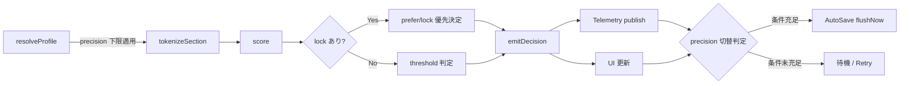
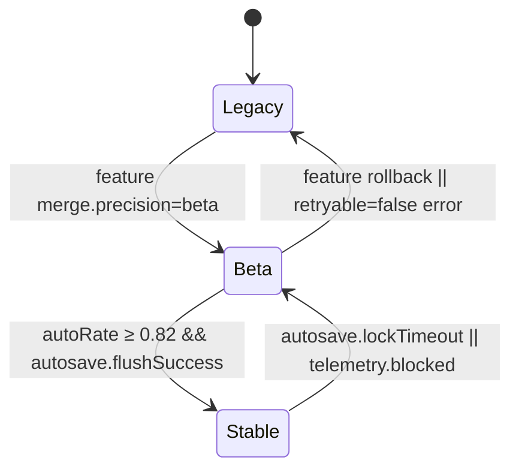

# Merge Engine 設計サマリ

## 0. ドキュメント概要
- docs/MERGE-DESIGN-IMPL.md §0-§4 の要約として `merge3` コア処理・プロファイル制御・イベント通知・precision 切替要件を整理する。【F:docs/MERGE-DESIGN-IMPL.md†L4-L130】
- `resolveProfile`/`score`/`decide`/`emitDecision` の連携と UI/Telemetry プロトコルを図表化し、AutoSave 連携および SLA 遵守ポイントを明示する。【F:docs/MERGE-DESIGN-IMPL.md†L96-L205】
- 本メモを `tests/merge/merge3.spec.ts` の TDD 起点および 100 カット 5 秒 SLA ベンチマークの計画書として参照する。

## 1. 目的
- Base/Ours/Theirs の 3-way 決定的マージ `merge3` を確立し、precision ごとの自動採択と競合提示を切り替える。【F:docs/MERGE-DESIGN-IMPL.md†L16-L130】
- Merge コマンド適用（`queueMergeCommand`）とイベント購読（`subscribeMergeEvents`）を通じ、UI・AutoSave の整合を維持する。【F:docs/MERGE-DESIGN-IMPL.md†L170-L205】
- Telemetry/Trace (`persistMergeTrace`) の永続化で precision 別信頼指標を収集し、Collector 連携を確保する。【F:docs/MERGE-DESIGN-IMPL.md†L205-L222】

## 2. スコープ
| 項目 | 内容 | 参照 |
| --- | --- | --- |
| `merge3` | `MergeInput`→`MergeResult` を返す純関数。precision プロファイルに基づきハンク類似度と統合テキストを決定する。 | 【F:docs/MERGE-DESIGN-IMPL.md†L16-L110】 |
| コマンド | `queueMergeCommand` で merge 操作・AutoSave・Trace を直列制御し、`subscribeMergeEvents` が UI 再描画を仲介する。 | 【F:docs/MERGE-DESIGN-IMPL.md†L170-L205】 |
| テレメトリ | `persistMergeTrace` とイベント発火順序で Collector・Analyzer・Reporter に精度・再試行ログを送出する。 | 【F:docs/MERGE-DESIGN-IMPL.md†L205-L222】 |

## 3. 設計詳細

### 3.0 処理フロー図

### 3.1 プロファイル解決
| ステップ | 詳細 | 制約 |
| --- | --- | --- |
| 1. `resolveProfile` | ユーザ入力 `Partial<MergeProfile>` に precision 下限を適用し `ResolvedMergeProfile` を生成。 | `minAutoThreshold = max(profile.threshold, precision.min)` を必須化。 | 【F:docs/MERGE-DESIGN-IMPL.md†L36-L111】 |
| 2. Lock 優先 | セクション lock が存在する場合は `prefer` / 類似度計算を迂回して決定。 | lock 未指定時のみ `prefer` → `similarity` の順で評価。 | 【F:docs/MERGE-DESIGN-IMPL.md†L46-L110】 |
| 3. 決定性維持 | セクションキーの辞書順ソートとトークン安定ソート、決定時の `prefer` 固定順序でハッシュ以外の乱数を排除。 | `seed` は入力ハッシュ由来の deterministic 値のみ許容。 | 【F:docs/MERGE-DESIGN-IMPL.md†L49-L53】 |

### 3.2 スコアリング手順
| フェーズ | 入力 | 出力 | SLA 対応 |
| --- | --- | --- | --- |
| `tokenizeSection` | セクションテキスト、`cfg.tokenizer` | `MergeScoringInput` | トークンキャッシュとバッチ処理で 100 カット 5 秒を満たす。 | 【F:docs/MERGE-DESIGN-IMPL.md†L96-L111】 |
| `score` | `MergeScoringInput`, `ResolvedMergeProfile` | `MergeScoringMetrics`（Jaccard/Cosine/Blended） | `AbortSignal` により SLA 超過前に `MergeError` を送出。 | 【F:docs/MERGE-DESIGN-IMPL.md†L96-L111】 |
| `decide` | `MergeScoringMetrics`, lock, `prefer` | `MergeDecision`, `similarity` | `similarity < minAutoThreshold` は必ず競合扱い。 | 【F:docs/MERGE-DESIGN-IMPL.md†L16-L110】 |
| `emitDecision` | `MergeDecision`, `MergeHunk` | UI / Telemetry イベント | 1 ハンク ≤1ms を上限にイベントファンアウト。 | 【F:docs/MERGE-DESIGN-IMPL.md†L103-L111】 |

### 3.3 決定イベント
| イベント | トリガー | UI プロトコル | Telemetry |
| --- | --- | --- | --- |
| `merge:auto-applied` | `similarity ≥ minAutoThreshold` か lock による自動採択。 | precision `legacy` は従来 UI、`beta/stable` は Diff タブ上でバッジ表示し AutoSave `flushNow()` を条件起動。 | Analyzer に `confidence_score=blended` を送出し成功率を precision 別に集計。 | 【F:docs/MERGE-DESIGN-IMPL.md†L91-L205】 |
| `merge:conflict-detected` | `similarity < minAutoThreshold` または lock が競合指定。 | `beta/stable` では `DiffMergeView` に競合ハンクを表示し再試行ボタンを活性化。 | `merge.precision.blocked` と `retryable` 区分を Collector→Analyzer→Reporter で連携。 | 【F:docs/MERGE-DESIGN-IMPL.md†L91-L205】 |

### 3.4 precision 別パラメータ
| precision | `minAutoThreshold` | 類似度バンド | スコア重み / ブースト | UI 連携 | Telemetry |
| --- | --- | --- | --- | --- | --- |
| `legacy` | `max(profile.threshold, 0.65)` | `auto = threshold + 0.08` / `review = threshold - 0.04` | `0.5*jaccard + 0.5*cosine` | Diff タブ非表示、`pref` は Manual/Ai 二択。 | `merge:finish` で従来統計のみ。 | 【F:docs/MERGE-DESIGN-IMPL.md†L114-L130】 |
| `beta` | `max(profile.threshold, 0.75)` | `auto = clamp(threshold+0.05, 0.8, 0.92)` / `review = threshold - 0.02` | `0.4*jaccard + 0.6*cosine` | Diff タブ末尾、`Beta` バッジと AutoSave `flushNow()` を併走。 | `merge.precision.suggested` に `confidence_score` を付与。 | 【F:docs/MERGE-DESIGN-IMPL.md†L114-L130】 |
| `stable` | `max(profile.threshold, 0.82)` | `auto = clamp(threshold+0.03, 0.86, 0.95)` / `review = threshold - 0.01` | `0.3*jaccard + 0.7*cosine + historyBoost≤0.05` | Diff タブ初期選択、AutoSave 遅延時に CTA 常時表示。 | `merge.precision.blocked` を SLO 監視に使用。 | 【F:docs/MERGE-DESIGN-IMPL.md†L114-L130】 |

### 3.5 I/O 契約と precision 閾値まとめ
| 関数 | 入力 | 出力 | precision ごとの主閾値 | 例外/リトライ | 参考 |
| --- | --- | --- | --- | --- | --- |
| `merge3` | `MergeInput`, `ResolvedMergeProfile` | `{ hunks, mergedText, stats }` | `legacy: ≥0.65`, `beta: ≥0.75`, `stable: ≥0.82` を `minAutoThreshold` として使用。 | 閾値未満は `Decision=conflict`、再試行は上位コマンド層に委譲。 | 【F:docs/MERGE-DESIGN-IMPL.md†L16-L130】 |
| `queueMergeCommand` | `MergeCommand`, AutoSave hooks | `Promise<void>` | precision 切替後に `merge:auto-applied` / `merge:conflict-detected` をシリアル発火。 | AutoSave ロック未取得時は `retryable` 付与。 | 【F:docs/MERGE-DESIGN-IMPL.md†L170-L205】 |
| `subscribeMergeEvents` | `listener(event)` | `unsubscribe()` | precision イベント（`merge.precision.*`）を順序維持で通知。 | `merge:trace:error` 受信時に `retryable` をリスナーへ伝播。 | 【F:docs/MERGE-DESIGN-IMPL.md†L170-L205】 |
| `persistMergeTrace` | `hunks`, `stats`, `profile` | `Promise<TraceMeta>` | `confidence_score` を `beta`/`stable` で必須収集、`legacy` は任意。 | IO 失敗は `retryable=true` で Collector 再送を許容。 | 【F:docs/MERGE-DESIGN-IMPL.md†L205-L222】 |

### 3.6 precision 切替条件ダイアグラム

| 遷移 | 主条件 | 付随アクション | Telemetry |
| --- | --- | --- | --- |
| `Legacy → Beta` | フラグ `merge.precision='beta'` が UI に同期。 | Diff タブ追加、`queueMergeCommand('hydrate')` を発火。 | `merge:start` を precision=`beta` で送信。 | 【F:docs/MERGE-DESIGN-IMPL.md†L170-L205】 |
| `Beta → Stable` | 自動採択率 ≥0.82 かつ AutoSave `flushNow()` 成功。 | Diff タブ初期表示へ昇格、Bulk 操作解放。 | `merge.precision.suggested` で `confidence_score` を Collector へ送出。 | 【F:docs/MERGE-DESIGN-IMPL.md†L114-L205】 |
| `Stable → Beta` | AutoSave ロック遅延や `historyBoost` 欠落で UI を降格。 | Diff 特有 CTA を削除し `Ready` 状態へ戻す。 | `merge.precision.blocked` を `retryable=true` で通知。 | 【F:docs/MERGE-DESIGN-IMPL.md†L170-L205】 |
| `Beta → Legacy` | フラグロールバック、`retryable=false` 例外。 | Diff タブ非表示、AutoSave 共有ロック解除。 | `merge:finish` 後に `merge.precision.blocked` を `retryable=false` で送信。 | 【F:docs/MERGE-DESIGN-IMPL.md†L170-L205】 |

### 3.7 AutoSave 連携と例外ハンドリング
- `queueMergeCommand` が AutoSave 共有ロックを取得できない場合、`MergeError` を `retryable=true` で送出し UI へ再試行バナーを表示する。Collector へも同フラグを送信して Analyzer の再評価を許容する。【F:docs/MERGE-DESIGN-IMPL.md†L170-L205】
- AutoSave `flushNow()` 成功後にのみ `persistMergeTrace` を実行し、`merge:auto-applied` → `merge:trace:persisted` → `merge:finish` の順序を固定する。失敗時は `MergeError` を `retryable` 判定に応じてラップし、Telemetry へ `merge:trace:error` を発火する。【F:docs/MERGE-DESIGN-IMPL.md†L205-L222】【F:docs/AUTOSAVE-DESIGN-IMPL.md†L61-L209】
- `MergeError` の分類: SLA 超過 (`AbortSignal`)、AutoSave ロック未取得、Trace 書込失敗は `retryable=true`。プロファイル不正・precision フラグ矛盾は `retryable=false` とし、UI は Diff タブを閉じて `legacy` へフォールバックする。【F:docs/MERGE-DESIGN-IMPL.md†L36-L205】
- 例外処理手順: エラー発生 → Telemetry `merge:error` で `retryable` を明示 → AutoSave ロック解除 → UI が `Error` 状態へ遷移し `retryCommand` を enqueue。これにより AutoSave と Trace の整合を保ちながら安全に再試行できる。【F:docs/MERGE-DESIGN-IMPL.md†L170-L205】

## 4. TDD / ベンチマーク計画

### 4.1 `tests/merge/merge3.spec.ts` で実装するケース
| シナリオ | precision | 観点 | 期待検証 |
| --- | --- | --- | --- |
| プロファイル解決と閾値補正 | `legacy` | `resolveProfile` が precision 下限へ閾値を引き上げる。 | `minAutoThreshold` が `max(0.7, precision.min)` に正規化される。 |
| Lock 優先順位 | `stable` | `locks` が存在するセクションで `prefer` を迂回し auto 決定される。 | `merge:auto-applied` イベントが `lock` 優先で発火し Telemetry へ反映される。 |
| precision 切替シーケンス | `legacy→beta→stable` | イベント順序が `merge:start` → `merge:hunk-decision` → `merge:auto-applied` → AutoSave `flushNow()` → `merge:finish` となる。 | Telemetry モックが順序通り記録し、Diff タブが段階的に有効化される。 |
| precision ロールバック | `stable→beta→legacy` | `retryable=false` 例外発生時に Diff タブが閉じられ、`merge.precision.blocked` が通知される。 | UI 状態が `legacy` へ戻り、Telemetry にロールバックイベントが一度だけ送信される。 |
| Telemetry 順序保証 | `beta` | ハンクごとに `merge:hunk-decision` が `merge:auto-applied` より先に送出される。 | Collector モックのログがイベント順序を保証し、`confidence_score` が付与される。 |
| SLA 超過リトライ | `beta` | `AbortSignal` 発火で `MergeError.retryable=true` が返りコマンドが再試行される。 | UI が `Error` → `Ready` に戻り、再試行で成功するまでイベント履歴が保持される。 |
| Trace 書込失敗リトライ | `stable` | `persistMergeTrace` 失敗時に 3 回までリトライし `retryable` の有無で処理が変化する。 | `retryable=true` で成功まで `merge:trace:error` → `merge:trace:persisted` を確認し、`false` なら即停止する。 |

### 4.2 ベンチマーク計画
- **対象**: 100 カットのセクションを含む `MergeInput` サンプル 3 種（`legacy`/`beta`/`stable`）。
- **測定**: `AbortController` 計測で `processingMillis` を取得し、平均 4.5s 以下、最大 5.0s 未満を合格基準とする。
- **ツール**: Node 18 + `node --test` で micro-benchmark、`performance.mark/measure` を利用。
- **回数**: プロファイルごとに 5 連続試行し、`95th percentile ≤ 4.8s` を保証。
- **回帰監視**: CI で週次ジョブを追加し、閾値超過時は `merge.precision.blocked` イベントを付与してリトライ判定を促す。

### 4.3 イベント順序・AutoSave 整合チェックリスト
1. `queueMergeCommand` → `store.ts` 更新後に AutoSave `flushNow()` を遅延呼び出しする。【F:docs/MERGE-DESIGN-IMPL.md†L170-L205】【F:docs/AUTOSAVE-DESIGN-IMPL.md†L3-L132】
2. AutoSave の `saved` を `subscribeMergeEvents` で監視し、完了通知後に `persistMergeTrace` を起動する。【F:docs/MERGE-DESIGN-IMPL.md†L205-L222】【F:docs/AUTOSAVE-DESIGN-IMPL.md†L186-L318】
3. `persistMergeTrace` 成功後に `merge:trace:persisted`、失敗時は `merge:trace:error`（`retryable` 判定付き）を送出する。【F:docs/MERGE-DESIGN-IMPL.md†L205-L222】

### 4.4 AutoSave 連携ポイントと `AutoSaveError.retryable`
- AutoSave ロック未取得（`lock-unavailable`）は `queueMergeCommand` が再送可能イベントへ変換し、`AutoSaveError.retryable=true` を尊重する。【F:docs/AUTOSAVE-DESIGN-IMPL.md†L61-L209】
- AutoSave `snapshot` 失敗で `retryable=false` の場合は `merge:trace:error` を `retryable=false` で伝搬し、ユーザ通知を優先する。【F:docs/AUTOSAVE-DESIGN-IMPL.md†L186-L318】
- `persistMergeTrace` の書込エラーが `retryable=true` なら AutoSave の指数バックオフと同期し、最大 3 回までリトライする。【F:docs/MERGE-DESIGN-IMPL.md†L205-L222】【F:docs/AUTOSAVE-DESIGN-IMPL.md†L61-L209】

### 4.5 想定 TDD ケースの追加列挙
| 対象ファイル | precision | 観点 | 成功条件 |
| --- | --- | --- | --- |
| `tests/merge/merge3.spec.ts` | `legacy→beta` | precision 切替時のハンク決定とイベント順序 (`merge.precision.suggested`→`merge:auto-applied`) を検証。 | イベントシーケンスが決定順に収集される。 | 【F:docs/MERGE-DESIGN-IMPL.md†L114-L205】 |
| `tests/merge/merge3.spec.ts` | `beta→stable` | Telemetry の `confidence_score` が `persistMergeTrace` へ渡る。 | Trace JSON が precision ごとに差異を持つ。 | 【F:docs/MERGE-DESIGN-IMPL.md†L205-L222】 |
| `tests/merge/commands.spec.ts` | 全 precision | AutoSave `flushNow()` 後に `persistMergeTrace` が連続成功するまでイベントがブロックされる。 | チェックリスト(4.3) 順序通りであること。 | 【F:docs/MERGE-DESIGN-IMPL.md†L170-L222】 |
| `tests/merge/telemetry.spec.ts` | `beta` | Telemetry 順序（`merge:auto-applied`→`merge:trace:persisted`）を検証。 | Collector モックが昇順受信を記録。 | 【F:docs/MERGE-DESIGN-IMPL.md†L205-L222】 |
| `tests/merge/retry.spec.ts` | `stable` | AutoSave / Trace 失敗時の再試行制御。 | `retryable=true` のとき 3 回以内に成功し、`false` なら即時中断。 | 【F:docs/AUTOSAVE-DESIGN-IMPL.md†L61-L209】 |

## 5. リスク・フォローアップ
| リスク/課題 | 対応策 |
| --- | --- |
| `MergeError` の retryable 区分が UI/Telemetry へ伝搬されない。 | `MergeError` に `retryable: boolean` を保持し、SLA 超過や precision ブロック時は `true` を設定。Collector 経由で Analyzer へ転送し再試行 UI を活性化する。 |
| AutoSave 連携時の証跡欠落。 | AutoSave 有効時は `runs/<ts>/merge.json` へ決定イベントと `confidence_score` を必ず保存し、`merge:auto-applied` 毎にファイル追記する。証跡が欠けた場合はリリース停止条件とする。 | 【F:docs/MERGE-DESIGN-IMPL.md†L16-L222】 |
| precision 切替の UI 異常で SLA 超過が顕在化。 | `merge.precision` 切替テストを CI の smoke に追加し、5 秒 SLA のベンチ指標が 5% 超過した場合はローリングバック手順を即時実行。 |
