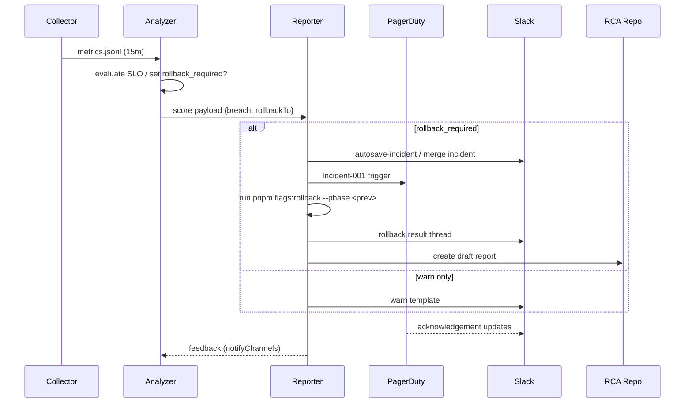

# AutoSave/精緻マージ 監視・ロールバック I/O 契約

## 1. Collector / Analyzer / Reporter の I/O 契約整理
- **Collector 入力**: `reports/canary/phase-*.jsonl` などの 15 分窓 JSONL を取り込み、`scripts/monitor/collect-metrics.ts --window=15m` で `autosave_p95` / `restore_success_rate` / `merge_auto_success_rate` を正規化する。【F:docs/IMPLEMENTATION-PLAN.md†L246-L266】
- **Collector → Analyzer 出力**: 正規化済み JSONL (`reports/monitoring/<timestamp>.jsonl`) を Analyzer へ渡し、`monitor:analyze` → `monitor:score` がフェーズ別 SLO 判定と `rollback_required` を計算する。【F:docs/IMPLEMENTATION-PLAN.md†L261-L273】
- **Analyzer → Reporter 出力**: `monitor:score` のサマリ（`phase`, `metric`, `value`, `threshold`, `breach`, `rollbackTo`）を Reporter に連携し、Slack/PagerDuty テンプレとロールバック CLI 実行結果を通知本文へ反映する。【F:docs/IMPLEMENTATION-PLAN.md†L270-L273】【F:templates/alerts/rollback.md†L1-L23】
- **Reporter → Governance/Runbook フィードバック**: Slack/PagerDuty 送信後に `reports/alerts/<timestamp>.md` と RCA ドラフトを保存し、Incident-001 や Phase 再開の判断材料にする。【F:docs/IMPLEMENTATION-PLAN.md†L233-L287】
- Day8 アーキテクチャの Collector→Analyzer→Reporter パイプラインと整合し、15 分サイクルで JSONL → 判定 → 通知の順序を固定する。【F:Day8/docs/day8/design/03_architecture.md†L29-L43】

### 1.1 `rollback_required` フラグライフサイクル
1. Analyzer が SLO 逸脱 (`breach=true`) を検出し、`rollbackTo` を含む場合に `rollback_required=true` を設定する。【F:docs/IMPLEMENTATION-PLAN.md†L261-L273】
2. Reporter は `rollback_required=true` を受信すると Slack/PagerDuty の Incident テンプレを展開し、`pnpm run flags:rollback --phase <prev>` を実行して結果を通知へ添付する。【F:docs/IMPLEMENTATION-PLAN.md†L235-L237】【F:docs/IMPLEMENTATION-PLAN.md†L270-L273】
3. ロールバック完了後、Reporter が RCA ドラフトと Phase 差し戻し記録を `reports/rca/` に登録し、次サイクルで Collector が Canary 相当の JSONL を再収集する。【F:docs/IMPLEMENTATION-PLAN.md†L233-L287】

## 2. RED テストケース（`tests/monitoring/collector.*.test.ts`）
- `collector.metrics.test.ts`
  - 15 分ウィンドウで `autosave_p95` / `restore_success_rate` / `merge_auto_success_rate` を境界値付きで正規化するケース。
- `collector.notifications.test.ts`
  - `--simulate-breach` で各ガードレールを強制し、Slack/PagerDuty/RCA セクションを揃えた `AlertPayload` を生成するケース。
- `collector.rollback.test.ts`
  - Analyzer モックが `rollback_required=true` を返す際に `pnpm run flags:rollback --phase <prev>` を呼び出し、`retryable=true` は指数バックオフ 2 回、`retryable=false` は即時 PagerDuty へエスカレーションするケース。
- `collector.retry.test.ts`
  - Collector 出力失敗 (`EPIPE`) を 3 回再試行し、枯渇後に Analyzer へ `degraded` を通知し Slack `#telemetry` → PagerDuty P2 を起動するケース。
- `collector.e2e.test.ts`
  - `--dry-run` で Collector→Analyzer→Reporter の JSON ハンドオフを実行し、Day8 パイプライン順序と一致することを検証するケース。

（上記はすべて既存ドキュメント上の RED シナリオを起点に列挙しており、グリーン化は今後の実装タスクで行う。【F:docs/IMPLEMENTATION-PLAN.md†L275-L281】）

## 3. フェーズゲート基準・通知チャネル・ロールバック・RCA フロー
| フェーズ | 既定フラグ (`autosave.enabled` / `merge.precision`) | SLO 判定条件 (Analyzer) | 通知チャネル (Reporter) | ロールバックコマンド | RCA 着手 | 
| --- | --- | --- | --- | --- | --- |
| Phase A-0 (準備) | `false` / `legacy` | JSONL 整合性のみ。自動判定なし | Slack `#launch-autosave` メモ | 対象外 | Incident 無し。RCA 不要 |
| Phase A-1 (QA Canary) | `true` (QA 限定) / `legacy` | `autosave_p95` ≤ 2500ms かつ `restore_success_rate` ≥ 0.995 を 2 バッチ連続満たす | Slack `#launch-autosave`、重大時 PagerDuty *Autosave & Precision Merge* | `pnpm run flags:rollback --phase A-0` | PagerDuty 発砲時は 1 サイクル以内にドラフト |
| Phase A-2 (β導入) | `true` / `legacy` | `restore_success_rate` ≥ 0.995 維持、クラッシュ率 Δ≤+5% | Slack `#launch-autosave` + PagerDuty (P2) | `pnpm run flags:rollback --phase A-1` | 同上 |
| Phase B-0 (Merge β) | `true` / `beta` | `merge_auto_success_rate` ≥ 0.80 を 3 バッチ連続確認 | Slack `#merge-ops` + PagerDuty *Merge Duty* (critical) | `pnpm run flags:rollback --phase A-2` | Incident-001 に 1 サイクル以内でドラフト |
| Phase B-1 (GA) | `true` / `stable` | AutoSave/Merge SLO を 5 日連続達成、重大事故 0 件 | Slack `#incident` + PagerDuty Incident-001 (P1) | `pnpm run flags:rollback --phase B-0` | Incident-001 発砲時に 1 サイクル以内でドラフト |

- 15 分サイクルで Collector→Analyzer→Reporter の順に処理し、判定結果を `rollback_required` とテンプレ通知へ反映する。【F:docs/IMPLEMENTATION-PLAN.md†L208-L259】
- RCA はロールバック完了から 1 サイクル以内にドラフトを `reports/rca/` へ配置し、Slack `#incident` へ共有する。【F:docs/IMPLEMENTATION-PLAN.md†L233-L287】

## 4. PagerDuty / Slack 連携と運用チェックリスト

### 4.1 シーケンス図

### 4.2 運用チェックリスト
1. Collector が `retryable=false` または `degraded` を検出したら即座に Slack `#launch-autosave` / `#merge-ops` へ通知し、次サイクルで再収集を予約する。【F:docs/IMPLEMENTATION-PLAN.md†L282-L307】
2. Analyzer が `rollback_required=true` を設定したサイクルでは Reporter が `pnpm run flags:rollback --phase <prev>` を実行し、成功/失敗ログを Slack と PagerDuty Incident-001 に添付する。【F:docs/IMPLEMENTATION-PLAN.md†L235-L287】
3. ロールバック後 1 サイクル以内に `reports/rca/<phase>-<timestamp>.md` のドラフトを作成し、Slack `#incident` に共有する。【F:docs/IMPLEMENTATION-PLAN.md†L233-L287】
4. 次フェーズへ進む前にダッシュボードで 15 分サイクルの SLO 線と実測値が一致するか確認し、差分が ±5% 以内であることを記録する。【F:docs/IMPLEMENTATION-PLAN.md†L295-L338】
5. `rollback_required` が false に戻った後も 2 サイクル連続で Collector/Analyzer/Reporter のログをレビューし、Phase Scope と guardrail の整合を Runbook に追記する。【F:docs/IMPLEMENTATION-PLAN.md†L282-L307】

